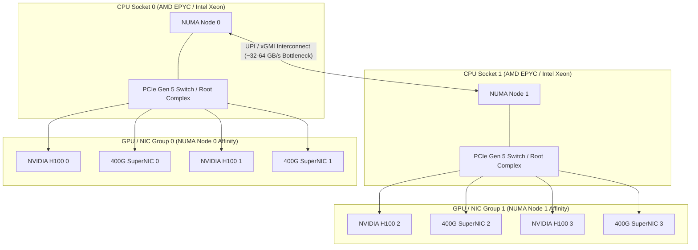
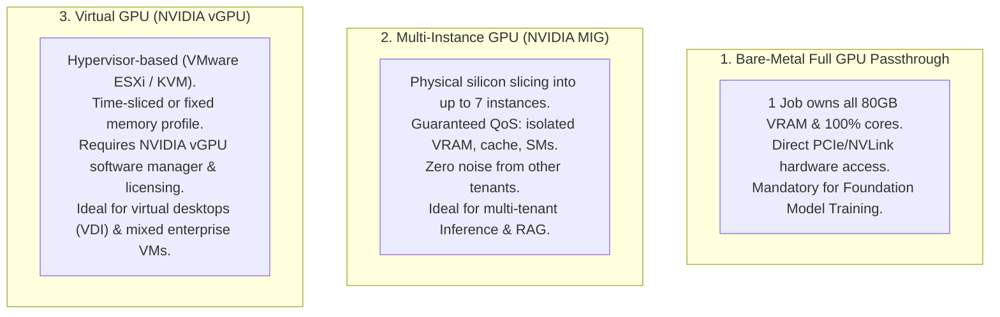
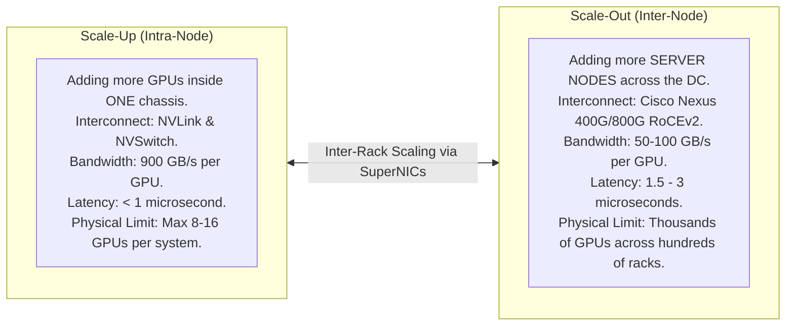

# Compute Architecture & GPU Connectivity — Blueprint Domain 2.2

> **Official Curriculum Reference:** Domain 2.2 (Evaluate compute deployment based on AI workload requirements)  
> **Blueprint Subtopics:**  
> - CPU/GPU Resources & PCIe Gen 5 Lane Allocation  
> - Connectivity: NVLink Mesh, NVSwitch, & SuperNIC-to-GPU Pairing  
> - Memory Hierarchy: HBM3/HBM3e vs. DDR5 & NUMA Affinity  
> - Virtualization & Partitioning: Bare-Metal vs. MIG vs. Passthrough  
> - Scalability: Scale-Up (Intra-Node) vs. Scale-Out (Inter-Node)  

---

## 1. Explain Like I'm a Novice: The City Highway & Airport Analogy

Imagine moving thousands of international passengers between two cities:

1. **Host RAM (DDR5) is Suburban Commuter Trains:**
   - Great for moving large crowds of ordinary commuters at 60 mph. It holds massive amounts of data (e.g., 2 Terabytes of server memory), but it's too slow to feed thousands of hungry GPU cores.
2. **GPU Memory (HBM3e) is an F1 Racetrack Right Next to the Cockpit:**
   - It only holds 80GB to 144GB of data, but it moves that data at an astronomical **3,350 Gigabytes per second**. The cores can read and write to it almost instantly.
3. **PCIe Gen 5 Bus is a 4-Lane City Expressway:**
   - It connects the host CPU to the GPU and network cards at **64 GB/s**. It's fast for normal servers, but in AI, it can become a terrible traffic jam if you try to pass GPU tensors through it.
4. **NVLink / NVSwitch is an Underground Bullet Train Between Buildings:**
   - Directly connects adjacent GPUs at **900 GB/s**, completely bypassing the city expressway (PCIe) and the train station (CPU).
5. **NUMA Affinity is Booking a Flight from the Airport Closest to Your House:**
   - If you live in South City, you drive 10 minutes to South Airport. If you drive all the way to North Airport across town, you waste an hour in rush-hour traffic.
   - In servers with two CPUs (Socket 0 and Socket 1), GPU 0 and NIC 0 must talk to Socket 0 (**Same NUMA Node**). If GPU 0 has to talk across the CPU interconnect (**UPI bus**) to Socket 1, performance plummets by 40%!

---

## 2. Server Topology: CPU-to-GPU Ratios & PCIe Lanes

In an enterprise AI compute node (such as the Cisco UCS C885A or HGX H100 system):

### Key Ratios & Rules:
- **Standard Golden Ratio:** **2 Host CPUs to 8 SXM GPUs** (a 1:4 ratio per socket).
- **PCIe Lane Budget:** Modern server CPUs provide 128 PCIe Gen 5 lanes per socket.
  - A PCIe Gen 5 x16 slot provides **64 GB/s** bidirectional bandwidth.
  - Storage NVMe drives, SuperNICs, and PCIe switches consume these lanes.
- **NUMA Pinning Requirement:** In high-performance AI operating systems, applications must bind GPU processes, CPU cores, and network interfaces to the **exact same NUMA node**. If an application process running on CPU 1 attempts to transmit data from GPU 0 via NIC 0, packets must traverse the inter-socket UPI link, introducing massive latency and memory bus contention.

---

## 3. High Bandwidth Memory (HBM3/HBM3e) vs. System DDR5

AI models are fundamentally **Memory-Bandwidth Bound**. A GPU core can perform math much faster than standard RAM can deliver numbers.

| Feature | Server Host DDR5 RAM | GPU High Bandwidth Memory (HBM3 / HBM3e) |
| :--- | :--- | :--- |
| **Physical Architecture** | Standard DIMMs plugged into motherboard slots. | 3D-stacked silicon dies connected via a silicon interposer directly beside the GPU logic die. |
| **Typical Capacity** | 1,024 GB to 4,096 GB per server. | 80 GB to 144 GB per GPU (H100/H200). |
| **Memory Bus Width** | 64-bit per channel. | **1,024-bit to 4,096-bit ultra-wide bus**. |
| **Memory Bandwidth** | ~300 to 500 GB/s aggregate. | **3,350 GB/s (H100) to 4,800 GB/s (H200)**. |
| **Role in AI** | OS kernel, data prep, batch caching. | Active model weights, gradients, KV cache, activations. |

---

## 4. GPU Partitioning: Bare-Metal vs. MIG vs. vGPU

Depending on the workload, architects choose among three compute partitioning strategies:

### NVIDIA MIG Profiles (H100 80GB Example)

On the exam, recognize valid MIG profiles for the H100:

| Profile Name | Compute Slices (SMs) | Memory Capacity | Max Instances per H100 | Ideal Workload |
| :--- | :---: | :---: | :---: | :--- |
| **1g.10gb** | 1 / 7th | 10 GB HBM3 | 7 | Small embedding models, lightweight NLP, QA tests. |
| **2g.20gb** | 2 / 7th | 20 GB HBM3 | 3 | Small LLMs (7B INT4 quantized), computer vision. |
| **3g.40gb** | 3 / 7th | 40 GB HBM3 | 2 | Medium LLMs (13B models), document processing. |
| **4g.40gb** | 4 / 7th | 40 GB HBM3 | 1 (+ 3g.40gb) | Higher compute density with 40GB memory. |
| **7g.80gb** | 7 / 7th | 80 GB HBM3 | 1 | Full GPU isolated as a single managed MIG instance. |

> [!IMPORTANT]
> **MIG Rule:** MIG **disables NVLink** between GPUs!  
> If an application spans multiple GPUs using NVLink (like Tensor Parallelism in 70B+ LLM training), you **cannot** use MIG. MIG is strictly for independent, single-instance inference or lightweight fine-tuning.

---

## 5. Scale-Up vs. Scale-Out Architecture

Understanding the boundary between Scale-Up and Scale-Out is fundamental to passing Domain 2:

---

## 6. Exam Traps & Key Distinctions

> [!WARNING]
> **Exam Pitfall 1: NVLink Across Normal Network Cables:**  
> Cisco exam questions will try to trick you into selecting "NVLink across Nexus switches". **NVLink does not leave the chassis** (except in specialized proprietary NVLink rack systems). Across the Nexus data center fabric, the protocol is **RoCEv2 over Ethernet**.

> [!WARNING]
> **Exam Pitfall 2: NUMA Mismatch:**  
> If an exam scenario states: *"GPU throughput dropped by 45% during distributed training, but CPU utilization is low and network interfaces show zero drops"*, the root cause is frequently a **NUMA misalignment** (processes bound to CPU Socket 1 while GPUs are physically wired to Socket 0).

---

## 7. Quick Revision Summary Table

| Concept | Key Technical Specification | Exam Rule of Thumb |
| :--- | :--- | :--- |
| **PCIe Gen 5 x16** | 64 GB/s bidirectional | Standard bus connecting NICs/GPUs to CPU. |
| **NVLink 4** | 900 GB/s bidirectional | High-speed bus between GPUs on same HGX baseboard. |
| **HBM3e** | Up to 4.8 TB/s bandwidth | On-die GPU memory; prevents core starving. |
| **NVIDIA MIG** | Up to 7 hardware instances | Physical silicon partitioning; disables NVLink. |
| **NUMA Node** | CPU socket + local RAM + local PCIe | Keep GPU, NIC, and CPU process on identical NUMA ID. |
