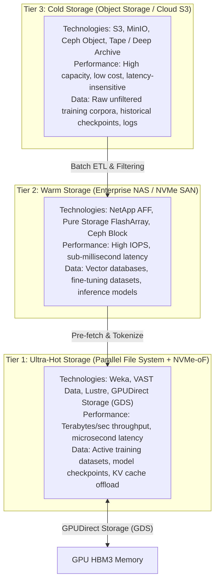
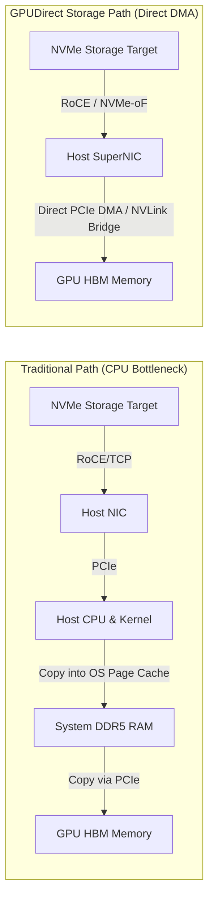
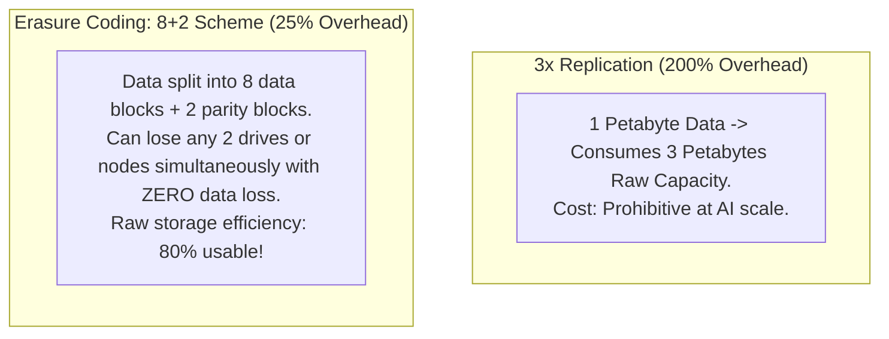

# Storage Architecture Evaluation for AI Workloads — Blueprint Domain 2.3

> **Official Curriculum Reference:** Domain 2.3 (Evaluate storage deployment based on AI workload requirements)  
> **Blueprint Subtopics:**  
> - Capacity & Dataset Sizing (Checkpoints, Weights, Data Lakes)  
> - Performance: Throughput vs. IOPS & Checkpoint Window  
> - Storage Architectures: SAN/FC, NAS, NVMe-oF, & Parallel File Systems  
> - GPUDirect Storage (GDS) Mechanics & CPU Bypass  
> - Redundancy, Availability, & Erasure Coding  

---

## 1. Explain Like I'm a Novice: The Coal Train vs. Sports Car Analogy

Storage in traditional IT is totally different from storage in AI:

1. **Traditional Enterprise Storage (SAN / Fibre Channel) is an Armored Sports Car:**
   - Designed to deliver 1,000 corporate bank balances (random tiny records) in 0.5 milliseconds.
   - It has incredible reflexes for tiny packages (**High Random IOPS**), but the trunk only holds two suitcases.
2. **AI Training Storage is a 100-Car Freight Train Moving Mountains of Coal:**
   - An AI training cluster doesn't care about looking up one person's bank balance.
   - It demands **gigabytes of continuous streaming data every single second** to feed 500 hungry GPUs. If the coal train runs out of coal for even two seconds, the entire power plant shuts down (**GPU Starvation**).
3. **The Checkpointing Nightmare (Saving the Game):**
   - Imagine playing an ultra-hard video game for 40 hours with no automatic checkpoint. If power flickers, you lose 40 hours of progress!
   - In AI, clusters save their exact memory state (**Checkpoints**) every 30 to 60 minutes. While saving, **all GPUs stop computing**.
   - If your storage writes that checkpoint in **30 seconds**, your GPUs only lose 1% of their training day.
   - If your storage takes **15 minutes** to write that checkpoint, you just burned 25% of your multi-million dollar GPU budget doing nothing!

---

## 2. The AI Storage Hierarchy: Hot, Warm, & Cold

---

## 3. Storage Architecture Comparison: SAN vs. NAS vs. Parallel File Systems

| Attribute | Traditional SAN (Fibre Channel / iSCSI) | Enterprise NAS (Standard NFS / SMB) | Parallel Scale-Out File System (Weka / VAST / Lustre) |
| :--- | :--- | :--- | :--- |
| **Data Access Method** | Block-level (LUNs mapped to single hosts). | File-level via single network controller head. | **Distributed POSIX File System** over NVMe-oF. |
| **Metadata Bottleneck** | N/A (Block layer has no file metadata). | **Severe:** Single active NFS controller must serialize millions of file lookups. | **Zero Bottleneck:** Metadata is sharded and distributed across all storage nodes. |
| **Throughput Potential** | 10–40 GB/s aggregate. | 10–50 GB/s aggregate. | **500 GB/s to 4+ Terabytes/s aggregate**. |
| **GPUDirect Storage (GDS)** | No (Requires host OS block translation). | No (Traditional kernel NFS stack). | **Yes (Native kernel-bypass straight to GPU HBM)**. |
| **Role in AI Cluster** | Host OS boot LUNs, VM datastores. | User home directories, script storage. | **Primary AI Training & Checkpoint Tier**. |

---

## 4. GPUDirect Storage (GDS) Deep Dive

Traditional storage architectures force data to travel through the host CPU, creating a massive pipeline bottleneck:

### Advantages of NVIDIA GPUDirect Storage (GDS):
1. **Host CPU Offload:** Bypasses the CPU, eliminating CPU context switches and page cache memory locks. Host CPU utilization drops from 70% to under 10% during heavy storage I/O.
2. **Latency Halved:** Data is transferred directly between the NVMe storage subsystem and GPU High-Bandwidth Memory (HBM).
3. **Saturates 400G Pipes:** Delivers line-rate throughput directly into GPU tensor cores.

---

## 5. Checkpointing Mathematics & Sizing Rules

During distributed model training, the cluster writes checkpoints to disk.

$$\text{Checkpoint Size} \approx \text{Model Parameters (Bytes)} + \text{Optimizer States} + \text{Gradients} + \text{Activations}$$

- For a **70 Billion Parameter Model (FP16)**:
  - Model weights: $70\text{B} \times 2\text{ bytes} = 140\text{ GB}$
  - Adam Optimizer states (FP32 momentum + variance + master weights): $70\text{B} \times 12\text{ bytes} = 840\text{ GB}$
  - Total raw checkpoint footprint: **~1 Terabyte per checkpoint!**
- For a cluster of 512 GPUs writing a 1 TB checkpoint every 30 minutes:
  - If target checkpoint write window is **30 seconds**:
  - Required aggregate storage write throughput:
    $$\frac{1,000\text{ GB}}{30\text{ seconds}} \approx 33.3\text{ GB/s sustained write speed}$$
- If storage write speed is only 2 GB/s, the checkpoint takes **8 minutes and 20 seconds**! The cluster wastes nearly 30% of its operational time waiting on disk writes.

---

## 6. Redundancy & Protection: Erasure Coding vs. Replication

AI training datasets and checkpoints are multi-petabyte scale. Traditional **3x replication** (storing 3 identical copies) is economically unviable.

### Storage Protection Mechanisms for AI:
1. **Erasure Coding (EC):** Breaks data chunks into fragments, expands with parity fragments, and distributes across separate failure domains (nodes, racks). Delivers high durability with minimal capacity penalty.
2. **Atomic Checkpoint Commits:** Checkpoint files are written to a temporary scratch namespace and renamed atomically upon completion. If a storage node or GPU fails mid-write, the cluster cleanly rolls back to the previous validated checkpoint.

---

## 7. Exam Traps & Key Distinctions

> [!IMPORTANT]
> **GPUDirect Storage Requires RoCEv2 or NVMe-oF:**  
> On the DCAI exam, remember that GPUDirect Storage (GDS) relies on **Direct Memory Access (DMA) over PCIe and RDMA (RoCEv2)**. It cannot function over legacy, non-RDMA storage protocols.

> [!WARNING]
> **IOPS vs. Throughput Distinction:**  
> - If an exam question mentions *serving thousands of small vector search embeddings in RAG*, look for **High Random Read IOPS (NVMe Block)**.  
> - If an exam question mentions *accelerating model training and minimizing checkpoint stall times*, look for **High Sustained Streaming Throughput (Parallel File System / Weka / VAST)**.

---

## 8. Quick Revision Summary Table

| Storage Technology | Primary Metric | Best Suited For | GPUDirect Compatible? |
| :--- | :--- | :--- | :--- |
| **Weka / VAST Data** | Terabytes/sec Throughput | AI Training Checkpoints & Datasets | **Yes (Native GDS)** |
| **NVMe-oF (RoCEv2)** | Microsecond Latency | Low-latency disaggregated storage pools | **Yes** |
| **Standard Enterprise NFS** | Ease of management | Home dirs, scripts, logs | No |
| **Object Storage (S3)** | Low Cost / Petabyte Scale | Raw data lakes, cold archive | No |
| **Fibre Channel SAN** | Predictable block IOPS | Relational DBs, virtualization boot | No |
