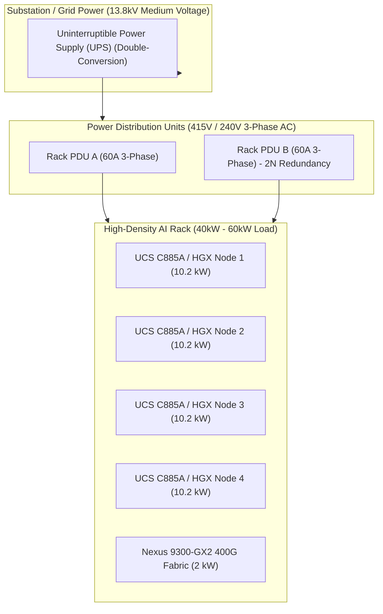
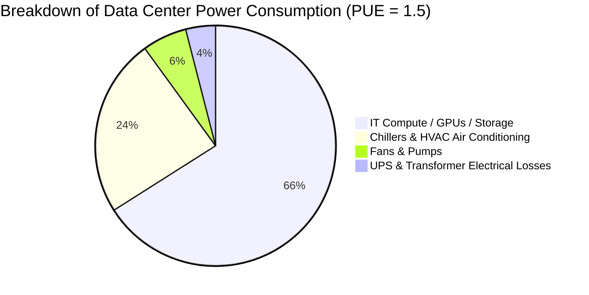
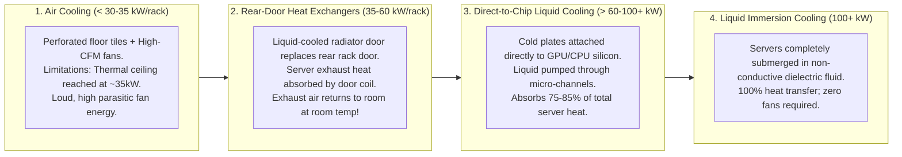

# Power, Cooling, Efficiency, & Sustainability — Blueprint Domain 2.4

> **Official Curriculum Reference:** Domain 2.4 (Evaluate power, efficiency, and sustainability based on AI workload requirements)  
> **Blueprint Subtopics:**  
> - Power Density (40kW to 100kW+ per Rack)  
> - Power Usage Effectiveness (PUE) Metrics & Calculations  
> - Cooling Architectures: Air Cooling vs. RDHx vs. Direct-to-Chip Liquid Cooling  
> - Sustainability & Renewable Energy Optimization  
> - Cisco Intersight Power Capping & Nexus Silicon One Efficiency  

---

## 1. Explain Like I'm a Novice: The Hairdryer in a Phone Booth Analogy

To understand why AI power and cooling break traditional data center design, picture this:

1. **A Traditional Enterprise Server Rack is a Few Desktop Fans:**
   - A normal rack with 20 web servers consumes about **8 to 10 Kilowatts (kW)** of power. Standard data center air conditioning can blow chilled air through the floor tiles and keep everything cool with zero drama.
2. **An AI GPU Server Rack is 50 Industrial Hairdryers Inside a Sealed Phone Booth:**
   - A modern 8-GPU server (like an NVIDIA H100/H200 system) consumes **up to 10.2 kW by itself**.
   - If you put four of those servers into a single 42RU rack along with 400G switches and storage, that single rack pulls **over 45,000 Watts (45 kW)** of power!
   - Future racks (like the NVIDIA GB200 NVL72) consume **120,000 Watts (120 kW)** in a single 24-inch footprint!
   - **Air can no longer save you:** You cannot physically push enough cold air through that tiny metal box fast enough to prevent the chips from melting. The server fans would have to spin so loud and fast that they would consume more power than the GPUs themselves!
3. **Liquid Cooling is Circulating Ice Water Through the Engine Block:**
   - Water absorbs heat **over 3,000 times more efficiently than air**.
   - Instead of blowing fans, we pipe cool liquid directly over the copper lids of the GPUs (**Direct-to-Chip**), carrying the boiling heat away silently and efficiently.

---

## 2. Power Density Calculus & Electrical Distribution

### Key Power Infrastructure Rules:
1. **Transition to 415V 3-Phase Power:**
   - Traditional 120V or 208V power delivery requires impossibly thick, heavy copper cables that block airflow and overheat.
   - High-density AI data centers deliver **415V 3-Phase power directly to the rack PDU**, drastically reducing electrical current ($I = P / V$), heat loss, and copper wire diameter.
2. **2N / N+N Power Redundancy:**
   - AI servers feature 4 to 6 redundant power supply units (PSUs).
   - Half are plugged into PDU Feed A; half are plugged into PDU Feed B. If Feed A fails, Feed B instantly takes the load without a glitch.

---

## 3. Power Usage Effectiveness (PUE) Metrics

PUE is the industry-standard benchmark for measuring data center energy efficiency.

$$\text{PUE} = \frac{\text{Total Facility Power (IT Equipment + Cooling + Lighting + Losses)}}{\text{IT Equipment Power}}$$

### PUE Benchmark Targets

| PUE Value | Efficiency Rating | Typical Cooling Architecture |
| :--- | :--- | :--- |
| **> 1.8** | Poor / Legacy | Ancient legacy data centers with inefficient CRAC air handlers. |
| **1.4 – 1.6** | Average Enterprise | Raised-floor air cooling with hot/cold aisle containment. |
| **1.15 – 1.25** | **AI-Optimized Standard** | Rear-Door Heat Exchangers (RDHx) and free-air economizers. |
| **< 1.10** | World-Class Hyperscale | **Direct-to-Chip Liquid Cooling** with warm water loops. |

> [!NOTE]
> **PUE Calculation Example:**  
> If an AI facility consumes **12 Megawatts** of total utility power, and the AI servers and switches consume **10 Megawatts**, the PUE is:
> $$\text{PUE} = \frac{12\text{ MW}}{10\text{ MW}} = 1.20$$
> A lower PUE means less energy is wasted on cooling and fans, leaving more power for raw compute!

---

## 4. Cooling Technologies: From Air to Immersion

### Technical Cooling Comparison

| Metric | Traditional Air Cooling | Rear-Door Heat Exchanger (RDHx) | Direct-to-Chip (D2C) Liquid | Immersion Cooling |
| :--- | :--- | :--- | :--- | :--- |
| **Max Rack Density** | Up to ~30 kW | Up to ~60 kW | **Up to 100 kW+** | **100 kW to 200 kW** |
| **Coolant Medium** | Chilled Air | Chilled Water / Glycol | Treated Distilled Water / Glycol | Synthetic Dielectric Hydrocarbon / Fluorochemical |
| **Facility Impact** | Massive HVAC ducts & raised floor. | Retrofits into standard air-cooled rooms. | Requires Coolant Distribution Units (**CDUs**) and liquid piping manifolds. | Heavy tanks, specialized maintenance cranes, warranty considerations. |
| **Parasitic Fan Power** | Extremely High (up to 20% of IT load). | Moderate. | Low (only small secondary fans for VRMs/DIMMs). | **Zero (Fans removed entirely)**. |

---

## 5. Cisco UCS & Nexus Sustainability Features

Cisco integrates advanced power and thermal management into **Intersight** and **NX-OS**:

### 1. Cisco Intersight Dynamic Power Capping
- **What it does:** Allows data center administrators to set strict electrical limits per chassis, rack, or group of servers.
- **How it works:** If a building's power grid suffers a brownout or cooling unit failure, Intersight throttles GPU clock frequencies via IPMI/redfish to keep total consumption under a hard wattage ceiling, preventing the main facility circuit breaker from tripping.

### 2. Cisco Silicon One ASIC Energy Efficiency
- Cisco Nexus switches powered by **Silicon One (e.g., Nexus 9800)** consolidate multiple disparate chips (ingress buffers, traffic managers, crossbar fabrics) into a **single piece of monolithic silicon**.
- Consumes up to **35% less power per gigabit switched** compared to legacy multi-chip routing architectures.

### 3. Optical Power Optimization (LPO vs. Retimed Transceivers)
- Standard 400G/800G optical transceivers use power-hungry Digital Signal Processors (DSPs) inside each optical module (~10W to 14W per port).
- Cisco is pioneering **Linear Pluggable Optics (LPO)** and **Co-Packaged Optics (CPO)**, eliminating the onboard DSP and slashing optic power consumption by up to 50%!

---

## 6. Exam Traps & Key Distinctions

> [!TIP]
> **Warm Water Cooling Advantage:**  
> Direct-to-Chip (D2C) liquid cooling can operate with supply water temperatures up to **32°C to 45°C (Warm Water Cooling)**. This means the data center can use outdoor evaporative cooling towers ("Free Cooling") year-round, completely turning off mechanical refrigeration chillers and driving PUE down to 1.08!

> [!WARNING]
> **The Thermal Throttling Trap:**  
> If an exam question describes a scenario where *AI training times inexplicably slow down by 30% between 2:00 PM and 5:00 PM every afternoon with zero network packet drops*, suspect **thermal throttling**: high ambient summer temperatures cause GPU sensors to automatically throttle clock speeds to protect silicon!

---

## 7. Quick Revision Summary Table

| Concept | Definition / Formula | Ideal Benchmark |
| :--- | :--- | :--- |
| **PUE** | $\frac{\text{Total Facility Energy}}{\text{IT Compute Energy}}$ | **1.15 to 1.25** for modern AI facilities |
| **Air Cooling Limit** | Maximum physical thermal density for air | **~30 to 35 kW per rack** |
| **Direct-to-Chip (D2C)** | Liquid cold plates mounted to GPUs/CPUs | Handles **60kW to 100kW+ per rack** |
| **CDU** | Coolant Distribution Unit (Pumps & heat exchangers) | Central heart of liquid-cooled loops |
| **Power Capping** | Policy-enforced wattage ceilings in Intersight | Prevents data center electrical overdraw |
