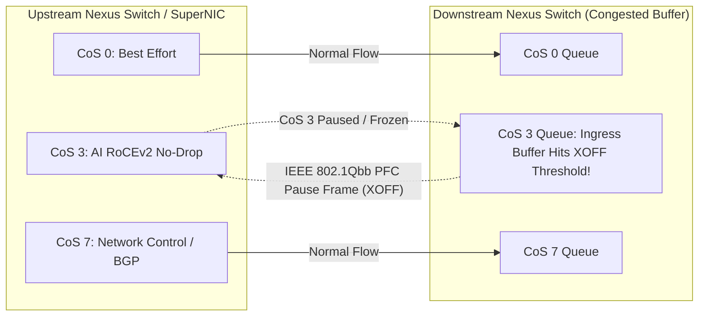
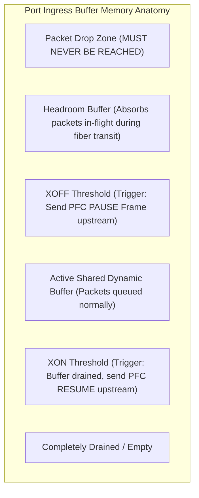
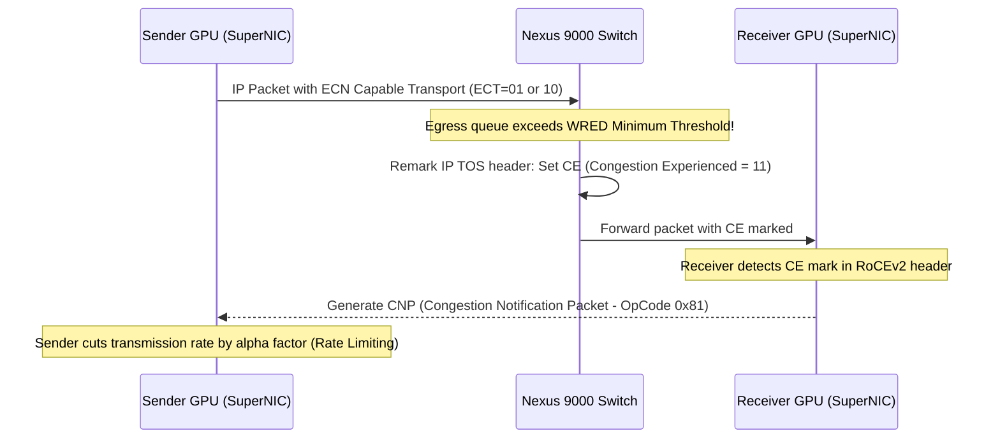
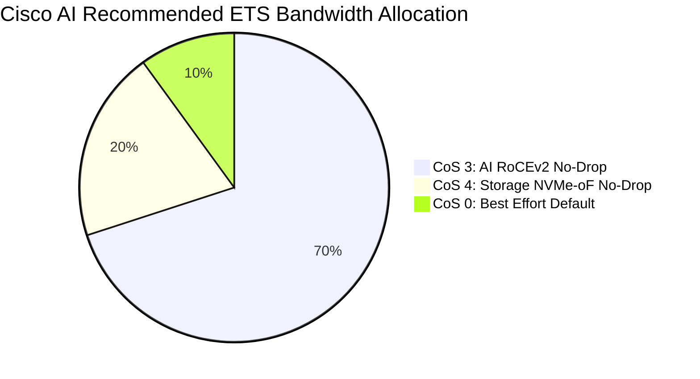

# Lossless Ethernet & Congestion Control — PFC, ECN, & ETS

> **Official Curriculum Reference:** Domain 3.1.a (Congestion control mechanisms)  
> **Blueprint Subtopics:**  
> - Priority-based Flow Control (PFC - IEEE 802.1Qbb)  
> - Explicit Congestion Notification (ECN - RFC 3168 & WRED)  
> - Enhanced Transmission Selection (ETS - IEEE 802.1Qaz)  
> - Headroom Buffers, Pause Frames, & Deadlock Avoidance  

---

## 1. Explain Like I'm a Novice: The Freeway Ramp Meter & Train Brakes Analogy

To understand why standard Ethernet fails AI, you have to realize that Ethernet was born in 1973 as a **"best-effort"** network:
- If a switch buffer fills up, standard Ethernet just throws incoming packets into the digital trash can (**Packet Drop**).
- Standard web traffic doesn't mind: TCP notices the drop, pauses for a moment, and retransmits the lost packet.
- **In AI, packet drops are catastrophic.** When GPUs are exchanging gradient tensors across 400G links, a single dropped packet causes the entire GPU cluster to freeze and timeout.

**To make Ethernet 100% lossless, we use two cooperating mechanisms:**

1. **ECN (The Gentle Ramp Meter Light):**
   - Think of a highway on-ramp with a digital sign: *"Traffic slowing ahead, please reduce speed to 45 mph."*
   - ECN does **not** stop cars. It simply stamps a small warning tag on packets (**Congestion Experienced - CE bit**) when switch buffers start filling up.
   - The receiving GPU sees this tag, sends an urgent notification back to the sender (**CNP - Congestion Notification Packet**), and the sender politely slows down its transmission rate.
2. **PFC (The Emergency Railroad Handbrake):**
   - What happens if traffic builds up so fast that ECN isn't fast enough?
   - PFC pulls the emergency handbrake! The downstream switch sends an **802.1Qbb Pause Frame** backward to the upstream switch: *"STOP TRANSMITTING ON LANE 3 IMMEDIATELY! MY BUFFER IS FULL!"*
   - The upstream switch pauses only Lane 3 (CoS 3), while normal web and SSH traffic on Lanes 0–2 keeps rolling smoothly!
3. **ETS (The Multi-Lane Carpool Law):**
   - If Lane 3 is given high priority, what stops it from hogging 100% of the highway and starving all other traffic to death?
   - **ETS** guarantees minimum percentages: e.g., Lane 3 (AI RoCE) gets guaranteed 70% of bandwidth, Lane 4 (Storage) gets 20%, and Lane 0 (Management) gets 10%.

---

## 2. Priority-based Flow Control (PFC — IEEE 802.1Qbb)

Standard IEEE 802.3x Flow Control was all-or-nothing: pausing a port paused the entire physical cable, freezing management, BGP, and data alike.  
**PFC splits the link into 8 independent Class of Service (CoS 0–7) virtual lanes:**



### Buffer Architecture: XOFF, XON, and Headroom

Inside a Cisco Nexus switch (Cloud Scale or Silicon One ASIC), memory buffers are partitioned into precise operational zones:



1. **Active Shared Buffer:** Packets arrive and are forwarded out the egress port.
2. **XOFF Threshold:** When ingress buffer occupancy crosses this line, the switch immediately fires a **PFC PAUSE frame** out the cable to the upstream neighbor.
3. **Headroom Buffer (Critical Concept):**
   - Light travels down a fiber cable at ~5 nanoseconds per meter.
   - When the switch sends a PFC PAUSE frame, there are still hundreds of packets physically traveling in-flight down the 100-meter fiber optic cable! Furthermore, the upstream NIC takes a few nanoseconds to process the pause.
   - **Headroom** is the dedicated safety buffer reserved exclusively to absorb those in-flight packets. If headroom is too small, packets drop before the sender stops!
4. **XON Threshold:** Once the downstream egress queue drains below this lower watermark, the switch sends an unpause frame, resuming transmission.

---

## 3. Explicit Congestion Notification (ECN — RFC 3168 & WRED)

PFC is a reactive emergency brake. If you rely solely on PFC, you cause constant start-stop jitter ("PFC thrashing"). **ECN is proactive and smooth:**



### ECN WRED Marking Curve

Cisco Nexus switches use **Weighted Random Early Detection (WRED)** to mark ECN bits based on buffer queue depth:

```
Probability of Marking CE
  100% |                                      ┌────────────────
       |                                     /
       |                                    /
       |                                   /
       |                                  /
    0% |─────────────────┬───────────────┘
       0               WRED Min        WRED Max         PFC (XOFF)
                       Threshold       Threshold        Threshold
```

- **Below WRED Min:** 0% of packets are marked.
- **Between Min and Max:** Packets are probabilistically marked with CE (Congestion Experienced = `11` in the IP ECN field). As the queue grows, the percentage marked increases.
- **Above WRED Max:** 100% of packets are marked with CE.
- **PFC XOFF Threshold:** Placed comfortably **above WRED Max**. PFC should only trigger if the sender fails to slow down in response to ECN!

---

## 4. Enhanced Transmission Selection (ETS — IEEE 802.1Qaz)

ETS replaces rigid strict priority queuing with **weighted deficit round-robin scheduling (DWRR)**.



- **Guaranteed Bandwidth:** During peak congestion, each traffic class is guaranteed its configured bandwidth percentage.
- **Work-Conserving Sharing:** If CoS 4 (Storage) is currently idle, CoS 3 (RoCEv2) is dynamically allowed to consume 90% or 100% of the link. Bandwidth is never wasted.

---

## 5. Dangerous Failure Modes: PFC Deadlock & Pause Storms

PFC is powerful, but if misconfigured, it can bring down an entire enterprise data center:

### 1. The PFC Deadlock (Circular Dependency Loop)
- Occurs when a circular traffic dependency forms across switches (e.g., Switch A pauses Switch B, which pauses Switch C, which pauses Switch A).
- All buffers fill to 100%, all switches wait on each other to unpause, and the entire network freezes permanently.

### 2. PFC Pause Storms (Slow-Drain Device)
- A single broken server or misconfigured SuperNIC gets stuck and continuously floods the switch with PFC pause frames.
- The switch pauses its upstream neighbor, which pauses its neighbor, propagating pause frames backwards across the entire data center in milliseconds!

### Cisco Nexus Solution: PFC Watchdog
Cisco NX-OS includes a hardware-level **PFC Watchdog timer**:
- If a queue remains paused for longer than a configured threshold (e.g., 100 milliseconds), the switch detects an abnormal condition.
- The PFC watchdog automatically disables PFC on that specific queue and drains the misbehaving packets, preventing the pause storm from poisoning the rest of the fabric.

---

## 6. Exam Traps & Key Distinctions

> [!IMPORTANT]
> **ECN vs. PFC Relationship:**  
> On the DCAI exam: **ECN operates on EGRESS queues** (marking packets as they leave congested output ports). **PFC operates on INGRESS buffers** (pausing incoming traffic when input buffers fill up). ECN thresholds must ALWAYS be set lower than PFC thresholds!

> [!WARNING]
> **CoS 3 is the Universal AI Industry Standard:**  
> While PFC can theoretically be configured on any CoS from 0 to 7, Cisco Validated Designs and NVIDIA DGX clusters universally standardize on **CoS 3 (DSCP 24 or 26) as the Lossless No-Drop queue**.

---

## 7. Quick Revision Summary Table

| Technology | Standard / RFC | Layer of Operation | Primary Action | Key Configuration Metric |
| :--- | :--- | :--- | :--- | :--- |
| **PFC** | IEEE 802.1Qbb | Layer 2 MAC Control | Sends Pause frame backwards; halts transmission | XOFF, XON, Headroom buffer |
| **ECN** | RFC 3168 | Layer 3 IP TOS Field | Marks CE bits (`11`); triggers receiver CNP | WRED Min, WRED Max |
| **ETS** | IEEE 802.1Qaz | Layer 2 Scheduler | Allocates minimum bandwidth percentages | DWRR weights (e.g., 70% / 20% / 10%) |
| **PFC Watchdog** | Cisco NX-OS Feature | Switch Hardware ASIC | Drops packets & unfreezes queues during pause storms | Detection timer (ms) & Recovery timer |
