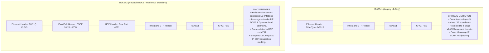
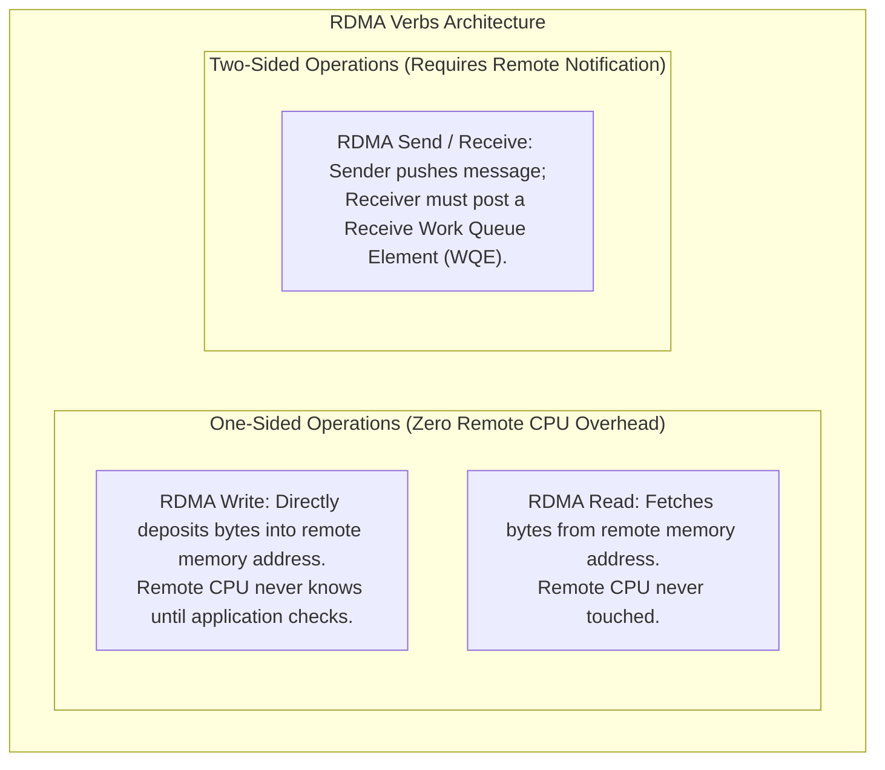
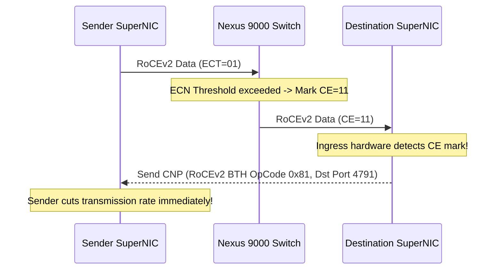

# RDMA over Converged Ethernet (RoCE & RoCEv2) Deep Dive — Blueprint Domain 3.1.b

> **Official Curriculum Reference:** Domain 3.1.b (RDMA over Converged Ethernet: RoCE, RoCEv2)  
> **Target Concepts:** Kernel Bypass, Zero-Copy, RoCEv1 vs. RoCEv2, UDP Port 4791, Packet Anatomy, BTH, Queue Pairs (QP), and CNP Packets.

---

## 1. Explain Like I'm a Novice: The Traditional Mailroom vs. The Teleporter Analogy

To understand why RDMA is the lifeblood of AI clusters, look at how regular computers send data:

1. **Standard TCP/IP is a Bureaucratic Government Mailroom (CPU Bottleneck):**
   - Application wants to send data.
   - It knocks on the Linux Operating System Kernel door.
   - The OS **wakes up the CPU**, allocates a memory buffer in RAM, and copies the data into the kernel buffer (**Copy #1**).
   - The CPU breaks the data into packets, calculates TCP checksums, generates headers, and copies the packets to the network card buffer (**Copy #2**).
   - On the receiving server, this entire painful process repeats in reverse: the receiving CPU is interrupted, copies data to its kernel, and copies it to the app (**Copy #3 and #4**).
   - **Result:** The CPU spends 60% of its energy playing courier, adding milliseconds of jitter and burning CPU cores.
2. **RDMA (Remote Direct Memory Access) is a Sci-Fi Teleporter (Zero-Copy & Kernel Bypass):**
   - GPU 0 on Server A wants to write 1 Gigabyte of tensors directly into the memory of GPU 0 on Server B.
   - GPU 0 gives a command directly to the **SuperNIC** network card via PCIe.
   - **The Linux OS Kernel and CPU are completely bypassed!**
   - The sending SuperNIC reaches into GPU A's memory, beams the data across the 400G network, and the receiving SuperNIC writes the data directly into GPU B's memory.
   - **Result:** Zero CPU interrupts, zero intermediate memory copies, and sub-microsecond latency.

---

## 2. RoCEv1 vs. RoCEv2: The Architectural Evolution



### Detailed Protocol Comparison

| Attribute | RoCEv1 | RoCEv2 (Routable RoCE) |
| :--- | :--- | :--- |
| **Layer** | Layer 2 (Data Link) | **Layer 3 / Layer 4 (Network & Transport)** |
| **EtherType / IP Protocol** | EtherType `0x8915` | IP Protocol `17` (UDP) |
| **UDP Destination Port** | None (Raw Ethernet) | **`4791` (IANA Standard)** |
| **UDP Source Port** | None | **Calculated Hash of QP / Flow** (Enables switch ECMP!) |
| **Routability** | Non-routable (Single VLAN) | **Routable across Spine-Leaf IP subnets** |
| **ECMP Multipathing** | Impossible (Switches see no IP/UDP) | **Native line-rate IP/UDP hash distribution** |
| **Congestion Marking** | L2 Priority only | **Full L3 ECN (RFC 3168) + DSCP** |

---

## 3. Detailed RoCEv2 Packet Anatomy

On the 300-640 DCAI exam, you must recognize the exact encapsulation fields of a RoCEv2 packet:

```
┌─────────────────────────────────────────────────────────────────────────────────────────┐
│ Layer 2: Ethernet Header (DMAC, SMAC, 802.1Q Tag: CoS 3)                                │
├─────────────────────────────────────────────────────────────────────────────────────────┤
│ Layer 3: IPv4 Header (SIP, DIP, DSCP: 24/26, ECN: ECT(0) or CE)                        │
├─────────────────────────────────────────────────────────────────────────────────────────┤
│ Layer 4: UDP Header (Src Port: Hash-Generated, Dst Port: 4791, Length, Checksum: 0x0000)│
├─────────────────────────────────────────────────────────────────────────────────────────┤
│ InfiniBand BTH (Base Transport Header: OpCode, Partition Key, Dest QPN, PSN, AckReq)   │
├─────────────────────────────────────────────────────────────────────────────────────────┤
│ InfiniBand Extended Headers (RETH / AETH / DETH - Address & Length)                     │
├─────────────────────────────────────────────────────────────────────────────────────────┤
│ RDMA Payload (Tensor Data / Model Weights)                                              │
├─────────────────────────────────────────────────────────────────────────────────────────┤
│ ICRC (Invariant CRC: 32-bit check over immutable fields) + Ethernet FCS                 │
└─────────────────────────────────────────────────────────────────────────────────────────┘
```

### Critical Header Fields Explained:
1. **802.1Q VLAN Tag (CoS):** Prioritizes the frame for switch PFC pause triggers (typically **CoS 3**).
2. **DSCP (Differentiated Services Code Point):** Layer 3 priority marking. Typically set to **CS3 (`24`)** or **AF31 (`26`)**.
3. **UDP Source Port (Dynamic Flow Entropy):**
   - When a SuperNIC generates a RoCEv2 UDP packet, it sets the destination port to `4791`.
   - But it sets the **UDP Source Port to a hash of the Queue Pair (QP)**!
   - **Why?** Network switches (Cisco Nexus 9000) hash the IP 5-tuple (`SrcIP, DstIP, Protocol, SrcPort, DstPort`) to choose an ECMP uplink. By randomizing the UDP source port per flow, RoCEv2 spreads traffic evenly across all spine uplinks!
4. **UDP Checksum:** By specification, the UDP checksum in RoCEv2 is typically set to `0x0000` (disabled), because InfiniBand uses the **ICRC** to guarantee data integrity without incurring UDP checksum calculation overhead.
5. **Base Transport Header (BTH):**
   - **OpCode:** Defines the operation (e.g., `RDMA WRITE`, `RDMA READ`, `SEND`, `CNP`).
   - **Destination QPN (Queue Pair Number):** The hardware socket endpoint on the target NIC.
   - **PSN (Packet Sequence Number):** Detects dropped or out-of-order packets.

---

## 4. RDMA Core Mechanics: Verbs & Memory Registration

RDMA operates using software primitives called **Verbs**:



### Memory Registration (MR) & Protection Keys (R_Key)
Before an application can use RDMA:
1. **Memory Pinning:** The application tells the Linux kernel to lock virtual memory pages into physical RAM, preventing the OS from ever swapping them out to disk.
2. **Address Translation Registration:** The virtual-to-physical memory mapping is handed directly to the SuperNIC's internal translation table.
3. **Remote Key (R_Key):** The host generates an authorization token (`R_Key`) and sends it across the network to the authorized partner. Remote nodes can only write to memory ranges matching their valid `R_Key`, guaranteeing security!

---

## 5. Congestion Notification Packets (CNP)

When an ECN-marked RoCEv2 packet arrives at the destination NIC:



- **CNP OpCode:** `0x81` in the InfiniBand Base Transport Header.
- **Port:** Sent as an independent UDP packet on port `4791`.
- **High Priority:** CNP packets are marked with high QoS priority so they bypass queued data packets and reach the sender in microseconds.
- **Rate-Limiting Algorithm:** Upon receiving a CNP, the sender's SuperNIC throttles its transmission rate for that specific Queue Pair, preventing the switch buffers from escalating to a full PFC pause.

---

## 6. Exam Traps & Key Distinctions

> [!IMPORTANT]
> **Port 4791 is Burned into the Exam:**  
> If you see an ACL question, an NDFC template question, or a packet trace question on the DCAI exam, **UDP Port 4791 is always the RoCEv2 identifier**.

> [!WARNING]
> **UDP Source Port is Dynamic:**  
> The **Destination Port is static (4791)**, but the **Source Port is dynamic and randomized per flow** to provide entropy for ECMP hashing. Do not configure switch ACLs that expect a fixed source port!

---

## 7. Quick Revision Summary Table

| Field / Component | Technical Value / Role | Key Exam Significance |
| :--- | :--- | :--- |
| **RoCEv2 L4 Protocol** | UDP (IP Protocol 17) | Allows traversal of IP routers |
| **Destination UDP Port** | **4791** | Standard IANA assigned RoCEv2 port |
| **Source UDP Port** | Flow hash (Dynamic 49152–65535) | Powers ECMP hash distribution |
| **BTH OpCode 0x81** | Congestion Notification Packet (CNP) | ECN feedback loop trigger |
| **Kernel Bypass** | Direct user-space to SuperNIC DMA | Eliminates CPU interrupts and memory copies |
| **Memory Registration** | Virtual memory pinning & R_Key creation | Grants remote SuperNIC direct access |
