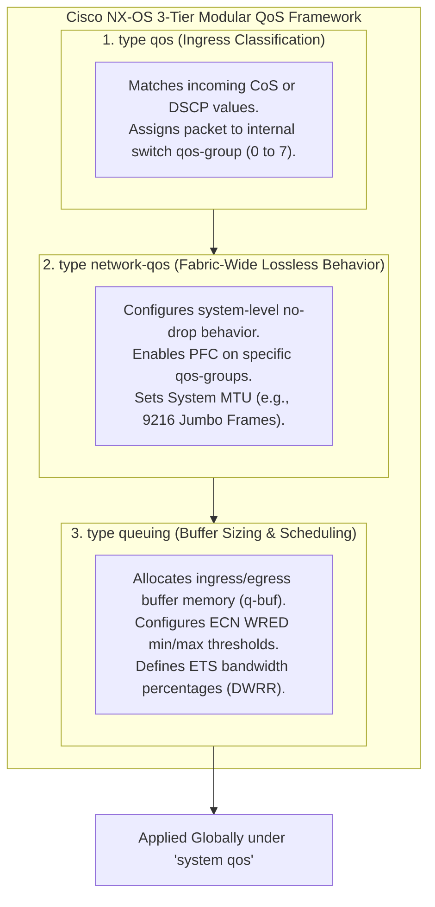

# QoS & Queuing Configuration on Cisco Nexus NX-OS — Blueprint Domain 3.1.c

> **Official Curriculum Reference:** Domain 3.1.c (Configure Quality of Service - QoS on Cisco Data Center)  
> **Target Concepts:** Modular QoS CLI (MQC), Classification (`type qos`), Queuing & Scheduling (`type queuing`), Fabric Lossless Policies (`type network-qos`), PFC Pause Configuration, and Buffer Tuning.

---

## 1. Explain Like I'm a Novice: The Airport VIP & Luggage System

Configuring QoS on a Cisco Nexus switch is just like managing passenger traffic at a busy international airport:

1. **Classification (`type qos`) is the Check-In Desk:**
   - The agent looks at your ticket (packet header).
   - If you have an economy ticket (standard web traffic), they put a white luggage tag on your bag.
   - If you have a First-Class ticket (AI RoCEv2 with DSCP 26 / CoS 3), they slap a giant **Neon Pink VIP Priority Tag** on your bag (internal `qos-group 3`).
2. **Network Policy (`type network-qos`) is the Airport Security Rulebook:**
   - The rulebook states: *"No VIP Pink luggage may EVER be thrown in the trash. If the baggage belt is jammed, press the pause button on the cart until space clears!"* (This is the **Lossless No-Drop PFC policy** with **MTU 9216**).
3. **Queuing & Scheduling (`type queuing`) is the Luggage Belts & Airplanes:**
   - It divides the cargo plane: 70% of the cargo bay is reserved for Pink VIP bags, 20% for storage, and 10% for general economy.
   - If the VIP belt starts getting crowded, a warning beacon flashes to tell passengers to slow down (**ECN WRED**).

---

## 2. The Cisco NX-OS MQC Architecture

Cisco NX-OS uses the **Modular QoS CLI (MQC)**. Unlike traditional IOS, NX-OS splits QoS into **three specialized policy types**:



---

## 3. Step-by-Step AI Lossless QoS Configuration Template

Here is the exact production NX-OS configuration used in **Cisco Validated Designs for AI (RoCEv2 on CoS 3 / DSCP 26)**:

### Step 1: Ingress Classification (`type qos`)
Match incoming RoCEv2 traffic (DSCP 26 or CoS 3) and map it into internal hardware **`qos-group 3`**:

```text
! Step 1: Define the class-map to match RoCEv2 traffic
class-map type qos match-any CM_ROCE
  match dscp 26
  match cos 3

! Step 2: Create ingress classification policy-map
policy-map type qos PM_QOS_INGRESS
  class CM_ROCE
    set qos-group 3
  class class-default
    set qos-group 0
```

### Step 2: Network-QoS Policy (`type network-qos`)
Enable **lossless no-drop (PFC)** on `qos-group 3` and set the global Jumbo Frame MTU to `9216`:

```text
! Step 1: Define system class matching qos-group 3
class-map type network-qos CM_NETQOS_ROCE
  match qos-group 3

! Step 2: Configure no-drop pause behavior and MTU 9216
policy-map type network-qos PM_NETWORK_QOS
  class CM_NETQOS_ROCE
    pause pfc-cos 3
  class class-default
    mtu 9216
```

### Step 3: Queuing, Buffer Allocation, & ECN WRED (`type queuing`)
Carve ingress and egress buffers, configure ETS bandwidth distribution (70% RoCE, 30% Default), and configure **ECN marking**:

```text
! Step 1: Define queuing class-maps
class-map type queuing CM_QUEUE_ROCE
  match qos-group 3

! Step 2: Configure queuing policy with ECN and ETS
policy-map type queuing PM_QUEUING_EGRESS
  class type queuing CM_QUEUE_ROCE
    bandwidth percent 70
    random-detect ecn
    random-detect minimum-threshold 150 kbytes maximum-threshold 1500 kbytes
  class type queuing class-default
    bandwidth percent 30

policy-map type queuing PM_QUEUING_INGRESS
  class type queuing CM_QUEUE_ROCE
    queue-limit percent 50
```

### Step 4: Apply Policies Globally under `system qos`

```text
system qos
  service-policy type qos input PM_QOS_INGRESS
  service-policy type network-qos PM_NETWORK_QOS
  service-policy type queuing input PM_QUEUING_INGRESS
  service-policy type queuing output PM_QUEUING_EGRESS
```

---

## 4. Port-Level Interface Overrides & PFC Watchdog

On interfaces connected directly to AI servers (SuperNICs):

```text
interface Ethernet1/1-16
  description "Connected to HGX H100 SuperNICs (RoCEv2 400G)"
  mtu 9216
  priority-flow-control mode on
  priority-flow-control watch-dog-interval 100
```

### Critical Interface Parameters:
- `priority-flow-control mode on`: Actively enables 802.1Qbb PFC on the interface (auto/on).
- `priority-flow-control watch-dog-interval 100`: Activates the **PFC Watchdog** with a 100ms timeout to detect and quarantine pause storms!

---

## 5. Essential Verification & Diagnostic Commands

When troubleshooting QoS on NX-OS, use these core commands:

### 1. Verify Priority-Based Flow Control Status
```text
switch# show priority-flow-control interface Ethernet1/1

Port       Mode  Oper(VL)  Rx-PPP  Tx-PPP  Watchdog
---------------------------------------------------
Eth1/1     on    on(3)     1420    0       Enabled
```
*Key Metric:* If `Rx-PPP` (Received Pause Packets) is counting rapidly, the server is overwhelmed and telling the switch to pause. If `Tx-PPP` is high, the switch buffer is filling up and pausing the server.

### 2. Verify Queuing & Buffer Drops
```text
switch# show queuing interface Ethernet1/1

Interface Ethernet1/1:
  Egress Queuing:
    qos-group 3 (CM_QUEUE_ROCE):
      Transmitted packets   : 14298102345
      Transmitted bytes     : 146429381023450
      Dropped packets       : 0                <-- MUST BE ZERO!
      ECN marked packets    : 14820            <-- Normal ECN activity!
    qos-group 0 (class-default):
      Transmitted packets   : 502812
      Dropped packets       : 12
```

### 3. Verify Active System Policies
```text
switch# show policy-map system
```
Validates that the `type qos`, `type network-qos`, and `type queuing` policies are active on hardware ASICs.

---

## 6. Exam Traps & Common Misconfigurations

> [!IMPORTANT]
> **Matching DSCP vs. CoS:**  
> On routed (Layer 3) boundaries, standard 802.1Q VLAN headers are stripped! Therefore, **classification must match DSCP (Layer 3)** in addition to CoS. Matching only CoS will result in packets dropping into `class-default` as soon as they cross a routed hop!

> [!WARNING]
> **MTU Mismatch Disasters:**  
> If an AI server transmits 9000-byte jumbo frames, but a Nexus switch port has default MTU 1500, the switch **drops the frames silently as `Rx Jumbo Drops`**. Always ensure MTU 9216 is set in `type network-qos` and verified on interfaces.

---

## 7. Quick Revision Summary Table

| MQC Policy Type | Configuration Scope | Core Directives |
| :--- | :--- | :--- |
| **`type qos`** | Ingress classification | `match dscp`, `match cos`, `set qos-group` |
| **`type network-qos`** | Global fabric behavior | `pause pfc-cos <id>`, `mtu 9216` |
| **`type queuing`** | Ingress/Egress buffering | `bandwidth percent`, `random-detect ecn`, `queue-limit` |
| **PFC Watchdog** | Interface-level resilience | `priority-flow-control watch-dog-interval` |
