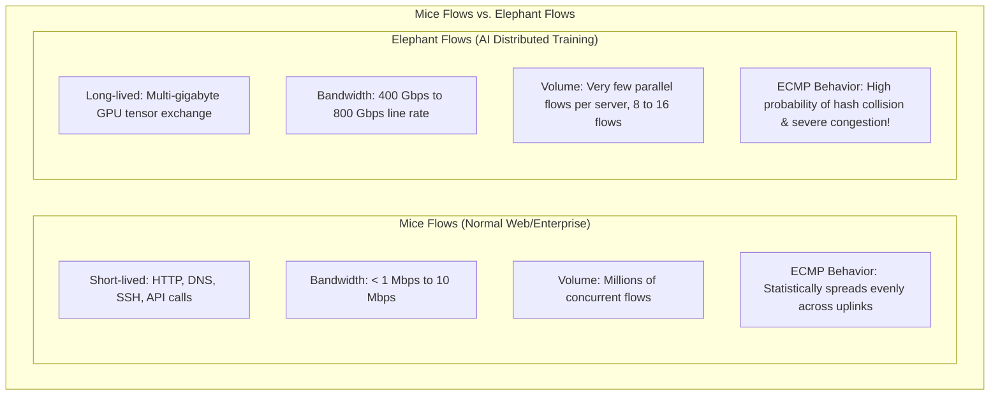
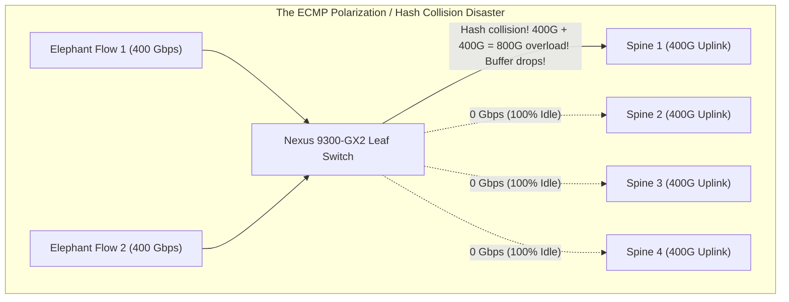
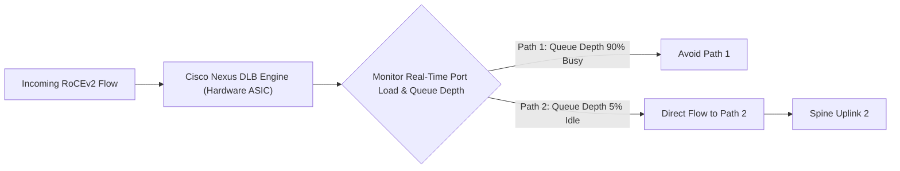

# Load Balancing & Traffic Distribution — ECMP, DLB, & Flowlet Switching

> **Official Curriculum Reference:** Domain 3.1.d (Load distribution)  
> **Target Concepts:** Elephant Flows vs. Mice Flows, ECMP Hashing Collisions, Dynamic Load Balancing (DLB), Flowlet Switching, Packet Spraying, and Resilient Hashing.

---

## 1. Explain Like I'm a Novice: The Supermarket Checkout Line Analogy

Understanding load balancing in AI clusters comes down to two very different grocery shopping experiences:

1. **Enterprise Traffic is 1,000 People Buying Single Candy Bars (Mice Flows):**
   - If a supermarket has 16 open checkout registers and 1,000 customers with single candy bars, you can tell customers: *"Pick a register based on your birthday month"* (Static ECMP 5-tuple hash).
   - Even if two people pick the same register, each transaction takes 5 seconds. Everyone gets through smoothly.
2. **AI Cluster Traffic is 4 People with 50 Giant Flatbed Carts of Lumber (Elephant Flows):**
   - Each customer has enough lumber to block a register for 45 minutes straight.
   - Now imagine two of these flatbeds randomly pick Register #1 because of the birthday rule.
   - Register #1 has a **catastrophic 90-minute traffic jam**, while Registers #2, #3, and #4 are **completely empty with clerks twiddling their thumbs!**
   - That is the **ECMP Hash Collision problem**.
3. **Cisco Dynamic Load Balancing (DLB) is an Intelligent Store Floor Manager:**
   - The manager stands in front of the registers with a headset.
   - They look at the actual line lengths in real-time.
   - When a giant flatbed cart arrives, the manager directs it directly to the emptiest register, dynamically balancing the load across all lanes!

---

## 2. The Elephant Flow Problem in AI Networking

In deep learning clusters, GPUs don't communicate using thousands of small packets. They transmit **massive continuous streams of tensor data at line rate (400 Gbps)**:



---

## 3. The Failure of Traditional ECMP (Static 5-Tuple Hashing)

Standard switches distribute traffic across Equal-Cost Multi-Paths by calculating a CRC hash of the packet's **5-Tuple**:

$$\text{Egress Port} = \text{Hash}(\text{SrcIP, DstIP, Protocol, SrcPort, DstPort}) \pmod{\text{Number of Uplinks}}$$



### Why ECMP Breaks in AI Fabrics:
- Because an AI server only runs a few giant flows at any given second, **hash collisions are mathematically guaranteed**.
- When two 400G flows land on the same 400G uplink, buffer queues explode immediately, triggering **PFC pause frames**, slowing down training, or causing packet drops.
- Meanwhile, 75% of your expensive Spine bandwidth sits completely unutilized!

---

## 4. Cisco Dynamic Load Balancing (DLB) Mechanics

To fix this, Cisco implemented **Dynamic Load Balancing (DLB)** in hardware on **Nexus 9000 Cloud Scale and Silicon One ASICs**:



### How DLB Works:
1. **Real-Time Hardware Telemetry:** The ASIC continuously measures port queue depth and byte counters on all ECMP egress paths.
2. **Quality-Aware Forwarding:** When a new flow or flowlet arrives, DLB evaluates which uplink has the **lowest latency and lowest buffer utilization**.
3. **Threshold-Triggered Rerouting:** If an existing path becomes congested, DLB dynamically steers new bursts to an alternate path.

---

## 5. Flowlet Switching: Eliminating Out-of-Order Packets

A major danger of dynamically moving traffic across different network paths is **Packet Reordering**:
- If Packet #1 takes Path A (15 microseconds) and Packet #2 takes Path B (10 microseconds), Packet #2 arrives at the destination *before* Packet #1.
- In unoptimized stacks, out-of-order packets cause transport stalls and CPU overhead.

### The Flowlet Solution:
A **flowlet** is a natural burst of packets within a larger elephant flow separated by a brief pause (**Flowlet Gap**):

```
Flowlet 1                     Flowlet Gap (> Inter-Path Delay Difference)       Flowlet 2
[P1][P2][P3][P4] ───────────────────────► [  SILENCE: > 60µs  ] ───────────────► [P5][P6][P7][P8]
   (Sent on Path A)                                                                 (Safe to send on Path B!)
```

- If the silent gap between bursts is greater than the latency difference between paths, **Packet #5 can safely be routed down a completely different path without any risk of arriving before Packet #4!**
- Cisco Nexus switches track these flowlet gaps in hardware timers, safely distributing flows across all uplinks without creating packet reordering.

---

## 6. Packet Spraying (Per-Packet Load Balancing)

In modern AI superclusters featuring **NVIDIA SuperNICs (ConnectX-7 / ConnectX-8)**:
- The network can execute **Packet Spraying**: the switch forwards every individual packet to a different ECMP spine link in round-robin fashion ($P_1 \to S_1, P_2 \to S_2, P_3 \to S_3, P_4 \to S_4$).
- **The Result:** Achieves **perfect 100% fabric utilization** across all spine links.
- **The Catch:** Packets arrive out-of-order. Modern SuperNICs have dedicated on-die hardware reordering engines that reassemble packets in nanoseconds before delivering them to GPU memory, making Packet Spraying the ultimate load-balancing technique for AI!

---

## 7. Cisco NX-OS Configuration & CLI Verification

### Enabling Dynamic Load Balancing on Nexus 9000

```text
! Enable hardware load balancing features
hardware profile load-balance dlb

! Configure ECMP load balancing parameters
load-balance dynamic-mode flowlet
load-balance flowlet-gap 64
```

### Verifying Load Distribution across Uplinks

```text
switch# show port-channel load-balance
switch# show hardware internal forwarding load-balance
switch# show interface counters rate | include 400G
```

*Look for:* Symmetrical bit-rate distribution across all spine uplinks (e.g., all 4 uplinks showing 380 Gbps $\pm 3\%$, rather than one at 400 Gbps and three at 10 Gbps).

---

## 8. Exam Traps & Key Distinctions

> [!IMPORTANT]
> **Static Hash vs. DLB:**  
> If an exam question describes an AI training cluster with 4x 400G spine switches where **one link drops packets while others have zero traffic**, the recommended Cisco solution is to **enable Dynamic Load Balancing (DLB) / Flowlet Switching**.

> [!WARNING]
> **Flowlet Gap Sizing:**  
> The flowlet gap timer must be tuned longer than the maximum Round-Trip Time (RTT) / delay variance across the fabric. If the gap timer is set too short, packets from the new flowlet will overtake packets from the previous flowlet, causing packet reordering!

---

## 9. Quick Revision Summary Table

| Load Balancing Mode | Forwarding Unit | Hash Basis | Risk of Reordering | AI Fabric Utilization |
| :--- | :--- | :--- | :--- | :--- |
| **Traditional ECMP** | Entire Flow | Static 5-Tuple | None | Poor (Hash collisions common) |
| **Dynamic Load Balancing (DLB)** | Flow / Flowlet | Real-time queue depth | Low | **High (> 85%)** |
| **Flowlet Switching** | Burst of packets | Gap timer + path load | **Zero** | **High (> 90%)** |
| **Packet Spraying** | Individual Packet | Round-Robin | Guaranteed (NIC must reorder) | **Optimal (98–100%)** |
