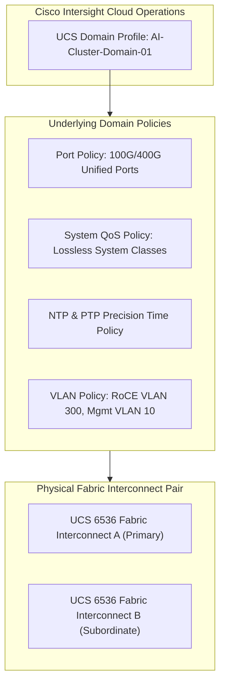
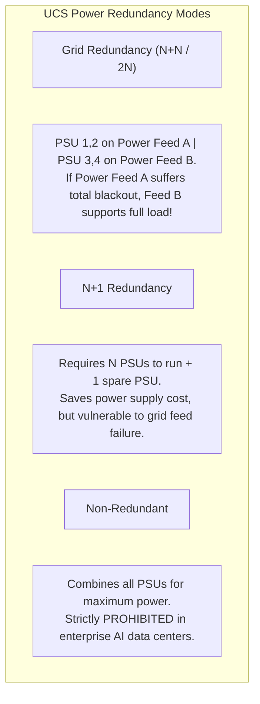
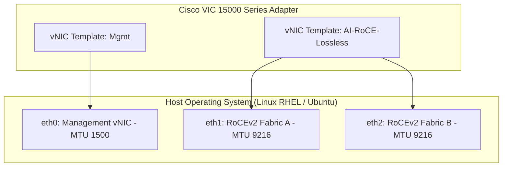
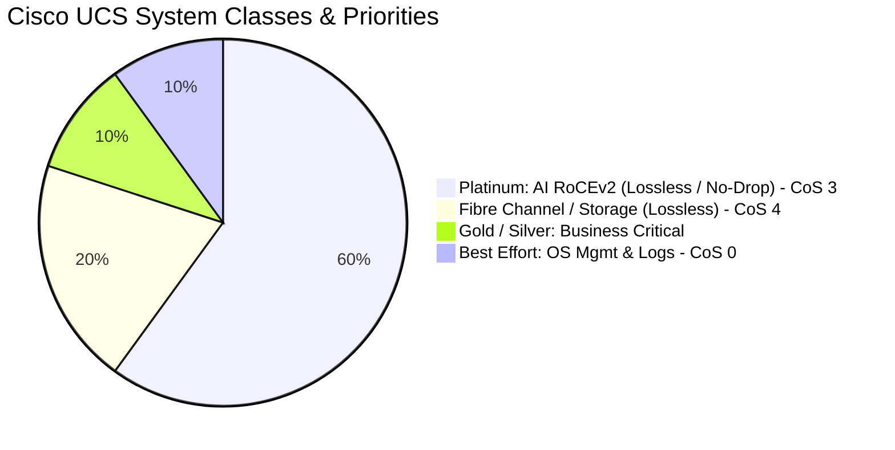

# Cisco UCS Compute & Storage Configuration for AI — Blueprint Domain 3.2

> **Official Curriculum Reference:** Domain 3.2 (Configure high-performance compute and storage to support AI workloads using Cisco UCS)  
> **Blueprint Subtopics:**  
> - 3.2.a Domain profiles  
> - 3.2.b Power policy  
> - 3.2.c Storage policies  
> - 3.2.d LAN connectivity and vNIC policies  
> - 3.2.e QoS policies and system classes  
> - 3.2.f NTP policy  

---

## 1. Explain Like I'm a Novice: The Master Hotel Construction Blueprint Analogy

Imagine building a 5-star luxury hotel with 500 identical penthouse suites:
- If you send 500 different construction workers and let them randomly choose wire thickness, plumbing pipes, thermostat settings, and door locks, every room will be slightly broken, and maintenance will be a nightmare.
- Instead, the master architect creates a **Central Digital Blueprint Profile**:
  - The blueprint specifies: *"Every room gets dual 200-amp power panels, 3-inch hot water pipes, a central digital clock linked to atomic time, and a private high-speed elevator."*
  - When a new room is added, you just apply the blueprint, and it configures itself automatically in 60 seconds.

**This is Cisco UCS (Unified Computing System) managed by Cisco Intersight:**
- You do not log into individual servers to click BIOS menus, set RAID controllers, or tune network cards.
- You define **Domain Profiles, Server Policies, and vNIC templates** once in Cisco Intersight. When you insert a new UCS X-Series blade or C-Series GPU server, Intersight stamps the exact AI policies onto the bare-metal hardware.

---

## 2. UCS Domain Profiles in Cisco Intersight (Domain 3.2.a)

A **UCS Domain Profile** defines the personality and configuration of the **UCS Fabric Interconnects (FIs)** that manage the cluster:



### Steps to Configure an Intersight UCS Domain Profile:
1. **Assign Fabric Interconnect Model:** Select UCS 6536 (36x 100G/400G ports).
2. **Configure Port Policy:**
   - Define **Server Ports:** Ports connected downstream to UCS X9508 Intelligent Fabric Modules (IFMs).
   - Define **Uplink Ports:** 100G/400G ports connected upstream to Nexus 9300-GX2 / 9800 spine switches.
3. **Attach System QoS Policy:** Enforces lossless behavior across the unified fabric.
4. **Deploy Domain Profile:** Intersight validates configuration dependencies and deploys the profile to the physical hardware.

---

## 3. Power Policy for High-Wattage AI Compute (Domain 3.2.b)

AI servers with multiple GPUs consume immense power (often 8kW to 10kW per chassis). A misconfigured power policy can cause an entire chassis to shut down during peak training loads:



### Critical Power Configurations for AI:
- **Redundancy Mode:** Set to **Grid Redundancy (N+N)** to survive complete utility feed drops.
- **Power Capping Mode:** Set to **No Cap** for mission-critical training clusters so GPUs are never throttled during complex matrix calculations, or set to **Dynamic Power Capping** when operating under strict facility power budgets.

---

## 4. Storage Policies: NVMe Drive Groups & RAID (Domain 3.2.c)

AI nodes require ultra-high-speed local scratch storage for OS boot, container images, and local caching:

```text
Cisco Intersight Storage Policy:
├── Controller: Cisco 12G Modular SAS/SATA/NVMe RAID Controller
├── Drive Group:
│   ├── Drive Type: Direct-Attach NVMe SSDs
│   ├── RAID Level: RAID 1 (Mirrored) for OS Boot Drives
│   └── RAID Level: RAID 0 (Striped) or JBOD for High-Speed Local Cache
└── Virtual Drive Configuration:
    ├── Name: OS_BOOT_VD (2x Mirrored NVMe drives)
    └── Name: AI_LOCAL_SCRATCH (Striped NVMe for maximum local IOPS)
```

- **Boot Policy:** Configure **M.2 / NVMe Boot** as primary, pointing to the mirrored virtual drive.
- **JBOD / Pass-Through:** For distributed file systems (like Weka or Ceph storage nodes), configure the controller to **JBOD mode**, allowing the software-defined storage layer to communicate directly with raw NVMe drives without hardware RAID overhead.

---

## 5. LAN Connectivity & vNIC Policies (Domain 3.2.d)

The Virtual Network Interface Card (**vNIC**) policy defines how virtual adapters appear to the host operating system from the **Cisco VIC (Virtual Interface Card)**:



### Mandatory vNIC Parameters for AI RoCEv2:
1. **MTU Size:** Must be set to **`9000` or `9216` (Jumbo Frames)**.
2. **RoCE Settings:** Check the **Enable RoCEv2** checkbox in the Intersight vNIC policy.
3. **QoS Policy Binding:** Bind the vNIC to the **Platinum (Lossless)** QoS policy.
4. **Failover Configuration:**
   - For standard enterprise traffic, Cisco VIC hardware failover is common.
   - **For AI RoCEv2, DISABLE hardware fabric failover on the vNIC!** Let the dual-rail multi-plane software stack manage paths. A hardware failover event can cause out-of-order packet bursts that break active RDMA Queue Pairs.

---

## 6. QoS System Classes in Cisco UCS (Domain 3.2.e)

Cisco UCS organizes traffic into **System Classes**:



### System Class Configuration Table:

| System Class | Default CoS | Packet Drop Setting | Recommended AI Role | Weight (Bandwidth) |
| :--- | :---: | :---: | :--- | :---: |
| **Platinum** | **3** | **No (Lossless / PFC)** | **AI RoCEv2 Interconnect** | **60% - 70%** |
| **Fibre Channel** | 4 | No (Lossless) | SAN Storage Traffic | 20% |
| **Gold** | 2 | Yes (Drop) | High-priority API traffic | 5% |
| **Silver** | 1 | Yes (Drop) | General internal services | 5% |
| **Best Effort** | 0 | Yes (Drop) | SSH, OS updates, logging | 10% |

> [!IMPORTANT]
> **Lossless Class Configuration Rule:**  
> In UCS Manager or Intersight, navigate to **System QoS**. On the **Platinum** class, you must set **Packet Drop = No**. This instructs the Fabric Interconnect hardware to enable 802.1Qbb PFC on CoS 3!

---

## 7. NTP & Precision Time Synchronization (Domain 3.2.f)

Why is time synchronization tested on an AI infrastructure exam?

```
Standard NTP: Synchronizes servers within 1 to 10 Milliseconds (Fine for email)
Precision Time (PTP / IEEE 1588): Synchronizes nodes within Sub-Microseconds (Essential for AI)
```

### Why AI Clusters Require Microsecond Clock Synchronization:
1. **Distributed Log & Telemetry Correlation:** When troubleshooting an NCCL timeout across 1,000 GPUs, you must correlate millisecond-level telemetry from switches, NICs, and GPU drivers. If clocks drift by even 100ms, event correlation is impossible!
2. **Collective Barrier Tracking:** Profiling frameworks (like PyTorch Profiler) rely on synchronized hardware timestamps to measure execution skew between nodes.
3. **Intersight Policy:** UCS NTP policies must configure multiple authoritative Stratum-1 or Stratum-2 NTP servers with **PTP (Precision Time Protocol - IEEE 1588)** enabled where supported.

---

## 8. Exam Traps & Key Distinctions

> [!WARNING]
> **Exam Pitfall: vNIC Failover with RoCEv2:**  
> Cisco exam questions love to ask: *"Which setting should be applied to RoCEv2 vNICs in a Cisco UCS AI deployment?"*  
> - **WRONG ANSWER:** Enable Fabric Failover on the vNIC.  
> - **CORRECT ANSWER:** **Disable Fabric Failover on the vNIC**; deploy two separate vNICs pinned to Fabric A and Fabric B respectively, and allow the application / RoCEv2 dual-rail stack to handle redundancy!

---

## 9. Quick Revision Summary Table

| Policy Component | Key Parameter Value | Primary Exam Takeaway |
| :--- | :--- | :--- |
| **Domain Profile** | UCS 6536 Fabric Interconnect | Aggregates 100G/400G compute nodes |
| **Power Policy** | Grid Redundancy (N+N) | Protects 40kW+ racks against feed outage |
| **vNIC MTU** | **9000 or 9216** | Mandatory for RoCEv2 tensor transfer |
| **QoS System Class** | **Platinum (Packet Drop = No)** | Enables hardware PFC on CoS 3 |
| **vNIC Failover** | **Disabled** for RoCEv2 | Prevents out-of-order RDMA packet corruptions |
| **NTP / PTP** | Microsecond synchronization | Enables exact multi-node log correlation |
