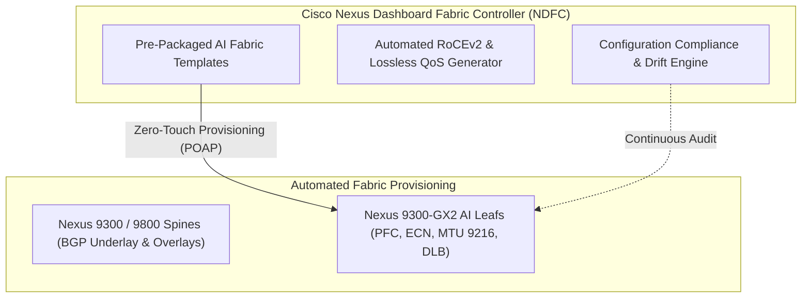
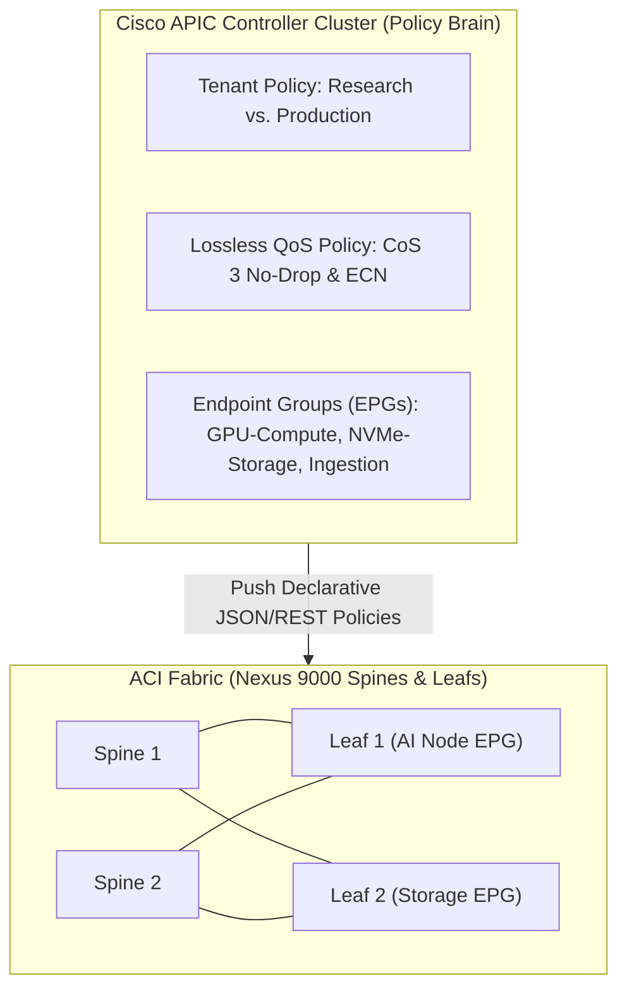
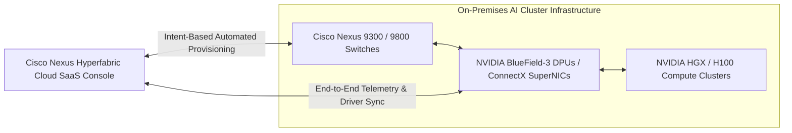
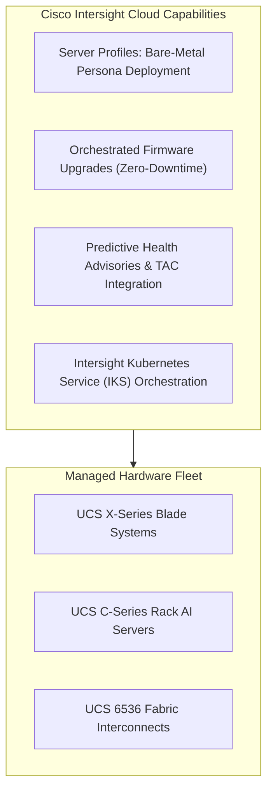

# AI Fabric Orchestration Tools — NDFC, APIC, Hyperfabric, & Intersight

> **Official Curriculum Reference:** Domain 3.3 (Deploy AI-ready fabrics using Cisco orchestration tools)  
> **Blueprint Subtopics:**  
> - 3.3.a Nexus Dashboard / NDFC  
> - 3.3.b APIC (Application Policy Infrastructure Controller)  
> - 3.3.c Hyperfabric AI  
> - 3.3.d Intersight  

---

## 1. Explain Like I'm a Novice: The Orchestra Conductor & Navigation App Analogy

Imagine managing a modern city's transportation and power grid:
- If a single person tried to run around manually flipping thousands of circuit breakers, opening drawbridges, adjusting traffic light timing, and paving roads by hand, the city would grind to a halt in hours.
- You need central, intelligent orchestration dashboards:

1. **Nexus Dashboard (NDFC) is the City Highway Authority:**
   - Instead of configuring 64 switches one by one with manual CLI commands, you open NDFC and select: *"Apply AI Fabric Template"*.
   - In 30 seconds, NDFC provisions BGP routing, VXLAN EVPN, 1:1 non-blocking spine-leaf links, PFC pause buffers, and ECN marking across all 64 switches simultaneously.
2. **Cisco APIC (ACI) is the Master Policy & Security Director:**
   - Enforces strict security contracts and tenant isolation: *"The Public Internet team can only talk to API endpoints; they can NEVER touch the private GPU memory fabric."*
3. **Cisco Nexus Hyperfabric is Waze + Autopilot for AI Supercomputing:**
   - A cloud-managed SaaS orchestrator developed with NVIDIA.
   - It doesn't just manage the switches; it monitors the car engines (the SuperNICs and GPUs on the servers), dynamically rerouting traffic around bottlenecks before human operators even notice.
4. **Cisco Intersight is the Master Architect's Cloud Management Tablet:**
   - Controls every physical server, blade chassis, BIOS version, power budget, and storage drive in the data center from a single cloud console.

---

## 2. Cisco Nexus Dashboard Fabric Controller (NDFC) (Domain 3.3.a)

**NDFC** (formerly DCNM) is Cisco's comprehensive fabric automation and management platform running on **Nexus Dashboard**.

### Key Capabilities for AI Fabrics:
1. **AI Fabric Deployment Templates:**
   - NDFC includes dedicated, tested templates specifically for AI/ML and RoCEv2.
   - Automatically calculates buffer sizes, sets XOFF/XON headroom, enables ECN WRED marking, and provisions MTU 9216 with a single click.
2. **Zero-Touch POAP (Power-On Auto Provisioning):**
   - When a new Nexus switch is racked and plugged into power, it automatically contacts NDFC via DHCP, downloads its verified NX-OS image and golden configuration, and joins the fabric without manual console cabling.
3. **Configuration Drift Management:**
   - NDFC continuously monitors switch configs. If an engineer manually changes a QoS buffer via CLI, NDFC flags a **Compliance Violation** and allows an instant one-click rollback.

---

## 3. Cisco APIC & Application Centric Infrastructure (ACI) (Domain 3.3.b)

**Cisco ACI** is the industry-leading SDN (Software-Defined Networking) architecture for automated, policy-driven data centers managed by the **Application Policy Infrastructure Controller (APIC)**:

### Implementing AI Policies in Cisco APIC:
1. **Endpoint Groups (EPGs):** Group AI servers, storage arrays, and inference endpoints into logical tiers regardless of physical IP or subnet.
2. **Contracts & Subject Filters:** Define strict rules for communication (e.g., allowing UDP port 4791 RoCEv2 between GPU EPG and Storage EPG, while blocking all non-essential protocols).
3. **QoS Policies in ACI:**
   - APIC maps incoming packets to **ACI QoS Classes** (Level 1 to Level 6).
   - The admin configures **PFC (Priority Flow Control)** on the designated class (e.g., Level 3) with **ECN enabled**, ensuring the ACI leaf switches treat AI traffic as strictly lossless.

---

## 4. Cisco Nexus Hyperfabric AI (Domain 3.3.c)

Co-developed with **NVIDIA**, **Nexus Hyperfabric** represents the future of simplified, cloud-orchestrated AI networking:

### Hyperfabric Architectural Pillars:
1. **Cloud-Managed Simplicity:** The control plane is hosted in the cloud, offering a clean, guided wizard to design, deploy, and monitor 400G/800G AI fabrics without deep CLI expertise.
2. **End-to-End Orchestration (Switch + SuperNIC):**
   - Traditional tools stop at the switch port. Hyperfabric orchestrates the **entire path** from the switch port down into the NVIDIA SuperNIC / DPU on the server.
3. **AI-Driven Automated Remediation:**
   - Continuously ingests streaming telemetry from both switches and NICs.
   - Detects microbursts, tail latency spikes, or optical signal degradation and dynamically adjusts flow routing before training jobs fail.

---

## 5. Cisco Intersight (Domain 3.3.d)

**Cisco Intersight** is a cloud-based operations platform providing intelligent lifecycle management for **Cisco UCS compute, HyperFlex, and third-party infrastructure**:

### Core AI Functions in Intersight:
1. **Server Profiles & Templates:**
   - Define a single "AI-Worker-Profile" (BIOS settings, PCIe power capping, vNIC RoCE settings, MTU 9216).
   - Replicate that profile across 100 UCS servers with 100% configuration consistency.
2. **Predictive Hardware Analytics:**
   - Identifies failing DIMMs, degraded power supplies, or overheating GPUs before they trigger cluster-wide crashes.
   - Automatically opens support cases with Cisco TAC and dispatches replacement parts proactively.

---

## 6. Exam Comparison: When to Use Which Tool?

| Orchestration Tool | Primary Scope | Typical User | Exam Trigger Keywords |
| :--- | :--- | :--- | :--- |
| **NDFC (Nexus Dashboard)** | NX-OS Fabric Management (Spine-Leaf) | Network Engineers / DC Admins | Fabric templates, POAP, VXLAN EVPN, configuration compliance. |
| **Cisco APIC (ACI)** | SDN Policy & Contract Architecture | Security & Enterprise DC Teams | EPGs, Contracts, Tenants, ACI QoS Level policies. |
| **Nexus Hyperfabric** | Turnkey Cloud-Managed AI Fabrics | AI Infrastructure / Cloud Admins | SaaS portal, NVIDIA DPU integration, intent-based, automated RoCEv2. |
| **Cisco Intersight** | Server & Compute Lifecycle (UCS) | Systems & Compute Architects | Server profiles, BIOS policies, firmware orchestration, UCS 6536. |

---

## 7. Exam Traps & Key Distinctions

> [!TIP]
> **NDFC AI Templates Guarantee Proper Headroom:**  
> A classic exam scenario asks: *"How can an engineer rapidly configure a 32-node Nexus 9300 fabric with correct PFC headroom buffers and ECN thresholds without manual CLI calculations?"*  
> **Answer:** Use **NDFC with the pre-packaged AI/ML RoCEv2 Fabric Template**.

> [!WARNING]
> **Hyperfabric is NOT a Physical Switch:**  
> Nexus Hyperfabric is the **management, automation, and telemetry platform**; the physical switches doing the heavy packet lifting are **Cisco Nexus 9300-GX2 / 9800 series switches**.

---

## 8. Quick Revision Summary Table

| Tool | Deployment Model | Core Value Proposition for AI |
| :--- | :--- | :--- |
| **NDFC** | On-Prem Appliance (Nexus Dashboard) | Automated Day-0 to Day-2 spine-leaf fabric lifecycle |
| **APIC** | On-Prem Clustered Appliance | Microsegmentation, EPGs, and policy-driven security |
| **Hyperfabric** | Cloud SaaS + On-Prem Switches/DPUs | Turnkey AI fabric with full switch-to-SuperNIC visibility |
| **Intersight** | Cloud SaaS (or Private Virtual Appliance) | UCS compute server profiles, power policies, and hardware telemetry |
