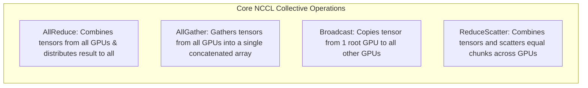
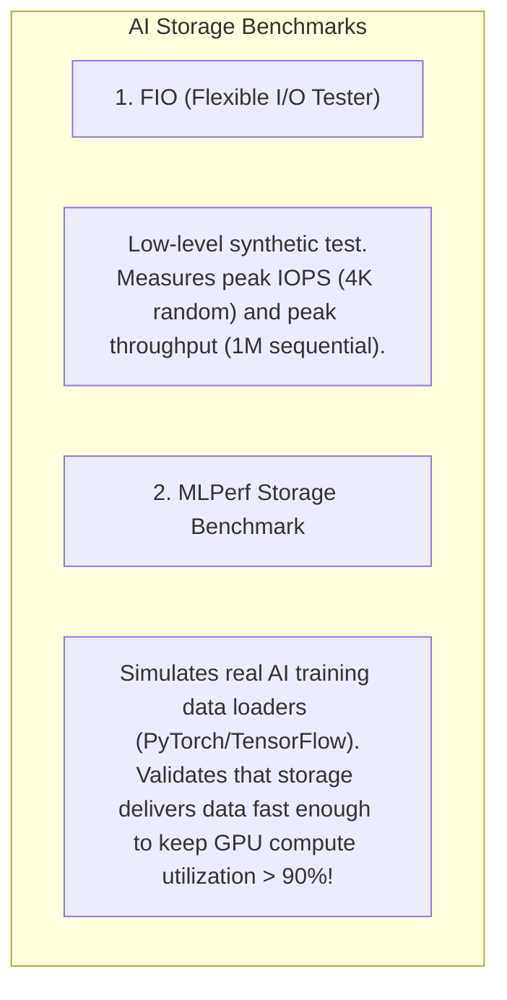
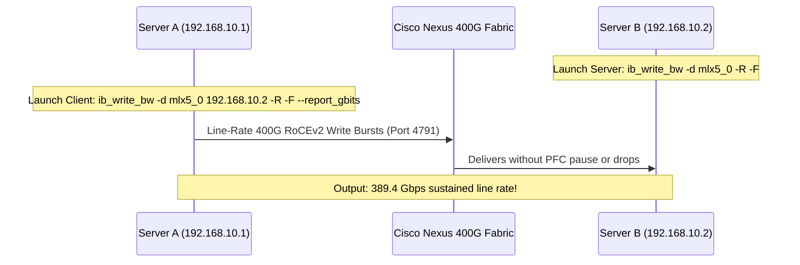

# AI Infrastructure Benchmarking — NCCL, MLPerf, & Storage

> **Official Curriculum Reference:** Domain 4.1 (Implement benchmarks to evaluate AI infrastructure performance)  
> **Target Concepts:** NCCL Tests (`all_reduce_perf`, `all_gather_perf`), Bus Bandwidth vs. Algorithm Bandwidth, MLPerf Training & Inference, FIO Storage Benchmarking, and RDMA `perftest` Suite.

---

## 1. Explain Like I'm a Novice: The Dyno Test & Track Time Analogy

Before a Formula 1 team enters a race, they don't just turn on the car and hope for the best:

1. **RDMA `perftest` is Testing the Fuel Pump and Spark Plugs Individually:**
   - Tests raw hardware speed between two points. Can Fuel Pump #1 pump 100 gallons per minute? Can NIC 1 push 400 Gbps to NIC 2?
2. **NCCL Tests (`all_reduce_perf`) are the Engine Dyno Test:**
   - Spins up all 8 cylinders (GPUs) together on a test stand.
   - Measures how fast all 8 cylinders fire in perfect synchronization. If one spark plug misfires by a millisecond, the dyno test flags it immediately.
3. **FIO Storage Benchmarks are Testing the Pit Crew's Tire Change Speed:**
   - How many seconds does it take the crew to sprint out, unbolt 4 tires, and bolt on new ones? (How fast can the NVMe storage write a 1 TB checkpoint?).
4. **MLPerf is the Official Race Around Monaco:**
   - The standardized industry championship. It runs real, complete AI models (like LLaMA or ResNet) and gives an official score: *"This cluster trained the model in 3 hours and 14 minutes."*

---

## 2. NVIDIA NCCL Tests (The Gold Standard for AI Fabrics)

The **NVIDIA Collective Communications Library (NCCL)** provides multi-GPU communication primitives. The open-source **NCCL-tests** suite is the primary tool used by network and systems engineers to validate cluster health:



### Running the NCCL `all_reduce_perf` Benchmark
To validate a multi-node cluster connected via Cisco Nexus 400G RoCEv2:

```bash
# Execute 8-GPU AllReduce test across 2 nodes using MPI
mpirun -np 16 \
  -H node01:8,node02:8 \
  --bind-to numa \
  -x NCCL_DEBUG=INFO \
  -x NCCL_IB_DISABLE=0 \
  -x NCCL_NET_GDR_LEVEL=5 \
  -x NCCL_CROSS_NIC=1 \
  /opt/nccl-tests/build/all_reduce_perf -b 1G -e 8G -f 2 -g 1
```

### Key Environment Flags:
- `NCCL_DEBUG=INFO`: Outputs hardware topology detection, showing whether NVLink, PCIe, or RoCEv2 is active.
- `NCCL_NET_GDR_LEVEL=5`: Forces **GPUDirect RDMA** between GPUs and network adapters (bypassing host CPU memory entirely).
- `NCCL_IB_DISABLE=0`: Ensures RDMA (InfiniBand/RoCE) is enabled.

---

## 3. Bus Bandwidth vs. Algorithm Bandwidth (Crucial Exam Math)

When NCCL tests finish, the output table displays two different bandwidth numbers:

```text
#                                           out-of-place                       
#       size         count      type   op    time  algbw  busbw #wrong
#        (B)    (elements)                   (us) (GB/s) (GB/s)
  8589934592    2147483648     float  sum  48921 175.58 329.21      0
```

### Why is Bus Bandwidth almost DOUBLE Algorithm Bandwidth?
- **Algorithm Bandwidth (`algbw`):** The raw size of the user tensor divided by execution time:
  $$\text{algbw} = \frac{\text{Data Size}}{\text{Time}}$$
- **Bus Bandwidth (`busbw`):** The actual physical bytes moved across the network wires to complete the Ring AllReduce algorithm.
  - In a Ring AllReduce across $N$ GPUs, every GPU must send and receive data twice ($2 \times \frac{N - 1}{N}$):
  $$\text{busbw} = \text{algbw} \times 2 \times \left(\frac{N - 1}{N}\right)$$
  - For a large cluster ($N \gg 1$), the factor $2 \times \frac{N - 1}{N}$ approaches **$2.0$**.
  - **Exam Rule:** If an exam question asks why `busbw` is roughly twice `algbw` on a 64-node cluster, the reason is the **ring communication pattern of the AllReduce algorithm**!

---

## 4. Storage Benchmarking: FIO & MLPerf Storage

To ensure storage won't starve GPUs or drag out checkpoint save windows:



### Sample FIO High-Throughput Checkpoint Test Command:
```bash
fio --name=ai_checkpoint_write \
    --ioengine=libaio \
    --direct=1 \
    --rw=write \
    --bs=1M \
    --numjobs=16 \
    --size=50G \
    --runtime=60 \
    --time_based \
    --group_reporting \
    --filename=/mnt/weka_ai/checkpoint_test.dat
```
- `--direct=1`: Bypasses Linux OS page cache to measure true NVMe flash performance.
- `--bs=1M`: Uses 1 Megabyte block sizes to mimic large model checkpoint dumps.

---

## 5. Network RDMA Benchmarking: The `perftest` Suite

Before launching complex multi-GPU workloads, verify point-to-point RoCEv2 line-rate performance between two servers using `perftest`:



### Critical `perftest` Commands:
- `ib_write_bw -R`: Tests RDMA Write Bandwidth using **RoCEv2** (`-R` flag enables RoCEv2).
- `ib_read_lat -R`: Tests RDMA Read Latency (should report $< 1.5$ microseconds across a Nexus leaf-spine).
- If bandwidth plateaus at ~200 Gbps instead of ~390 Gbps on a 400G link, verify that **PCIe Gen 5 link width is running at x16** (`lspci -vvv`) rather than x8.

---

## 6. Industry Benchmark: MLPerf

**MLPerf** (maintained by MLCommons) is the premier vendor-neutral benchmarking suite:

```
           ┌── MLPerf Training (Measures 'Time-to-Train' a standard model, e.g. LLaMA 3, GPT-3)
MLPerf ────┤
           └── MLPerf Inference (Measures throughput in queries/sec & latency in milliseconds)
```

- **Closed Division:** Strict rules where hardware and software configurations are fixed to ensure an apples-to-apples comparison across vendors.
- **Open Division:** Allows customized algorithms, specialized quantization, and experimental network architectures.

---

## 7. Exam Traps & Key Distinctions

> [!IMPORTANT]
> **Algorithm vs. Bus Bandwidth:**  
> Remember the formula: $\text{busbw} \approx 2 \times \text{algbw}$. If an exam question asks *"An AllReduce NCCL test reports an algorithm bandwidth of 180 GB/s on 32 nodes; what is the approximate bus bandwidth?"*  
> **Answer:** Approximately **360 GB/s** ($180 \times 2$).

> [!WARNING]
> **The `-R` Flag in `perftest`:**  
> By default, `ib_write_bw` runs InfiniBand Native. To test **RoCEv2 over Ethernet**, you **must specify the `-R` flag**!

---

## 8. Quick Revision Summary Table

| Benchmark Tool | Primary Focus | Success Metric on 400G RoCEv2 |
| :--- | :--- | :--- |
| **`all_reduce_perf`** | Multi-GPU collective synchronization | High Bus Bandwidth (> 350 GB/s per node), zero error count |
| **`ib_write_bw`** | Raw point-to-point network speed | Line-rate ~385–395 Gbps per 400G link |
| **`ib_read_lat`** | Fabric propagation and NIC latency | Sub-2 microsecond round trip |
| **FIO** | Storage IOPS & sequential throughput | Sustained > 25 GB/s write speed for checkpoints |
| **MLPerf** | End-to-end full stack system benchmark | Lowest time-to-train (minutes/hours) |
