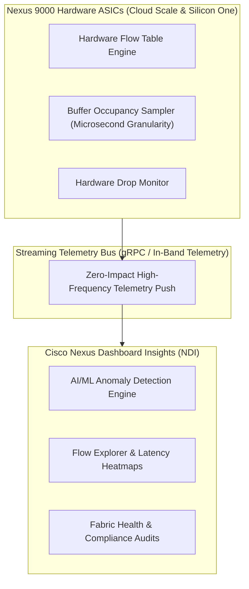
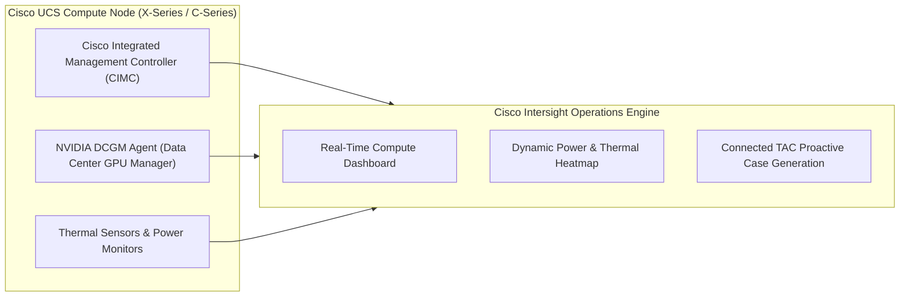
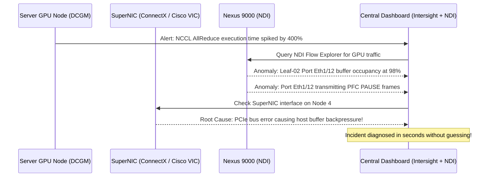

# AI Infrastructure Monitoring — Nexus Dashboard Insights & Intersight

> **Official Curriculum Reference:** Domain 4.2 (Implement monitoring of AI data center infrastructures using Cisco solutions)  
> **Target Concepts:** Nexus Dashboard Insights (NDI), Flow Telemetry, Microburst Detection, Buffer Occupancy Heatmaps, Intersight Server Telemetry, GPU Power/Thermal Monitoring, and Proactive Advisories.

---

## 1. Explain Like I'm a Novice: The Air Traffic Radar & Engine Telemetry Analogy

Imagine managing a fleet of supersonic passenger jets:

1. **Nexus Dashboard Insights (NDI) is the High-Resolution Doppler Radar Screen:**
   - Standard network monitoring is like calling the airport tower every 5 minutes: *"Everything look okay over there?"* (Slow SNMP polling). If a dangerous microburst of wind hits between 12:02:10 and 12:02:12, SNMP never even sees it.
   - **NDI is continuous 60fps streaming Doppler radar:**
     - It tracks every single flight (packet flow) in real-time.
     - It detects invisible microbursts of turbulence, identifies when runway buffers are starting to congest, and warns you before any plane is forced to make an emergency go-around.
2. **Cisco Intersight is the Jet Engine IoT Sensor Suite:**
   - Constantly reads temperature probes inside the turbine blades, oil pressure, fuel flow rates, and vibration levels on every server and GPU.
   - If an engine starts running 3 degrees hotter than normal, Intersight flags a **Proactive Advisory** before the engine fails mid-flight.

---

## 2. Cisco Nexus Dashboard Insights (NDI) Architecture

**Nexus Dashboard Insights (NDI)** ingests hardware-level streaming telemetry directly from Cisco Nexus ASIC flow engines:



### Core Monitoring Capabilities of NDI for AI:

### 1. Microburst Detection
- **What is a Microburst?** A massive surge of data lasting only **10 to 100 microseconds**.
- Traditional SNMP (polling every 5 minutes) reports average interface utilization at 15%, masking the fact that for 50 microseconds, the port was at **100% capacity with full buffers**!
- NDI samples switch buffers thousands of times per second, detecting microbursts instantly and pinpointing which RoCEv2 flows caused the surge.

### 2. PFC & ECN Telemetry
- NDI tracks **PFC pause counters (`Rx-PPP` / `Tx-PPP`)** across the entire fabric.
- If a server begins generating excessive pause frames, NDI generates an immediate anomaly alert: *"Slow-Drain Device detected on Leaf-01 port Eth1/4"*.
- Displays **ECN marking rates**, showing whether senders are slowing down gracefully or if buffers are continuing to swell toward XOFF thresholds.

### 3. Latency Heatmaps & Tail Latency Outliers
- Measures hop-by-hop latency for every flow across the spine-leaf fabric.
- Visualizes latency anomalies in intuitive heatmaps, identifying if a specific spine switch is introducing jitter into AllReduce collective communications.

---

## 3. Cisco Intersight: Compute & GPU Infrastructure Monitoring

While NDI monitors the network fabric, **Cisco Intersight** monitors the physical server, chassis, and accelerator ecosystem:



### Key Intersight Metrics for AI Clusters:
1. **GPU Thermal & Throttling Status:**
   - Intersight integrates with GPU management agents (DCGM) to report GPU temperature, junction temperature, and clock frequencies.
   - Immediately alerts if a GPU has triggered **SW Thermal Slowdown** or **HW Thermal Slowdown** (throttling below rated base clock).
2. **Chassis & Rack Power Draw:**
   - Tracks real-time wattage consumption per server blade and total chassis load.
   - Validates that high-density AI racks remain comfortably within the facility PDU power budget.
3. **Proactive Hardware Advisories:**
   - Intersight automatically scans your installed hardware, firmware, and driver versions against Cisco's knowledge base of **Known Defects, Field Notices, and Security Advisories (PSIRTs)**.
   - If a specific firmware release has a known RoCEv2 pause bug, Intersight alerts the administrator before the bug impacts production workloads.

---

## 4. End-to-End Visibility: Correlating Switch & Compute Telemetry

The true power of Cisco's architecture is connecting network telemetry with compute telemetry:



---

## 5. Integrating with Enterprise Observability (Prometheus / Grafana)

Cisco solutions export open-standard telemetry formats for integration into enterprise monitoring stacks:

```
[Nexus NX-OS Streaming Telemetry (gRPC/gNMI)] ──► [Prometheus / InfluxDB] ──► [Grafana Dashboards]
[Cisco Intersight OpenAPI REST / Webhooks]    ──► [Splunk / Datadog]       ──► [PagerDuty Alerts]
```

- **NX-OS Telemetry Push:** Uses Google Network Management Interface (**gNMI**) or gRPC to stream interface byte counters, queue depths, and pause events to open-source collectors every 10 seconds.
- **Intersight Webhooks:** Sends instant JSON webhook notifications to enterprise incident response platforms (Slack, Teams, PagerDuty, ServiceNow).

---

## 6. Exam Traps & Key Distinctions

> [!IMPORTANT]
> **SNMP vs. Streaming Telemetry in AI Fabrics:**  
> A classic exam question asks: *"Why is traditional SNMP polling insufficient for monitoring congestion in an AI RoCEv2 fabric?"*  
> **Answer:** SNMP polling intervals (e.g., 60 to 300 seconds) are far too slow to capture **microbursts** and microsecond queue spikes that trigger PFC pause storms!

> [!WARNING]
> **NDI Flow Telemetry is Hardware-Based:**  
> Nexus Dashboard Insights flow telemetry is performed **directly by dedicated hardware logic inside the Cloud Scale and Silicon One ASICs**. It does NOT burden the switch control plane CPU!

---

## 7. Quick Revision Summary Table

| Monitoring Platform | Monitoring Scope | Key AI Metrics Tracked |
| :--- | :--- | :--- |
| **Nexus Dashboard Insights (NDI)** | Network Fabric (Nexus Switches) | Microbursts, PFC pause frames, buffer drops, latency anomalies |
| **Cisco Intersight** | Compute & Infrastructure (UCS / FIs) | Server health, GPU power/temperature, firmware compliance, PSIRTs |
| **NVIDIA DCGM** | Host GPU Silicon | SM utilization, memory clock throttling, PCIe bandwidth, XID errors |
| **gNMI / Streaming Telemetry** | Switch Data Plane to External Collector | Real-time push of interface rates, queue depths, and drop counters |
