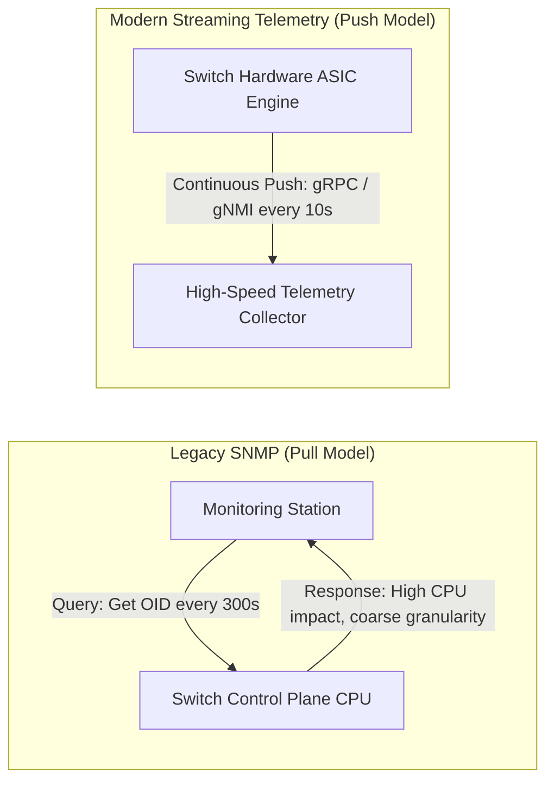
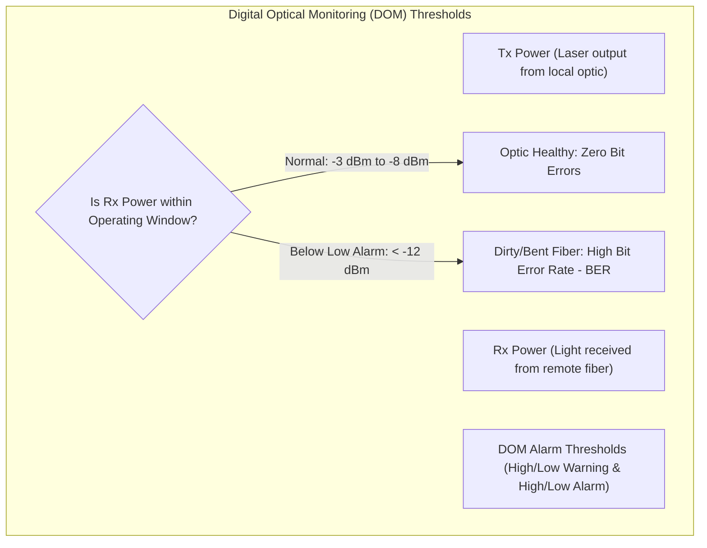
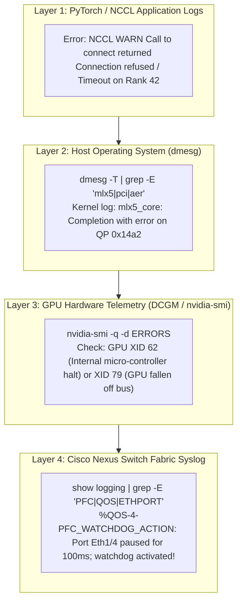

# Operational Telemetry, Health, & Log Correlation — Blueprint Domain 4.3

> **Official Curriculum Reference:** Domain 4.3 (Monitor AI infrastructure using system messages and management tools to ensure reliability, scalability, and performance)  
> **Blueprint Subtopics:**  
> - 4.3.a Operational telemetry (Streaming Telemetry, gNMI, INT)  
> - 4.3.b System health (DOM Optical Power, Environmental Sensors, UCS Health)  
> - 4.3.c Alerts (Syslog Severities, SNMP Traps, Webhooks)  
> - 4.3.d Log correlation (Correlating Switch, Host, GPU, & NCCL Errors)  

---

## 1. Explain Like I'm a Novice: The Black Box Flight Recorder Analogy

When a rocket experiences a glitch during launch, you can't just ask the astronaut: *"Hey, what do you think happened?"*
- You need a **synchronized Black Box Flight Recorder**:
  - Telemetry sensor 1 records fuel tank pressure every millisecond.
  - Telemetry sensor 2 records rocket booster exhaust heat.
  - Telemetry sensor 3 records wind shear on the steering fins.
  - The onboard computer records the software autopilot commands.
- When an anomaly occurs, the engineers line up all four recordings on the exact same timeline. Suddenly the mystery is solved: *"Ah! At 00:03.14, a wind gust hit the steering fin, causing the booster to over-compensate, which spiked fuel pressure and triggered an engine shutdown."*

**This is Log Correlation in an AI Data Center:**
- When an AI model training job crashes with a cryptic error: `NCCL WARN: Transport failure on rank 14`, the problem could be a loose fiber cable, a dirty optical transceiver, a switch buffer drop, a PFC deadlock, or a burned-out GPU core.
- By correlating **Nexus switch syslogs, optical power levels (DOM), Linux kernel errors, and NVIDIA GPU logs**, you find the single root cause in minutes.

---

## 2. Operational Telemetry: Streaming Telemetry vs. Traditional SNMP (Domain 4.3.a)



### Technical Telemetry Comparison

| Feature | Legacy SNMP Polling | Modern Model-Driven Streaming Telemetry |
| :--- | :--- | :--- |
| **Model** | **Pull** (Collector queries switch). | **Push** (Switch continuously streams data out). |
| **Transport** | UDP Port 161 (Unencrypted / Insecure). | **gRPC over TLS (Encrypted HTTP/2)** or UDP/TCP. |
| **Data Encoding** | MIB / OID binary tables. | **Google Protocol Buffers (GPB) / JSON / YANG**. |
| **Sampling Frequency** | 60 seconds to 300 seconds. | **Sub-second to 10 seconds** (Near real-time). |
| **CPU Impact** | High switch control plane CPU overhead. | **Zero CPU impact** (Hardware ASIC streaming). |
| **AI Suitability** | Inadequate (Misses microbursts entirely). | **Mandatory for AI lossless fabric monitoring**. |

### Dial-In vs. Dial-Out Telemetry
- **Dial-Out (Push):** The Nexus switch initiates a connection to an external telemetry collector (e.g., Nexus Dashboard or Prometheus) and streams data.
- **Dial-In (Subscription):** An external management station connects to the switch (via gNMI / NETCONF) and subscribes to specific YANG data paths.

---

## 3. In-Band Network Telemetry (INT)

**In-Band Network Telemetry (INT)** embeds telemetry metadata directly into the headers of active data packets:

```
[Ethernet Header] [IP Header] [UDP 4791] [INT Telemetry Header] [RoCEv2 BTH] [Data Payload]
                                          ├── Switch ID: Leaf-01
                                          ├── Ingress Timestamp: 14:02:11.104820
                                          ├── Egress Port: Eth1/4
                                          ├── Queue Depth: 45 KB
                                          └── Hop Latency: 320 nanoseconds
```

- As the RoCEv2 packet hops from Leaf to Spine to Leaf, each switch ASIC inserts its hop latency and queue depth into the INT header.
- When the destination switch receives the packet, it strips the INT header and exports it to the telemetry collector, giving network engineers an exact nanosecond-by-nanosecond timeline of the packet's journey across the fabric!

---

## 4. System Health: Digital Optical Monitoring (DOM) & Optics Degradation (Domain 4.3.b)

One of the most frequent hardware failures in 400G AI fabrics is **dirty or degraded fiber optics**.  
400G transceivers (QSFP-DD) use **PAM4 modulation**, which is extremely sensitive to optical signal attenuation:



### Key NX-OS Command to Inspect Optical Power:
```text
switch# show interface transceiver details

Ethernet1/1
    transceiver is present
    type is QSFP-DD-400G-DR4
    name is CISCO
    part number is QDD-400G-DR4-S
    Digital Optical Monitoring
        Lane 1
            Tx Power : -1.2 dBm   (Normal)
            Rx Power : -14.8 dBm  (LOW ALARM! Remote transmit degraded or fiber contaminated)
```
*Exam Takeaway:* If `Rx Power` drops below the low alarm threshold, the transceiver suffers high **Bit Error Rates (BER)**, causing silent CRC errors, frame drops, and RoCEv2 NAK retransmission storms!

---

## 5. Alerts: Syslog Severities & Traps (Domain 4.3.c)

Cisco NX-OS adheres to standard RFC 5424 **Syslog Severities (Levels 0 through 7)**:

```
Level 0: Emergency     (System unusable - total crash)
Level 1: Alert         (Immediate action required)
Level 2: Critical      (Critical hardware condition, e.g., dual PSU failure)
Level 3: Error         (Error condition, e.g., interface drop, transceiver failure)
Level 4: Warning       (Warning message, e.g., PFC Watchdog action triggered!)
Level 5: Notification  (Normal but significant event, e.g., interface up/down)
Level 6: Informational (General operational messages)
Level 7: Debugging     (Deep diagnostic output)
```

> [!IMPORTANT]
> **Key Exam Trap:**  
> The Cisco mnemonic for syslog levels:  
> **"Every (0) Awesome (1) Cisco (2) Engineer (3) Will (4) Need (5) Icecream (6) Daily (7)"**  
> Notice that **PFC Watchdog actions** trigger as **Severity 4 (Warning)** in NX-OS (`%QOS-4-PFC_WATCHDOG_ACTION`).

---

## 6. Full-Stack Log Correlation Protocol (Domain 4.3.d)

When an AI distributed training run crashes, follow this systematic multi-layer correlation protocol:



### Correlating the Real-World Scenario:
1. **Application Symptoms:** PyTorch hangs indefinitely; GPUs sit at 0% compute utilization; job eventually aborts with `NCCL timeout`.
2. **Switch Symptoms:** Nexus Leaf syslog shows:  
   `%QOS-4-PFC_WATCHDOG_ACTION: Interface Ethernet1/8 Queue 3 is stuck in pause state for over 100ms. Quarantining queue.`
3. **Host Symptoms:** Linux kernel shows:  
   `mlx5_core 0000:08:00.0: PCIe AER: Uncorrected error [Completer Abort] reported by 0000:08:00.0`
4. **Root Cause Synthesis:** The server's SuperNIC suffered a hardware PCIe transaction failure, causing its on-board buffer to lock up. Unable to accept data, it flooded the switch with PFC pause frames. The Cisco Nexus PFC Watchdog successfully detected the stuck queue and quarantined it, protecting the rest of the cluster from being dragged down by that single bad node!

---

## 7. Exam Traps & Key Distinctions

> [!TIP]
> **Correlating BER with RoCE NAKs:**  
> If an exam question describes a scenario where *RoCEv2 transfers experience frequent timeout retransmissions, but switch buffers are completely empty with zero PFC pause frames*, the cause is almost always **physical Layer 1 optical degradation (low DOM Rx power causing bit errors)**.

> [!WARNING]
> **Syslog Severity for Link Flaps:**  
> An interface going down or up (`%ETHPORT-5-IF_DOWN`) is **Severity 5 (Notification)**, not an Error!

---

## 8. Quick Revision Summary Table

| Telemetry Mechanism | Primary Protocol | Key Advantage |
| :--- | :--- | :--- |
| **Model-Driven Telemetry** | gRPC / gNMI over TLS | Sub-second push of buffer and interface metrics without CPU overhead |
| **In-Band Telemetry (INT)** | Packet header insertion | Nanosecond per-hop latency and queue depth tracking |
| **Digital Optical Monitoring (DOM)** | I2C ASIC sensor readings | Measures transceiver laser Rx/Tx power to detect dirty fiber |
| **PFC Watchdog Syslog** | Severity 4 (`%QOS-4-...`) | Confirms an interface was frozen and quarantined |
| **GPU XID Errors** | NVIDIA Kernel Driver Log | Identifies silicon defects, PCIe bus drops, and memory ECC errors |
