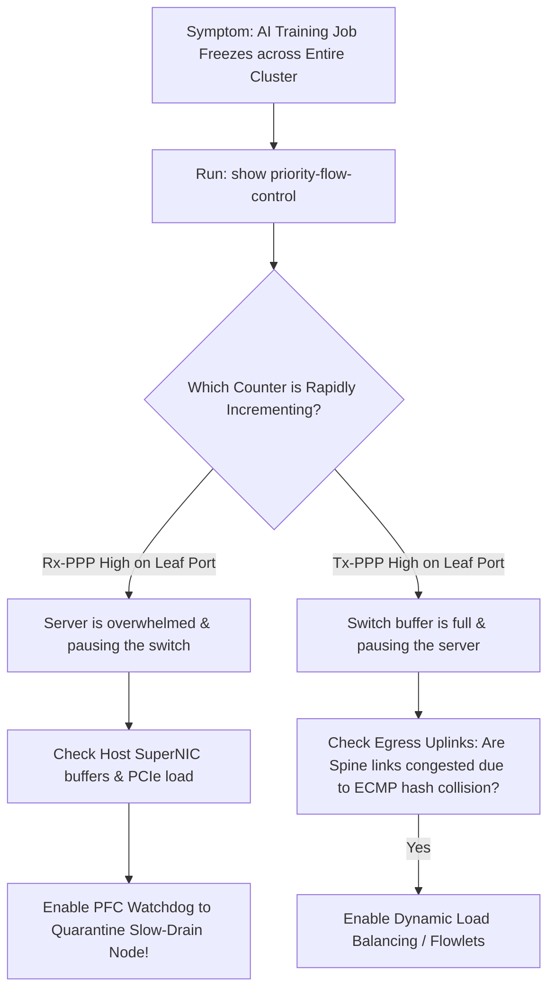
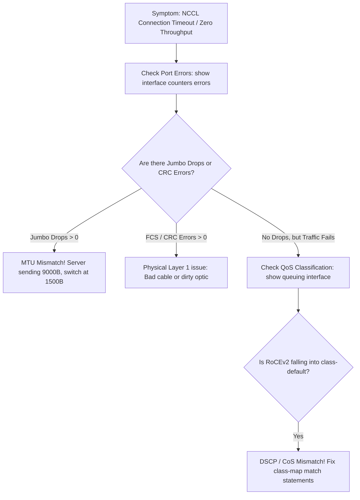
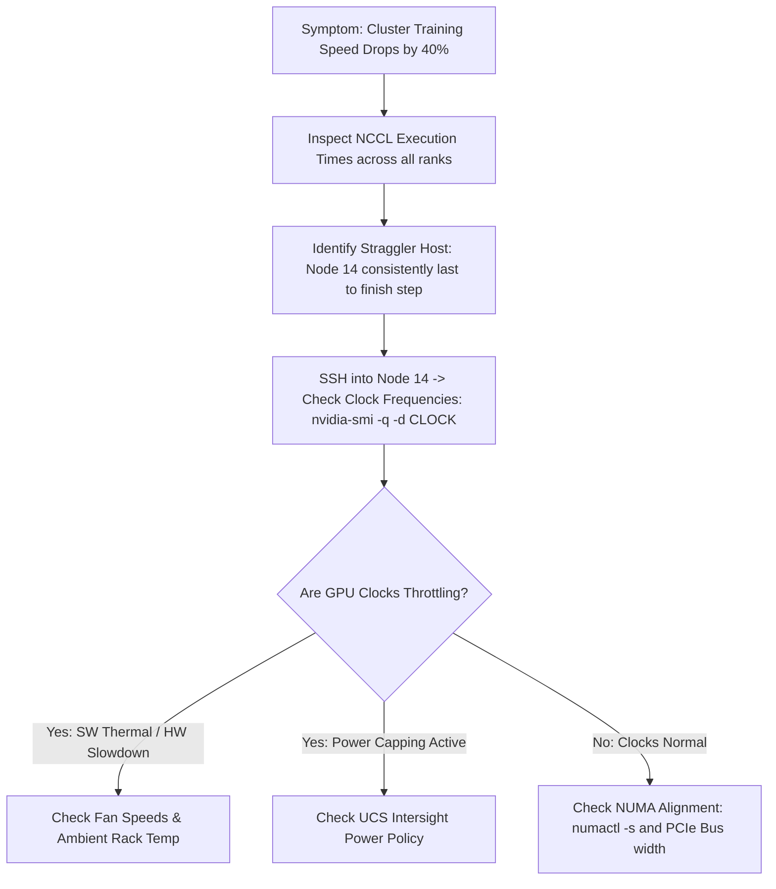

# AI Infrastructure Troubleshooting Playbooks & CLI Diagnostics — Blueprint Domain 4.4

> **Official Curriculum Reference:** Domain 4.4 (Troubleshoot AI infrastructure using system messages and management tools)  
> **Target Concepts:** PFC Pause Storms, Slow-Drain Quarantine, RoCEv2 Mismatches, MTU Truncation, Straggler Node Elimination, GPU XID Faults, and Master NX-OS/UCS Diagnostic CLI.

---

## 1. Explain Like I'm a Novice: The Pit Lane Emergency Mechanic Analogy

When a multi-million dollar racecar pulls into the pit box spitting smoke and coughing:
- You don't start randomly swapping tires, unscrewing bolts, and guessing.
- The chief mechanic runs a **strict diagnostic tree**:
  1. Is the engine receiving clean fuel? (Layer 1 Optics & MTU).
  2. Are the brakes stuck on? (PFC Pause Storm).
  3. Are the spark plugs firing in the right order? (RoCEv2 DSCP & Queue mapping).
  4. Is one cylinder running cold? (Straggler GPU Node).

**This guide provides the exact diagnostic playbooks and Cisco CLI commands required to pass the troubleshooting scenarios on the 300-640 DCAI exam.**

---

## 2. Playbook 1: Diagnosing PFC Pause Storms & Slow-Drain Devices



### Step 1: Check Global PFC Status on Leaf Switch
```text
switch# show priority-flow-control

Port       Mode  Oper(VL)  Rx-PPP  Tx-PPP  Watchdog
---------------------------------------------------
Eth1/1     on    on(3)     0       0       Enabled
Eth1/2     on    on(3)     0       0       Enabled
Eth1/3     on    on(3)     1849202 12      Enabled    <-- SLOW DRAIN CULPRIT!
Eth1/4     on    on(3)     0       0       Enabled
```
- **Analysis:** Port `Eth1/3` has received over **1.8 million pause frames (`Rx-PPP`)**. The server attached to `Eth1/3` is stuck and repeatedly telling the switch to stop transmitting, creating upstream buffer congestion across the whole rack!

### Step 2: Verify PFC Watchdog Intervention
```text
switch# show logging | grep -i watchdog
2026 Sep 11 02:14:10 Leaf-01 %QOS-4-PFC_WATCHDOG_ACTION: Interface Ethernet1/3 Queue 3 was paused for 100 ms. Watchdog action taken: Shutdown pause and drain queue.
```

### Step 3: Resolution Protocol:
1. Isolate the server connected to `Eth1/3`.
2. Inspect server host logs (`dmesg`) for PCIe or GPU driver memory lockups.
3. If PFC watchdog is not enabled, enable it immediately:
   ```text
   interface Ethernet1/3
     priority-flow-control watch-dog-interval 100
   ```

---

## 3. Playbook 2: Diagnosing RoCEv2 Connection Failures & Silent Drops



### Step 1: Verify MTU Configuration Across the Entire Path
```text
switch# show interface Ethernet1/1 | grep -i mtu
  MTU 9216 bytes, BW 400000000 Kbit, DLY 1 usec
```
- Both the **host SuperNIC MTU** (set via `ip link set dev eth1 mtu 9000`) and the **Nexus switch MTU** (set to `9216` in `type network-qos`) must match.
- If the switch port MTU is `1500`, 9000-byte RoCEv2 packets are **silently dropped without generating an ICMP unreachable message**.

### Step 2: Verify DSCP Classification in Hardware
```text
switch# show queuing interface Ethernet1/1

Interface Ethernet1/1:
  Ingress Queuing:
    qos-group 3 (CM_QUEUE_ROCE):
      Pkts: 0                <-- ZERO PACKETS MATCHED!
    qos-group 0 (class-default):
      Pkts: 184920482        <-- AI TRAFFIC WRONGLY DROPPING HERE!
```
- **Analysis:** RoCEv2 traffic is failing to match `CM_QUEUE_ROCE`.
- **Root Cause:** Host application is tagging packets with DSCP 26, but the switch `class-map` is only matching `match cos 3`. Across a Layer 3 routed hop, the CoS tag was stripped!
- **Fix:** Update class-map:
  ```text
  class-map type qos match-any CM_ROCE
    match dscp 26
    match dscp 24
    match cos 3
  ```

---

## 4. Playbook 3: Identifying Straggler Nodes & Tail Latency Inequities

In an AllReduce synchronization run, **one slow node drags down the entire cluster**:



### Step 1: Check GPU Clocks & Throttling Status (Host Level)
```bash
nvidia-smi -q -d PERFORMANCE

Performance State                  : P0
Clocks Throttle Reasons
    Idle                           : Not Active
    Applications Clocks Setting    : Not Active
    SW Power Cap                   : Not Active
    HW Slowdown                    : ACTIVE  <-- THROTTLING!
    Sync Boost                     : Not Active
    SW Thermal Slowdown            : ACTIVE  <-- OVERHEATING!
    HW Thermal Slowdown            : Not Active
```
- **Analysis:** GPU is thermal throttling due to insufficient airflow, clogged fan filters, or a loose liquid cooling cold plate.

### Step 2: Verify PCIe Bus Link Width
```bash
nvidia-smi -q -d BUS

PCI
    Link Width
        Max                        : 16x
        Current                    : 8x    <-- DEGRADED BUS WIDTH!
```
- **Analysis:** The GPU is negotiated at PCIe Gen 5 **x8 instead of x16**, cutting host bus bandwidth by 50%! Re-seat the PCIe riser card or replace the failed connector.

---

## 5. Playbook 4: Diagnosing GPU XID Errors & Hardware Faults

When a GPU encounters a fatal internal error, the NVIDIA Linux kernel driver writes an **XID Error** to `/var/log/messages` or `dmesg`:

```bash
dmesg -T | grep -i "NVRM: Xid"
[Fri Sep 11 02:40:12 2026] NVRM: Xid (PCI:0000:09:00): 79, pid=4812, GPU has fallen off the bus.
```

### High-Frequency XID Errors for the Exam:

| XID Code | Plain-English Meaning | Root Cause & Action |
| :---: | :--- | :--- |
| **XID 31** | GPU Memory Page Fault | Software application error; out-of-bounds CUDA pointer. |
| **XID 45** | Preemptive Cleanup / Job Aborted | Application was killed by scheduler (OOMKilled). |
| **XID 62** | Internal Micro-controller Halt | GPU hardware ASIC fault; requires server reboot or RMA. |
| **XID 79** | **GPU has fallen off the bus** | Severe PCIe link drop, thermal trip, or power failure. Re-seat GPU or inspect PSU. |
| **XID 92** | High Uncorrectable ECC Error | Unrecoverable HBM memory bit corruption. RMA replacement required. |

---

## 6. Master Cisco NX-OS Diagnostic CLI Reference Sheet

Keep this master command summary handy for any exam scenario:

```text
! 1. Priority-Based Flow Control Inspection
show priority-flow-control
show priority-flow-control interface Ethernet1/1

! 2. Queuing, Buffer Occupancy, & Drops
show queuing interface Ethernet1/1
show hardware internal buffer info pkt-stats
show hardware internal buffer detail

! 3. QoS System Policies & Classification
show policy-map system
show class-map type qos
show policy-map type network-qos

! 4. Transceiver Health & Optical Levels (DOM)
show interface transceiver details
show interface transceiver status

! 5. Interface Errors & Jumbo Drops
show interface Ethernet1/1 counters errors
show interface Ethernet1/1 counters detailed

! 6. Dynamic Load Balancing (DLB) Verification
show port-channel load-balance
show hardware internal forwarding load-balance

! 7. System Messages & PFC Watchdog
show logging | grep -i PFC
show logging last 100
```

---

## 7. Exam Traps & Key Distinctions

> [!IMPORTANT]
> **Tx-PPP vs. Rx-PPP Rule:**  
> - **High `Rx-PPP`:** The remote server is sending pause frames. The server is congested.  
> - **High `Tx-PPP`:** The local switch is sending pause frames. The switch egress buffers are congested.

> [!WARNING]
> **XID 79 Means Hardware Power / PCIe Failure:**  
> If an exam question asks what action to take when a host logs `XID 79`, do **not** blame the network or update PyTorch. **The GPU has physically dropped off the PCIe bus due to a power or riser failure.**

---

## 8. Quick Revision Summary Table

| Problem Scenario | Primary Indicator | Root Cause | Cisco Solution |
| :--- | :--- | :--- | :--- |
| **PFC Pause Storm** | Millions of `Rx-PPP` on single port | Slow-drain NIC / host hang | Enable `priority-flow-control watch-dog-interval` |
| **Silent RoCEv2 Drop** | Interface errors showing `Jumbo Drops` | Port MTU set to default 1500 | Set MTU 9216 in `type network-qos` and on port |
| **RoCE Traffic in Best Effort** | `qos-group 3` counter at 0 pkts | Missing Layer 3 DSCP match statement | Add `match dscp 26` to `class-map type qos` |
| **Tail Latency Skew** | One GPU finishing AllReduce late | GPU thermal throttling / clock drop | Inspect cooling, fan filters, and power caps |
| **BER / Packet Retransmissions** | High RoCE NAKs, buffers empty | Low DOM Rx optical power | Clean fiber end-face or replace QSFP-DD optic |
