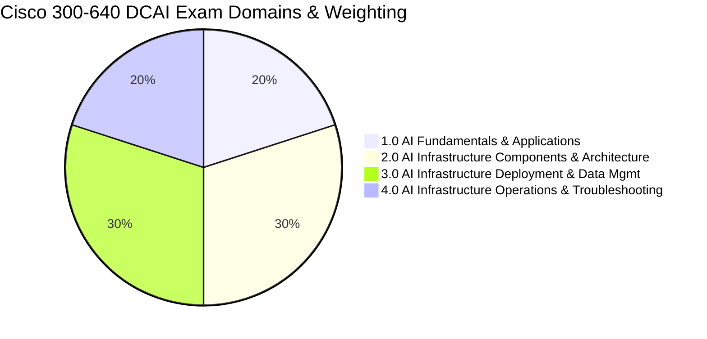

# Cisco 300-640 DCAI — Master Study Guide & Knowledge Base

> **Exam Code:** 300-640 DCAI  
> **Official Title:** Implementing Cisco Data Center AI Infrastructure  
> **Certifications Awarded:** CCNP Data Center Concentration & Cisco Certified Specialist - Data Center AI Infrastructure  
> **Duration:** 90 Minutes (~55–65 Questions)  
> **Format:** Multiple Choice (Single & Multi-Select), Drag-and-Drop, Scenario-Based Analysis  
> **Passing Score:** ~750–825 / 1000 (Scaled Score)  
> **Official Links:**
> - [Cisco Learning Network: 300-640 DCAI Exam Page](https://learningnetwork.cisco.com)
> - [Cisco Data Center AI Solutions Architecture](https://www.cisco.com/c/en/us/solutions/data-center/artificial-intelligence.html)
> - [Cisco Validated Designs (CVDs) for AI/ML](https://www.cisco.com/c/en/us/solutions/design-zone.html)

---

## 🧭 Curriculum Domains & Weighting

The exam curriculum is divided into four core domains. High-performance networking, compute, and data management represent **60% of the total score**.

| Domain | Weight | Core Competencies & Blueprint Topics |
| :--- | :---: | :--- |
| [**01. AI Fundamentals & Applications**](01-ai-fundamentals-and-applications/) | **20%** | AI/ML workload types (Training, Inference, RAG, GenAI), AI lifecycle & drift, Cloud vs. On-Prem vs. Edge AI, Core components (NVLink, GPUs, Storage, Containers), Cisco AI Solutions (AI PODs, AI Canvas, Hyperfabric AI). |
| [**02. AI Infrastructure Components & Architecture**](02-ai-infrastructure-components-and-architecture/) | **30%** | Network sizing (1:1 non-blocking bisectional bandwidth, tail latency, rail-optimized spine-leaf), Compute sizing (GPU/CPU ratios, PCIe Gen 5, HBM3e, NUMA pinning, MIG), Storage evaluation (Throughput vs. IOPS, Checkpointing, Parallel File Systems, GDS), Power & Cooling (40kW–100kW+ racks, PUE, D2C liquid cooling, RDHx). |
| [**03. AI Infrastructure Deployment & Data Management**](03-ai-infrastructure-deployment-and-data-management/) | **30%** | Lossless Ethernet (PFC 802.1Qbb, ECN RFC 3168, ETS 802.1Qaz), RoCEv2 encapsulation (UDP port 4791, BTH), Cisco NX-OS MQC QoS configuration (no-drop CoS 3), Dynamic Load Balancing (DLB) & Flowlets, Cisco UCS AI configuration (Domain profiles, vNICs, MTU 9216, Lossless Platinum classes), Orchestration (NDFC, APIC, Hyperfabric, Intersight). |
| [**04. AI Infrastructure Operations & Troubleshooting**](04-ai-infrastructure-operations-and-troubleshooting/) | **20%** | Benchmarking (NCCL `all_reduce_perf`, bus vs. algo bandwidth, FIO, `perftest`), Monitoring (Nexus Dashboard Insights flow telemetry, Intersight compute telemetry), Telemetry & Health (DOM optical power, INT, streaming gNMI, Syslog), Root cause troubleshooting (PFC deadlocks, slow drains, RoCE drops, GPU XID errors). |

---

## 📚 Complete Knowledge Base Navigation

### Module 00: Exam Strategy & Hardware Primer
*Master the exam blueprint, scoring philosophy, and core hardware building blocks.*
- [01. Exam Blueprint, Structure, & Preparation Strategy](00-exam-strategy-and-hardware-primer/01-exam-blueprint-and-strategy.md) — Scoring, question distribution, passing rules, and time management.
- [02. AI Data Center Hardware Primer](00-exam-strategy-and-hardware-primer/02-ai-datacenter-hardware-primer.md) — NVIDIA SXM vs. PCIe GPUs, NVLink, Cisco UCS X-Series (X9508, X210c, X440p), UCS 6536 Fabric Interconnects, and Nexus 9000 switches.

---

### Module 01: AI Fundamentals & Applications (20% Weight)
*Understand workload profiles, models, lifecycle stages, and Cisco turnkey solutions.*
- [01. AI & ML Workload Types](01-ai-fundamentals-and-applications/01-ai-ml-workload-types.md) — Plain-English breakdown of Training (Data, Model, Tensor Parallelism), Inference (KV cache, TTFT), RAG, and Generative AI.
- [02. AI Lifecycle & Enterprise Use Cases](01-ai-fundamentals-and-applications/02-ai-lifecycle-and-enterprise-use-cases.md) — 7 phases from data ingestion to model drift (Data Drift vs. Concept Drift) and industry architectures.
- [03. AI Infrastructure Models: Cloud, Hybrid, On-Prem, & Edge](01-ai-fundamentals-and-applications/03-ai-infrastructure-models-cloud-hybrid-onprem-edge.md) — TCO calculations, 60% utilization rule, data sovereignty, and Cisco Intersight hybrid connectivity.
- [04. Core Components of an AI Environment](01-ai-fundamentals-and-applications/04-ai-environment-core-components.md) — Front-end vs. back-end networks, GPU virtualization (MIG vs. vGPU), orchestration (Slurm vs. K8s), and storage tiers.
- [05. Cisco AI Architectural Solutions](01-ai-fundamentals-and-applications/05-cisco-ai-architectural-solutions.md) — Cisco AI PODs (CVDs), Cisco AI Canvas visual framework, and Cisco Nexus Hyperfabric AI with NVIDIA.

---

### Module 02: AI Infrastructure Components & Architecture (30% Weight)
*Architect scalable networks, high-density compute, extreme throughput storage, and liquid cooling facilities.*
- [01. Network Architecture Evaluation](02-ai-infrastructure-components-and-architecture/01-network-architecture-evaluation.md) — 1:1 non-blocking bisectional bandwidth, tail latency in AllReduce, rail-optimized spine-leaf, and MACsec.
- [02. Compute Architecture & GPU Connectivity](02-ai-infrastructure-components-and-architecture/02-compute-architecture-and-gpu-connectivity.md) — CPU/GPU ratios, PCIe Gen 5 lanes, HBM3e memory, NUMA node binding, and Scale-Up vs. Scale-Out limits.
- [03. Storage Architecture Evaluation](02-ai-infrastructure-components-and-architecture/03-storage-architecture-evaluation.md) — Storage hierarchy, checkpointing mathematics, parallel file systems (Weka/VAST), and GPUDirect Storage (GDS).
- [04. Power, Cooling, Efficiency, & Sustainability](02-ai-infrastructure-components-and-architecture/04-power-cooling-efficiency-and-sustainability.md) — 40kW–100kW+ racks, PUE formulas, Direct-to-Chip (D2C) liquid cooling, RDHx, and Intersight power capping.

---

### Module 03: AI Infrastructure Deployment & Data Management (30% Weight)
*Configure lossless Ethernet, deploy RoCEv2, orchestrate UCS server profiles, and automate fabrics.*
- [01. Lossless Ethernet & Congestion Control](03-ai-infrastructure-deployment-and-data-management/01-lossless-ethernet-and-congestion-control.md) — The Lossless Holy Trinity: PFC (802.1Qbb), ECN (RFC 3168/WRED), ETS (802.1Qaz), and buffer headroom.
- [02. RDMA over Converged Ethernet (RoCE & RoCEv2) Deep Dive](03-ai-infrastructure-deployment-and-data-management/02-roce-and-rocev2-deep-dive.md) — RoCEv1 vs. RoCEv2, UDP port 4791, packet anatomy, BTH headers, and Congestion Notification Packets (CNP).
- [03. QoS & Queuing Configuration on Cisco Nexus NX-OS](03-ai-infrastructure-deployment-and-data-management/03-qos-and-queuing-configuration-nxos.md) — Step-by-step MQC templates (`type qos`, `type network-qos`, `type queuing`), CoS 3 no-drop, and PFC Watchdog.
- [04. Load Balancing & Traffic Distribution](03-ai-infrastructure-deployment-and-data-management/04-load-balancing-and-traffic-distribution.md) — Elephant flows, ECMP hash collision disasters, Dynamic Load Balancing (DLB), Flowlet switching, and Packet Spraying.
- [05. Cisco UCS Compute & Storage Configuration for AI](03-ai-infrastructure-deployment-and-data-management/05-cisco-ucs-compute-and-storage-configuration.md) — Intersight domain profiles, power policies (N+N), vNIC policies (MTU 9216, RoCE enabled, failover disabled), and Platinum QoS classes.
- [06. AI Fabric Orchestration Tools](03-ai-infrastructure-deployment-and-data-management/06-ai-fabric-orchestration-tools.md) — Nexus Dashboard Fabric Controller (NDFC AI templates), Cisco APIC (ACI), Nexus Hyperfabric, and Intersight.

---

### Module 04: AI Infrastructure Operations & Troubleshooting (20% Weight)
*Benchmark performance, monitor real-time telemetry, correlate system logs, and triage production outages.*
- [01. AI Infrastructure Benchmarking](04-ai-infrastructure-operations-and-troubleshooting/01-ai-benchmarking-nccl-mlperf-storage.md) — NCCL tests (`all_reduce_perf`), bus bandwidth vs. algorithm bandwidth ($2 \times \frac{N-1}{N}$ math), FIO, and `perftest`.
- [02. AI Infrastructure Monitoring: NDI & Intersight](04-ai-infrastructure-operations-and-troubleshooting/02-monitoring-nexus-dashboard-insights-and-intersight.md) — Nexus Dashboard Insights (microburst detection, buffer heatmaps), Intersight compute telemetry, and DCGM integration.
- [03. Operational Telemetry, Health, & Log Correlation](04-ai-infrastructure-operations-and-troubleshooting/03-operational-telemetry-health-and-log-correlation.md) — Model-driven telemetry (gNMI), In-Band Telemetry (INT), DOM optical power levels, Syslog levels, and multi-layer correlation.
- [04. AI Infrastructure Troubleshooting Playbooks & CLI Diagnostics](04-ai-infrastructure-operations-and-troubleshooting/04-troubleshooting-playbooks-and-cli-diagnostics.md) — 5 step-by-step diagnostic trees for PFC pause storms, silent drops, straggler nodes, GPU XID errors, and master NX-OS CLI cheat sheet.

---

### Module 05: Practice Scenarios & Master Reference
*Validate your readiness with exam-level practice questions and rapid-fire cheat sheets.*
- [01. High-Frequency Exam Scenarios & Practice Drills](05-practice-scenarios-and-cheatsheets/01-high-frequency-exam-scenarios-and-drills.md) — Scenario-based questions with in-depth plain-English explanations and trap analysis.
- [02. Master Acronyms, Standards, Ports, & CLI Cheat Sheet](05-practice-scenarios-and-cheatsheets/02-master-acronyms-ports-and-cli-cheatsheet.md) — Comprehensive acronym glossary, port numbers, formulas, and production configuration templates.

---

## ⚡ The Plain-English Core Summary

If you only remember 5 core principles for the exam:

1. **Lossless is Mandatory for AI Training:** Standard TCP drops are unacceptable; back-end AI fabrics **must** use **PFC (802.1Qbb)** on **CoS 3** paired with **ECN (RFC 3168)** and **MTU 9216**.
2. **RoCEv2 Runs on UDP Port 4791:** Encapsulated in UDP with a dynamic source port to allow **ECMP & Dynamic Load Balancing (DLB)** across spine switches.
3. **AllReduce is Bound by Tail Latency:** The slowest packet or slowest GPU determines the speed of the entire cluster. Fabrics must be **strictly 1:1 non-blocking and rail-optimized**.
4. **Cisco UCS Requires Specific AI Settings:** Set QoS System Class **Platinum to Packet Drop = No**, set vNIC **MTU to 9216**, **Enable RoCE**, and **Disable vNIC Fabric Failover**.
5. **Bus Bandwidth $\approx$ 2x Algorithm Bandwidth:** In NCCL `all_reduce_perf`, $\text{busbw} = \text{algbw} \times 2 \times \frac{N-1}{N}$ due to the bidirectional ring communication pattern.
