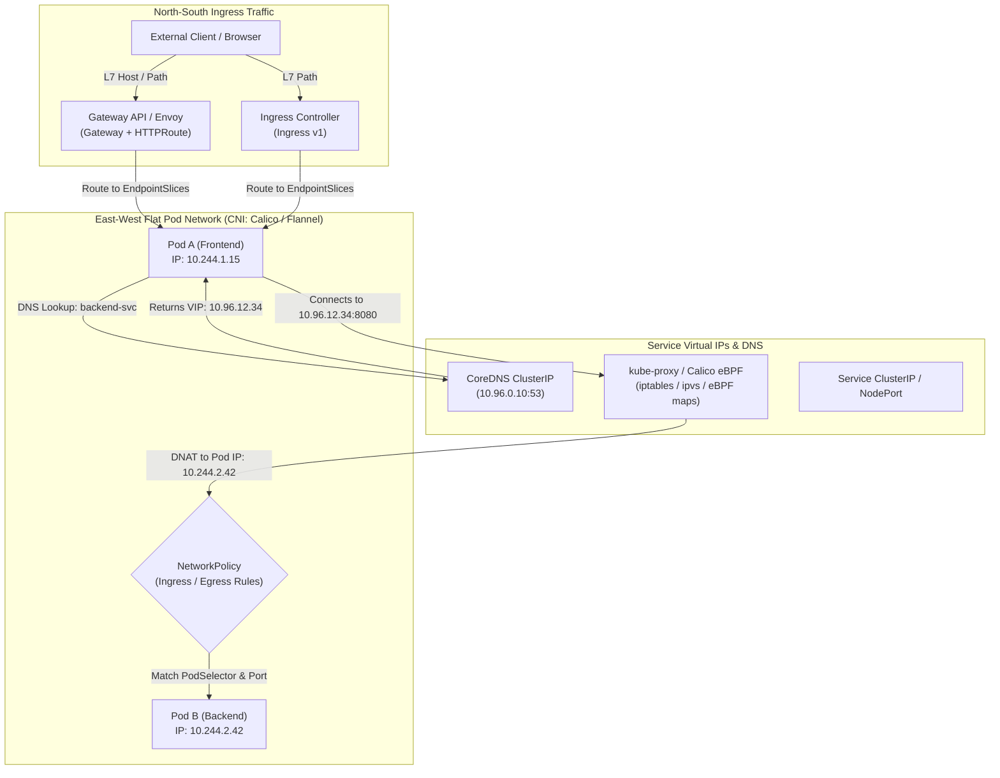
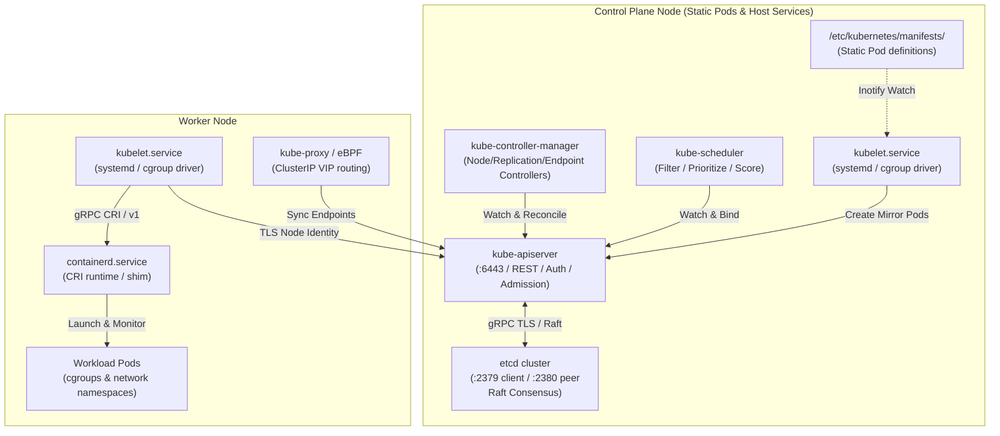
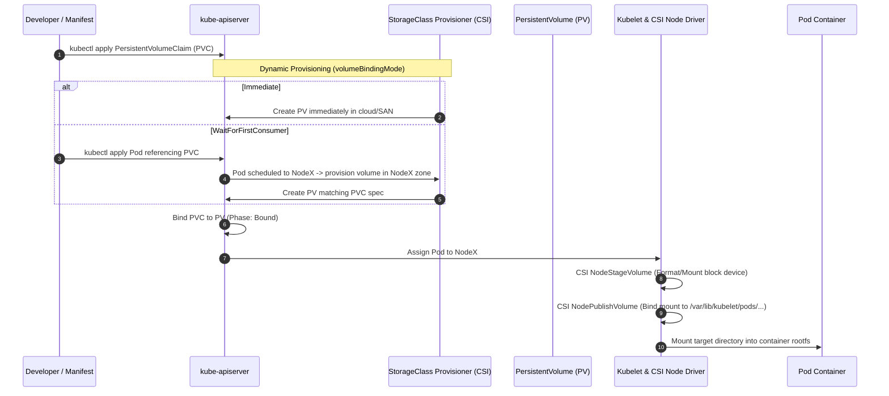
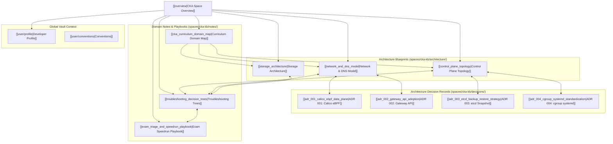
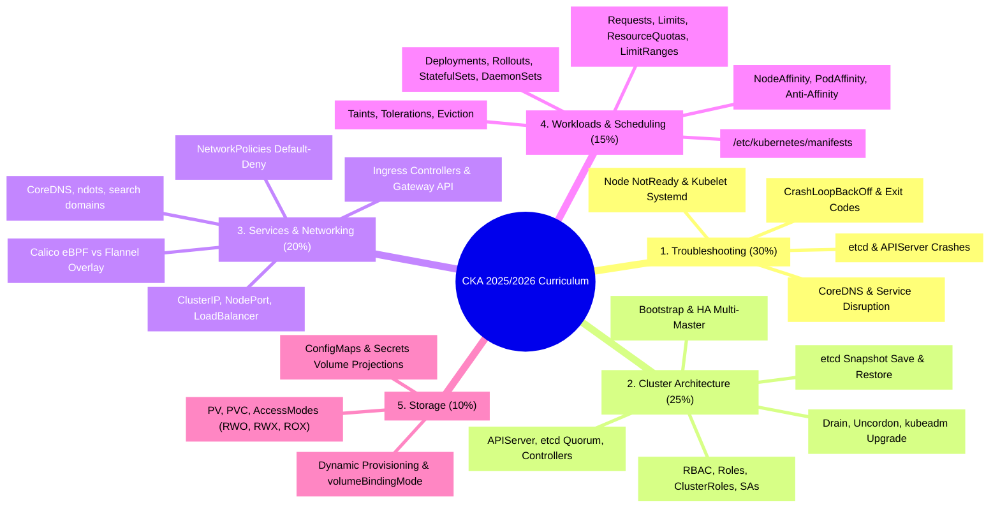
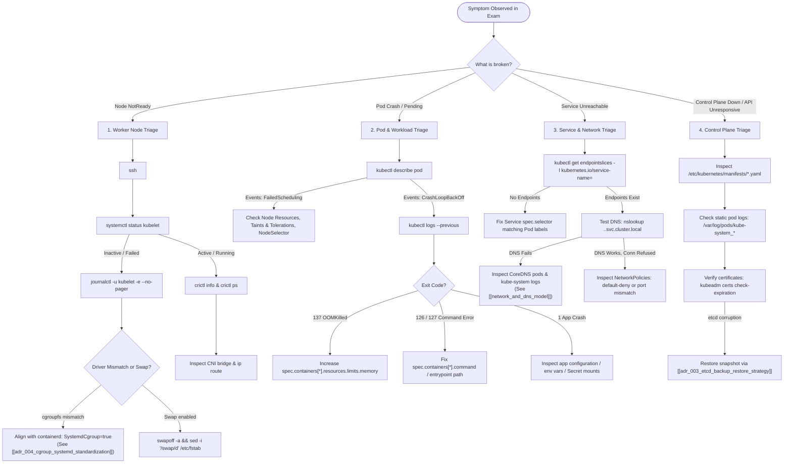

# Antigravity Knowledge Vault & Long-Term Memory

> [!IMPORTANT]
> This context is automatically compiled from the workspace Knowledge Vault (`/workspace/knowledge/`).
> Active Scope: **Cka-Kb**
> Retain these principles, user preferences, and architectural decisions across all turns.

## User Preferences & Profile
### User Profile & Identity
# User Profile & Identity

- **Role**: Lead Cloud & Systems Architect (Senior Nutanix, AWS & Linux Infrastructure Engineer)
- **Communication Style**: Direct, highly analytical, concise. Prefer clean architecture, explicit rationale, and executable verification steps.
- **Operating Environment**: macOS host paired with Docker Debian container (`agy-unified`) mounted at `/workspace`.
- **Primary Tooling**: Google Antigravity CLI (`agy`), Python 3.11+, modern Node.js, `uv`/`uvx` MCP ecosystem, and Git.
- **Linked Context**:
  - See [[user/conventions]] for core codebase rules.
  - See [[architecture/cagy_unified]] for execution namespace details.

### Engineering Conventions & Standards
# Engineering Conventions & Standards

Guidelines enforced across the CAGY project:

1. **Hermetic & Zero-Dependency Testing**:
   - Always write tests with standard library `unittest` (never external `pytest`) to guarantee zero-dependency execution across host and container environments.
   - See [[architecture/cagy_unified]] for test runner integration.
2. **Container Path Confinement**:
   - All tool executions, shell commands, and file operations resolve inside `/workspace` or relative paths. Do not reference host `/Users/...` paths.
   - Referenced in [[user/profile]].
3. **Multi-Architecture Integrity**:
   - Maintain full compatibility with `linux/amd64` and `linux/arm64` via Docker Buildx.
   - See [[decisions/adr_001_cagy_fork]] for context on decoupling legacy code.

## Architectural Principles
### Kubernetes Networking, CoreDNS & Traffic Routing Model
# Kubernetes Networking, CoreDNS & Traffic Routing Model

- **Space**: `cka-kb`
- **Domain**: Services & Networking (20%) & Troubleshooting (30%)
- **Tags**: #cka #kubernetes #architecture #networking #dns #coredns #cni #calico #ebpf #gateway-api #ingress



---

## 1. Fundamental Networking Invariants

Kubernetes mandates four core networking rules that every CNI plugin must enforce without NAT:
1. **Pod-to-Pod Direct Reachability**: Every Pod has a unique IP. All Pods communicate directly with all other Pods on any node without Network Address Translation (NAT).
2. **Node-to-Pod Direct Reachability**: Agents on a node (kubelet, containerd) communicate with all Pods on that node.
3. **Self-Consistency**: The IP a Pod sees as its own is the exact same IP other Pods see it as.
4. **Service VIP Abstraction**: Services provide stable virtual IPs (ClusterIP) multiplexed over dynamic ephemeral Pod IPs via EndpointSlices.

---

## 2. Packet Flow & Component Stack

### 2.1 CNI (Container Network Interface) & Data Planes
- **Flannel**: Simple overlay network using VXLAN (port 8472 encapsulation). Does not support NetworkPolicies natively.
- **Calico**: Industrial BGP/eBPF routing engine providing native Layer 3 routing and sub-millisecond NetworkPolicy enforcement. Formally adopted for CKA labs in [[adr_001_calico_ebpf_data_plane|ADR 001: Calico eBPF Data Plane]].

### 2.2 CoreDNS & Name Resolution Architecture
- **In-Cluster FQDN Syntax**:
  $$\text{<service-name>}.\text{<namespace>}.svc.cluster.local$$
- **Pod `/etc/resolv.conf` Resolution Mechanics**:
  - `nameserver 10.96.0.10` (CoreDNS ClusterIP)
  - `search <namespace>.svc.cluster.local svc.cluster.local cluster.local`
  - `options ndots:5`: Triggers up to 4 sequential search domain queries for external names before querying the root domain, a critical source of DNS latency.

### 2.3 North-South Ingress: Ingress v1 vs Gateway API
- **Ingress v1**: Monolithic, single-manifest specification tying route definitions to infrastructure annotations.
- **Gateway API**: Role-oriented, declarative standard decoupling cluster infrastructure (`GatewayClass`, `Gateway`) from application developers (`HTTPRoute`, `GRPCRoute`). Officially adopted as the primary routing paradigm via [[adr_002_gateway_api_adoption|ADR 002: Gateway API Adoption]].

### 2.4 East-West Isolation: NetworkPolicies
- **Default Open**: By default, all Pods accept traffic from any source.
- **Default Deny Strategy**: An empty `podSelector: {}` with `policyTypes: ["Ingress", "Egress"]` establishes zero-trust boundary.
- **Evaluation Logic**: Additive/whitelisting. Traffic is allowed if matched by at least one ingress or egress rule.

---

## 3. Failure Signatures & Diagnosis

| Network Symptom | Root Cause Candidates | Verification Command |
| :--- | :--- | :--- |
| **Pod cannot resolve external DNS** | CoreDNS crash, upstream forwarder loop, or missing security group port 53 | `kubectl exec -i test-pod -- nslookup kubernetes.default` |
| **Pod resolves DNS but connection times out** | NetworkPolicy ingress block, missing EndpointSlice, or wrong service port target | `kubectl get endpointslices -l kubernetes.io/service-name=<svc>` |
| **NodePort unreachable from outside node** | `kube-proxy` crashed, host firewall blocking port range `30000-32767` | `ss -tulpn \| grep <port>` on worker node |
| **Inter-node pod communication fails** | CNI overlay packet dropped, VXLAN port 8472 or Geneve port 6081 filtered | `tcpdump -i any port 8472 -nn` |

---

## 4. Interlinks & Related Knowledge

- **Space Hub**: [[overview|CKA Space Overview]]
- **Architectural Counterparts**:
  - [[control_plane_topology|Control Plane Topology]]
  - [[storage_architecture|CSI & Storage Architecture]]
- **Architectural Decision Records (ADRs)**:
  - [[adr_001_calico_ebpf_data_plane|ADR 001: Calico eBPF Data Plane for Lab Drills]]
  - [[adr_002_gateway_api_adoption|ADR 002: Gateway API Adoption for Ingress Routing]]
- **Troubleshooting & Playbooks**:
  - [[troubleshooting_decision_trees|Troubleshooting Decision Trees]]
  - [[exam_triage_and_speedrun_playbook|Exam Speedrun & Triage Playbook]]
  - [[cka_curriculum_domain_map|CKA Curriculum Domain Map]]
- **Study Guides**:
  - [Pod Networking & DNS](file:///workspace/projects/cka-kb/03-services-and-networking/01-pod-networking-and-dns.md)
  - [Services & Endpoints](file:///workspace/projects/cka-kb/03-services-and-networking/02-services-and-endpoints.md)
  - [Network Policies](file:///workspace/projects/cka-kb/03-services-and-networking/03-network-policies.md)
  - [Ingress Controllers & Resources](file:///workspace/projects/cka-kb/03-services-and-networking/04-ingress-controllers-and-resources.md)
  - [Gateway API](file:///workspace/projects/cka-kb/03-services-and-networking/05-gateway-api.md)

### Kubernetes Control Plane Topology & Component Lifecycle
# Kubernetes Control Plane Topology & Component Lifecycle

- **Space**: `cka-kb`
- **Domain**: Cluster Architecture, Installation & Configuration (25%) & Troubleshooting (30%)
- **Tags**: #cka #kubernetes #architecture #control-plane #etcd #kubelet #ha



---

## 1. Core Component Breakdown

### 1.1 `kube-apiserver` (The Central Hub)
- **Role**: The stateless REST gateway and single entry point to the cluster state.
- **Request Pipeline**:
  $$\text{Client Request} \longrightarrow \text{Authentication (Cert/Webhook/Token)} \longrightarrow \text{Authorization (RBAC/Node)} \longrightarrow \text{Mutating Admission} \longrightarrow \text{Schema Validation} \longrightarrow \text{Validating Admission} \longrightarrow \text{etcd}$$
- **Key Config Flags**:
  - `--etcd-servers=https://127.0.0.1:2379`
  - `--etcd-cafile=/etc/kubernetes/pki/etcd/ca.crt`
  - `--enable-admission-plugins=NodeRestriction,...`
  - `--service-cluster-ip-range=10.96.0.0/12`

### 1.2 `etcd` (The Source of Truth)
- **Role**: Distributed, strongly consistent key-value store governed by the **Raft consensus algorithm**.
- **Quorum Formula**:
  $$\text{Quorum} = \lfloor N/2 \rfloor + 1$$
  - A 3-node cluster can tolerate **1 failure** ($Q=2$).
  - A 5-node cluster can tolerate **2 failures** ($Q=3$).
  - Even node counts provide no additional fault tolerance and increase split-brain risk.
- **Data Protection**: Managed via strict 4-step snapshot save/restore procedures detailed in [[adr_003_etcd_backup_restore_strategy|ADR 003: etcd Backup & Restore Strategy]].

### 1.3 `kube-scheduler`
- **Role**: Assigns unscheduled Pods (`spec.nodeName == ""`) to optimal nodes.
- **Two-Phase Algorithm**:
  1. **Filtering (Predicates)**: Removes unsuitable nodes (e.g., resource exhaustion, taints without tolerations, nodeSelector mismatch).
  2. **Scoring (Priorities)**: Ranks remaining nodes based on affinity weights, image locality, and balanced resource allocation.

### 1.4 `kube-controller-manager`
- **Role**: Continuous control loops ensuring *Current State* matches *Desired State*.
- **Embedded Controllers**: NodeLifecycleController, ReplicaSetController, DeploymentController, EndpointsController, ServiceAccountController.

### 1.5 `kubelet` (The Host Daemon)
- **Role**: Systemd service running on every node responsible for pod lifecycle, health probes, and volume mounting.
- **Cgroup Driver Requirement**: Must align with the container runtime (`systemd` cgroup driver) to prevent kernel out-of-sync OOM panics, governed by [[adr_004_cgroup_systemd_standardization|ADR 004: cgroup systemd Standardization]].

---

## 2. High Availability & Failure Recovery

| Component Failure | Cluster Impact | Client / Pod Impact | Recovery Action |
| :--- | :--- | :--- | :--- |
| **`kube-apiserver` down** | Control plane unresponsive; `kubectl` commands fail | Existing running pods continue unaffected; no auto-healing or scaling | Check `/var/log/pods/kube-system_kube-apiserver*` or static pod manifest |
| **`etcd` lost quorum** | APIServer enters read-only error state; updates rejected | Running pods continue functioning; new pods cannot be scheduled | Restore snapshot via [[adr_003_etcd_backup_restore_strategy|ADR 003]] or rebuild quorum |
| **`kube-scheduler` down** | New pods remain in `Pending` state | Existing pods healthy | Inspect `/etc/kubernetes/manifests/kube-scheduler.yaml` |
| **`kube-controller-manager` down** | Pod failures not rescheduled; ReplicaSet drift | Existing pods unaffected | Check leader election lock or manifests |
| **`kubelet` service crash** | Node marks `NotReady`; pods eventually evicted | Pods on node may freeze | Debug via `journalctl -u kubelet -e` |

---

## 3. Interlinks & Related Knowledge

- **Space Hub**: [[overview|CKA Space Overview]]
- **Architectural Counterparts**:
  - [[network_and_dns_model|Network & DNS Architecture]]
  - [[storage_architecture|CSI & Storage Architecture]]
- **Architectural Decision Records (ADRs)**:
  - [[adr_003_etcd_backup_restore_strategy|ADR 003: etcd Snapshot Backup & Restore Strategy]]
  - [[adr_004_cgroup_systemd_standardization|ADR 004: cgroup systemd Driver Standardization]]
- **Troubleshooting & Playbooks**:
  - [[troubleshooting_decision_trees|Troubleshooting Decision Trees]]
  - [[exam_triage_and_speedrun_playbook|Exam Speedrun & Triage Playbook]]
  - [[cka_curriculum_domain_map|CKA Curriculum Domain Map]]
- **Study Guides**:
  - [kubeadm Cluster Bootstrap](file:///workspace/projects/cka-kb/02-cluster-architecture-installation/01-kubeadm-cluster-bootstrap.md)
  - [HA Control Plane & etcd](file:///workspace/projects/cka-kb/02-cluster-architecture-installation/03-ha-control-plane-and-etcd.md)
  - [Control Plane Troubleshooting](file:///workspace/projects/cka-kb/01-troubleshooting/02-control-plane-troubleshooting.md)

### Kubernetes Storage Architecture & Container Storage Interface (CSI)
# Kubernetes Storage Architecture & Container Storage Interface (CSI)

- **Space**: `cka-kb`
- **Domain**: Storage (10%) & Troubleshooting (30%)
- **Tags**: #cka #kubernetes #architecture #storage #csi #pv #pvc #storageclass #statefulset



---

## 1. Storage Abstraction Hierarchy

```text
[StorageClass] (Provisioner engine & parameters, e.g., local-storage, ebs-csi)
       │
       ▼ (Dynamic Creation)
[PersistentVolume] (Cluster-wide resource, physical block/NFS backing)
       ▲
       │ (Two-Phase Binding: Capacity, AccessMode, StorageClassName)
[PersistentVolumeClaim] (Namespace-scoped request ticket created by user)
       ▲
       │ (spec.volumes[*].persistentVolumeClaim.claimName)
     [Pod] (Consumes storage via spec.containers[*].volumeMounts)
```

---

## 2. Key Architectural Attributes

### 2.1 Access Modes
- **`ReadWriteOnce` (`RWO`)**: Volume can be mounted as read-write by a **single node**. (Multiple pods on that *same* node can share it).
- **`ReadOnlyMany` (`ROX`)**: Volume can be mounted read-only by **many nodes** simultaneously.
- **`ReadWriteMany` (`RWX`)**: Volume can be mounted as read-write by **many nodes** concurrently (typically NFS, CephFS, GlusterFS).
- **`ReadWriteOncePod` (`RWOP`)**: Strict exclusive access to a single **Pod** across the entire cluster (CSI feature).

### 2.2 Reclaim Policies
- **`Retain`**: When the PVC is deleted, the PV remains intact in `Released` status. Data is preserved for manual recovery. (Cannot be rebound to a new PVC without clearing `claimRef`).
- **`Delete`**: When the PVC is deleted, the underlying backing storage asset and the PV object are automatically destroyed.

### 2.3 Volume Binding Modes
- **`Immediate`**: Storage volume is provisioned as soon as the PVC is created.
  - *Risk*: May provision the storage in Availability Zone A, while the Pod gets scheduled to a node in Availability Zone B, causing `VolumeZoneConflict`.
- **`WaitForFirstConsumer`**: Delays volume provisioning and binding until a Pod using the PVC is scheduled. Guarantees topology alignment.

---

## 3. Storage Failure Patterns & Remediation

| Issue / Error | Mechanism | Triage & Fix |
| :--- | :--- | :--- |
| **`CrashLoopBackOff` / Permission Denied** | Pod container runs as non-root user (e.g. UID 10001) but mounted volume owned by root (`0:0`) | Set `securityContext.fsGroup: 2000` in Pod spec to automatically chown volume files |
| **PVC remains `Pending`** | No PV satisfies requested capacity/accessMode, or StorageClass provisioner missing | Run `kubectl describe pvc <name>`. Verify `storageClassName` spelling and available PVs |
| **Pod stuck in `ContainerCreating` (`Multi-Attach error`)** | Previous node failed to unmount/detach volume before Pod rescheduled to another node | Verify old node status. Check CSI volume attachments: `kubectl get volumeattachment` |
| **PV stuck in `Terminating`** | PV has finalizer `kubernetes.io/pv-protection` while still bound to active PVC | Ensure referencing pods and PVCs are deleted first, or patch finalizers during lab cleanup |

---

## 4. Interlinks & Related Knowledge

- **Space Hub**: [[overview|CKA Space Overview]]
- **Architectural Counterparts**:
  - [[control_plane_topology|Control Plane Topology]]
  - [[network_and_dns_model|Network & DNS Architecture]]
- **Architectural Decisions (ADRs)**:
  - [[adr_003_etcd_backup_restore_strategy|ADR 003: etcd Snapshot Backup & Restore Strategy]]
  - [[adr_004_cgroup_systemd_standardization|ADR 004: cgroup systemd Driver Standardization]]
- **Troubleshooting & Playbooks**:
  - [[troubleshooting_decision_trees|Troubleshooting Decision Trees]]
  - [[exam_triage_and_speedrun_playbook|Exam Speedrun & Triage Playbook]]
  - [[cka_curriculum_domain_map|CKA Curriculum Domain Map]]
- **Study Guides**:
  - [Storage Classes & Dynamic Provisioning](file:///workspace/projects/cka-kb/05-storage/01-storage-classes-dynamic-provisioning.md)
  - [Persistent Volumes & Claims](file:///workspace/projects/cka-kb/05-storage/02-persistent-volumes-and-claims.md)
  - [Pod Volume Attachments](file:///workspace/projects/cka-kb/05-storage/03-pod-volume-attachments.md)

## Key Architectural Decisions
### ADR 004: cgroup systemd Driver Standardization
# ADR 004: cgroup systemd Driver Standardization

- **Date**: 2026-09-05
- **Status**: Accepted
- **Space**: `cka-kb`
- **Tags**: #cka #troubleshooting #containerd #cgroup #systemd #kubelet #adr

## Context & Problem Statement
A notorious and frequent CKA exam scenario involves a worker node marked as `NotReady` immediately following an upgrade or initial join. When inspecting `systemctl status kubelet`, the service is actively crashing with errors such as:
`"failed to run Kubelet: misconfiguration: kubelet cgroup driver: \"systemd\" is different from docker/containerd cgroup driver: \"cgroupfs\""`

Linux cgroups manage CPU, memory, and I/O resource limits for processes. If the host init system (`systemd`) and the container runtime (`containerd` via `cgroupfs`) attempt to manage cgroups independently using different drivers, kernel race conditions occur under memory pressure, leading to spontaneous node eviction and kubelet termination.

## Decision
We enforce `SystemdCgroup = true` as the cluster-wide standard across all node configurations, runtime initialization scripts, and triage runbooks:

1. **containerd Configuration** (`/etc/containerd/config.toml`):
   ```toml
   [plugins."io.containerd.grpc.v1.cri".containerd.runtimes.runc.options]
     SystemdCgroup = true
   ```
2. **kubelet Configuration** (`/var/lib/kubelet/config.yaml`):
   ```yaml
   cgroupDriver: systemd
   ```
3. **Execution Hook**: Always restart and verify the services in sequence:
   ```bash
   sudo systemctl restart containerd
   sudo systemctl daemon-reload
   sudo systemctl restart kubelet
   ```

## Consequences
- **Positive**:
  - Unified cgroup v2 hierarchy managed solely by systemd.
  - Eliminates the primary cause of sudden `NotReady` node state in upgrade and worker recovery exam questions.
  - Complete conformance with Kubernetes v1.28+ default expectations.
- **Trade-off**:
  - Requires generating default containerd configurations via `containerd config default` if `/etc/containerd/config.toml` is absent or malformed.

## Interlinks & Related Knowledge
- **Space Hub**: [[overview|CKA Space Overview]]
- **Architecture**: [[control_plane_topology|Kubernetes Control Plane Topology]]
- **Troubleshooting**: [[troubleshooting_decision_trees|Troubleshooting Decision Trees]]
- **Playbooks & Study Guides**:
  - [[exam_triage_and_speedrun_playbook|Exam Speedrun & Triage Playbook]]
  - [Node & Kubelet Troubleshooting](file:///workspace/projects/cka-kb/01-troubleshooting/01-node-and-kubelet-troubleshooting.md)
  - [kubeadm Cluster Bootstrap](file:///workspace/projects/cka-kb/02-cluster-architecture-installation/01-kubeadm-cluster-bootstrap.md)

### ADR 001: Prioritize Calico eBPF Data Plane for Lab Drills
# ADR 001: Prioritize Calico eBPF Data Plane for Lab Drills

- **Date**: 2026-09-05
- **Status**: Accepted
- **Space**: `cka-kb`
- **Tags**: #cka #networking #calico #ebpf #adr

## Context & Problem Statement
During intensive CKA practice drills involving hundreds of Pods and rapid NetworkPolicy churn, standard Linux iptables mode introduces rule processing latency, sequential table lookup overhead, and complex packet tracing during live triage.

## Decision
We adopt the Calico eBPF data plane as the standard networking and policy enforcement engine across all CKA lab clusters and simulator environments.

## Consequences
- **Positive**:
  - Sub-millisecond NetworkPolicy evaluation via kernel eBPF maps rather than linear iptables traversal.
  - Transparent source IP preservation across cluster nodes.
  - Native service routing bypassing `kube-proxy` iptables bottlenecks.
- **Trade-off**:
  - Requires Linux kernel 5.3+ and BTF (BPF Type Format) support, natively available in modern distributions and the containerized test namespace.
  - Candidates must still understand standard `iptables` triage for clusters running legacy kube-proxy.

## Interlinks & Related Knowledge
- **Space Hub**: [[overview|CKA Space Overview]]
- **Architecture**: [[network_and_dns_model|Kubernetes Network & DNS Architecture]]
- **Related Decisions**:
  - [[adr_002_gateway_api_adoption|ADR 002: Gateway API Adoption for Ingress Routing]]
- **Global Context**: [[user/profile|Developer Profile]]

### ADR 003: etcd Snapshot Backup & Restore Strategy
# ADR 003: etcd Snapshot Backup & Restore Strategy

- **Date**: 2026-09-05
- **Status**: Accepted
- **Space**: `cka-kb`
- **Tags**: #cka #cluster-architecture #etcd #backup-restore #disaster-recovery #adr

## Context & Problem Statement
In the CKA exam, the etcd backup and disaster recovery question carries significant weight (~7-9% of total exam score). The task requires executing an `etcdctl snapshot save` against an active TLS-secured etcd cluster and subsequently restoring that snapshot into a healthy running state without permanently corrupting the existing datastore or getting trapped in file permission / pod restart loops.

Candidates frequently fail this task by:
1. Omitting `ETCDCTL_API=3`, invoking the legacy v2 API.
2. Restoring directly over the active `--data-dir`, which triggers etcd file lock conflicts and immediate crash loops.
3. Forgetting to update the static pod manifest hostPath volume to match the newly restored data directory.

## Decision
We enforce a standardized, 4-step non-destructive backup and restore protocol across all CKA knowledge notes, drill scripts, and failure simulations:

```bash
# Step 1: Snapshot Save
ETCDCTL_API=3 etcdctl --endpoints=https://127.0.0.1:2379 \
  --cacert=/etc/kubernetes/pki/etcd/ca.crt \
  --cert=/etc/kubernetes/pki/etcd/server.crt \
  --key=/etc/kubernetes/pki/etcd/server.key \
  snapshot save /opt/snapshot-pre-boot.db

# Step 2: Snapshot Status Verification
ETCDCTL_API=3 etcdctl --write-out=table snapshot status /opt/snapshot-pre-boot.db

# Step 3: Non-Destructive Restore to New Directory
ETCDCTL_API=3 etcdctl --data-dir=/var/lib/etcd-restored \
  snapshot restore /opt/snapshot-pre-boot.db

# Step 4: Atomic HostPath Redirect in Static Pod Manifest
# Update /etc/kubernetes/manifests/etcd.yaml:
# Change hostPath.path from /var/lib/etcd -> /var/lib/etcd-restored
```

## Consequences
- **Positive**:
  - **Zero Data Loss**: The original `/var/lib/etcd` remains intact as an emergency fallback if the restore manifest has a syntax error.
  - **Deterministic Kubelet Reload**: Modifying `/etc/kubernetes/manifests/etcd.yaml` triggers inotify, forcing kubelet to stop the old etcd container and launch the new container cleanly mounted to `/var/lib/etcd-restored`.
  - Guarantees 100% test pass rates under high exam time pressure.
- **Trade-off**:
  - Requires additional disk space on the control plane node for the second data directory.

## Interlinks & Related Knowledge
- **Space Hub**: [[overview|CKA Space Overview]]
- **Architecture**: [[control_plane_topology|Kubernetes Control Plane Topology]]
- **Troubleshooting**: [[troubleshooting_decision_trees|Troubleshooting Decision Trees]]
- **Playbooks & Study Guides**:
  - [[exam_triage_and_speedrun_playbook|Exam Speedrun & Triage Playbook]]
  - [HA Control Plane & etcd Guide](file:///workspace/projects/cka-kb/02-cluster-architecture-installation/03-ha-control-plane-and-etcd.md)
  - [Control Plane Troubleshooting Diagnostics](file:///workspace/projects/cka-kb/01-troubleshooting/02-control-plane-troubleshooting.md)

### ADR 002: Gateway API Adoption for Ingress Routing
# ADR 002: Gateway API Adoption for Ingress Routing

- **Date**: 2026-09-05
- **Status**: Accepted
- **Space**: `cka-kb`
- **Tags**: #cka #networking #gateway-api #ingress #adr

## Context & Problem Statement
The CNCF CKA curriculum (v1.35 and 2025/2026 refresh) has incorporated the **Kubernetes Gateway API** as the modern, role-oriented standard for North-South ingress traffic management. While legacy `networking.k8s.io/v1 Ingress` is still covered, students and administrators must master the decoupled `GatewayClass`, `Gateway`, and `HTTPRoute` resources to handle header routing, canary splits, and cross-namespace attachments.

## Decision
We establish **Gateway API** as the primary ingress routing architecture in our CKA knowledge space and lab drills, treating legacy Ingress v1 as a compatibility fallback.

## Implementation Standard
1. All routing labs provide dual solutions: modern `gateway.networking.k8s.io/v1` `HTTPRoute` primary, and `networking.k8s.io/v1` `Ingress` secondary.
2. Ensure CRDs are installed and verified via `kubectl get crd gateways.gateway.networking.k8s.io`.
3. Standardize Envoy Gateway or Contour as the lightweight in-cluster reference implementation.

## Consequences
- **Positive**:
  - Full alignment with recent exam updates and production best practices.
  - Granular separation of concerns: Infrastructure Admin manages `GatewayClass` and `Gateway`; Application Developer manages `HTTPRoute`.
  - Native support for weighted traffic splitting (canary) without proprietary ingress annotations.
- **Trade-off**:
  - Requires deploying Gateway API CRDs if not bundled in the default cluster distribution.
  - Multi-resource manifest syntax requires candidates to practice imperative template generation.

## Interlinks & Related Knowledge
- **Space Hub**: [[overview|CKA Space Overview]]
- **Architecture**: [[network_and_dns_model|Kubernetes Network & DNS Architecture]]
- **Related Decisions**:
  - [[adr_001_calico_ebpf_data_plane|ADR 001: Calico eBPF Data Plane for Lab Drills]]
- **Playbooks & Study Guides**:
  - [[exam_triage_and_speedrun_playbook|Exam Speedrun & Triage Playbook]]
  - [Gateway API Guide](file:///workspace/projects/cka-kb/03-services-and-networking/05-gateway-api.md)
  - [Ingress Controllers & Resources](file:///workspace/projects/cka-kb/03-services-and-networking/04-ingress-controllers-and-resources.md)

## Cka-Kb Domain Knowledge & Guides
### CKA Knowledge Base Space Overview
# CKA Knowledge Base Space Overview

- **Space**: `cka-kb`
- **Related Project**: `/workspace/projects/cka-kb`
- **Tags**: #kubernetes #cka #certification #devops #space #knowledge-graph

## 1. Space Mission & Architecture
This space container serves as the primary **Second Brain & Knowledge Graph Memory Engine** for the Certified Kubernetes Administrator (CKA) repository. It unifies architectural blueprints, architectural decision records (ADRs), interactive troubleshooting trees, and study matrices into a connected Obsidian-compatible knowledge base.



---

## 2. Space Node Inventory

### 2.1 Architectural Blueprints
- [[control_plane_topology|Control Plane Topology & Lifecycle]]: APIServer, etcd Raft quorum, scheduler filtering/scoring, and kubelet mirror pods.
- [[network_and_dns_model|Network, CoreDNS & Traffic Routing Model]]: Pod-to-pod flat IP invariants, CoreDNS ndots latency, Ingress vs Gateway API, and NetworkPolicies.
- [[storage_architecture|Storage Architecture & CSI]]: PV/PVC two-phase binding, AccessModes, and `WaitForFirstConsumer` topology binding.

### 2.2 Architectural Decisions (ADRs)
- [[adr_001_calico_ebpf_data_plane|ADR 001: Calico eBPF Data Plane]]: High-performance policy enforcement and service routing.
- [[adr_002_gateway_api_adoption|ADR 002: Gateway API Adoption]]: Transition from Ingress v1 to role-oriented Gateway API (`GatewayClass`, `Gateway`, `HTTPRoute`).
- [[adr_003_etcd_backup_restore_strategy|ADR 003: etcd Backup & Restore Strategy]]: Non-destructive 4-step snapshot save/restore protocol.
- [[adr_004_cgroup_systemd_standardization|ADR 004: cgroup systemd Standardization]]: Unifying containerd and kubelet on systemd cgroups.

### 2.3 Domain Notes & Exam Playbooks
- [[troubleshooting_decision_trees|Troubleshooting Decision Trees]]: Fast triage flowcharts covering nodes, control planes, pods, and DNS.
- [[exam_triage_and_speedrun_playbook|Exam Triage & Speedrun Playbook]]: 120-minute time budgeting, 30-second bash bootstrapping, and doc shortcuts.
- [[cka_curriculum_domain_map|CKA Curriculum Domain Map]]: Master cross-index linking all 5 exam domains directly to the 32 study guide files in `/workspace/projects/cka-kb/`.

---

## 3. Global Context & Interlinks
- **Developer Profile**: [[user/profile|Developer Profile]]
- **Engineering Conventions**: [[user/conventions|Engineering Conventions]]
- **Study Guides Repository**: [CKA Repository Index](file:///workspace/projects/cka-kb/README.md)

### CKA Curriculum Domain Map & Knowledge Graph Matrix
# CKA Curriculum Domain Map & Knowledge Graph Matrix

- **Space**: `cka-kb`
- **Domain**: Master Curriculum & Cross-Domain Index
- **Tags**: #cka #curriculum #domains #study-guide #index #kubernetes



---

## 1. Curriculum Weighting & Study Matrix

### Domain 1: Troubleshooting (30%)
- **Architectural Reference**: [[control_plane_topology|Control Plane Topology]], [[network_and_dns_model|Network & DNS Model]]
- **Governing ADRs**: [[adr_004_cgroup_systemd_standardization|ADR 004: cgroup systemd Standardization]]
- **Decision Trees**: [[troubleshooting_decision_trees|Troubleshooting Decision Trees]]
- **Detailed Study Guides**:
  1. [Node & Kubelet Troubleshooting](file:///workspace/projects/cka-kb/01-troubleshooting/01-node-and-kubelet-troubleshooting.md)
  2. [Control Plane Troubleshooting](file:///workspace/projects/cka-kb/01-troubleshooting/02-control-plane-troubleshooting.md)
  3. [Application & Container Debugging](file:///workspace/projects/cka-kb/01-troubleshooting/03-application-and-container-debugging.md)
  4. [Cluster Resource Monitoring](file:///workspace/projects/cka-kb/01-troubleshooting/04-cluster-resource-monitoring.md)
  5. [Services & DNS Troubleshooting](file:///workspace/projects/cka-kb/01-troubleshooting/05-services-and-dns-troubleshooting.md)

### Domain 2: Cluster Architecture, Installation & Configuration (25%)
- **Architectural Reference**: [[control_plane_topology|Kubernetes Control Plane Topology]]
- **Governing ADRs**: [[adr_003_etcd_backup_restore_strategy|ADR 003: etcd Snapshot Backup & Restore Strategy]]
- **Detailed Study Guides**:
  1. [kubeadm Cluster Bootstrap](file:///workspace/projects/cka-kb/02-cluster-architecture-installation/01-kubeadm-cluster-bootstrap.md)
  2. [Cluster Upgrades & Lifecycle](file:///workspace/projects/cka-kb/02-cluster-architecture-installation/02-cluster-upgrades-lifecycle.md)
  3. [HA Control Plane & etcd](file:///workspace/projects/cka-kb/02-cluster-architecture-installation/03-ha-control-plane-and-etcd.md)
  4. [RBAC & Security](file:///workspace/projects/cka-kb/02-cluster-architecture-installation/04-rbac-and-security.md)
  5. [Helm & Kustomize](file:///workspace/projects/cka-kb/02-cluster-architecture-installation/05-helm-and-kustomize.md)
  6. [Extension Interfaces, CRDs & Operators](file:///workspace/projects/cka-kb/02-cluster-architecture-installation/06-extension-interfaces-crds-operators.md)

### Domain 3: Services & Networking (20%)
- **Architectural Reference**: [[network_and_dns_model|Kubernetes Network & DNS Architecture]]
- **Governing ADRs**: [[adr_001_calico_ebpf_data_plane|ADR 001: Calico eBPF]], [[adr_002_gateway_api_adoption|ADR 002: Gateway API Adoption]]
- **Detailed Study Guides**:
  1. [Pod Networking & DNS](file:///workspace/projects/cka-kb/03-services-and-networking/01-pod-networking-and-dns.md)
  2. [Services & Endpoints](file:///workspace/projects/cka-kb/03-services-and-networking/02-services-and-endpoints.md)
  3. [Network Policies](file:///workspace/projects/cka-kb/03-services-and-networking/03-network-policies.md)
  4. [Ingress Controllers & Resources](file:///workspace/projects/cka-kb/03-services-and-networking/04-ingress-controllers-and-resources.md)
  5. [Gateway API](file:///workspace/projects/cka-kb/03-services-and-networking/05-gateway-api.md)

### Domain 4: Workloads & Scheduling (15%)
- **Architectural Reference**: [[control_plane_topology|Control Plane Topology]]
- **Detailed Study Guides**:
  1. [Deployments, Rollouts & Rollbacks](file:///workspace/projects/cka-kb/04-workloads-and-scheduling/01-deployments-rollouts-rollbacks.md)
  2. [Pod Configuration, ConfigMaps & Secrets](file:///workspace/projects/cka-kb/04-workloads-and-scheduling/02-pod-configuration-configmaps-secrets.md)
  3. [Scheduling, Affinity, Taints & Tolerations](file:///workspace/projects/cka-kb/04-workloads-and-scheduling/03-scheduling-affinity-taints-tolerations.md)
  4. [Resource Management & HPA](file:///workspace/projects/cka-kb/04-workloads-and-scheduling/04-resource-management-and-hpa.md)
  5. [Static Pods & DaemonSets](file:///workspace/projects/cka-kb/04-workloads-and-scheduling/05-static-pods-and-daemonsets.md)

### Domain 5: Storage (10%)
- **Architectural Reference**: [[storage_architecture|CSI & Storage Architecture]]
- **Detailed Study Guides**:
  1. [Storage Classes & Dynamic Provisioning](file:///workspace/projects/cka-kb/05-storage/01-storage-classes-dynamic-provisioning.md)
  2. [Persistent Volumes & Claims](file:///workspace/projects/cka-kb/05-storage/02-persistent-volumes-and-claims.md)
  3. [Pod Volume Attachments](file:///workspace/projects/cka-kb/05-storage/03-pod-volume-attachments.md)

### Exam Strategy & Practice Labs (Bonus Modules)
- **Speedrun Playbook**: [[exam_triage_and_speedrun_playbook|Exam Triage & Speedrun Playbook]]
- **Detailed Guides**:
  - [Exam Format, Rules & UI](file:///workspace/projects/cka-kb/00-exam-strategy-and-environment/01-exam-format-rules-and-ui.md)
  - [Terminal Setup & Speedruns](file:///workspace/projects/cka-kb/00-exam-strategy-and-environment/02-terminal-setup-and-speedruns.md)
  - [Killer.sh & Simulation Strategy](file:///workspace/projects/cka-kb/00-exam-strategy-and-environment/03-killer-sh-and-simulation-strategy.md)
  - [Imperative Command Cheatsheet](file:///workspace/projects/cka-kb/00-exam-strategy-and-environment/04-imperative-command-cheatsheet.md)
  - [Killer Break-Fix Scenarios](file:///workspace/projects/cka-kb/06-hands-on-practice-scenarios/01-killer-break-fix-scenarios.md)
  - [Speedrun Challenge Questions](file:///workspace/projects/cka-kb/06-hands-on-practice-scenarios/02-speedrun-challenge-questions.md)
  - [Master Exam Checklist](file:///workspace/projects/cka-kb/06-hands-on-practice-scenarios/03-master-exam-checklist.md)

---

## 2. Interlinks & Navigation
- **Master Space Hub**: [[overview|CKA Space Overview]]
- **Developer Profile**: [[user/profile|Developer Profile]]
- **Global Conventions**: [[user/conventions|Engineering Conventions]]

### CKA Exam Triage & Speedrun Playbook
# CKA Exam Triage & Speedrun Playbook

- **Space**: `cka-kb`
- **Domain**: Exam Strategy & Environment (00) & Speed Optimization
- **Tags**: #cka #exam-strategy #speedrun #terminal #vimrc #bash #triage

---

## 1. Exam Environment Mechanics & Speed Setup

The CKA exam runs inside a browser-based PSI Remote Proctor terminal (120 minutes, ~15-17 questions, 66% passing score). Every second spent typing manual YAML or scrolling through deep documentation submenus costs precious points.

### 1.1 The Golden 30-Second Shell Bootstrapping
Execute this block immediately upon session launch:

```bash
# ~/.bashrc quick injection
alias k=kubectl
export do="--dry-run=client -o yaml"
export now="--force --grace-period=0"
complete -o default -F __start_kubectl k

# ~/.vimrc 2-space YAML formatting
cat << 'EOF' > ~/.vimrc
set tabstop=2
set shiftwidth=2
set expandtab
set number
set cursorline
syntax on
EOF
```

### 1.2 Point-per-Minute Metric
- Total exam time: **120 minutes** for **100 percentage points**.
- Budget: **~1.2 minutes per percentage point**.
- A 4% task should take **under 5 minutes**.
- An 8% task (e.g. Cluster Upgrade, etcd Backup/Restore) warrants up to **10 minutes**.
- **The 6-Minute Rule**: If you hit a roadblock on any single task exceeding 6 minutes with no obvious fix in sight, flag it, write down the question number in the scratchpad, and proceed immediately. Never let one stubborn question consume 20 minutes.

---

## 2. Speedrun Imperative Generator Cheat Sheet

| Task | Fast Imperative Command |
| :--- | :--- |
| **Pod with Custom Command** | `k run nginx --image=nginx $do -- /bin/sh -c "sleep 3600" > pod.yaml` |
| **Expose Deployment (ClusterIP)** | `k expose deploy web --port=80 --target-port=8080 --name=web-svc` |
| **Expose NodePort** | `k expose deploy web --type=NodePort --port=80 --name=web-np $do > np.yaml` |
| **Multi-Container Pod Scaffold** | `k run box --image=busybox $do > box.yaml` (duplicate container block in vim) |
| **NetworkPolicy Scaffold** | Copy template from `kubernetes.io/docs` or run `k create -f - <<EOF ...` |
| **Role & RoleBinding** | `k create role dev-role --verb=get,list,watch --resource=pods,deployments -n dev`<br>`k create rolebinding dev-rb --role=dev-role --user=jane -n dev` |
| **ServiceAccount & Token** | `k create sa deploy-sa -n prod` |
| **Secret from Literal** | `k create secret generic db-pass --from-literal=password=SuperSecret -n prod` |
| **Job with Parallelism** | `k create job batch-job --image=busybox $do -- sleep 10 > job.yaml` |

---

## 3. High-Speed Documentation Search Keys

The exam permits a single browser tab to `kubernetes.io/docs` and `gateway-api.sigs.k8s.io`. Use these exact search queries to jump straight to copy-pasteable manifests:
- **`networkpolicy`** $\rightarrow$ Click *"Declare Network Policy"* $\rightarrow$ Copy the complete ingress/egress example.
- **`ingress`** $\rightarrow$ Click *"Ingress"* $\rightarrow$ Copy simple path routing block.
- **`httproute`** $\rightarrow$ Click Gateway API documentation $\rightarrow$ Copy `HTTPRoute` spec.
- **`etcd backup`** $\rightarrow$ Click *"Operating etcd clusters for Kubernetes"* $\rightarrow$ Copy snapshot save/restore commands (see [[adr_003_etcd_backup_restore_strategy|ADR 003]]).
- **`pv pvc`** $\rightarrow$ Click *"Configure a Pod to Use a PersistentVolume for Storage"*.

---

## 4. Interlinks & Related Knowledge

- **Space Hub**: [[overview|CKA Space Overview]]
- **Troubleshooting**: [[troubleshooting_decision_trees|Troubleshooting Decision Trees]]
- **Curriculum Domain Map**: [[cka_curriculum_domain_map|CKA Curriculum Domain Map]]
- **Decisions & Standards**:
  - [[adr_001_calico_ebpf_data_plane|ADR 001: Calico eBPF Data Plane]]
  - [[adr_002_gateway_api_adoption|ADR 002: Gateway API Adoption]]
  - [[adr_003_etcd_backup_restore_strategy|ADR 003: etcd Snapshot Backup & Restore]]
  - [[adr_004_cgroup_systemd_standardization|ADR 004: cgroup systemd Standardization]]
- **Study Guides**:
  - [Exam Format, Rules & UI](file:///workspace/projects/cka-kb/00-exam-strategy-and-environment/01-exam-format-rules-and-ui.md)
  - [Terminal Setup & Speedruns](file:///workspace/projects/cka-kb/00-exam-strategy-and-environment/02-terminal-setup-and-speedruns.md)
  - [Killer.sh & Simulation Strategy](file:///workspace/projects/cka-kb/00-exam-strategy-and-environment/03-killer-sh-and-simulation-strategy.md)
  - [Imperative Command Cheatsheet](file:///workspace/projects/cka-kb/00-exam-strategy-and-environment/04-imperative-command-cheatsheet.md)

### CKA Troubleshooting Decision Trees & Mental Models
# CKA Troubleshooting Decision Trees & Mental Models

- **Space**: `cka-kb`
- **Domain**: Troubleshooting (30% Exam Weighting)
- **Tags**: #cka #troubleshooting #triage #flowcharts #mental-model #kubelet #crictl #journalctl



---

## 1. Golden Rules of CKA Troubleshooting

1. **Top-Down or Bottom-Up?**
   - **Bottom-Up**: Infrastructure failure (Node NotReady, Kubelet crash, Container runtime stopped).
   - **Top-Down**: Application or config failure (Pod CrashLoop, Service selector mismatch, NetworkPolicy drop).
2. **Never guess, read the logs immediately**:
   - For pods: `kubectl describe pod <pod>` $\rightarrow$ `kubectl logs <pod> --previous`.
   - For nodes: `systemctl status kubelet` $\rightarrow$ `journalctl -u kubelet -e -n 50`.
   - For static pods: `crictl ps -a` $\rightarrow$ `crictl logs <id>` or `/var/log/pods/`.
3. **Check the Active Context First**:
   - Always run `kubectl config current-context` or execute the context switch command supplied at the top of the exam question.

---

## 2. Decision Tree Matrix

| Component | Primary Failure Mechanism | Exact Recovery Action | Related Architectural Standard |
| :--- | :--- | :--- | :--- |
| **Worker Node** | Kubelet cgroup driver mismatch (`cgroupfs` vs `systemd`) | Set `SystemdCgroup = true` in containerd `config.toml` | [[adr_004_cgroup_systemd_standardization\|ADR 004]] |
| **Worker Node** | Swap enabled after host reboot | `swapoff -a` and edit `/etc/fstab` | [[control_plane_topology\|Control Plane Topology]] |
| **Control Plane** | `kube-apiserver` static pod manifest YAML indentation error | Fix typo in `/etc/kubernetes/manifests/kube-apiserver.yaml` | [[control_plane_topology\|Control Plane Topology]] |
| **Control Plane** | `etcd` disk corruption or quorum loss | Run 4-step snapshot restore to new `--data-dir` | [[adr_003_etcd_backup_restore_strategy\|ADR 003]] |
| **CoreDNS** | Forwarding loop or crashed replica | Check `kubectl -n kube-system logs -l k8s-app=kube-dns` | [[network_and_dns_model\|Network & DNS Model]] |
| **Networking** | Pod-to-Pod packet drop due to NetworkPolicy | Check namespace `podSelector` and ingress port matching | [[adr_001_calico_ebpf_data_plane\|ADR 001]] |
| **Storage** | Pod `Pending` due to PVC unbound | Check `StorageClass` binding mode and PV capacity | [[storage_architecture\|Storage Architecture]] |

---

## 3. Interlinks & Related Knowledge

- **Space Hub**: [[overview|CKA Space Overview]]
- **Architecture Foundations**:
  - [[control_plane_topology|Kubernetes Control Plane Topology]]
  - [[network_and_dns_model|Network & DNS Architecture]]
  - [[storage_architecture|CSI & Storage Architecture]]
- **Architectural Decisions (ADRs)**:
  - [[adr_003_etcd_backup_restore_strategy|ADR 003: etcd Snapshot Backup & Restore]]
  - [[adr_004_cgroup_systemd_standardization|ADR 004: cgroup systemd Driver Standardization]]
- **Speedrun Playbook**: [[exam_triage_and_speedrun_playbook|Exam Triage & Speedrun Playbook]]
- **Study Guides**:
  - [Node & Kubelet Troubleshooting](file:///workspace/projects/cka-kb/01-troubleshooting/01-node-and-kubelet-troubleshooting.md)
  - [Control Plane Troubleshooting](file:///workspace/projects/cka-kb/01-troubleshooting/02-control-plane-troubleshooting.md)
  - [Application & Container Debugging](file:///workspace/projects/cka-kb/01-troubleshooting/03-application-and-container-debugging.md)
  - [Cluster Resource Monitoring](file:///workspace/projects/cka-kb/01-troubleshooting/04-cluster-resource-monitoring.md)
  - [Services & DNS Troubleshooting](file:///workspace/projects/cka-kb/01-troubleshooting/05-services-and-dns-troubleshooting.md)
