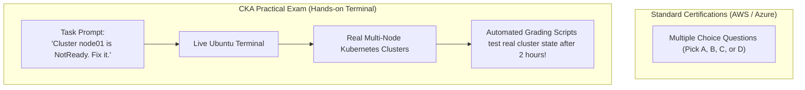
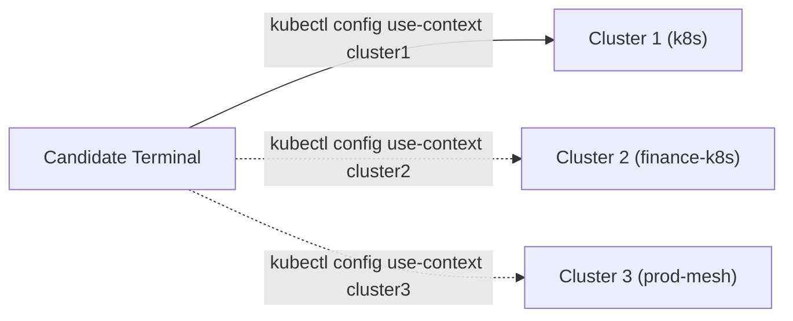

# CKA Exam Format, Rules, & Environment — Novice-Friendly Study Guide

> **Official Curriculum Reference:** Domain: *Exam Execution & Remote Desktop Rules*  
> **Official Documentation Links:**  
> - [Linux Foundation Certification Candidate Handbook](https://docs.linuxfoundation.org/tc-docs/certification/lf-handbook2)  
> - [Important Instructions: CKA and CKAD](https://docs.linuxfoundation.org/tc-docs/certification/tips-cka-and-ckad)  
> - [Frequently Asked Questions: CKA Exam](https://docs.linuxfoundation.org/tc-docs/certification/faq-cka-ckad-cks)

---

## 1. Explain Like I'm a Novice: The DMV Driving Test Analogy

Most IT certification tests (like CompTIA, AWS Solutions Architect, or Azure Fundamentals) are **written multiple-choice tests**:
- You sit in a chair, read 65 questions, eliminate ridiculous answers, and guess between A, B, C, or D.
- You can theoretically memorize answers from flashcards and pass without ever touching a real server.

**The CKA is completely different. It is like the practical DMV in-car driving test:**
- The proctor sits beside you, hands you the keys to 6 live Kubernetes clusters, and gives you tasks:  
  *"Parallel park this application between those two servers, upgrade the control tower engine without crashing the planes, and fix this broken worker node that won't start."*
- There are no multiple-choice options. You are given a blank command-line terminal.
- Either your commands work and the cluster functions, or it doesn't.



---

## 2. Key Exam Metadata & Passing Rules

- **Exam Duration:** 120 minutes (2 hours).
- **Number of Tasks:** 15 to 17 practical tasks.
- **Passing Score:** **66%** (You do not need a perfect 100%! You can completely skip 2 difficult questions and still pass easily).
- **Free Retake:** Every registration purchased from the Linux Foundation includes **one free retake attempt** if you do not pass on your first try.
- **Simulator Included:** Includes **2 free 36-hour sessions** on the official Killer.sh exam simulator.

---

## 3. The PSI Remote Desktop Environment

The exam is proctored through the **PSI Secure Browser**, which streams a remote virtual Ubuntu Linux desktop (XFCE) into your web browser:

1. **The Terminal:** A standard XFCE terminal window. You can open multiple tabs and split windows.
2. **The Internal Browser:** A built-in Firefox web browser running *inside* the remote desktop.
3. **Single Documentation Tab Rule:**  
   You are allowed to open **one single browser tab** inside the internal Firefox browser to consult official documentation:
   - `https://kubernetes.io/docs/`
   - `https://kubernetes.io/blog/`
   - `https://github.com/kubernetes/`
   - `https://gateway-api.sigs.k8s.io/` (Crucial for modern Gateway API tasks!)
4. **Copying & Pasting:**  
   - Inside the remote terminal: use standard `Ctrl+Shift+C` and `Ctrl+Shift+V` or right-click context menus.
   - Text copied from the documentation can be pasted directly into your terminal.

---

## 4. The Golden Rule of CKA: Context Switching

The exam environment does **not** consist of just one cluster. It typically connects to **4 to 6 different clusters** (e.g. `k8s`, `cluster2`, `prod-cluster`).



### The Firefighter Analogy:
Imagine you are a firefighter covering 5 different cities:
- A 911 call comes in from **Springfield**.
- If you accidentally drive your fire engine to **Shelbyville** and spray water on an empty field:
  1. The fire in Springfield is still burning.
  2. You get **0 points** for the question!

> [!CAUTION]
> **Every single question starts with an explicit context command:**
> ```bash
> kubectl config use-context <context-name>
> ```
> **Always click the copy button and paste this context-switching command before typing any other command!** If you do the work on the wrong cluster, the automated grading script will score it 0.

---

## 5. Elevated Privileges: The SSH Rule

Certain questions (like upgrading a node or fixing a broken kubelet) require you to leave your base workstation and SSH into a remote node:

```bash
# SSH into the node:
ssh node01

# Escalate to root:
sudo -i
```

### The "Stuck in SSH" Trap:
When you finish repairing `node01`, **you must remember to type `exit`!**
```bash
exit
```
If you forget to exit and remain logged in as `root@node01`, typing your next `kubectl` command will fail because regular worker nodes do not have cluster admin credentials installed.

---

## 6. Official Domain Weights Breakdown

| Domain | Exam Weight | What It Tests in Plain English |
| :--- | :---: | :--- |
| [**Troubleshooting**](01-troubleshooting/) | **30%** | Fixing broken worker nodes, crashed API servers, failing DNS, and CrashLooping pods. |
| [**Cluster Architecture & Installation**](02-cluster-architecture-installation/) | **25%** | Upgrading clusters with `kubeadm`, backing up ETCD, setting up RBAC security badges. |
| [**Services & Networking**](03-services-and-networking/) | **20%** | Connecting pods with Services, locking doors with NetworkPolicies, routing with Ingress & Gateway API. |
| [**Workloads & Scheduling**](04-workloads-and-scheduling/) | **15%** | Rolling deployments, rollbacks, ConfigMaps, Secrets, and node scheduling rules. |
| [**Storage**](05-storage/) | **10%** | Setting up PersistentVolumes, PersistentVolumeClaims, StorageClasses, and volume mounts. |

---

## 7. Knowledge Check Flashcards

1. **Q:** What is the passing score for the Linux Foundation CKA exam?  
   **A:** 66%.
2. **Q:** What is the first command you should execute before starting any question on the exam?  
   **A:** The context-switching command provided at the top of the question (e.g. `kubectl config use-context <name>`).
3. **Q:** Why must you remember to type `exit` after troubleshooting a worker node via SSH?  
   **A:** To return to the main workstation terminal where your admin `kubectl` credentials and context are configured.
