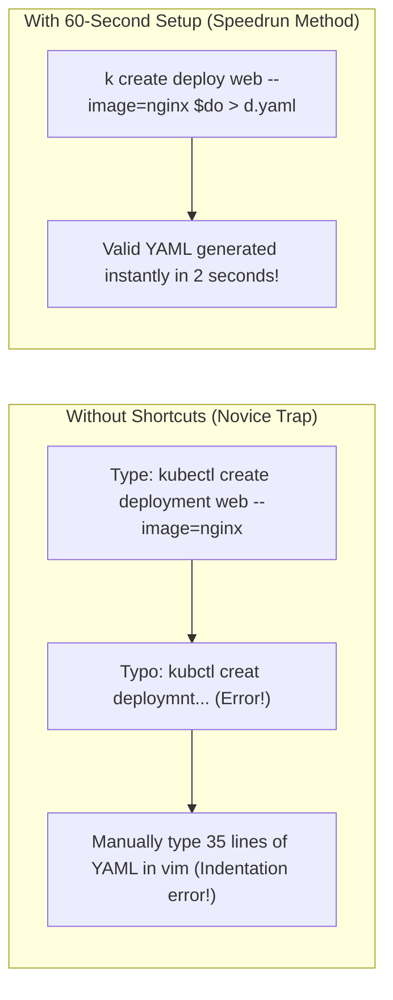

# Terminal Setup, Aliases, & Speedruns — Novice-Friendly Study Guide

> **Official Curriculum Reference:** Domain: *Exam Execution & Terminal Fluency*  
> **Official Documentation Links:**  
> - [kubectl Cheat Sheet](https://kubernetes.io/docs/reference/kubectl/quick-reference/)  
> - [kubectl Autocomplete Guide](https://kubernetes.io/docs/tasks/tools/install-kubectl-linux/#enable-shell-autocompletion)

---

## 1. Explain Like I'm a Novice: The F1 Pit Stop & Chef's Mise en Place

The CKA exam is not a multiple-choice test where you can lean back and guess between A, B, C, or D.  
It is a **120-minute live practical performance exam** with 15–17 complex engineering tasks. That gives you an average of **6 to 7 minutes per question**.

Think of your terminal setup like a **Formula 1 Pit Stop** or a **Master Chef's prep station (Mise en Place)**:
- A Formula 1 pit crew doesn't wander around looking for where they left the socket wrench while the car is idling.
- If you type the word `kubectl` 400 times during the exam, you will spend 6 minutes just typing the letters `k-u-b-e-c-t-l` and make dozens of frustrating typos.
- Spending your very first 60 seconds setting up your shell shortcuts will save you **25 to 30 minutes** of typing and debugging!



---

## 2. The 60-Second Shell Bootstrap

When the exam environment opens, paste this exact block into your terminal immediately:

```bash
# 1. Enable autocomplete and the legendary 'k' alias:
source <(kubectl completion bash)
alias k=kubectl
complete -o default -F __start_kubectl k

# 2. Dry-Run generator shortcut (The biggest time-saver on the exam!):
export do="--dry-run=client -o yaml"

# 3. Instant force delete shortcut (Don't wait 30 seconds for pods to terminate):
export now="--grace-period=0 --force"
```

### What do these variables actually do in plain English?

#### 1. `export do="--dry-run=client -o yaml"`
- When you type `k run my-pod --image=nginx $do`, you are telling Kubernetes:  
  *"Pretend you are about to create this pod, but **do not actually create it**! Instead, spit out the clean, valid YAML blueprint onto my screen."*
- You can redirect that output directly into a file:
  ```bash
  k create deploy web --image=nginx $do > deploy.yaml
  ```
  Now you have a 100% syntactically correct deployment file ready to tweak in 2 seconds, without writing YAML from scratch!

#### 2. `export now="--grace-period=0 --force"`
- Normally, when you delete a pod, Kubernetes politely knocks on the door and waits 30 seconds for the pod to wrap up its work before terminating.
- In a timed exam, waiting 30 seconds for a broken test pod to disappear is agony.
- Typing `k delete pod test-pod $now` kicks down the door and deletes the pod in 0.1 seconds!

---

## 3. Configuring Vim for YAML Sanity (`~/.vimrc`)

YAML is notoriously strict about whitespace:
- Tabs are **strictly illegal**. If you press the `Tab` key in Vim and it inserts a real tab character, `kubectl apply` will fail with parsing errors.
- Indentations must be exactly 2 spaces.

Add this configuration to your Vim settings:

```bash
cat <<EOF > ~/.vimrc
set tabstop=2
set shiftwidth=2
set expandtab
set autoindent
set number
EOF
```

### What these settings do:
- `expandtab`: Converts every press of the `Tab` key into real spaces.
- `shiftwidth=2`: Automatically indents your lines by 2 spaces.
- `number`: Shows line numbers on the left (essential when `kubectl apply` reports: `error on line 18`).

---

## 4. Lifesaving Vim Shortcuts for YAML Editing

| Keybinding | What It Does in Plain English |
| :--- | :--- |
| **`v` + Up/Down** | Enters Visual Mode to highlight multiple lines of YAML. |
| **`>` or `<`** | Indents or un-indents the highlighted block by 2 spaces. |
| **`.` (dot)** | Repeats the last action (e.g. press dot to indent 2 more spaces!). |
| **`dd`** | Deletes the current line instantly. |
| **`yy`** | Copies (yanks) the current line. |
| **`p`** | Pastes the copied line below your cursor. |
| **`u`** | Undo the last change. |
| **`Ctrl + r`** | Redo what you just undid. |
| **`:set paste`** | Prevents staircase formatting when pasting YAML snippets from the browser into Vim! |

---

## 5. Offline Help: `kubectl explain`

If you forget an exact YAML field name (e.g., *"Is it `spec.containers.env.valueFrom` or `spec.containers.env.secretKeyRef`?"*), **do not waste time opening the browser tab!**

Use `kubectl explain` right in your terminal:

```bash
# Look up the fields for SecurityContext:
k explain pod.spec.containers.securityContext

# Recursively print all child fields and their types:
k explain pod.spec.affinity.nodeAffinity --recursive

# Look up HTTPRoute rules in the Gateway API:
k explain httproute.spec.rules
```

---

## 6. Rookie Traps & Exam Gotchas

> [!CAUTION]
> 1. **Pasting Tabs from the Browser:** If you copy a YAML snippet from `kubernetes.io` and paste it into Vim without `:set paste`, Vim might compound indents and ruin the formatting. Always type `:set paste` before pasting code.
> 2. **Never Type YAML From Scratch:** If an exam question asks for a CronJob, run `kubectl create cronjob my-job --schedule="0 0 * * *" --image=busybox $do > cron.yaml`, and edit it. Never write 25 lines from memory.

---

## 7. Knowledge Check Flashcards

1. **Q:** What does `--dry-run=client -o yaml` do when appended to a `kubectl create` command?  
   **A:** It prints the generated declarative YAML manifest to stdout without creating the resource on the cluster.
2. **Q:** What command allows you to delete a stuck or terminating pod immediately without waiting 30 seconds?  
   **A:** `kubectl delete pod <pod-name> --grace-period=0 --force`.
3. **Q:** How can you look up the YAML specification and field descriptions for any Kubernetes resource directly from the CLI?  
   **A:** Using `kubectl explain <resource.path>` (e.g. `kubectl explain pod.spec.containers`).
