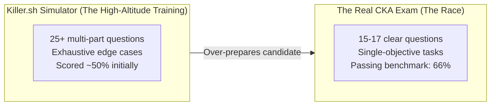
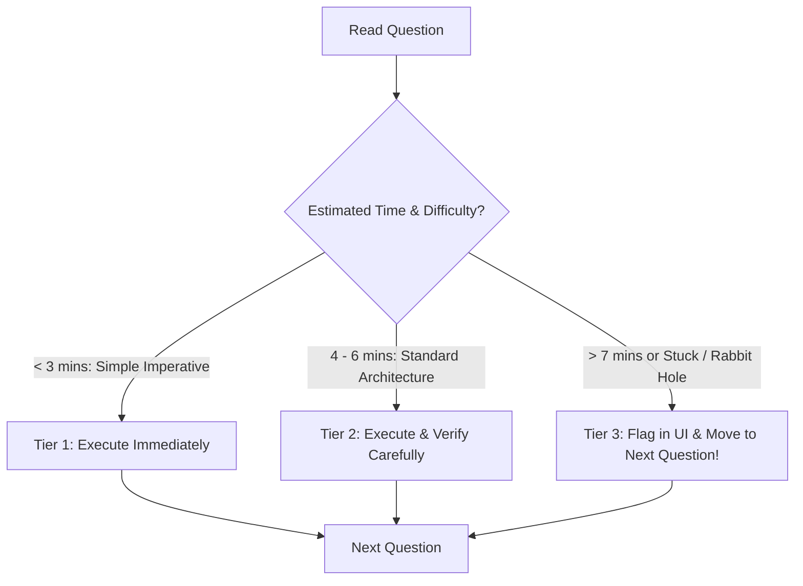

# Killer.sh & Simulation Strategy — Novice-Friendly Study Guide

> **Official Curriculum Reference:** Domain: *Exam Preparation & Time Management*  
> **Official Documentation Links:**  
> - [Killer.sh Official CKA Simulator](https://killer.sh)  
> - [Linux Foundation Certification Candidate Handbook](https://docs.linuxfoundation.org/tc-docs/certification/lf-handbook2)

---

## 1. Explain Like I'm a Novice: The Weighted Vest Analogy

When athletes train for the Olympics, they often run with **heavy weighted vests** or train at **high altitudes**:
- During practice, everything feels twice as hard and exhausting.
- But when race day arrives and they take off the vest, they feel light, fast, and unstoppable!

**Killer.sh** is your Kubernetes weighted vest:
- Every registration for the official Linux Foundation CKA exam includes **2 free test sessions on Killer.sh**.
- **The Reality Check:** Killer.sh is intentionally designed to be **significantly harder, more complex, and longer** than the real CKA exam!
- On your first attempt, getting a score of **45% to 55% is completely normal**. Novices often panic and think they are doomed to fail. Do not panic! Killer.sh throws extreme multi-part edge cases at you to over-prepare you. If you can score 80%+ on your second attempt, you will easily pass the real CKA exam.



---

## 2. The 3-Tier Exam Triage Strategy

In a 120-minute performance exam, poor time management is the #1 reason candidates fail.

Do not answer questions in strict numerical order if question #3 is a nightmare that drains 20 minutes of your life! Use the **3-Tier Triage Strategy**:



### Tier 1: Quick-Wins (1–3 minutes each)
- Creating a simple Pod, Deployment, or Service imperatively.
- Creating a ConfigMap or Secret from literals.
- Creating a ServiceAccount and RoleBinding.
- Generating a Job or scaling a deployment.
- *Action:* **Do these immediately.** Securing these points early builds calm confidence and puts points on the board.

### Tier 2: Standard Architecture Tasks (4–6 minutes each)
- Performing a node upgrade (`kubeadm upgrade`).
- Taking or restoring an ETCD snapshot backup.
- Defining a PersistentVolume and PersistentVolumeClaim.
- Creating a NetworkPolicy or Gateway API `HTTPRoute`.
- *Action:* Execute with focus, verify end-to-end, move forward.

### Tier 3: The Rabbit Holes (Flag and Skip!)
- Obscure control plane troubleshooting where the API server won't start and the logs are confusing.
- Complex multi-cluster networking where curl times out and you have no idea why.
- *Action:* **Spend at most 2 minutes diagnosing.** If the solution is not immediately obvious, **click "Flag Question" in the exam UI** and proceed to the next question. Do not let a 4% question rob you of 20 minutes when three easy 7% questions are waiting at the end of the exam!

---

## 3. The 30-Second Post-Question Verification Ritual

Before clicking "Next" on any question, perform this rapid 4-step checklist:

1. **Verify the Namespace:**  
   Did the task ask you to create the pod in namespace `accounting`, but you accidentally created it in `default`?
   ```bash
   kubectl get all -n accounting
   ```
2. **Verify Pod Health:**  
   Is your pod in `Running` or `Completed` state? (Make sure it's not bouncing in `CrashLoopBackOff` or `Error`).
3. **Verify Endpoints:**  
   If you created a Service, did it bind to real pods?
   ```bash
   kubectl get endpoints <service-name>
   ```
   If it shows `<none>`, your selector has a typo!
4. **Did You Exit SSH Sessions?**  
   If you SSH'd into `node01` to fix kubelet, **type `exit`** to return to your workstation.

---

## 4. How to Maximize Your 2 Killer.sh Sessions

Each of your two Killer.sh sessions gives you access to a live cluster for **36 hours**:

### Session 1 (Take 7 to 10 days before your real exam):
1. **The First 2 Hours:** Sit down, set a timer for 120 minutes, and attempt all questions without looking at the solutions.
2. **The Next 34 Hours:** Click "Stop Exam" to trigger automated grading. Go through **every single question**, read the detailed explanations, inspect the alternative solutions, and rebuild the broken components in the live environment.

### Session 2 (Take 2 to 3 days before your real exam):
1. Reset the simulator.
2. Attempt to complete the entire exam with a target score of **80%+ in under 90 minutes**.

---

## 5. Knowledge Check Flashcards

1. **Q:** What is the passing score on the official Linux Foundation CKA exam?  
   **A:** 66%.
2. **Q:** Why is scoring 50% on your first Killer.sh session not a reason to panic?  
   **A:** Killer.sh is intentionally designed to be significantly harder and longer than the real exam to over-prepare candidates.
3. **Q:** What should you do if you encounter a confusing troubleshooting task that you cannot solve within 3 minutes?  
   **A:** Flag the question in the exam UI and immediately move to the next question, returning to it only after completing all simpler tasks.
