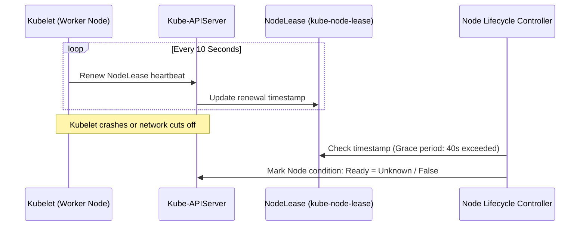
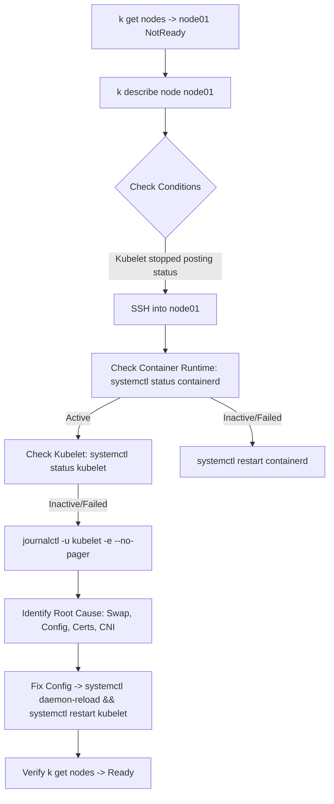

# Node and Kubelet Troubleshooting — Study Guide

> **Official Curriculum Reference:** Domain: *Troubleshooting (30%)*  
> **Relevant Official Documentation:**  
> - [Troubleshoot Clusters & Nodes](https://kubernetes.io/docs/tasks/debug/debug-cluster/)  
> - [Configuring a cgroup driver](https://kubernetes.io/docs/tasks/administer-cluster/kubelet-cgroup-driver/)  
> - [Node Status and Heartbeats](https://kubernetes.io/docs/concepts/architecture/nodes/#heartbeats)  
> - [crictl CLI for Container Runtime](https://kubernetes.io/docs/tasks/debug/debug-cluster/crictl/)

---

## 1. Explain Like I'm a Novice: The Job Site Foreman Analogy

Imagine a construction company managing jobs across multiple remote work sites:
- Each physical building site is a **Worker Node**.
- On every site, there is a dedicated **Site Foreman** whose job is to watch the blueprints, inspect the workers, and report back to the company headquarters. In Kubernetes, that foreman is the **`kubelet`**.
- The heavy equipment (cranes and forklifts) that physically moves shipping containers around is the container runtime (**`containerd`**).
- Every 10 seconds, the foreman picks up a radio and checks in with headquarters: *"Site #2 is operational and on schedule!"* (This radio check-in is the **`NodeLease`** heartbeat).

### What happens when a node shows `NotReady`?
When you see `node02 NotReady` in `kubectl get nodes`, it simply means **headquarters has stopped hearing from the foreman**:
1. Did the foreman pass out? (`kubelet` service crashed or stopped).
2. Did the heavy machinery break down? (`containerd` runtime failed).
3. Did the radio wire get cut? (Network connectivity to the control plane failed).
4. Did someone violate safety regulations? (Linux swap was turned on, causing kubelet to shut itself down in protest).

Your job as an administrator is to SSH into the physical job site and get the foreman back on the radio!

---

## 2. Under the Hood: Node Lifecycle & NodeLeases



---

## 2. Initial Assessment Flowchart



---

## 3. Step-by-Step Diagnostic Protocol

### Step 1: Inspect the Node Condition from the Workstation
```bash
# Check node status
kubectl get nodes -o wide

# Check conditions in the describe output
kubectl describe node <node-name>
```
Look at the **Conditions** block:
```text
Conditions:
  Type             Status  Reason                       Message
  ----             ------  ------                       -------
  MemoryPressure   False   KubeletHasSufficientMemory   kubelet has sufficient memory available
  DiskPressure     False   KubeletHasNoDiskPressure     kubelet has no disk pressure
  PIDPressure      False   KubeletHasSufficientPID      kubelet has sufficient PID available
  Ready            False   KubeletNotReady              runtime network not ready: NetworkReady=false
```

### Step 2: SSH into the Target Node
```bash
ssh <node-name>
sudo -i   # Switch to root
```

### Step 3: Check Container Runtime Status
Kubernetes relies on the CRI runtime (typically `containerd`). If containerd is dead, kubelet cannot run containers.
```bash
systemctl status containerd
# If down:
systemctl restart containerd
systemctl enable containerd
```

### Step 4: Check Kubelet Service Status
```bash
systemctl status kubelet
```
If kubelet is `inactive (dead)` or `activating (auto-restart)`:
```bash
# View recent systemd journal logs
journalctl -u kubelet -e --no-pager -n 50
```

---

## 4. Common Kubelet Failure Modes and Fixes

### Issue A: Swap is Enabled
By default, kubelet fails to start if Linux swap space is active.
- **Error in logs:**
  ```text
  "command failed" err="failed to run Kubelet: running with swap on is not supported, please disable swap!"
  ```
- **Fix:**
  ```bash
  # Disable swap immediately
  swapoff -a
  
  # Ensure swap is disabled across reboots
  sed -i '/swap/d' /etc/fstab
  
  systemctl restart kubelet
  ```

### Issue B: Kubelet Configuration Typos or Invalid Paths
Kubelet reads its configuration from `/var/lib/kubelet/config.yaml` and systemd drop-ins from `/etc/systemd/system/kubelet.service.d/10-kubeadm.conf`.
- **Error in logs:**
  ```text
  failed to load kubelet config file, error: open /var/lib/kubelet/config.yaml: no such file or directory
  ```
- **Fix:**
  Inspect `/var/lib/kubelet/config.yaml` for:
  - Wrong indentation or invalid keys.
  - Invalid `clusterDNS` IP (must match CoreDNS service IP, e.g. `10.96.0.10`).
  - Wrong `cgroupDriver` (must match containerd, usually `systemd`).

### Issue C: Invalid or Expired Client Certificates
Kubelet uses client certs in `/var/lib/kubelet/pki/` to talk to the kube-apiserver.
- Check cert validity:
  ```bash
  openssl x509 -in /var/lib/kubelet/pki/kubelet-client-current.pem -text -noout | grep -A 2 "Validity"
  ```
- Ensure `/etc/kubernetes/kubelet.conf` points to valid certs and the correct API server endpoint (`server: https://<apiserver-ip>:6443`).

### Issue D: Misconfigured CNI Network Plugin
If the node shows `NotReady` with reason `NetworkPluginNotReady` or `runtime network not ready: NetworkReady=false`:
- Inspect `/etc/cni/net.d/`:
  ```bash
  ls -la /etc/cni/net.d/
  ```
  If directory is completely empty, the CNI (e.g. Flannel, Calico, Cilium) is either not installed or its daemonset pod is failing on this node.
- Check CNI pods on the control plane:
  ```bash
  kubectl get pods -n kube-system -o wide
  ```

---

## 5. Using `crictl` for Low-Level Node Diagnostics

`crictl` interacts directly with the CRI container runtime without talking through kubelet or the API server. This is essential when kubelet is unresponsive.

### Setting up crictl endpoint (if not configured):
```bash
cat <<EOF > /etc/crictl.yaml
runtime-endpoint: unix:///run/containerd/containerd.sock
image-endpoint: unix:///run/containerd/containerd.sock
timeout: 10
debug: false
EOF
```

### Essential `crictl` Commands:
```bash
# List all running pod sandboxes on this node
crictl pods

# List all containers (including exited/crashed ones)
crictl ps -a

# View logs of a specific container directly from containerd
crictl logs <container-id>

# Inspect container details (exit code, mounts, environment)
crictl inspect <container-id>

# List container images present on this node
crictl images
```

---

## 6. Exam Traps & Gotchas

> [!CAUTION]
> 1. **Forgetting to reload systemd:** If you modify `/etc/systemd/system/kubelet.service.d/10-kubeadm.conf`, running `systemctl restart kubelet` is **NOT enough**. You must run `systemctl daemon-reload` first, otherwise systemd executes the old unit definition.
> 2. **Trapped in SSH:** Remember to type `exit` after repairing a worker node. If you remain logged into the worker node, `kubectl` commands will fail because standard worker nodes do not host admin kubeconfig credentials.
> 3. **Cgroup Driver Conflict:** Ensure both containerd (`/etc/containerd/config.toml`) and kubelet (`/var/lib/kubelet/config.yaml`) use `systemd` as their cgroup driver. Mixing `cgroupfs` and `systemd` causes kubelet to crash loop on startup.

---

## 7. Knowledge Check & Flashcards

1. **Q:** Where does kubelet store its primary configuration file in a cluster initialized with kubeadm?  
   **A:** `/var/lib/kubelet/config.yaml`.
2. **Q:** What tool can inspect running containers on a node when kubelet has failed?  
   **A:** `crictl` (using socket `/run/containerd/containerd.sock`).
3. **Q:** What Linux command immediately turns off swap without a reboot?  
   **A:** `swapoff -a`.
4. **Q:** Why do worker nodes need `net.ipv4.ip_forward = 1` set in sysctl?  
   **A:** To allow the Linux kernel to route packets across network interfaces and pod subnets without dropping them.
