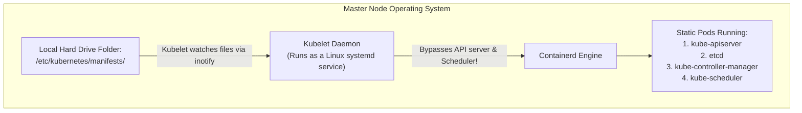

# Control Plane Troubleshooting & Static Pods — Novice-Friendly Study Guide

> **Official Curriculum Reference:** Domain: *Troubleshooting (30%)*  
> **Official Documentation Links:**  
> - [Troubleshooting kubeadm](https://kubernetes.io/docs/setup/production-environment/tools/kubeadm/troubleshooting-kubeadm/)  
> - [Static Pods Overview](https://kubernetes.io/docs/tasks/configure-pod-container/static-pod/)  
> - [Certificate Management with kubeadm](https://kubernetes.io/docs/tasks/administer-cluster/kubeadm/kubeadm-certs/)  
> - [Operating etcd clusters for Kubernetes](https://kubernetes.io/docs/tasks/administer-cluster/configure-upgrade-etcd/)

---

## 1. Explain Like I'm a Novice: The Chicken-and-Egg Problem

In Kubernetes, standard application pods need the **`kube-scheduler`** to inspect the cluster and assign them to a worker node.

But this raises a classic computer science riddle:
> **Who schedules the Scheduler and the API Server when the cluster is booting up?**  
> If the Scheduler is needed to launch pods, but the Scheduler itself runs inside a pod, how does the cluster ever start?

Kubernetes solves this with **`Static Pods`**.



### How Static Pods Work in Plain English:
1. When you turn on a master node, the Linux operating system starts the **`kubelet`** service via systemd.
2. The `kubelet` looks into a special directory on the hard drive: **`/etc/kubernetes/manifests/`**.
3. It does **not** ask any API server or Scheduler for permission. If it sees `kube-apiserver.yaml` or `etcd.yaml` sitting in that folder, it immediately commands `containerd` to start those containers!
4. If you edit a file inside `/etc/kubernetes/manifests/`, `kubelet` automatically detects the change within seconds and restarts the container.
5. If you delete the file from that folder, `kubelet` terminates the container.

---

## 2. The Nightmare Scenario: "Connection Refused on Port 6443"

You sit down at your exam terminal, run `kubectl get nodes`, and get this terrifying error:
```text
The connection to the server 192.168.1.10:6443 was refused - did you specify the right host or port?
```

### Why this happens to novices:
- Port `6443` is the front door of the **`kube-apiserver`**.
- This error means the front door is slammed shut. The API server has crashed, died, or failed to start.
- **The Catch:** You **cannot** use `kubectl` to fix this! `kubectl` relies on the API server. If the API server is dead, `kubectl` is totally blind.

You must become a low-level Linux detective:

```mermaid
flowchart TD
    A[kubectl fails: Connection Refused :6443] --> B[1. SSH into the master node: ssh controlplane]
    B --> C[2. Check if host kubelet is alive: systemctl status kubelet]
    C -->|Kubelet Dead| D[Restart kubelet: systemctl restart kubelet]
    C -->|Kubelet Alive| E[3. Use crictl to inspect static containers]
    E --> F[crictl ps -a | grep kube-apiserver]
    F -->|Container Crashlooping/Exited| G[4. Read crash logs: crictl logs container-id]
    G --> H[5. Fix YAML typo in /etc/kubernetes/manifests/kube-apiserver.yaml]
    H --> I[6. Kubelet auto-restarts the container]
    I --> J[7. Verify kubectl get nodes from workstation]
```

---

## 3. How to Read Logs Without `kubectl`

When `kubectl logs` doesn't work, use the container runtime CLI directly (**`crictl`**):

```bash
# 1. List all containers (including exited/crashed ones):
crictl ps -a

# 2. Find the crashed API server container:
crictl ps -a --name kube-apiserver

# 3. Read the crash logs directly from the runtime:
crictl logs <container-id>
```

### Alternative: Read directly from the Linux filesystem:
Kubelet writes raw container logs directly to the node's hard drive:
```bash
tail -n 60 /var/log/pods/kube-system_kube-apiserver*/*/*.log
```

---

## 4. The 3 Most Common Exam Sabotage Traps

In CKA troubleshooting scenarios, questions often present a cluster that was intentionally broken by a previous "junior admin". Look for these three traps:

### Trap 1: Typo in the Command Flags
Open `/etc/kubernetes/manifests/kube-apiserver.yaml`:
```yaml
spec:
  containers:
  - command:
    - kube-apiserver
    # SABOTAGE EXAMPLE: Typo in flag name
    - --etcd-servers=https://127.0.0.1:2379     # Correct
    # - --etcd-server=https://127.0.0.1:2379   # BROKEN: Missing trailing 's'!
```
If an unrecognized flag is passed, the container crashes instantly on startup.

### Trap 2: Typo in Certificate Paths
The API server requires cryptographic certificates to start:
```yaml
    - --client-ca-file=/etc/kubernetes/pki/ca.crt
```
If someone changed this to `/etc/kubernetes/pki/ca.crt.broken` or `/tmp/ca.crt`, the API server will fail to start because the file does not exist. Check with `ls -la` on the host to verify every certificate file exists!

### Trap 3: Accidentally Moved Manifest
If the manifest file was moved or renamed to `/etc/kubernetes/manifests.bak/`, `kubelet` assumes you wanted to delete the container and shuts it down!
- Verify the static pod path:
  ```bash
  grep -i staticpod /var/lib/kubelet/config.yaml
  # Default: staticPodPath: /etc/kubernetes/manifests
  ```

---

## 5. Checking for Expired Certificates

Certificates generated by `kubeadm` expire every 12 months. If your cluster suddenly stops working after a year, check certificate validity:

```bash
# Check expiration dates across all cluster certs:
kubeadm certs check-expiration
```

### How to Renew Expired Certificates in 1 Minute:
```bash
# 1. Renew all certificates:
kubeadm certs renew all

# 2. Restart kubelet to reload the static pods:
systemctl restart kubelet

# 3. Update your admin credentials:
cp -i /etc/kubernetes/admin.conf $HOME/.kube/config
```

---

## 6. Rookie Traps & Exam Gotchas

> [!CAUTION]
> 1. **`kubectl delete pod` Does NOT Kill Static Pods:** If you run `kubectl delete pod kube-apiserver-controlplane -n kube-system`, you are only deleting a temporary "mirror pod". Kubelet will recreate it 2 seconds later. To truly delete or stop a static pod, you must remove its YAML file from `/etc/kubernetes/manifests/`.
> 2. **YAML Formatting is Crucial:** Static pod manifests are YAML. If you introduce a tab character or bad indentation while editing `/etc/kubernetes/manifests/kube-apiserver.yaml`, kubelet will fail to parse the file and refuse to start the container.
> 3. **Always Return to the Workstation:** When troubleshooting is complete, type `exit` to return from the control plane node to the exam workstation.

---

## 7. Knowledge Check Flashcards

1. **Q:** Why do core control plane components (API server, Scheduler, ETCD) run as Static Pods?  
   **A:** To solve the bootstrap dependency loop: static pods are launched directly by the host `kubelet` without requiring a running API server or Scheduler.
2. **Q:** If `kubectl` commands fail with "Connection Refused :6443", what low-level tool allows you to inspect containers directly?  
   **A:** `crictl` (e.g. `crictl ps -a` and `crictl logs`).
3. **Q:** What single command renews all Kubernetes control plane certificates created by `kubeadm`?  
   **A:** `kubeadm certs renew all`.
