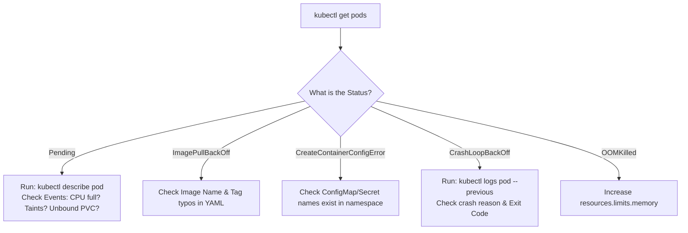

# Application and Container Debugging — Novice-Friendly Study Guide

> **Official Curriculum Reference:** Domain: *Troubleshooting (30%)*  
> **Official Documentation Links:**  
> - [Debug Pods and ReplicationControllers](https://kubernetes.io/docs/tasks/debug/debug-application/debug-pods/)  
> - [Determine the Reason for Pod Failure](https://kubernetes.io/docs/tasks/debug/debug-application/determine-reason-pod-failure/)  
> - [Debugging with Ephemeral Containers](https://kubernetes.io/docs/tasks/debug/debug-application/debug-running-pod/#ephemeral-container)

---

## 1. Explain Like I'm a Novice: Decoding Pod Status Strings

In simple Docker, a container is usually just "Running" or "Stopped".  
In Kubernetes, you will encounter a dozen strange-sounding status strings. Here is what they mean in plain English:

| Status String | Plain English Translation | Real-World Analogy |
| :--- | :--- | :--- |
| **`Pending`** | "I haven't even started yet because the scheduler can't find a suitable server." | A new hire waiting in the lobby because all office desks are fully occupied. |
| **`ContainerCreating`** | "I found a server, and now I'm downloading the container image." | The moving van is driving the employee's desk to the office. |
| **`ImagePullBackOff`** | "I can't download the container image (bad name, wrong tag, or private repo)." | The delivery driver went to the warehouse with an invalid package barcode. |
| **`CreateContainerConfigError`** | "I cannot start because a Secret or ConfigMap you referenced doesn't exist!" | The worker sits at their desk, reaches for their tools, but the drawer is empty. |
| **`CrashLoopBackOff`** | "The container starts, immediately crashes or exits, and Kubernetes is backing off before trying again." | A toaster that pops, catches fire, trips the breaker, resets, and catches fire again! |
| **`OOMKilled`** | "The container exceeded its allocated memory limit and was executed by Linux." | An employee who ate so much office bandwidth/food that building security kicked them out! |



---

## 2. Linux Exit Codes: The Crime Scene Investigation

When a container dies, Linux leaves behind a numerical **Exit Code**. Inspect it using:
```bash
kubectl describe pod <pod-name> | grep -A 8 "Last State:"
```

### The 5 Most Important Exit Codes on the Exam:

1. **`Exit Code 0` (Success / Finished):**  
   *What happened:* The program executed and cleanly finished.  
   *The Trap:* If you run a pod with `image: busybox` without a background loop, busybox starts, sees nothing to do, exits with code 0, and Kubernetes assumes it died and tries to restart it forever!  
   *Fix:* Give it a long-running command: `["sh", "-c", "sleep 3600"]`.
2. **`Exit Code 1` (Application Crash):**  
   *What happened:* General application error (e.g. unhandled Python/Node.js exception, broken database connection).  
   *Fix:* Check application logs with `kubectl logs <pod>`.
3. **`Exit Code 127` (Command Not Found):**  
   *What happened:* You told the container to execute a binary that doesn't exist in the image (e.g. typing `python app.py` in an image that only has Node.js).
4. **`Exit Code 137` (SIGKILL / OOMKilled):**  
   *What happened:* The process was murdered by the Linux kernel with signal 9 ($128 + 9 = 137$). The container exceeded its memory limit!  
   *Fix:* Increase `resources.limits.memory` in the pod spec.
5. **`Exit Code 143` (SIGTERM):**  
   *What happened:* The container was politely asked to terminate ($128 + 15 = 143$) because of a deployment rollout or pod deletion.

---

## 3. The Golden Rule of CrashLoop Logs: The `--previous` Flag

Novices frequently get stuck here:
1. You see a pod in `CrashLoopBackOff`.
2. You type `kubectl logs my-crashed-pod`.
3. The screen returns **completely blank**!

**Why?**  
Because the container crashed 10 seconds ago, Kubernetes restarted it 1 second ago, and the *new* container instance hasn't logged anything yet!

> [!TIP]
> **Always append `--previous`:**
> ```bash
> kubectl logs my-crashed-pod --previous
> ```
> This tells Kubernetes: *"Do not show me the current blank container. Show me the black-box flight recorder logs from the container instance that actually died!"*

---

## 4. Multi-Container Pods & InitContainers

### Multi-Container Pods:
If a Pod has 2 containers, `kubectl logs <pod>` will error out asking which container you want:
```bash
kubectl logs my-pod -c <container-name> --previous
```

### InitContainers (The Setup Crew):
`initContainers` are helper containers that run **before** your main application starts (e.g. waiting for a database to become reachable or downloading assets):
```bash
# If a pod shows status 'Init:0/1' or 'Init:CrashLoopBackOff':
kubectl logs my-pod -c <init-container-name>
```
If an `initContainer` fails, your main application container will **never** even attempt to start!

---

## 5. Ephemeral Debug Containers (`kubectl debug`)

What if your container image is minimal (like a "distroless" image without `curl`, `bash`, or `netstat`)? How do you troubleshoot inside it?

Use **`kubectl debug`** to attach an interactive diagnostic toolbox:
```bash
kubectl debug -it <broken-pod> \
  --image=busybox:1.28 \
  --target=<broken-container-name>
```
With `--target`, your debug container shares the process namespace of the target container, allowing you to run `ps aux` and inspect its processes!

---

## 6. Rookie Traps & Exam Gotchas

> [!CAUTION]
> 1. **Not Checking `Events` in `describe`:** When a pod fails, don't guess! Run `kubectl describe pod <name>` and look at the bottom 10 lines under `Events:`. It will tell you in plain English: *"Failed to pull image"*, *"Insufficient memory"*, or *"Secret not found"*.
> 2. **Forgetting to check the namespace:** If `kubectl logs web-app` says `Error from server (NotFound)`, you forgot to pass the namespace: `kubectl logs web-app -n production`.
> 3. **Container Name in Pod with 1 Container:** If a pod has only 1 container, you don't need `-c`. But if it has sidecars, you must specify `-c`.

---

## 7. Knowledge Check Flashcards

1. **Q:** What does `Exit Code 137` indicate when inspecting a crashed container?  
   **A:** The container was killed by `SIGKILL`, most commonly because it exceeded its memory limit (`OOMKilled`).
2. **Q:** Why does `kubectl logs <pod>` sometimes show no output for a pod in `CrashLoopBackOff`?  
   **A:** The container just restarted and the new instance hasn't logged anything yet; use `kubectl logs <pod> --previous`.
3. **Q:** If a pod's status displays `Init:CrashLoopBackOff`, what part of the pod is failing?  
   **A:** One of its `initContainers` is failing or exiting with a non-zero code.
