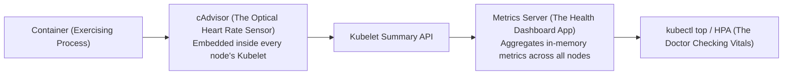

# Cluster Resource Monitoring & Top Commands — Novice-Friendly Study Guide

> **Official Curriculum Reference:** Domain: *Troubleshooting (30%)*  
> **Official Documentation Links:**  
> - [Resource Metrics Pipeline](https://kubernetes.io/docs/tasks/debug/debug-cluster/resource-metrics-pipeline/)  
> - [Configure Quality of Service for Pods](https://kubernetes.io/docs/tasks/configure-pod-container/quality-service-pod/)  
> - [Tools for Monitoring Resources](https://kubernetes.io/docs/tasks/debug/debug-cluster/resource-usage-monitoring/)

---

## 1. Explain Like I'm a Novice: The Smartwatch & Lifeboat Analogy

Monitoring resources in Kubernetes can feel abstract, but it works just like a modern wearable fitness tracker:



1. **`cAdvisor` (The Sensor on Your Wrist):** Embedded directly inside the `kubelet` on every node. It monitors raw CPU cycles and memory bytes consumed by every container.
2. **`Metrics Server` (The Smartphone App):** A lightweight pod that polls all the node sensors every 60 seconds and stores recent vitals in memory.
3. **`kubectl top` (The Vitals Check):** Queries the Metrics Server to tell you who the biggest CPU and RAM hogs are.

---

## 2. QoS Classes: Who Gets Thrown Off the Lifeboat First?

When a physical server runs out of memory, the Linux kernel must kill processes to prevent the whole computer from crashing.

How does Kubernetes decide **which pod to murder first**?  
It assigns every pod a **Quality of Service (QoS) Class** based on its requests and limits:

| QoS Class | What You Specified in YAML | Lifeboat Analogy | Eviction Priority |
| :--- | :--- | :--- | :--- |
| **`BestEffort`** | **No requests and no limits.** You gave Kubernetes zero information. | **The Stowaway:** You snuck onto the ship without a ticket. | **Killed First!** As soon as memory gets tight, BestEffort pods are thrown overboard. |
| **`Burstable`** | Requests are lower than limits (e.g. request 100m, limit 500m). | **Economy Class:** You bought a standard seat, but you might stretch your legs into the aisle. | **Killed Second.** Evicted once all BestEffort pods are gone. |
| **`Guaranteed`** | **Requests are 100% equal to limits** for both CPU and Memory. | **First-Class VIP:** You bought a guaranteed private cabin with a dedicated life vest. | **Killed Last!** Kubernetes will only kill a Guaranteed pod if no other option exists. |

```bash
# Check a pod's QoS class:
kubectl get pod my-app -o jsonpath='{.status.qosClass}'
```

---

## 3. Fast Resource Inspection with `kubectl top`

The exam frequently asks you to find the highest resource consumer and save its name into a file.

### Node Inspection:
```bash
# View usage across all nodes:
kubectl top nodes

# Sort nodes by CPU usage (highest first):
kubectl top nodes --sort-by=cpu

# Sort nodes by Memory usage (highest first):
kubectl top nodes --sort-by=memory
```

### Pod Inspection:
```bash
# View pods in current namespace:
kubectl top pods

# View pods across ALL namespaces:
kubectl top pods -A

# Sort pods across the cluster by CPU:
kubectl top pods -A --sort-by=cpu

# Sort pods across the cluster by Memory:
kubectl top pods -A --sort-by=memory
```

---

## 4. The 1-Minute Exam Pattern: "Save Highest Consumer to File"

A classic CKA question pattern:  
*"Find the pod in namespace `production` using the highest memory and write only its name to `/opt/high_mem_pod.txt`."*

Never try to copy-paste with your mouse! Use this clean shell pipeline:

```bash
# Sort by memory, strip headers, take the top line, extract column 1:
kubectl top pods -n production --sort-by=memory --no-headers | head -n 1 | awk '{print $1}' > /opt/high_mem_pod.txt

# Verify the file contents:
cat /opt/high_mem_pod.txt
```

---

## 5. Rookie Traps & Exam Gotchas

> [!CAUTION]
> 1. **Do NOT Include Column Headers in Output Files:** If a question asks for a pod name in a text file, saving `NAME` as the first line will fail automated grading. Always pass `--no-headers`!
> 2. **Metrics Server Scrape Delay:** If you just launched a pod 5 seconds ago, `kubectl top pod` will output `metrics not available yet`. Wait 30–60 seconds for the first scrape cycle to complete.
> 3. **CPU Throttling vs OOMKilled:** Remember: exceeding CPU limits only causes throttling (slowness); exceeding memory limits causes immediate death (`OOMKilled`, Exit Code 137).

---

## 6. Knowledge Check Flashcards

1. **Q:** What component embedded inside `kubelet` collects raw container metrics?  
   **A:** `cAdvisor`.
2. **Q:** Which QoS class is assigned to a pod if its container defines `requests.memory: 256Mi` and `limits.memory: 256Mi`, with requests and limits equal for CPU as well?  
   **A:** `Guaranteed`.
3. **Q:** Which QoS class is evicted first when a node experiences memory pressure?  
   **A:** `BestEffort`.
