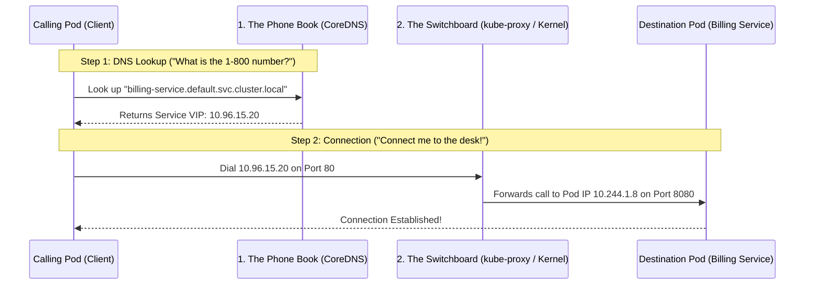

# Services & DNS Troubleshooting — Novice-Friendly Study Guide

> **Official Curriculum Reference:** Domain: *Troubleshooting (30%)*  
> **Official Documentation Links:**  
> - [Debug Service and Networking Issues](https://kubernetes.io/docs/tasks/debug/debug-application/debug-service/)  
> - [Debugging DNS Resolution](https://kubernetes.io/docs/tasks/administer-cluster/dns-debugging-resolution/)  
> - [CoreDNS for Service Discovery](https://kubernetes.io/docs/tasks/administer-cluster/coredns/)

---

## 1. Explain Like I'm a Novice: The Phone Book vs. The Switchboard

When an application pod says *"I cannot connect to `billing-service`"*, beginners often get overwhelmed because networking feels invisible.

To easily debug network issues, break every connection down into **two completely separate steps**:



### How to Diagnose Which Half is Broken in 10 Seconds:
1. **Did Step 1 (The Phone Book) fail?**  
   Run `nslookup billing-service`. If it says `Can't find host` or `connection timed out`, the problem is **CoreDNS**.
2. **Did Step 2 (The Switchboard) fail?**  
   If `nslookup` successfully gives you the IP, but `curl http://10.96.15.20:80` hangs or returns connection refused, the problem is **Service Endpoints, Selectors, or Port Mismatches**.

---

## 2. Debugging Step 1: CoreDNS Failures

CoreDNS runs as a deployment of 2 pods in the `kube-system` namespace.

### Step 1: Are the CoreDNS Pods Alive?
```bash
kubectl get pods -n kube-system -l k8s-app=kube-dns
```
If the pods show `CrashLoopBackOff`, read their logs:
```bash
kubectl logs -n kube-system -l k8s-app=kube-dns
```

### The Infinite Loop Trap (`plugin/loop: Loop ... detected`):
If the logs complain about a loop, CoreDNS has detected that `/etc/resolv.conf` on the physical node is forwarding queries back to `127.0.0.53` or the cluster DNS IP, creating an endless circle of DNS queries!
- **Fix:** Edit `/etc/resolv.conf` on the host node or update the CoreDNS ConfigMap (`kubectl edit cm coredns -n kube-system`) to forward external queries directly to a public nameserver like `8.8.8.8`.

---

## 3. Debugging Step 2: The Service Switchboard & Endpoints

If DNS works, but you cannot connect to the Service:

### The #1 Cause: The Empty Endpoints Trap (`<none>`)
Check if the Service has actually discovered any healthy pods:
```bash
kubectl get endpoints <service-name>
```
If you see:
```text
NAME             ENDPOINTS   AGE
billing-service  <none>      5m
```
This is guaranteed to be a **Label Selector Mismatch**!

### How to Fix the Selector Mismatch:
1. Print what the Service is searching for:
   ```bash
   kubectl get svc billing-service -o jsonpath='{.spec.selector}'
   # Output: {"app":"billing"}
   ```
2. Print what the Pods are actually labeled:
   ```bash
   kubectl get pods --show-labels
   # Output: app=billing-app   <-- MISMATCH!
   ```
3. Fix the typo in the Service or Pod labels so they match 100% identically!

---

## 4. The Port vs. TargetPort Trap

If endpoints *do* exist, but connections still fail:
- **`port`:** The port that the Service exposes.
- **`targetPort`:** The port that the software inside the container is listening on.

If your Node.js application listens on port `3000`, but your Service definition says `targetPort: 80`, packets will arrive at the container and be rejected with `Connection Refused`!

---

## 5. In-Cluster Diagnostic Pod (Save This Command!)

Never guess what a pod is seeing. Launch a temporary troubleshooting pod to test DNS and HTTP directly from inside the cluster network:

```bash
# Test DNS resolution with nslookup:
kubectl run dns-test --rm -it --image=busybox:1.28 --restart=Never -- nslookup <service-name>

# Test HTTP connection with curl:
kubectl run curl-test --rm -it --image=curlimages/curl --restart=Never -- curl -v http://<service-name>:<port>
```

---

## 6. Rookie Traps & Exam Gotchas

> [!CAUTION]
> 1. **Cross-Namespace Service Calls Need Full Names:** If pod `A` in namespace `dev` wants to reach service `B` in namespace `prod`, typing `curl http://service-b` will fail! You must include the namespace: `curl http://service-b.prod:80`.
> 2. **Always Use `busybox:1.28` for DNS Tests:** Newer versions of busybox have a known resolver bug inside Kubernetes. Always specify `busybox:1.28`.
> 3. **Endpoints Don't Include Unready Pods:** If your pods are failing their readiness probes, Kubernetes automatically removes them from the Service endpoints to protect users.

---

## 7. Knowledge Check Flashcards

1. **Q:** What does it mean if `kubectl get endpoints <service>` displays `<none>`?  
   **A:** The Service's label selector does not match the labels on any running, healthy pods.
2. **Q:** What is the full FQDN to connect to a service named `db` in namespace `data`?  
   **A:** `db.data.svc.cluster.local`.
3. **Q:** If a container listens on port 5000, what field in the Service manifest must be set to 5000?  
   **A:** `spec.ports[*].targetPort: 5000`.
