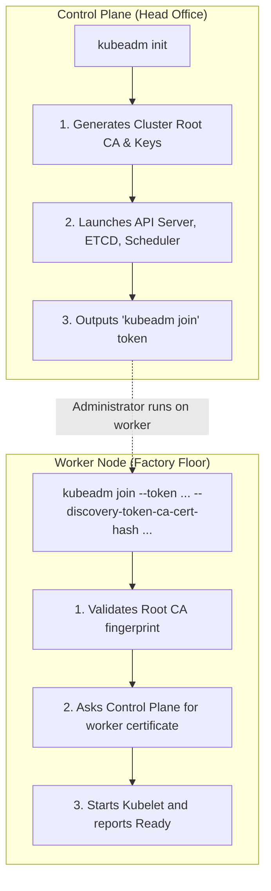

# Kubeadm Cluster Bootstrap & Node Joining — Novice-Friendly Study Guide

> **Official Curriculum Reference:** Domain: *Cluster Architecture, Installation and Configuration (25%)*  
> **Official Documentation Links:**  
> - [Creating a cluster with kubeadm](https://kubernetes.io/docs/setup/production-environment/tools/kubeadm/create-cluster-kubeadm/)  
> - [Container Runtimes: containerd](https://kubernetes.io/docs/setup/production-environment/container-runtimes/#containerd)  
> - [TLS Bootstrapping](https://kubernetes.io/docs/reference/access-authn-authz/kubelet-tls-bootstrapping/)

---

## 1. Explain Like I'm a Novice: What Is Bootstrapping a Cluster?

Imagine you are building a new corporate office from scratch:
- You need a **Head Office** where the boss, planners, and record-keepers sit. This is the **Control Plane** (or Master node).
- You need **Branch Offices / Factory Floors** where the actual workers perform tasks and build products. These are the **Worker Nodes**.
- You need a secure, encrypted phone system connecting everyone so unauthorized strangers can't walk in and issue orders. This is the **TLS Certificate Infrastructure**.

In the early days of Kubernetes, setting up a cluster required manually generating dozens of cryptographic certificates with `openssl`, downloading binary files by hand, and writing systemd configuration files from scratch (often referred to as *"Kubernetes the Hard Way"*).

**`kubeadm`** is Kubernetes' official automated setup assistant. It acts like an automated general contractor:
1. It creates all the root security certificates.
2. It spins up the control plane components inside containers.
3. It hands you a simple "invitation code" (a **join token**) that you can paste into any worker machine to securely onboard it into the cluster.



---

## 2. Preparing the Machines (Host Prerequisites)

Before `kubeadm` can do its job, the underlying Linux operating system must be prepared. Kubernetes has strict requirements for how the host operates.

### Step 1: Turn Off Linux Swap
**Why this matters to a novice:**  
In Linux, "swap" is disk space used as overflow memory when RAM is full. Disk storage is thousands of times slower than RAM. The Kubernetes scheduler carefully allocates memory down to the megabyte. If a machine quietly starts swapping memory to a slow hard drive, performance degrades unpredictably and the scheduler loses control. By default, `kubelet` refuses to start if swap is enabled!

```bash
# Temporarily turn off swap immediately
swapoff -a

# Permanently disable swap across server reboots
sed -i '/swap/d' /etc/fstab
```

### Step 2: Enable Kernel Modules (`overlay` and `br_netfilter`)
**Why this matters to a novice:**  
- `overlay`: Allows containers to use overlay filesystems (stacking container images in efficient layers).
- `br_netfilter`: Allows Linux to see and filter network packets flowing through network bridges using `iptables`.

```bash
cat <<EOF | tee /etc/modules-load.d/k8s.conf
overlay
br_netfilter
EOF

modprobe overlay
modprobe br_netfilter
```

### Step 3: Enable Packet Forwarding via Sysctl
**Why this matters to a novice:**  
By default, Linux acts as an endpoint: if a packet arrives for an IP address that doesn't belong to that machine, Linux drops it. But a Kubernetes worker node must act as a **router**, passing packets from physical cards to virtual container interfaces. We must enable IPv4 forwarding:

```bash
cat <<EOF | tee /etc/sysctl.d/k8s.conf
net.bridge.bridge-nf-call-iptables  = 1
net.bridge.bridge-nf-call-ip6tables = 1
net.ipv4.ip_forward                 = 1
EOF

# Reload sysctl without rebooting
sysctl --system
```

### Step 4: Configure the Container Runtime (`containerd`)
**Why this matters to a novice:**  
Kubernetes does not run containers directly; it delegates to a container runtime (usually `containerd`). Both Kubernetes and containerd must agree on who manages Linux control groups (cgroups). In modern Linux, the operating system uses `systemd` to manage cgroups. If containerd uses `cgroupfs` while the OS uses `systemd`, they fight over resources and crash.

```bash
mkdir -p /etc/containerd
containerd config default | tee /etc/containerd/config.toml
# Ensure SystemdCgroup is true
sed -i 's/SystemdCgroup = false/SystemdCgroup = true/' /etc/containerd/config.toml
systemctl restart containerd
systemctl enable containerd
```

---

## 3. Initializing the First Master Node (`kubeadm init`)

Run this **only once, on the control plane node**:

```bash
kubeadm init \
  --pod-network-cidr=192.168.0.0/16 \
  --apiserver-advertise-address=<controlplane-ip> \
  --cri-socket=unix:///run/containerd/containerd.sock
```

### Flag Breakdown for Beginners:
- `--pod-network-cidr`: This defines the private pool of IP addresses that will be assigned to Pods (e.g. `192.168.0.0/16`). **Important:** This range must match the CNI network plugin you install next!
- `--apiserver-advertise-address`: The specific IP of the master node that worker nodes will talk to.
- `--cri-socket`: Tells `kubeadm` where to find `containerd`'s communication socket.

---

## 4. Setting up `kubectl` Access (The Kubeconfig)

After `kubeadm init` finishes, the control plane is running, but your user account doesn't have the keys to talk to it yet.

Kubernetes creates an all-powerful admin credential file at `/etc/kubernetes/admin.conf`. We copy this into our home directory (`~/.kube/config`) so `kubectl` knows where to connect:

```bash
mkdir -p $HOME/.kube
sudo cp -i /etc/kubernetes/admin.conf $HOME/.kube/config
sudo chown $(id -u):$(id -g) $HOME/.kube/config
```

---

## 5. Installing the Plumbing (The CNI Network Plugin)

If you run `kubectl get nodes` right after `kubeadm init`, you will see:
```text
NAME           STATUS     ROLES           AGE   VERSION
controlplane   NotReady   control-plane   1m    v1.31.0
```
**Why is the node `NotReady`?**  
Kubernetes does not come with built-in pod networking. It leaves that to external plugins called **CNI (Container Network Interface)**. Until a network plugin (like Calico, Flannel, or Cilium) is installed, Pods cannot communicate with each other, CoreDNS cannot start, and the node remains in `NotReady` status.

Install Calico with a single command:
```bash
kubectl create -f https://raw.githubusercontent.com/projectcalico/calico/v3.28.0/manifests/calico.yaml
```
Within 30 seconds, `kubectl get nodes` will transition to **`Ready`**!

---

## 6. Joining Worker Nodes (`kubeadm join`)

When `kubeadm init` completes, it prints out a join command at the bottom of the screen. Run this on your worker nodes:

```bash
kubeadm join 192.168.1.10:6443 \
  --token abcdef.0123456789abcdef \
  --discovery-token-ca-cert-hash sha256:7f83b1657ff1fc53b92dc18148a1d65dfc2d4b1fa3d677284addd200126d9069
```

### What do these parts mean?
- `192.168.1.10:6443`: The IP and port of the master API server.
- `--token`: A temporary password (valid for 24 hours) proving the worker node is authorized to join.
- `--discovery-token-ca-cert-hash`: A cryptographic fingerprint of the master's Certificate Authority (CA). This ensures the worker is joining your *real* master, not an imposter.

### What if the token expired? (Common Exam Task!)
If you are asked to join a node and don't have the original command:
```bash
# Run this on the control plane to print a fresh, ready-to-run join command:
kubeadm token create --print-join-command
```

---

## 7. Rookie Traps & Exam Gotchas

> [!CAUTION]
> 1. **Running `kubeadm init` on a worker:** Only run `init` on the control plane. Running it on a worker initializes a second, independent cluster!
> 2. **Forgetting to install the CNI:** If you join a worker node and it stays `NotReady` forever, check if a CNI plugin was installed. Kubelet refuses to mark nodes ready without a network plugin.
> 3. **Firewall Blocking Port 6443:** Worker nodes must be able to communicate with the master on TCP port 6443.

---

## 8. Knowledge Check Flashcards

1. **Q:** Why does `kubelet` refuse to start if swap is enabled on Linux?  
   **A:** Because Kubernetes memory management and scheduling guarantees assume predictable RAM access without swapping to slow disks.
2. **Q:** What command on the control plane regenerates a complete, working `kubeadm join` string?  
   **A:** `kubeadm token create --print-join-command`.
3. **Q:** Why does a freshly initialized master node stay in `NotReady` status until a CNI is installed?  
   **A:** Because Kubernetes requires an external network plugin to establish pod subnets and configure DNS.
