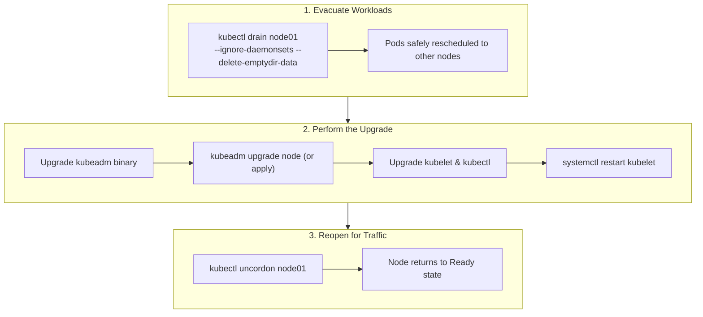

# Cluster Upgrades Lifecycle (`kubeadm`) — Novice-Friendly Study Guide

> **Official Curriculum Reference:** Domain: *Cluster Architecture, Installation and Configuration (25%)*  
> **Official Documentation Links:**  
> - [Upgrading kubeadm clusters](https://kubernetes.io/docs/tasks/administer-cluster/kubeadm/kubeadm-upgrade/)  
> - [Kubernetes Version Skew Policy](https://kubernetes.io/releases/version-skew-policy/)  
> - [Safely Drain a Node](https://kubernetes.io/docs/tasks/administer-cluster/safely-drain-node/)

---

## 1. Explain Like I'm a Novice: The Airport Runway Repaving Analogy

Upgrading a live Kubernetes cluster in production can sound terrifying:
> *"How do you upgrade the operating software of servers running live customer traffic without taking the entire website offline?"*

Think of upgrading a cluster like **repaving the runways at a busy international airport**:
1. You cannot shut down the whole airport at once, or planes will crash.
2. Instead, you upgrade **one runway (node) at a time**:
   - **Step A: Divert Flights (`drain`):** Put up a "Runway Closed" sign (`cordon`), and guide all planes already on that runway to move over to other runways (`drain`).
   - **Step B: Repave the Pavement (Upgrade):** Now that the runway is completely empty, the construction crew brings in asphalt and upgrades the hardware.
   - **Step C: Reopen the Runway (`uncordon`):** Take down the closed signs and resume landing flights!
3. Move on to the next runway and repeat.



---

## 2. The Golden Rules of Upgrades

1. **Sequential Minor Versions Only:**  
   You cannot skip minor versions! You can upgrade from `1.30` $\rightarrow$ `1.31`. You can **never** jump from `1.29` $\rightarrow$ `1.31` directly.
2. **The Worker Can Never Be Newer Than the Master:**  
   The `kube-apiserver` on the control plane is the boss. A worker node's `kubelet` can never run a higher minor version than the API server!
3. **Upgrade Order:**  
   Always upgrade the **Primary Control Plane first**, and then upgrade **Worker Nodes second**.

---

## 3. Upgrading the Control Plane Node (Step-by-Step)

Assume the exam asks you to upgrade the cluster to version `v1.31.1`.

### Step 1: Upgrade `kubeadm` on the Control Plane
```bash
apt-mark unhold kubeadm
apt-get update && apt-get install -y kubeadm=1.31.1-1.1
apt-mark hold kubeadm
```

### Step 2: Plan and Apply the Upgrade
```bash
# Check if the cluster is healthy and ready to upgrade:
kubeadm upgrade plan

# Apply the upgrade (this downloads container images and updates static pods):
kubeadm upgrade apply v1.31.1 -y
```

### Step 3: Drain the Control Plane Node
```bash
kubectl drain controlplane --ignore-daemonsets
```

### Step 4: Upgrade `kubelet` and `kubectl`
```bash
apt-mark unhold kubelet kubectl
apt-get install -y kubelet=1.31.1-1.1 kubectl=1.31.1-1.1
apt-mark hold kubelet kubectl
```

### Step 5: Restart Kubelet and Re-open the Node
```bash
systemctl daemon-reload
systemctl restart kubelet
kubectl uncordon controlplane
```

---

## 4. Upgrading Worker Nodes (Step-by-Step)

Repeat this for each worker node (`node01`, `node02`):

### Step 1: Drain the Worker Node (From the Workstation)
```bash
kubectl drain node01 --ignore-daemonsets --delete-emptydir-data --force
```

### Step 2: SSH into the Worker Node
```bash
ssh node01
sudo -i
```

### Step 3: Upgrade `kubeadm` on the Worker
```bash
apt-mark unhold kubeadm
apt-get update && apt-get install -y kubeadm=1.31.1-1.1
apt-mark hold kubeadm
```

### Step 4: Upgrade Worker Node Configuration
> [!IMPORTANT]
> On worker nodes, the command is `kubeadm upgrade node`, **NOT** `kubeadm upgrade apply`!
```bash
kubeadm upgrade node
```

### Step 5: Upgrade `kubelet` and `kubectl` on the Worker
```bash
apt-mark unhold kubelet kubectl
apt-get install -y kubelet=1.31.1-1.1 kubectl=1.31.1-1.1
apt-mark hold kubelet kubectl
```

### Step 6: Restart Kubelet and Return to Workstation
```bash
systemctl daemon-reload
systemctl restart kubelet
exit # Exit SSH back to workstation!
```

### Step 7: Uncordon the Worker Node
```bash
kubectl uncordon node01
```

---

## 5. Rookie Traps & Exam Gotchas

> [!CAUTION]
> 1. **Running `kubeadm upgrade apply` on a Worker:** This is the most common exam mistake. `upgrade apply` is strictly for control plane nodes. Running it on a worker will fail. Workers use `kubeadm upgrade node`.
> 2. **Forgetting to `uncordon`:** If you finish the upgrade but forget to run `kubectl uncordon <node>`, the node will remain in `SchedulingDisabled` state. Automated exam grading scripts will mark the question 0 points!
> 3. **Remaining Logged In via SSH:** After upgrading a worker, remember to type `exit` to return to your workstation.

---

## 6. Knowledge Check Flashcards

1. **Q:** Can you upgrade a Kubernetes cluster directly from version 1.29 to version 1.31?  
   **A:** No. You must upgrade sequentially (1.29 $\rightarrow$ 1.30 $\rightarrow$ 1.31).
2. **Q:** What is the command to upgrade the node configuration on a worker node after upgrading `kubeadm`?  
   **A:** `kubeadm upgrade node` (not `apply`).
3. **Q:** What flag must be passed to `kubectl drain` if pods using `emptyDir` storage exist on the node?  
   **A:** `--delete-emptydir-data`.
