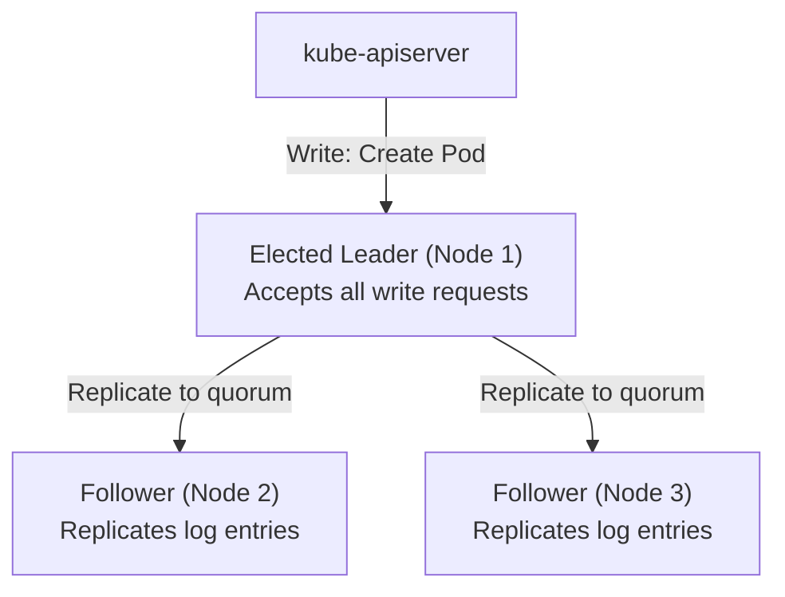
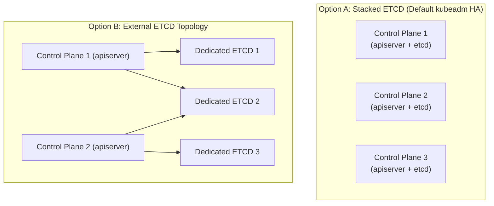

# High-Availability Control Plane & ETCD Management — Novice-Friendly Study Guide

> **Official Curriculum Reference:** Domain: *Cluster Architecture, Installation and Configuration (25%)*  
> **Official Documentation Links:**  
> - [Operating etcd clusters for Kubernetes](https://kubernetes.io/docs/tasks/administer-cluster/configure-upgrade-etcd/)  
> - [Options for High Availability topology](https://kubernetes.io/docs/setup/production-environment/tools/kubeadm/ha-topology/)  
> - [Backing up an etcd cluster](https://kubernetes.io/docs/tasks/administer-cluster/configure-upgrade-etcd/#backing-up-an-etcd-cluster)

---

## 1. Explain Like I'm a Novice: What Is ETCD?

Imagine a giant, multi-story shipping warehouse:
- Thousands of pallets (Pods) arrive, move, and leave every hour.
- Crane operators (Schedulers) move boxes around.
- Security guards (RBAC) check badges at every gate.

How does anyone know where box #4082 is stored, or how many copies of an app should be running?  
They don't keep that in their memory. They consult the **Central Master Ledger**. 

In Kubernetes, that ledger is **`etcd`**.
- It is a fast, distributed, key-value database.
- It stores **every single piece of information** about your cluster: every pod, node, secret, configmap, role, and deployment.
- **Critical rule:** The `kube-apiserver` is the **only** component allowed to talk directly to `etcd`. All other components (kubelet, scheduler, kubectl) must go through the API server.

> [!IMPORTANT]
> If your worker nodes crash, your applications die, but your cluster definition survives.  
> **If your `etcd` database is destroyed and you have no backup, your cluster is dead.** You would have to rebuild everything from scratch.

---

## 2. The Raft Consensus Algorithm & Why Odd Numbers Matter

If you run only 1 `etcd` server and that machine dies, your cluster stops working. To make it High-Availability (HA), we run multiple `etcd` servers that synchronize with each other.

To prevent conflicting writes, `etcd` uses the **Raft consensus algorithm**, which works like an election council:



### The Quorum Rule (Majority Voting)
Before any change is permanently saved, a **majority (quorum)** of the servers must agree:
$$\text{Quorum} = \left\lfloor \frac{N}{2} \right\rfloor + 1$$

| Total Nodes ($N$) | Majority Needed (Quorum) | Nodes That Can Fail |
| :---: | :---: | :---: |
| 1 | 1 | **0** (No tolerance) |
| **3** | **2** | **1 failure tolerated** |
| 4 | 3 | 1 failure tolerated *(Bad idea! Same tolerance as 3, but more overhead)* |
| **5** | **3** | **2 failures tolerated** |

### Why Odd Numbers (3 or 5)? The "Split-Brain" Problem
Imagine you have 4 nodes, and a network wire breaks, splitting the cluster into two groups of 2.
- Can Group A reach a majority? No (2 out of 4 is not a majority; it needs 3).
- Can Group B reach a majority? No (2 out of 4 is not a majority).
- The cluster completely freezes!

With 3 nodes, a network split leaves 2 nodes on one side and 1 node on the other. The side with 2 nodes still has a majority ($2 > 1.5$) and continues processing requests seamlessly without data corruption.

---

## 3. Two Ways to Deploy HA: Stacked vs. External



- **Stacked Topology:** `etcd` runs as static pods on the exact same machines as the control plane. Cheaper, easier to set up, standard for most small-to-mid companies.
- **External Topology:** `etcd` runs on separate, dedicated servers. If an API server consumes 100% of its host CPU, the `etcd` database is unaffected on its own machine.

---

## 4. How to Take an ETCD Snapshot Backup (Guaranteed Exam Question!)

In the exam, taking an ETCD snapshot is one of the most reliable ways to earn points if you know the exact pattern.

Because `etcd` holds sensitive cluster secrets, it requires mutual TLS authentication. You cannot simply run `etcdctl snapshot save` without passing certificates.

### Step 1: Find the Secret Passwords & Certs
You don't need to memorize file paths! Look inside the static pod manifest on the master node:
```bash
grep -E '(--cert-file|--key-file|--trusted-ca-file|--listen-client-urls)' /etc/kubernetes/manifests/etcd.yaml
```
Output will show:
- Client URL: `https://127.0.0.1:2379`
- CA Certificate: `/etc/kubernetes/pki/etcd/ca.crt`
- Server Certificate: `/etc/kubernetes/pki/etcd/server.crt`
- Server Private Key: `/etc/kubernetes/pki/etcd/server.key`

### Step 2: Run the Backup Command
```bash
ETCDCTL_API=3 etcdctl \
  --endpoints=https://127.0.0.1:2379 \
  --cacert=/etc/kubernetes/pki/etcd/ca.crt \
  --cert=/etc/kubernetes/pki/etcd/server.crt \
  --key=/etc/kubernetes/pki/etcd/server.key \
  snapshot save /opt/snapshot-backup.db
```

### Step 3: Verify the Snapshot
Always verify your backup file is valid:
```bash
ETCDCTL_API=3 etcdctl snapshot status /opt/snapshot-backup.db -w table
```
If **TOTAL REVISIONS** is $> 0$, the backup succeeded.

---

## 5. How to Restore an ETCD Snapshot

Restoring ETCD is slightly counter-intuitive: **you do not restore directly over the running database.** Instead, you extract the snapshot into a *new* folder, and then tell the `etcd` pod to read from that new folder.

### Step 1: Restore to a Brand New Directory
```bash
ETCDCTL_API=3 etcdctl \
  --data-dir=/var/lib/etcd-restored \
  snapshot restore /opt/snapshot-backup.db
```

### Step 2: Point the ETCD Static Pod to the New Directory
Edit `/etc/kubernetes/manifests/etcd.yaml`:
```yaml
spec:
  containers:
  - command:
    - etcd
    # 1. Update the data-dir argument:
    - --data-dir=/var/lib/etcd-restored
    volumeMounts:
    # 2. Update the container mount path:
    - mountPath: /var/lib/etcd-restored
      name: etcd-data
  volumes:
  - hostPath:
      # 3. Update the node hostPath:
      path: /var/lib/etcd-restored
      type: DirectoryOrCreate
    name: etcd-data
```

### Step 3: Wait for Automatic Restart
Because `/etc/kubernetes/manifests/etcd.yaml` is a static pod, saving this file triggers `kubelet` to stop the old etcd container and start a new one with your restored data.

Verify:
```bash
kubectl get pods -A
```

---

## 6. Rookie Traps & Exam Gotchas

> [!CAUTION]
> 1. **Forgetting `ETCDCTL_API=3`:** The `etcdctl` utility defaults to API version 2, which does not support the `snapshot` command! Always prefix `ETCDCTL_API=3` or run `export ETCDCTL_API=3`.
> 2. **Updating Command But Forgetting `hostPath`:** When restoring, beginners often update `--data-dir` under `command:`, but forget to update `volumes.hostPath.path`. If you don't update both, `etcd` crashes or boots with empty data.
> 3. **Restoring Over Active Directory:** Never run `snapshot restore` directly into `/var/lib/etcd` while the server is active; the locked database files will corrupt.

---

## 7. Knowledge Check Flashcards

1. **Q:** What is the quorum required for an ETCD cluster of 3 nodes?  
   **A:** 2 nodes ($3 // 2 + 1 = 2$).
2. **Q:** Can any component other than `kube-apiserver` communicate directly with `etcd`?  
   **A:** No. In a standard Kubernetes cluster, only the API server talks to `etcd`.
3. **Q:** Where do you find the exact TLS certificate paths needed to run `etcdctl` commands?  
   **A:** Inside `/etc/kubernetes/manifests/etcd.yaml`.
