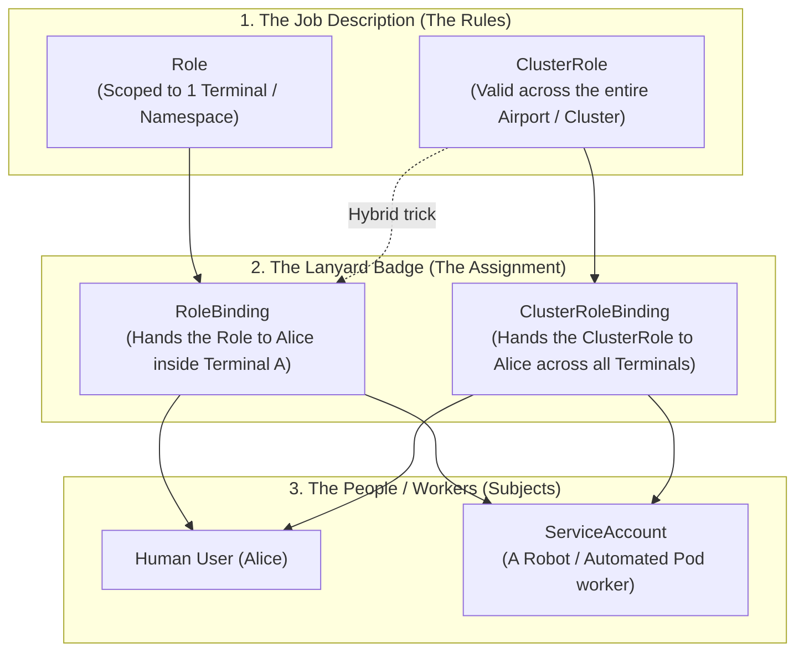

# Role-Based Access Control (RBAC) & Security — Novice-Friendly Study Guide

> **Official Curriculum Reference:** Domain: *Cluster Architecture, Installation and Configuration (25%)*  
> **Official Documentation Links:**  
> - [Using RBAC Authorization](https://kubernetes.io/docs/reference/access-authn-authz/rbac/)  
> - [Managing Service Accounts](https://kubernetes.io/docs/tasks/configure-pod-container/configure-service-account/)  
> - [API Groups Reference](https://kubernetes.io/docs/reference/using-api/#api-groups)  
> - [Checking API Access with kubectl auth can-i](https://kubernetes.io/docs/reference/access-authn-authz/authorization/#checking-api-access)

---

## 1. Explain Like I'm a Novice: The Airport Security Badge Analogy

Imagine you are hired to work at a major international airport:
- **Phase 1: Identification (Authentication):**  
  You arrive at the gate and show your photo ID badge. The security guard checks your face and verifies your name is Alice. That proves **who you are**.
- **Phase 2: Authorization (RBAC):**  
  Just because security knows you are Alice doesn't mean you can wander into the control tower or step onto the runway! They swipe your badge to check **what you are allowed to do**.

In Kubernetes, this permissions system is **RBAC (Role-Based Access Control)**. It is built from four building blocks:



### The 4 Concepts in Plain English:
1. **`Role`:** A job description valid in **only one room (namespace)**.  
   *Example:* "Can inspect luggage in Terminal 2" (`get`, `list` on `pods` in namespace `dev`).
2. **`ClusterRole`:** A job description valid **across the entire airport (cluster)**.  
   *Example:* "Can inspect physical airport buildings" (`get`, `list` on cluster-wide `nodes` or `storageclasses`).
3. **`RoleBinding`:** The lanyard that physically assigns a `Role` to a specific person or robot in that room.  
   *Example:* "Give Alice the Terminal 2 luggage inspector badge."
4. **`ClusterRoleBinding`:** The master keycard that assigns a `ClusterRole` to someone everywhere.  
   *Example:* "Give Bob the master airport inspector pass across every terminal."

---

## 2. The Golden Rule of Kubernetes RBAC: Whitelist Only!

> [!IMPORTANT]
> **There is no such thing as an explicit "Deny" rule in Kubernetes RBAC.**  
> By default, you have **zero permissions**. You can only grant permissions by adding rules. You cannot create a rule that says *"Allow Alice to do everything EXCEPT delete pods"*. If Alice has a binding that grants pod deletion, no other role can "block" it.

---

## 3. The ClusterRole + RoleBinding Hybrid Trick (Exam Favorite!)

A common question pattern on the CKA exam tests this genius architectural shortcut:

Kubernetes comes pre-packaged with built-in ClusterRoles like **`view`** (can view everything) and **`edit`** (can create and update apps).

- If you connect `view` using a **`ClusterRoleBinding`**, the user can view everything in the entire cluster.
- BUT if you connect `view` using a regular namespaced **`RoleBinding`** in namespace `finance`:
  **The user can ONLY view resources inside the `finance` namespace!**

This allows administrators to reuse one standard global template without creating duplicate `Role` definitions in hundreds of namespaces.

---

## 4. API Groups Reference: Finding the Right Neighborhood

When writing permissions, you must tell Kubernetes which "API Group" the resource belongs to:

| Resource You Want to Access | API Group (`apiGroups`) |
| :--- | :--- |
| `pods`, `services`, `configmaps`, `secrets`, `namespaces`, `nodes` | `""` *(Empty quotes = Core API Group)* |
| `deployments`, `daemonsets`, `statefulsets`, `replicasets` | `"apps"` |
| `jobs`, `cronjobs` | `"batch"` |
| `networkpolicies`, `ingresses` | `"networking.k8s.io"` |
| `gatewayclasses`, `gateways`, `httproutes` | `"gateway.networking.k8s.io"` |
| `storageclasses` | `"storage.k8s.io"` |

---

## 5. Instant Imperative RBAC Creation (Never Write YAML by Hand!)

Save 10 minutes on your exam by using `kubectl create`:

### Create a Role:
```bash
# Allow reading pods and pod logs in namespace 'marketing'
kubectl create role pod-reader \
  --verb=get,list,watch \
  --resource=pods,pods/log \
  -n marketing
```

### Create a ClusterRole:
```bash
# Allow viewing and listing nodes across the whole cluster
kubectl create clusterrole node-inspector \
  --verb=get,list \
  --resource=nodes
```

### Bind a Role to a ServiceAccount:
```bash
kubectl create rolebinding marketing-reader-binding \
  --role=pod-reader \
  --serviceaccount=marketing:crawler-sa \
  -n marketing
```

### Bind a Role to a Human User:
```bash
kubectl create rolebinding alice-reader \
  --role=pod-reader \
  --user=alice \
  -n marketing
```

---

## 6. How to Test Your Work: `kubectl auth can-i`

Never guess whether your permissions worked! Always test them before moving to the next question:

### Test as an Automated ServiceAccount:
```bash
kubectl auth can-i get pods \
  --as=system:serviceaccount:marketing:crawler-sa \
  -n marketing
# Must return: yes
```

### Test Negative Permissions (Should Fail):
```bash
kubectl auth can-i delete pods \
  --as=system:serviceaccount:marketing:crawler-sa \
  -n marketing
# Must return: no
```

---

## 7. Rookie Traps & Exam Gotchas

> [!CAUTION]
> 1. **The ServiceAccount `--as` Syntax Trap:** When impersonating a ServiceAccount with `kubectl auth can-i`, you **must** prefix the name with `system:serviceaccount:<namespace>:<sa-name>`. Writing `--as=crawler-sa` tests a human user, not the ServiceAccount!
> 2. **The Core API Group is Empty Quotes:** When writing YAML manually, the core group for pods and services is `apiGroups: [""]`. Writing `apiGroups: ["core"]` will fail silently.
> 3. **Subresource Syntax:** Granting access to pods does **not** grant access to pod logs! To view logs, you must explicitly include `pods/log` in the resources list.

---

## 8. Knowledge Check Flashcards

1. **Q:** Can an RBAC `Role` grant permissions to list physical `nodes`?  
   **A:** No. Nodes are cluster-scoped; they can only be authorized via a `ClusterRole`.
2. **Q:** What is the result of binding a `ClusterRole` named `edit` to user `dave` using a `RoleBinding` in namespace `development`?  
   **A:** User `dave` receives edit permissions **only** within the `development` namespace.
3. **Q:** What command tests whether a user named `claire` is allowed to create deployments in namespace `prod`?  
   **A:** `kubectl auth can-i create deployments --as=claire -n prod`.
