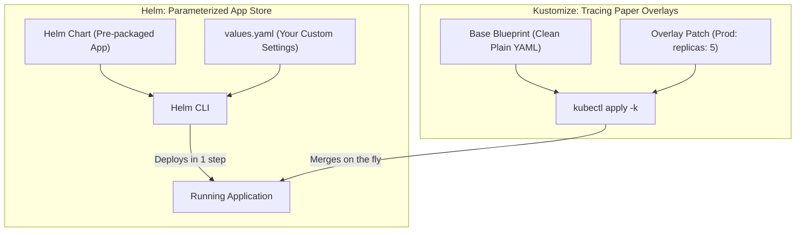

# Helm & Kustomize Manifest Management — Novice-Friendly Study Guide

> **Official Curriculum Reference:** Domain: *Cluster Architecture, Installation and Configuration (25%)*  
> **Official Documentation Links:**  
> - [Helm Documentation](https://helm.sh/docs/)  
> - [Declarative Management of Kubernetes Objects Using Kustomize](https://kubernetes.io/docs/tasks/manage-kubernetes-objects/kustomization/)  
> - [Kustomize Official Reference](https://kubectl.docs.kubernetes.io/guides/introduction/kustomize/)

---

## 1. Explain Like I'm a Novice: App Stores vs. Tracing Paper

Deploying an application in Kubernetes rarely requires just one file. A real application needs a Deployment, a Service, a ConfigMap, a Secret, an Ingress, and maybe a PersistentVolumeClaim. That's 6 or 7 different YAML files!

If you had to copy, paste, and edit all 7 files every time you deployed to Development, Staging, and Production, you would quickly make human errors and go crazy.

Kubernetes administrators use two modern tools to solve this:

| Tool | Real-World Analogy | How It Works in Plain English | Best Used For |
| :--- | :--- | :--- | :--- |
| **`Helm`** | The **App Store / Ikea Flat-Pack Kit** | A pre-packaged bundle of YAML templates created by vendors. You download the package, change a few settings (`--set replicas=3`), and install it in 1 command. | Third-party software (e.g., WordPress, Prometheus, Redis, Nginx Ingress). |
| **`Kustomize`** | **Architectural Tracing Paper (Overlays)** | You keep one pure, unmodified YAML "Base" blueprint. For Production, you lay a transparent sheet of tracing paper on top with your small patch edits (e.g., "Change replica count to 5"). | In-house microservices deployed across Dev, Staging, and Prod. |



---

## 2. Helm CLI Speedrun for the Exam

Helm commands follow a simple, intuitive lifecycle:

### Step 1: Add and Update a Chart Repository
Think of this like adding a new app store repository to your package manager:
```bash
# Add a repository
helm repo add bitnami https://charts.bitnami.com/bitnami

# Download the latest list of available charts
helm repo update
```

### Step 2: Search for Charts
```bash
helm search repo nginx
```

### Step 3: Install an Application with Custom Settings
```bash
helm install my-web bitnami/nginx \
  --namespace web \
  --create-namespace \
  --set replicaCount=3 \
  --set service.type=ClusterIP
```
- `--create-namespace`: Automatically creates the namespace if it doesn't already exist.
- `--set`: Overrides default chart settings on the fly.

### Step 4: Upgrade, List, and Rollback
```bash
# Upgrade the release to 5 replicas:
helm upgrade my-web bitnami/nginx --namespace web --set replicaCount=5

# View all installed releases:
helm list -A

# Undo a broken upgrade:
helm rollback my-web 1 -n web

# Uninstall and delete the application:
helm uninstall my-web -n web
```

---

## 3. Kustomize Workflow: Base vs. Overlays

Kustomize is built directly into `kubectl`! You don't need to install any external binary.

### Typical Directory Structure:
```text
/opt/deployments/
├── base/
│   ├── deployment.yaml
│   ├── service.yaml
│   └── kustomization.yaml     # The master index for the base
└── overlays/
    ├── dev/
    │   └── kustomization.yaml # Dev settings (1 replica)
    └── prod/
        ├── kustomization.yaml # Prod settings (5 replicas)
        └── replica-patch.yaml # The specific override patch
```

### The `kustomization.yaml` File:
```yaml
apiVersion: kustomize.config.k8s.io/v1beta1
kind: Kustomization

# Point to the shared base blueprint:
resources:
  - ../../base

# Inject production namespace and prefixes automatically:
namespace: production
namePrefix: prod-

# Add production labels to all pods:
commonLabels:
  env: production

# Override the replica count:
replicas:
  - name: my-deploy
    count: 5
```

---

## 4. How to Run Kustomize Commands

> [!IMPORTANT]
> **The Golden Flag: `-k` vs. `-f`**  
> When deploying with Kustomize, **always use the `-k` flag**!  
> Using `-f` tells kubectl to treat the folder as plain static files and it will fail to apply your patches.

```bash
# 1. Preview the rendered YAML without applying it (Dry-Run):
kubectl kustomize /opt/deployments/overlays/prod/

# 2. Apply the kustomization to the cluster:
kubectl apply -k /opt/deployments/overlays/prod/

# 3. Delete resources managed by the kustomization:
kubectl delete -k /opt/deployments/overlays/prod/
```

---

## 5. Rookie Traps & Exam Gotchas

> [!CAUTION]
> 1. **Typing `kubectl apply -f` instead of `-k`:** If a folder contains `kustomization.yaml`, you must use `kubectl apply -k <dir>`. If you use `-f`, patches and name prefixes will not be applied!
> 2. **Forgetting `--create-namespace` in Helm:** In Helm v3, if you run `helm install my-app repo/chart -n custom-ns` and `custom-ns` doesn't exist, the command will fail. Always include `--create-namespace`.
> 3. **Indentation in Helm `--set`:** When setting nested properties, use dots: `--set service.ports[0].port=8080`.

---

## 6. Knowledge Check Flashcards

1. **Q:** What is the difference between Helm and Kustomize?  
   **A:** Helm uses parameterized templates (`{{ .Values }}`) to generate manifests from packaged charts; Kustomize merges patch overlays onto plain, valid YAML bases without templating.
2. **Q:** What flag tells `kubectl` to evaluate a directory using Kustomize?  
   **A:** `-k` (e.g. `kubectl apply -k ./overlays/prod`).
3. **Q:** What command rolls back a Helm release named `database` in namespace `prod` to revision 2?  
   **A:** `helm rollback database 2 -n prod`.
