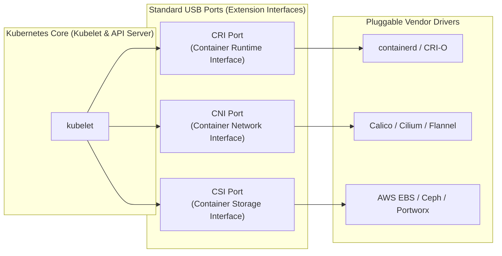
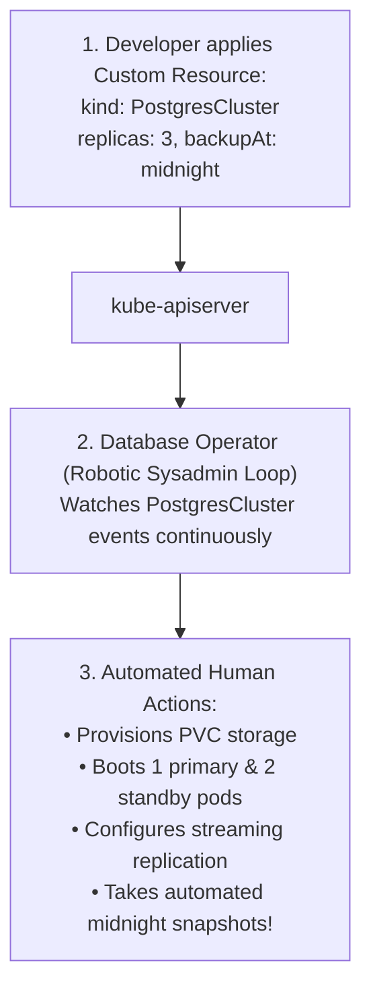

# Extension Interfaces (CNI, CSI, CRI), CRDs, & Operators — Novice-Friendly Study Guide

> **Official Curriculum Reference:** Domain: *Cluster Architecture, Installation and Configuration (25%)*  
> **Official Documentation Links:**  
> - [Extending Kubernetes](https://kubernetes.io/docs/concepts/extend-kubernetes/)  
> - [Custom Resources & CRDs](https://kubernetes.io/docs/concepts/extend-kubernetes/api-extension/custom-resources/)  
> - [Operator Pattern](https://kubernetes.io/docs/concepts/extend-kubernetes/operator/)  
> - [Container Network Interface (CNI)](https://github.com/containernetworking/cni)

---

## 1. Explain Like I'm a Novice: The Smartphone & USB Port Analogy

If Apple or Google tried to build every single piece of software in the world directly into the iOS or Android operating system, your phone would weigh 50 pounds, crash constantly, and take 10 years to update.

Instead, modern operating systems provide:
1. **Standard Hardware Ports (USB-C, Bluetooth):** So any third-party company can build headphones, keyboards, or chargers that plug in seamlessly.
2. **An App Store:** So developers can teach the phone new capabilities by installing apps.

Kubernetes follows this exact same philosophy:



---

## 2. Decoded: The Three Core Extension Interfaces

| Interface | Full Name | What It Plugs In | Where Does It Live on the Server? |
| :--- | :--- | :--- | :--- |
| **`CRI`** | **Container Runtime Interface** | The software that actually starts and runs container processes (e.g. `containerd`, `CRI-O`). | Communicates over a Unix socket: `/run/containerd/containerd.sock`. |
| **`CNI`** | **Container Network Interface** | The software that assigns IP addresses and connects virtual network cables to pods (e.g. Calico, Flannel, Cilium). | Configuration files: `/etc/cni/net.d/`<br>Binary executable plugins: `/opt/cni/bin/`. |
| **`CSI`** | **Container Storage Interface** | The storage driver that mounts cloud disks or SAN hardware into containers (e.g. AWS EBS CSI, NFS CSI). | Plugin sockets: `/var/lib/kubelet/plugins/`. |

---

## 3. Teaching Kubernetes New Words: Custom Resource Definitions (CRDs)

Out of the box, Kubernetes only understands standard vocabulary words like `Pod`, `Service`, `Deployment`, and `Secret`.

A **`CustomResourceDefinition` (CRD)** is like adding a new word to the Kubernetes dictionary:
- You tell Kubernetes: *"I am inventing a new kind of object called a `PostgresCluster`!"*
- Once you submit the CRD YAML, Kubernetes learns the new word.
- You can now type:
  ```bash
  kubectl get postgresclusters
  kubectl get crd
  ```

---

## 4. The Operator Pattern: A Sysadmin in a Box

Creating a CRD only creates a passive database record in ETCD. It doesn't actually know how to deploy or run a complex database.

That is where the **`Operator`** comes in:



### What is an Operator in Plain English?
An Operator is a custom controller running in a pod that encodes the **specialized human domain knowledge of a Senior Database Administrator** into code:
- If a database primary node crashes, the operator promotes a replica automatically.
- If it's midnight, the operator triggers an encrypted database dump.
- If you increase `replicas: 3` to `replicas: 5`, the operator handles cluster rebalancing.

---

## 5. How to Inspect CRDs and Operators on the Exam

```bash
# 1. List all custom resource definitions installed on the cluster:
kubectl get crd

# 2. Describe the schema/structure of a custom resource:
kubectl explain <custom-resource-name>.spec

# 3. List all instances of a custom resource across all namespaces:
kubectl get <custom-resource-name> -A

# 4. Check operator logs if custom resources aren't working:
kubectl logs -n <operator-namespace> -l app.kubernetes.io/name=<operator-name>
```

---

## 6. Rookie Traps & Exam Gotchas

> [!CAUTION]
> 1. **Confusing the CRD with the Custom Resource:**  
>    - `kubectl get crd` lists the **blueprints/definitions** (the schema).
>    - `kubectl get <custom-kind>` lists the **actual running instances**.
> 2. **CNI Folder Location on Nodes:** If a worker node is in `NotReady` status with message `NetworkPluginNotReady`, SSH into the node and check `/etc/cni/net.d/`. If that folder is empty, the CNI configuration file is missing or failed to generate.
> 3. **Operator Controllers:** If you apply a custom resource (like a `Gateway` or `Certificate`) and it sits in `Pending` forever without doing anything, check if the Operator pod that manages it has crashed!

---

## 7. Knowledge Check Flashcards

1. **Q:** What directory on a Linux node holds the JSON configuration files used by CNI plugins?  
   **A:** `/etc/cni/net.d/`.
2. **Q:** What is the difference between a `CustomResourceDefinition` (CRD) and an `Operator`?  
   **A:** A CRD defines the custom data schema/blueprint in the API; an Operator is the running controller loop that actively reconciles and manages the actual application state.
3. **Q:** What interface allows Kubernetes to communicate with container engines like `containerd` and `CRI-O`?  
   **A:** The **CRI** (Container Runtime Interface).
