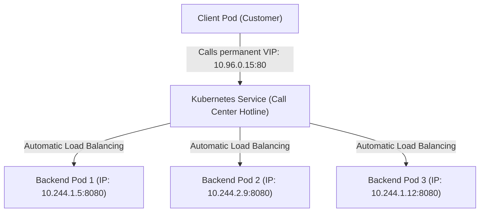

# Kubernetes Services, Endpoints, & EndpointSlices — Novice-Friendly Study Guide

> **Official Curriculum Reference:** Domain: *Services and Networking (20%)*  
> **Official Documentation Links:**  
> - [Service Concepts](https://kubernetes.io/docs/concepts/services-networking/service/)  
> - [Connecting Applications with Services](https://kubernetes.io/docs/tutorials/services/connect-applications-service/)  
> - [EndpointSlices Scalability](https://kubernetes.io/docs/concepts/services-networking/endpoint-slices/)

---

## 1. Explain Like I'm a Novice: Why Do We Need Services?

Imagine you run a pizza delivery company with a team of delivery drivers (Pods):
- Each driver has a personal mobile phone number (Pod IP address).
- But delivery drivers come and go, take breaks, crash their bikes, or get replaced (Pods are ephemeral; when they die and recreate, **their IP address changes completely**).
- If your customers tried to call individual drivers directly, they would constantly dial disconnected numbers!

You don't give customers the drivers' personal cell phone numbers. Instead, you set up a **Central Call Center Hotline**:
- Customers dial **1-800-PIZZA** (The Service Virtual IP / ClusterIP).
- That 1-800 number never changes, even if 10 drivers quit and 10 new drivers are hired.
- When a customer calls 1-800-PIZZA, the switchboard automatically forwards the call to whichever driver is currently on shift and ready to deliver.

In Kubernetes, that central hotline is a **`Service`**.



---

## 2. The Great Port Confusion: `port` vs. `targetPort` vs. `nodePort`

One of the most common stumbling blocks for beginners is understanding the three different port numbers in a Service definition:

```yaml
spec:
  ports:
  - port: 80         # 1. The Call Center's Number (Service Port)
    targetPort: 8080 # 2. The Worker's Desk Extension (Container Port)
    nodePort: 30080  # 3. The Public Payphone on the Street (NodePort)
```

1. **`port: 80` (The Service Port):**  
   The port that other pods inside the cluster use to talk to this service. When other pods call `http://my-service:80`, they reach the Service.
2. **`targetPort: 8080` (The Container Port):**  
   The port that the container inside the Pod is actually listening on. The Service takes traffic coming into port 80 and forwards it to port 8080 inside the container.
3. **`nodePort: 30080` (The Node's Physical Port):**  
   Only used for `type: NodePort`. Opens a dedicated port (in the range 30000–32767) on **every single physical server (node)** in the entire cluster. External users on your local network can access the service at `http://<Any-Node-IP>:30080`.

---

## 3. Service Types: Choosing the Right Door

| Service Type | Where Can You Reach It? | Best Used For |
| :--- | :--- | :--- |
| **`ClusterIP`** *(Default)* | **Internal only.** Accessible only by other pods inside the same cluster. | Internal microservices, backend APIs, databases. |
| **`NodePort`** | **Internal + External.** Opens a port (30000-32767) on every node's IP. | Direct access for testing, on-prem networks, home labs. |
| **`LoadBalancer`** | **External (Internet).** Asks your cloud provider (AWS, GCP, Azure) to provision a real public cloud load balancer with a public IP. | Production web applications, public API gateways. |
| **`ExternalName`** | **Internal DNS Alias.** Redirects requests to an external domain name outside the cluster. | Pointing pods to an external database (e.g. `rds.aws.amazon.com`). |
| **`Headless`** | **No Virtual IP (`clusterIP: None`).** Returns individual Pod IPs directly via DNS. | Databases running in StatefulSets (e.g. Cassandra, MongoDB, Kafka). |

---

## 4. How Services Find Pods: Selectors & Endpoints

A Service does **not** hardcode Pod IP addresses. Instead, it uses a **`selector`** (like a job title search) to discover pods dynamically:

```yaml
# Inside the Service:
spec:
  selector:
    app: shopping-cart   # "Forward calls to any pod with label app=shopping-cart"
```

Whenever a pod is created or destroyed, Kubernetes maintains an **`Endpoints`** object with the exact same name as the Service:
```bash
kubectl get endpoints shopping-cart-service
# Output:
# NAME                   ENDPOINTS                                   AGE
# shopping-cart-service  10.244.1.5:8080,10.244.2.9:8080             12m
```

### What is an `EndpointSlice`?
In large clusters with 5,000 pods, a single `Endpoints` list became too massive for Kubernetes to handle efficiently. Kubernetes introduced **`EndpointSlices`**, which chop up large lists of pods into smaller batches of 100 endpoints each.

---

## 5. Fast Imperative Generation (Save Time on the Exam!)

Never write a Service YAML by hand from scratch. Generate it in seconds:

### Expose a Deployment as ClusterIP:
```bash
kubectl expose deploy web-app --name=web-svc --port=80 --target-port=8080
```

### Expose a Deployment as NodePort:
```bash
kubectl expose deploy web-app --name=web-np --type=NodePort --port=80 --target-port=8080
```

### Create a NodePort with a Specific Port Number:
```bash
kubectl create service nodeport custom-np --tcp=80:8080 --node-port=31500
```

---

## 6. Rookie Traps & Exam Gotchas

> [!CAUTION]
> 1. **The Empty Endpoints Trap (`<none>`):** If you create a service and test it with `curl`, but get connection refused, run `kubectl get endpoints <service-name>`. If it shows `<none>`, **your Service selector does not match the Pod labels**. Check for typos!
> 2. **Confusing `port` and `targetPort`:** If your container listens on `3000` (like a Node.js app), but your Service specifies `targetPort: 80`, traffic will arrive at the container and be rejected.
> 3. **NodePort Range:** If you manually specify a `nodePort`, it **must be between 30000 and 32767**. Any number outside this range will result in an error.

---

## 7. Knowledge Check Flashcards

1. **Q:** What is the primary reason Kubernetes uses Services instead of connecting directly to Pod IPs?  
   **A:** Pods are ephemeral and their IP addresses change whenever they restart; Services provide a stable, permanent Virtual IP (ClusterIP).
2. **Q:** What does it mean if `kubectl get endpoints my-service` shows `<none>`?  
   **A:** The Service's `.spec.selector` does not match the labels of any healthy, running Pods.
3. **Q:** What is the default port range for a Kubernetes `NodePort` Service?  
   **A:** 30000 to 32767.
