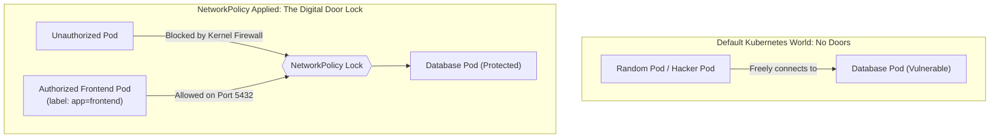

# Kubernetes Network Policies — Novice-Friendly Study Guide

> **Official Curriculum Reference:** Domain: *Services and Networking (20%)*  
> **Official Documentation Links:**  
> - [Network Policies Overview](https://kubernetes.io/docs/concepts/services-networking/network-policies/)  
> - [Declare Network Policy Task Guide](https://kubernetes.io/docs/tasks/administer-cluster/declare-network-policy/)  
> - [Network Policy Recipes Guide](https://github.com/ahmetb/kubernetes-network-policy-recipes)

---

## 1. Explain Like I'm a Novice: The Hotel Door Lock Analogy

By default, Kubernetes has a completely open, zero-security network:
- Running pods in Kubernetes is like living in a **hotel where every single bedroom door is left wide open**:
- Anyone staying in Room 101 can walk right into Room 504.
- A compromised web server in the `test` namespace can freely connect directly to your production customer database on port 5432!

To prevent this chaos, Kubernetes provides **`NetworkPolicies`**:



### The 3 Core Rules of NetworkPolicies:
1. **By default, doors are wide open:** Pods start out completely non-isolated. They accept all incoming and outgoing connections.
2. **The moment you apply a policy, the door snaps shut!** As soon as a NetworkPolicy selects a pod, it becomes **isolated**. All traffic is blocked *except* the traffic you explicitly whitelist.
3. **Policies are whitelist-only:** You cannot write "Block IP X". You only write "Allow IP Y", and everything else is dropped automatically.

---

## 2. Ingress vs. Egress in Plain English

NetworkPolicies control traffic in two directions:
- **`Ingress` (Incoming):** Traffic arriving *into* the target Pod. (e.g. Can the web frontend talk to this database?)
- **`Egress` (Outgoing):** Traffic leaving *from* the target Pod. (e.g. Can this database connect to the public internet?)

---

## 3. The Dangerous Dash Trap: `AND` vs. `OR` (Exam Favorite!)

The single most common mistake beginners make on the CKA exam is misplacing a tiny dash `-` in the YAML. A single dash completely changes the boolean logic from **AND** to **OR**!

### Case A: Logical `OR` (Separate List Items with Dashes)
Notice the dash `-` in front of **both** `namespaceSelector` and `podSelector`:
```yaml
ingress:
- from:
  - namespaceSelector:
      matchLabels:
        env: prod
  - podSelector:
      matchLabels:
        app: frontend
```
**What this means:** Allow traffic if the sender is in namespace `prod` **OR** if the sender is labeled `app=frontend` (anywhere in the cluster). This accidentally allows test pods labeled `frontend` from the `dev` namespace to connect!

---

### Case B: Logical `AND` (One Single Item with One Dash)
Notice there is **only one dash** at the very top:
```yaml
ingress:
- from:
  - namespaceSelector:
      matchLabels:
        env: prod
    podSelector:
      matchLabels:
        app: frontend
```
**What this means:** Allow traffic ONLY if the sender is in namespace `prod` **AND** that sender also has the label `app=frontend`. This is almost always what exam questions require!

---

## 4. High-Frequency Exam Templates

### Template 1: Default Deny All Ingress
Puts a lock on every pod in the namespace, dropping all incoming traffic from outside:
```yaml
apiVersion: networking.k8s.io/v1
kind: NetworkPolicy
metadata:
  name: default-deny-ingress
  namespace: secure-zone
spec:
  podSelector: {} # Empty brackets = Select ALL pods in this namespace
  policyTypes:
  - Ingress
```

### Template 2: Allow Only Frontend to Reach Backend Database on Port 3306
```yaml
apiVersion: networking.k8s.io/v1
kind: NetworkPolicy
metadata:
  name: backend-policy
  namespace: default
spec:
  # The Target: Which pods are we putting the lock on?
  podSelector:
    matchLabels:
      app: mysql
  policyTypes:
  - Ingress
  ingress:
  - from:
    # Whitelist: Who has the keycard?
    - podSelector:
        matchLabels:
          app: web-frontend
    ports:
    - protocol: TCP
      port: 3306
```

---

## 5. The Fatal Egress Trap: Why Did My DNS Break?

If you create an **`Egress`** policy to stop a pod from making outbound connections to the internet, **all DNS lookups will immediately fail!**

Why? Because DNS resolution requires the pod to send outgoing UDP packets on port 53 to CoreDNS in the `kube-system` namespace. If your Egress policy doesn't explicitly whitelist DNS, your app won't even be able to resolve `http://database:3306`.

### The Safe Egress Pattern (With DNS Whitelist):
```yaml
apiVersion: networking.k8s.io/v1
kind: NetworkPolicy
metadata:
  name: safe-crawler-egress
spec:
  podSelector:
    matchLabels:
      app: crawler
  policyTypes:
  - Egress
  egress:
  # Rule 1: Always allow outbound DNS queries to CoreDNS!
  - to:
    - namespaceSelector:
        matchLabels:
          kubernetes.io/metadata.name: kube-system
      podSelector:
        matchLabels:
          k8s-app: kube-dns
    ports:
    - protocol: UDP
      port: 53
    - protocol: TCP
      port: 53
  # Rule 2: Allow outbound web scraping on port 443
  - to:
    - ipBlock:
        cidr: 0.0.0.0/0
    ports:
    - protocol: TCP
      port: 443
```

---

## 6. Rookie Traps & Exam Gotchas

> [!CAUTION]
> 1. **`namespaceSelector` Matches Namespace Labels, Not Pod Labels:** If you write `namespaceSelector.matchLabels.app: frontend`, Kubernetes will search for a **Namespace** labeled `app: frontend`! To select by namespace name, use the built-in label `kubernetes.io/metadata.name: <namespace-name>`.
> 2. **CNI Support Requirement:** NetworkPolicies require an enforcement engine (like Calico or Cilium). Default Flannel does not enforce policies. On the CKA exam, the cluster CNI is already configured to enforce them.
> 3. **Testing Connection:** Always test with a temporary pod using `curl` with `--connect-timeout 3`. If traffic is blocked, curl will hang until timeout.

---

## 7. Knowledge Check Flashcards

1. **Q:** What is the default isolation status of a newly created Pod before any NetworkPolicy exists?  
   **A:** Non-isolated (accepts all ingress and egress traffic).
2. **Q:** In a NetworkPolicy `from:` block, what is the syntactic difference between a logical AND and a logical OR?  
   **A:** Multiple items with dashes evaluate as a logical **OR**; key-value selectors grouped under a single dash evaluate as a logical **AND**.
3. **Q:** Why does applying a strict Egress policy often cause applications to fail with "Host not found" errors?  
   **A:** Because DNS resolution requires outbound traffic to CoreDNS on port 53 (UDP/TCP), which gets blocked if not explicitly whitelisted.
