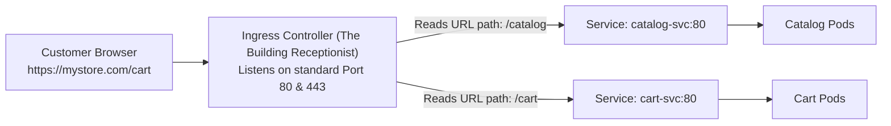

# Ingress Controllers & Ingress Resources — Novice-Friendly Study Guide

> **Official Curriculum Reference:** Domain: *Services and Networking (20%)*  
> **Official Documentation Links:**  
> - [Ingress Concepts](https://kubernetes.io/docs/concepts/services-networking/ingress/)  
> - [Ingress Controllers Reference](https://kubernetes.io/docs/concepts/services-networking/ingress-controllers/)  
> - [Configure TLS for Ingress](https://kubernetes.io/docs/concepts/services-networking/ingress/#tls)

---

## 1. Explain Like I'm a Novice: The Building Receptionist Analogy

If you use a `NodePort` service to expose your website, your customers have to type something ugly into their web browser:
```text
http://192.168.1.50:31452
```
No real user wants to memorize an IP address and a random 5-digit port number!  
Furthermore, if you have 10 different microservices (e.g. `/catalog`, `/cart`, `/payment`), opening 10 different random ports (`31452`, `31453`, `31454`) is a security and usability disaster.

What you really want is a single, clean URL:
- `https://mystore.com/catalog` $\rightarrow$ Routes to the catalog service.
- `https://mystore.com/cart` $\rightarrow$ Routes to the cart service.
- Standard port 80 (HTTP) and port 443 (HTTPS) with an SSL lock icon.

In Kubernetes, that smart routing layer is an **`Ingress`**.



### The Difference Between Ingress and Ingress Controller:
This is the #1 point of confusion for novices:
1. **The Ingress Resource (The Rulebook):** A simple YAML file you write declaring: *"If the user goes to `/cart`, send them to `cart-svc`."*
2. **The Ingress Controller (The Actual Worker / Reverse Proxy):** The software that actually listens on port 80/443 and routes the packets (like `ingress-nginx` or `Traefik`).  
   > **Note:** If you create an Ingress YAML file in a cluster that has no Ingress Controller installed, **absolutely nothing will happen!** The rulebook sits in ETCD ignored.

---

## 2. Anatomy of an Ingress Manifest

```yaml
apiVersion: networking.k8s.io/v1
kind: Ingress
metadata:
  name: store-ingress
  namespace: default
  annotations:
    nginx.ingress.kubernetes.io/rewrite-target: / # Rewrites path before sending to app
spec:
  ingressClassName: nginx   # Tells Kubernetes which Ingress Controller to use!
  tls:
  - hosts:
    - mystore.com
    secretName: store-tls   # Name of Secret containing tls.crt and tls.key
  rules:
  - host: mystore.com
    http:
      paths:
      # Rule 1: Send /api to api-service
      - path: /api
        pathType: Prefix
        backend:
          service:
            name: api-service
            port:
              number: 8080
      # Rule 2: Send everything else to web-service
      - path: /
        pathType: Prefix
        backend:
          service:
            name: web-service
            port:
              number: 80
```

---

## 3. Path Types in Plain English

When writing `pathType:`, you have two standard options:

| PathType | What It Matches | Example (`path: /shoes`) |
| :--- | :--- | :--- |
| **`Prefix`** *(Most Common)* | Matches the URL path and anything after the trailing slash. | Matches `/shoes`, `/shoes/`, `/shoes/nike`, `/shoes/boots`. (Does NOT match `/shoes-sales`). |
| **`Exact`** | Matches the URL path with 100% literal precision. | Matches `/shoes` only. Does NOT match `/shoes/nike` or `/shoes/`. |

---

## 4. Fast Imperative Generation

Save time by using `kubectl create ingress` to generate your initial YAML:

```bash
# Basic single-rule Ingress:
kubectl create ingress simple-ing \
  --rule="mystore.com/api*=api-svc:8080" \
  --class=nginx \
  --dry-run=client -o yaml > ing.yaml

# Ingress with TLS:
kubectl create ingress secure-ing \
  --rule="app.local/*=app-svc:80,tls=my-cert-secret" \
  --class=nginx
```

---

## 5. Rookie Traps & Exam Gotchas

> [!CAUTION]
> 1. **The Missing `ingressClassName`:** If your cluster has an Ingress Controller, but your Ingress YAML omits `spec.ingressClassName: nginx`, the controller might ignore your resource completely. Always verify installed classes with `kubectl get ingressclass`.
> 2. **Target Port Must Be the Service Port:** In `backend.service.port.number`, specify the port exposed by the **Kubernetes Service**, not the container's internal port!
> 3. **Testing Without Real DNS:** In the exam, `mystore.com` won't resolve to a real IP on the internet. Test it using `curl` with a Host header:
>    ```bash
>    curl -k -H "Host: mystore.com" http://<node-ip>/api
>    ```

---

## 6. Knowledge Check Flashcards

1. **Q:** What is the difference between an Ingress resource and an Ingress Controller?  
   **A:** An Ingress resource is a declarative configuration rulebook; an Ingress Controller is the running reverse proxy daemon (e.g. Nginx) that actually routes the traffic.
2. **Q:** What happens if you define `pathType: Exact` for `path: /store` and a user visits `/store/items`?  
   **A:** The request will not match and will be rejected with a 404 error because `Exact` requires an identical match.
3. **Q:** Where are SSL/TLS certificates stored when configuring HTTPS termination on an Ingress?  
   **A:** Inside a Kubernetes `Secret` of type `kubernetes.io/tls`.
