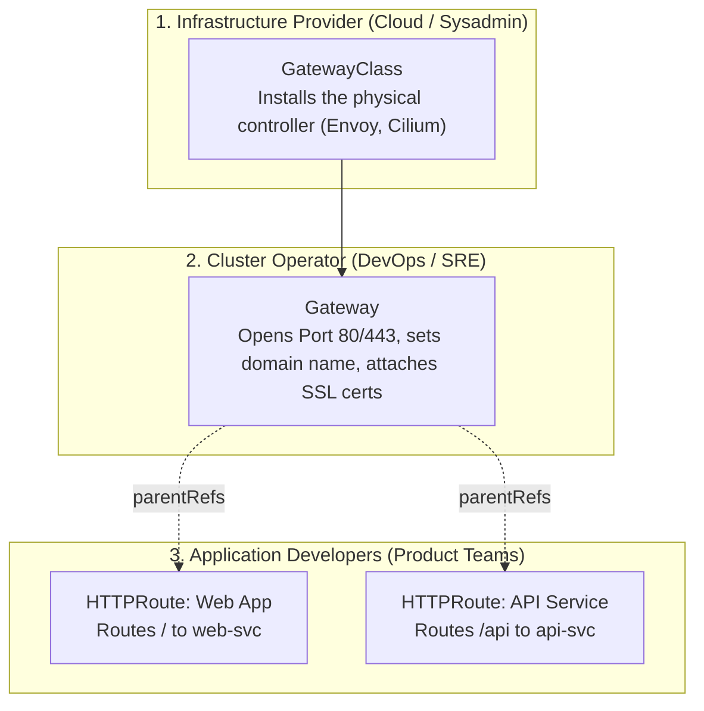

# Gateway API (Modern Ingress) — Novice-Friendly Study Guide

> **Official Curriculum Reference:** Domain: *Services and Networking (20%)*  
> **Official Documentation Links:**  
> - [Gateway API Official Documentation](https://gateway-api.sigs.k8s.io/)  
> - [Gateway API Concepts & Personas](https://gateway-api.sigs.k8s.io/concepts/)  
> - [HTTPRoute Specification & Guides](https://gateway-api.sigs.k8s.io/guides/http-routing/)  
> - [Kubernetes Gateway API Concepts](https://kubernetes.io/docs/concepts/services-networking/gateway/)

---

## 1. Explain Like I'm a Novice: Why Did Kubernetes Invent the Gateway API?

For years, Kubernetes used **Ingress** to route web traffic from outside the cluster to internal services. But as organizations grew, Ingress became messy and frustrating.

### The Problem with the Old Ingress:
Imagine an apartment building with one shared entrance:
- The landlord, the front-desk security guard, and 50 different apartment tenants are all forced to write their rules in **one single, shared notepad** (the Ingress manifest).
- If a tenant wants to route `/blog` to their app, they could accidentally overwrite another tenant's `/billing` route or break the entire building's SSL certificate!
- Furthermore, because the standard Ingress spec was too basic, vendors started inventing custom stickers (**annotations**, like `nginx.ingress.kubernetes.io/rewrite-target`). If you migrated your cluster from Nginx to Traefik or AWS ALB, none of your annotations worked anymore!

### The Gateway API Solution: Job Separation (Personas)
The **Gateway API** splits this monolithic mess into three distinct, cleanly separated jobs:



1. **The Infrastructure Provider** provides the **`GatewayClass`** (e.g., "We support Envoy or Cilium").
2. **The Cluster Operator (SRE/DevOps)** creates the **`Gateway`** (e.g., "Here is our public IP, opening ports 80 and 443 with wildcard TLS").
3. **The Application Developers** create **`HTTPRoute`** objects in their own namespaces (e.g., "Route traffic for `/cart` to my shopping cart service"). Developers can never accidentally break another team's TLS certificates or port bindings!

---

## 2. Resource 1: `GatewayClass` (The Engine)

The `GatewayClass` defines what technology actually implements the gateway (like choosing between an Envoy proxy, Nginx, or Cilium):

```yaml
apiVersion: gateway.networking.k8s.io/v1
kind: GatewayClass
metadata:
  name: standard-gateway-class
spec:
  controllerName: example.com/gateway-controller
```
> [!NOTE]
> On the CKA exam, the `GatewayClass` is almost always pre-installed for you. You can check what classes exist by running:
> ```bash
> kubectl get gatewayclasses
> ```

---

## 3. Resource 2: `Gateway` (The Front Door)

The `Gateway` is configured by the cluster administrator to listen on specific ports:

```yaml
apiVersion: gateway.networking.k8s.io/v1
kind: Gateway
metadata:
  name: prod-gateway
  namespace: gateway-infra
spec:
  gatewayClassName: standard-gateway-class # References the GatewayClass above
  listeners:
  - name: http
    protocol: HTTP
    port: 80
    allowedRoutes:
      namespaces:
        from: All # Allows developers from ANY namespace to attach routes
```

---

## 4. Resource 3: `HTTPRoute` (The Traffic Director)

As an application developer, you define an `HTTPRoute` in your namespace to direct traffic to your services:

```yaml
apiVersion: gateway.networking.k8s.io/v1
kind: HTTPRoute
metadata:
  name: store-route
  namespace: default
spec:
  parentRefs:
  - name: prod-gateway             # Name of the Gateway to connect to
    namespace: gateway-infra       # Namespace where the Gateway lives
  hostnames:
  - "store.example.com"
  rules:
  # Rule 1: Send /api to backend-svc on port 8080
  - matches:
    - path:
        type: PathPrefix
        value: /api
    backendRefs:
    - name: backend-svc
      port: 8080

  # Rule 2: Send everything else (/) to frontend-svc on port 80
  - matches:
    - path:
        type: PathPrefix
        value: /
    backendRefs:
    - name: frontend-svc
      port: 80
```

---

## 5. Built-in Traffic Splitting (Canary Deployments)

With legacy Ingress, routing 10% of traffic to a new version of an app required complex third-party annotations. With Gateway API, traffic splitting is natively built-in using **`weight`**:

```yaml
apiVersion: gateway.networking.k8s.io/v1
kind: HTTPRoute
metadata:
  name: canary-route
spec:
  parentRefs:
  - name: prod-gateway
  rules:
  - backendRefs:
    - name: app-v1
      port: 80
      weight: 90    # 90% of traffic goes to stable app-v1
    - name: app-v2
      port: 80
      weight: 10    # 10% of traffic goes to test app-v2
```

---

## 6. Rosetta Stone: Migrating Legacy Ingress to Gateway API

If the exam asks you to convert an old Ingress to the Gateway API, use this translation guide:

| Legacy Ingress Property | Gateway API Equivalent |
| :--- | :--- |
| `spec.ingressClassName: nginx` | `spec.gatewayClassName: nginx` (inside `Gateway`) |
| `spec.rules[].host: myapp.com` | `spec.hostnames: ["myapp.com"]` (inside `HTTPRoute`) |
| `http.paths[].path: /api` | `spec.rules[].matches[].path.value: /api` |
| `http.paths[].pathType: Prefix` | `spec.rules[].matches[].path.type: PathPrefix` |
| `backend.service.name: my-svc` | `spec.rules[].backendRefs[].name: my-svc` |
| `backend.service.port.number: 80` | `spec.rules[].backendRefs[].port: 80` |

---

## 7. How to Verify & Troubleshoot

```bash
# 1. Check if the Gateway has successfully allocated an IP:
kubectl get gateway -A
# Look for PROGRAMMED = True

# 2. Check if your HTTPRoute was accepted by the Gateway:
kubectl get httproute -A
# Look for ACCEPTED = True

# 3. If ACCEPTED is False, describe the route to see why:
kubectl describe httproute store-route
```

---

## 8. Rookie Traps & Exam Gotchas

> [!CAUTION]
> 1. **Forgetting `namespace` in `parentRefs`:** If your `HTTPRoute` is in the `default` namespace, but the `Gateway` is in `gateway-infra`, you **must** include `namespace: gateway-infra` under `parentRefs`. If omitted, it will search for the Gateway in `default` and fail!
> 2. **AllowedRoutes Restrictions:** If the `Gateway` admin set `allowedRoutes.namespaces.from: Same`, only HTTPRoutes created in the *same* namespace as the Gateway are allowed.
> 3. **Path Matching Type is Capitalized:** In Ingress it was `pathType: Prefix`. In Gateway API it is `type: PathPrefix` (PascalCase)!

---

## 9. Knowledge Check Flashcards

1. **Q:** What are the three primary resources in the Gateway API architecture?  
   **A:** `GatewayClass` (Infra provider), `Gateway` (Cluster operator), and `HTTPRoute` (App developer).
2. **Q:** How does an `HTTPRoute` specify which `Gateway` it attaches to?  
   **A:** By configuring `.spec.parentRefs`.
3. **Q:** How do you send 80% of traffic to Service A and 20% to Service B using Gateway API?  
   **A:** Under `rules[].backendRefs`, configure `name: service-a, weight: 80` and `name: service-b, weight: 20`.
