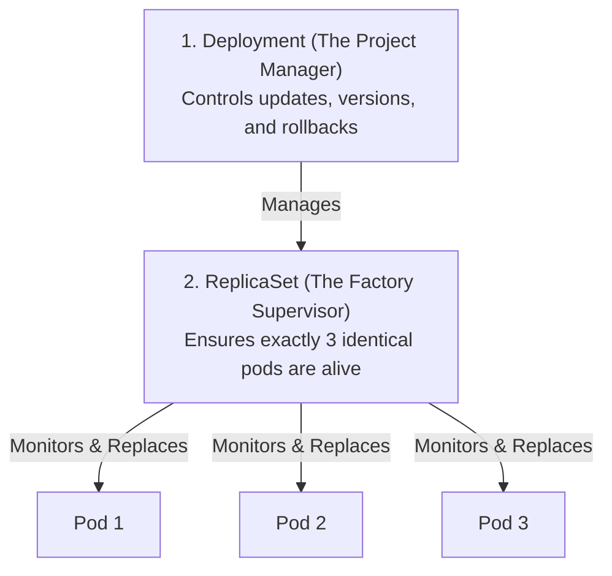
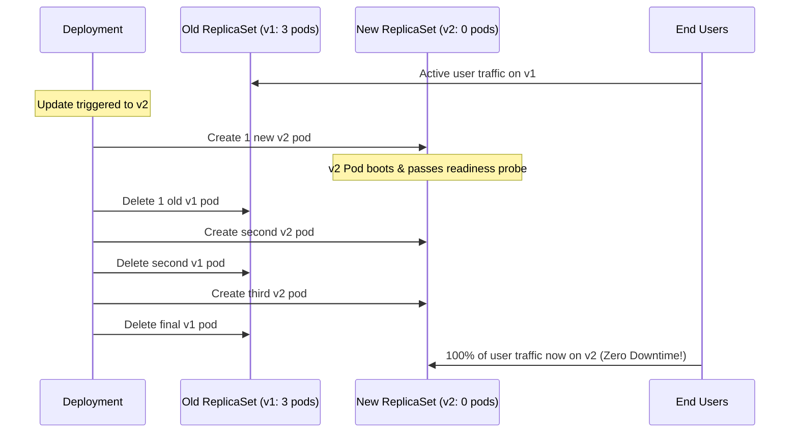

# Deployments, Rollouts, & Rollbacks — Novice-Friendly Study Guide

> **Official Curriculum Reference:** Domain: *Workloads and Scheduling (15%)*  
> **Official Documentation Links:**  
> - [Deployments Concepts](https://kubernetes.io/docs/concepts/workloads/controllers/deployment/)  
> - [Perform a Rolling Update on a Deployment](https://kubernetes.io/docs/tutorials/kubernetes-basics/update/update-intro/)  
> - [ReplicaSet Concepts](https://kubernetes.io/docs/concepts/workloads/controllers/replicaset/)

---

## 1. Explain Like I'm a Novice: Why Not Just Run Pods?

When people first learn Kubernetes, they run `kubectl run my-pod --image=nginx` and think, *"Great, my web server is running!"*

### The Problem with Standalone Pods:
A standalone Pod is like an individual **disposable paper cup**:
- If someone kicks the server, the power flickers, or the node runs out of memory, the Pod dies.
- **Kubernetes will never automatically recreate a standalone pod!** It is gone forever.
- If your website gets 10,000 visitors, you have to manually type `kubectl run` 10 times.
- If you release version 2.0 of your app, you have to manually delete all 10 old pods and type 10 new commands.

### The Solution: The Russian Nesting Dolls of Kubernetes
To manage real production applications, Kubernetes wraps Pods in controllers:



1. **Pod:** The actual container running your software.
2. **`ReplicaSet` (The Supervisor):** Watches the pods. If one pod crashes or gets deleted, the ReplicaSet immediately spawns a clone to take its place.
3. **`Deployment` (The General Manager):** Manages the ReplicaSets! When you want to upgrade from `v1` to `v2`, the Deployment seamlessly spins up a *new* ReplicaSet for `v2` while gracefully winding down the old ReplicaSet for `v1`.

---

## 2. Under the Hood: The Zero-Downtime Rolling Update

When you update an application image in a Deployment, it performs a **`RollingUpdate`** by default. It replaces pods gradually so your users never see a 404 error or downtime:



### The Math: `maxSurge` and `maxUnavailable`
You can fine-tune how fast this replacement happens:
- **`maxSurge` (Default 25%):** How many *extra* pods can be created above your desired replica count during the rollout. (e.g., If you have 4 replicas, maxSurge allows 5 pods to exist temporarily).
- **`maxUnavailable` (Default 25%):** How many pods can be taken offline at any one time. (e.g., If you have 4 replicas, at least 3 must always remain active and serving users).

---

## 3. Fast Imperative Deployment Commands

Never write Deployment YAML from scratch in the exam:

```bash
# 1. Create a deployment with 3 replicas:
kubectl create deploy web-app --image=nginx:1.24 --replicas=3

# 2. Upgrade the container image to 1.25:
kubectl set image deployment/web-app nginx=nginx:1.25

# 3. Watch the rollout in real-time:
kubectl rollout status deployment/web-app
```

---

## 4. The Emergency Undo Button: Rollbacks

Imagine you update your app to `nginx:1.26`, but the new version has a critical bug that crashes on startup. How do you recover?

### Step 1: Check the Rollout History
```bash
kubectl rollout history deployment/web-app
# Output:
# REVISION  CHANGE-CAUSE
# 1         <none>
# 2         <none>
# 3         <none>
```

### Step 2: Undo the Bad Update Instantly
```bash
# Revert to the immediately preceding version:
kubectl rollout undo deployment/web-app

# Or revert to a specific revision from the history table:
kubectl rollout undo deployment/web-app --to-revision=1
```
Kubernetes will immediately stop launching broken pods and roll your cluster back to the proven, stable version.

---

## 5. Pausing and Resuming (Batch Updates)

If you need to make several changes at once (e.g., change the image, update memory limits, and change environment variables), you don't want Kubernetes to trigger three separate rolling updates in a row.

You can **pause** the deployment:
```bash
# 1. Pause rollout
kubectl rollout pause deployment/web-app

# 2. Make multiple changes:
kubectl set resources deployment/web-app -c=nginx --limits=cpu=200m,memory=512Mi
kubectl set image deployment/web-app nginx=nginx:1.26

# 3. Resume rollout (applies all changes together in a single update!)
kubectl rollout resume deployment/web-app
```

---

## 6. Rookie Traps & Exam Gotchas

> [!CAUTION]
> 1. **Typo in Image Name Causes Rollout to Hang:** If you accidentally type `kubectl set image deployment/web-app nginx=nginx:1.99999` (a version that doesn't exist on Docker Hub), the new pod enters `ImagePullBackOff`. The rollout freezes! To unfreeze it, run `kubectl rollout undo deployment/web-app`.
> 2. **Restarting Without Changing Code:** If you updated a ConfigMap or Secret and need your pods to reload it, run `kubectl rollout restart deployment/web-app`. This restarts all pods sequentially without needing a new container image!
> 3. **Never Edit ReplicaSets Directly:** If you edit a ReplicaSet manually, the parent Deployment will notice the discrepancy and immediately overwrite your changes. Always edit the Deployment.

---

## 7. Knowledge Check Flashcards

1. **Q:** What Kubernetes object directly manages the lifecycle and replication of individual pods?  
   **A:** A `ReplicaSet`.
2. **Q:** What command rolls back a Deployment named `backend` to its previous working state?  
   **A:** `kubectl rollout undo deployment/backend`.
3. **Q:** How do you restart all pods in a Deployment sequentially without changing the container image or replica count?  
   **A:** `kubectl rollout restart deployment/<deployment-name>`.
