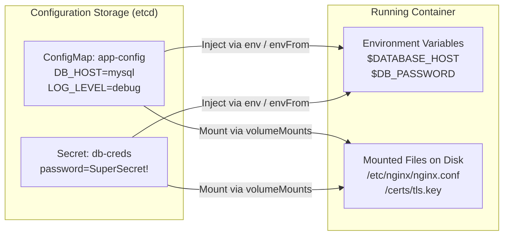

# Pod Configuration: ConfigMaps, Secrets, & SecurityContext — Novice-Friendly Study Guide

> **Official Curriculum Reference:** Domain: *Workloads and Scheduling (15%)*  
> **Official Documentation Links:**  
> - [ConfigMaps Overview](https://kubernetes.io/docs/concepts/configuration/configmap/)  
> - [Secrets Overview](https://kubernetes.io/docs/concepts/configuration/secret/)  
> - [Configure a Security Context for a Pod or Container](https://kubernetes.io/docs/tasks/configure-pod-container/security-context/)  
> - [Add Linux Capabilities to a Container](https://kubernetes.io/docs/tasks/configure-pod-container/security-context/#set-capabilities-for-a-container)

---

## 1. Explain Like I'm a Novice: The USB Thumb Drive Analogy

Imagine you are shipping 1,000 desktop computers to an office:
- If you hardcode the user's password, database host, and corporate background wallpaper directly onto the physical motherboard before shipping, changing a single password would require recalling and rebuilding the entire computer!
- Instead, you leave the operating system generic. When the computer arrives at a desk, you plug in a **USB thumb drive** containing a simple text file with that person's settings.

In Kubernetes:
- **`ConfigMap`:** A USB drive containing public, non-sensitive configuration settings (e.g. `DATABASE_HOST=postgres.internal`, `LOG_LEVEL=debug`).
- **`Secret`:** A password-protected USB drive containing sensitive credentials (e.g. database passwords, API tokens, TLS certificates).
- **The Golden Rule:** Never bake passwords or environment-specific URLs into your Docker image. Always inject them using ConfigMaps and Secrets!



---

## 2. Fast Imperative Creation (Save Time on the Exam!)

Never write YAML for a ConfigMap or Secret by hand:

### Create ConfigMaps:
```bash
# 1. From literal key-value pairs:
kubectl create cm app-settings \
  --from-literal=DB_PORT=5432 \
  --from-literal=ENVIRONMENT=production

# 2. From an existing configuration file on disk:
kubectl create cm nginx-config --from-file=/etc/nginx/nginx.conf

# 3. From a .env file:
kubectl create cm env-settings --from-env-file=settings.env
```

### Create Secrets:
```bash
# 1. Generic Secret (Key-value pairs):
kubectl create secret generic db-credentials \
  --from-literal=username=admin \
  --from-literal=password=P@ssw0rd987!

# 2. TLS Secret (SSL certificate and key):
kubectl create secret tls web-tls-cert --cert=server.crt --key=server.key
```

---

## 3. How Containers Read ConfigMaps & Secrets

You have two main choices for how your container consumes the configuration:

### Method A: As Environment Variables (`env` / `envFrom`)
When the container process boots up, Kubernetes injects the values into the Linux environment:

```yaml
spec:
  containers:
  - name: web-app
    image: nginx
    env:
    # 1. Pull a single key from a ConfigMap:
    - name: DB_PORT
      valueFrom:
        configMapKeyRef:
          name: app-settings
          key: DB_PORT
    # 2. Pull a single key from a Secret:
    - name: DB_PASSWORD
      valueFrom:
        secretKeyRef:
          name: db-credentials
          key: password
```

> [!NOTE]
> **Shortcut (`envFrom`):** If your ConfigMap has 20 keys and you don't want to type 20 lines, use `envFrom` to dump **all** keys into the container environment in one shot:
> ```yaml
> envFrom:
> - configMapRef:
>     name: app-settings
> ```

---

### Method B: As Mounted Files on Disk (Volume Mounts)
Instead of environment variables, Kubernetes can create actual files on the container's hard drive containing your configuration:

```yaml
spec:
  containers:
  - name: web-app
    image: nginx
    volumeMounts:
    - name: config-volume
      mountPath: /etc/config # Creates folder /etc/config inside the container
      readOnly: true
  volumes:
  - name: config-volume
    configMap:
      name: app-settings
```

---

## 4. The `subPath` Trap: How NOT to Wipe Out Existing Files

This is one of the most famous traps on the CKA exam:

Imagine your container image already comes with important default files in `/etc/nginx/conf.d/`.  
If you mount a ConfigMap directly to `mountPath: /etc/nginx/conf.d`, Kubernetes will **overlay the entire directory and erase all other files inside it!**

### The Solution: `subPath`
`subPath` tells Kubernetes: *"Do not overwrite the entire folder. Just slip this one individual file into the folder!"*

```yaml
spec:
  containers:
  - name: web-app
    image: nginx
    volumeMounts:
    # Mounts ONLY custom.conf without deleting any other files in /etc/nginx/conf.d/!
    - name: config-volume
      mountPath: /etc/nginx/conf.d/custom.conf
      subPath: custom.conf
  volumes:
  - name: config-volume
    configMap:
      name: nginx-custom-conf
```

---

## 5. SecurityContext: Giving Containers Safe Permissions

By default, Docker containers often run as `root` (UID 0). If an attacker hacks your container, they might gain root privileges on the physical host machine.

A **`SecurityContext`** defines the security boundaries:

```yaml
apiVersion: v1
kind: Pod
metadata:
  name: secure-app
spec:
  # Pod-level security: Applies to all containers in the pod
  securityContext:
    runAsUser: 1000  # Run as non-root user (UID 1000)
    runAsGroup: 3000 # Run with group GID 3000
    fsGroup: 2000    # Any files written to mounted volumes are owned by GID 2000
  containers:
  - name: app
    image: nginx
    # Container-level security (overrides pod-level):
    securityContext:
      allowPrivilegeEscalation: false # Child processes cannot gain higher privileges
      readOnlyRootFilesystem: true    # Container cannot modify its own hard drive!
      capabilities:
        add: ["NET_ADMIN"] # Grant network configuration powers without giving full root!
```

---

## 6. Rookie Traps & Exam Gotchas

> [!CAUTION]
> 1. **Base64 is NOT Encryption!** Kubernetes Secrets are stored in plain base64 encoding (e.g. `dXNlcm5hbWU=`). Anyone with access to the secret can decode it in 1 second by typing `echo <hash> | base64 -d`. Base64 is only obfuscation, not encryption.
> 2. **Environment Variables Don't Auto-Update:** If you edit a ConfigMap, pods reading it via `env:` or `envFrom:` will **never** see the update until you restart the pod (`kubectl rollout restart`). Volumes *do* update automatically within a minute.
> 3. **Missing Secret/ConfigMap Causes `CreateContainerConfigError`:** If a pod remains in `CreateContainerConfigError`, run `kubectl describe pod <name>`. It almost always means a referenced ConfigMap or Secret name was mistyped.

---

## 7. Knowledge Check Flashcards

1. **Q:** What is the fundamental difference between a ConfigMap and a Secret in Kubernetes?  
   **A:** ConfigMaps store non-sensitive configuration in plaintext; Secrets store sensitive credentials (base64 encoded, and optionally encrypted at rest in etcd).
2. **Q:** How do you mount a single file from a ConfigMap into a container directory without overwriting existing files in that directory?  
   **A:** Use the `subPath` property inside `spec.containers[*].volumeMounts`.
3. **Q:** What happens to a pod if it tries to start but its referenced Secret does not exist?  
   **A:** The pod fails to start and enters the `CreateContainerConfigError` state.
