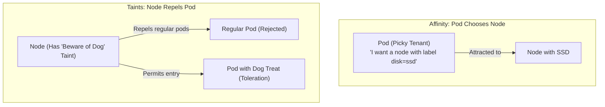

# Advanced Scheduling: Affinity, Taints, & Tolerations — Novice-Friendly Study Guide

> **Official Curriculum Reference:** Domain: *Workloads and Scheduling (15%)*  
> **Official Documentation Links:**  
> - [Assigning Pods to Nodes](https://kubernetes.io/docs/concepts/scheduling-eviction/assign-pod-node/)  
> - [Taints and Tolerations](https://kubernetes.io/docs/concepts/scheduling-eviction/taint-and-toleration/)  
> - [Pod Topology Spread Constraints](https://kubernetes.io/docs/concepts/scheduling-eviction/topology-spread-constraints/)

---

## 1. Explain Like I'm a Novice: How Does Kubernetes Choose Where Pods Live?

When you tell Kubernetes *"run 3 copies of my app"*, it doesn't just throw them randomly onto any server. It has an intelligent matchmaker called the **`kube-scheduler`**.

To understand how scheduling works, use this real estate analogy:

| Concept | Real-World Analogy | Direction of Preference |
| :--- | :--- | :--- |
| **`nodeSelector` / `nodeAffinity`** | A **picky tenant** looking for an apartment: *"I refuse to live anywhere without a balcony and an elevator."* | The **Pod** chooses the **Node**. |
| **Taints & Tolerations** | An apartment building with a **"No Pets Allowed"** or **"Hazmat Suit Required"** sign on the front door. Regular tenants are turned away, but someone with a certified service dog license (**Toleration**) is permitted entry. | The **Node** repels the **Pod**. |
| **Pod Anti-Affinity** | Two rival sports teams that **refuse to stay in the same hotel**. | The **Pods** stay away from each other. |



---

## 2. The Picky Pod: `nodeSelector` vs. `nodeAffinity`

### The Simple Way: `nodeSelector`
The simplest way to bind a pod to specific nodes is key-value label matching:

1. **Tag the physical server with a label:**
   ```bash
   kubectl label nodes node01 hardware=gpu
   ```
2. **Tell the pod to require that label:**
   ```yaml
   spec:
     nodeSelector:
       hardware: gpu
   ```
If no node has `hardware=gpu`, the pod stays in **`Pending`** forever.

---

### The Powerful Way: `nodeAffinity`
`nodeSelector` is all-or-nothing and very basic. `nodeAffinity` gives you rich rules and soft preferences:

```yaml
spec:
  affinity:
    nodeAffinity:
      # 1. HARD RULE: Must be in US East (or pod will refuse to run!)
      requiredDuringSchedulingIgnoredDuringExecution:
        nodeSelectorTerms:
        - matchExpressions:
          - key: topology.kubernetes.io/zone
            operator: In
            values:
            - us-east-1a
            - us-east-1b

      # 2. SOFT RULE: I prefer SSD disks if available, but HDD is okay if cluster is busy
      preferredDuringSchedulingIgnoredDuringExecution:
      - weight: 80 # Score from 1 to 100
        preference:
          matchExpressions:
          - key: disktype
            operator: In
            values:
            - ssd
```

### Decoding that giant Kubernetes property name:
`requiredDuringSchedulingIgnoredDuringExecution`:
- **`requiredDuringScheduling`:** During the moment the scheduler picks a node, this rule **must** be satisfied.
- **`IgnoredDuringExecution`:** If the node label changes *after* the pod is already running, Kubernetes will not kill the running pod.

---

## 3. The Grumpy Node: Taints and Tolerations

While Affinity attracts pods to nodes, **Taints** allow a node to push pods away.

### Real-World Use Cases for Taints:
1. **Dedicated Master Nodes:** You don't want regular web applications running on your control plane and hogging CPU from `kube-apiserver`. The master node is tainted by default.
2. **Expensive GPU Hardware:** You only want machine learning workloads to touch expensive GPU nodes.
3. **Unhealthy Nodes:** When a node runs out of disk, Kubernetes automatically taints it with `node.kubernetes.io/disk-pressure:NoSchedule`.

---

### The Three Taint Effects:
```bash
kubectl taint nodes node01 key=value:Effect
```

| Effect | What It Does in Plain English |
| :--- | :--- |
| **`NoSchedule`** | New pods without a matching toleration will **not** be placed on this node. Existing pods already running on this node are left alone. |
| **`PreferNoSchedule`** | Kube-scheduler will try to avoid placing pods here, but if all other nodes are full, it will use this node as a last resort. |
| **`NoExecute`** | **Eviction!** New pods without a toleration are rejected. Any regular pod already running on the node is **immediately evicted and terminated**! |

### How to Add and Remove Taints:
```bash
# Add a NoSchedule taint:
kubectl taint nodes node01 tier=database:NoSchedule

# Remove the taint (notice the '-' minus at the end!):
kubectl taint nodes node01 tier=database:NoSchedule-
```

### Giving a Pod a "Toleration":
To allow a pod to land on a tainted node:
```yaml
spec:
  tolerations:
  - key: "tier"
    operator: "Equal"
    value: "database"
    effect: "NoSchedule"
```

---

## 4. Keeping Replicas Apart: Pod Anti-Affinity

If you run 3 replicas of your web server, putting all 3 on the same physical server is dangerous: if that server's power supply dies, your entire website goes offline!

**Pod Anti-Affinity** tells Kubernetes: *"Do not put this pod on any physical machine that is already running another copy of this app."*

```yaml
spec:
  affinity:
    podAntiAffinity:
      requiredDuringSchedulingIgnoredDuringExecution:
      - labelSelector:
          matchExpressions:
          - key: app
            operator: In
            values:
            - web-store
        topologyKey: "kubernetes.io/hostname" # Evaluates per individual host
```

---

## 5. Rookie Traps & Exam Gotchas

> [!CAUTION]
> 1. **A Toleration is NOT an Attraction!**  
>    This is the #1 mistake novices make: A toleration gives a pod *permission* to land on a tainted node, but it does not force it there! If `node01` is tainted and `node02` is clean, a pod with a toleration might still land on `node02`. If you want a pod to go **only** to `node01`, you must use **both** a Toleration AND a `nodeSelector`/`nodeAffinity`.
> 2. **`NoExecute` Evicts Running Pods Instantly:** Be extremely careful when running `kubectl taint nodes ... :NoExecute` on a live node. Any pod on that node without a toleration will be killed immediately.
> 3. **Taint Removal Syntax:** You remove a taint by typing the exact key and effect followed by a minus sign (`-`), e.g., `kubectl taint nodes worker1 dedicated:NoSchedule-`.

---

## 6. Knowledge Check Flashcards

1. **Q:** What is the difference between `nodeAffinity` and `Taints`?  
   **A:** `nodeAffinity` is configured on Pods to attract them to specific Nodes; `Taints` are configured on Nodes to repel Pods.
2. **Q:** Does giving a Pod a toleration force it to be scheduled on that specific tainted node?  
   **A:** No. A toleration only permits the pod to land there; it does not mandate it.
3. **Q:** What taint effect causes currently running pods without a matching toleration to be evicted from the node?  
   **A:** `NoExecute`.
