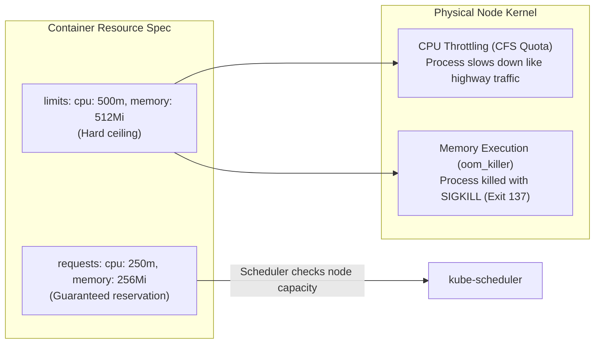

# Resource Management & Horizontal Pod Autoscaler (HPA) — Novice-Friendly Study Guide

> **Official Curriculum Reference:** Domain: *Workloads and Scheduling (15%)*  
> **Official Documentation Links:**  
> - [Managing Compute Resources for Containers](https://kubernetes.io/docs/concepts/configuration/manage-resources-containers/)  
> - [Horizontal Pod Autoscaling](https://kubernetes.io/docs/tasks/run-application/horizontal-pod-autoscale/)  
> - [Configure Quality of Service for Pods](https://kubernetes.io/docs/tasks/configure-pod-container/quality-service-pod/)

---

## 1. Explain Like I'm a Novice: Hotel Rooms & Thermostats

When multiple applications share physical servers, they compete for two finite physical resources: **CPU (Processing power)** and **Memory (RAM)**.

### Requests vs. Limits: The Hotel Room Analogy
To understand the difference between `requests` and `limits`, think of booking a hotel room:

| Concept | What It Is | Real-World Analogy | What Happens If Exceeded? |
| :--- | :--- | :--- | :--- |
| **`requests`** | **The Guaranteed Minimum.** The scheduler uses this to pick a server with enough empty space. | The minimum number of beds you book when reserving a room. The hotel won't let you book if they don't have enough beds. | Nothing bad; you are guaranteed this capacity. |
| **`limits`** | **The Hard Maximum Ceiling.** The maximum compute a container is allowed to consume. | The maximum occupancy fire code. If you invite 40 people into a 2-person room, hotel security shuts down the party! | **CPU:** Throttled (slowed down).<br>**Memory:** **OOMKilled!** (Terminated instantly). |



### Why CPU Throttles, but Memory Dies:
- **CPU is "Compressible":** Think of CPU like traffic lanes on a highway. If too many cars try to drive, traffic slows down, but nobody explodes. Kubernetes simply throttles the container's CPU cycles.
- **Memory is "Non-Compressible":** If you try to pour 2 liters of water into a 1-liter jug, the water spills over. A computer cannot "slow down" RAM; if you run out of physical bytes, the Linux kernel has no choice but to immediately shoot the process in the head (`SIGKILL`, **Exit Code 137**).

---

## 2. Demystifying Resource Units

### CPU Units (Millicores):
In Kubernetes, CPU is measured in fractions of a CPU core:
- `1` = 1 full CPU core / vCPU.
- `500m` = Half a core (500 millicores).
- `250m` = One-quarter of a core (250 millicores).

### Memory Units (Mi vs M):
- Always use **`Mi`** (Mebibytes, powers of 2) and **`Gi`** (Gibibytes) in Kubernetes.
- `256Mi` = 256 Megabytes.
- `1Gi` = 1 Gigabyte (1,024 Megabytes).

---

## 3. Horizontal Pod Autoscaler (HPA): The Living Room Thermostat

Imagine a smart thermostat in your home:
- When the room gets too hot (CPU spikes above 70%), the thermostat turns on extra air conditioners (spawns more Pod replicas).
- When the room cools down, it turns off the extra units to save electricity (scales down replicas).

That is exactly what the **Horizontal Pod Autoscaler (HPA)** does.

### The Autoscaling Formula:
Every 15 seconds, the HPA checks how hard your pods are working:
$$\text{Desired Replicas} = \left\lceil \text{Current Replicas} \times \left( \frac{\text{Current Metric Value}}{\text{Target Metric Value}} \right) \right\rceil$$

---

## 4. Imperative & Declarative HPA Management

### Quick Imperative Command (Fastest for the Exam!):
```bash
# Autoscale deployment based on 60% average CPU utilization
kubectl autoscale deployment web-deploy \
  --min=2 \
  --max=8 \
  --cpu-percent=60
```

### Complete Declarative HPA v2 Manifest:
```yaml
apiVersion: autoscaling/v2
kind: HorizontalPodAutoscaler
metadata:
  name: web-hpa
  namespace: default
spec:
  scaleTargetRef:
    apiVersion: apps/v1
    kind: Deployment
    name: web-deploy
  minReplicas: 2
  maxReplicas: 10
  metrics:
  - type: Resource
    resource:
      name: cpu
      target:
        type: Utilization
        averageUtilization: 60
```

---

## 5. The Two Mandatory Prerequisites for HPA

> [!IMPORTANT]
> If your HPA shows `<unknown>/60%` under the `TARGETS` column, it is failing!  
> For an HPA to function, two things must be true:
> 1. **Metrics-Server must be running:** Verify with `kubectl top pods`.
> 2. **Containers MUST have `resources.requests.cpu` defined!** If your pod template does not declare a CPU request, Kubernetes has no baseline to calculate a percentage!

---

## 6. Rookie Traps & Exam Gotchas

> [!CAUTION]
> 1. **The `<unknown>` HPA Metric Trap:** If `kubectl get hpa` displays `TARGETS: <unknown>/70%`, check the Deployment YAML immediately. You forgot to specify `resources.requests.cpu` in the container specification!
> 2. **Setting Limits Lower than Requests:** `limits` must always be greater than or equal to `requests`. If you specify `requests.cpu: 500m` and `limits.cpu: 250m`, Kubernetes will reject the YAML with a validation error.
> 3. **Memory Limits in Heavy Java / Node.js Apps:** Java virtual machines and Node.js often allocate heap memory generously. If your limit is set too tight, the container will bounce repeatedly in `OOMKilled` (Exit Code 137).

---

## 7. Knowledge Check Flashcards

1. **Q:** What happens to a container when it exceeds its configured memory limit?  
   **A:** It is immediately terminated by the Linux kernel OOM killer (`SIGKILL`, exit code 137).
2. **Q:** What happens to a container when it exceeds its configured CPU limit?  
   **A:** It is throttled via kernel CFS quota (it slows down, but does not crash).
3. **Q:** Why does an HPA show `<unknown>` for its target metric utilization percentage?  
   **A:** The target Deployment pod template lacks a `resources.requests.cpu` definition, or `metrics-server` is unavailable.
