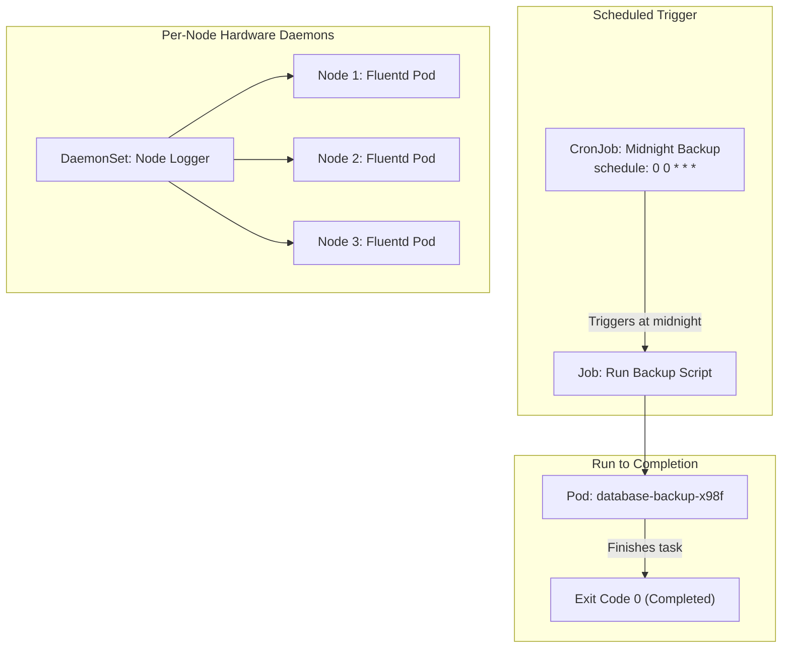

# Static Pods, DaemonSets, Jobs, & CronJobs — Novice-Friendly Study Guide

> **Official Curriculum Reference:** Domain: *Workloads and Scheduling (15%)*  
> **Official Documentation Links:**  
> - [Create Static Pods](https://kubernetes.io/docs/tasks/configure-pod-container/static-pod/)  
> - [DaemonSet Concepts](https://kubernetes.io/docs/concepts/workloads/controllers/daemonset/)  
> - [Jobs Overview](https://kubernetes.io/docs/concepts/workloads/controllers/job/)  
> - [CronJob Documentation](https://kubernetes.io/docs/concepts/workloads/controllers/cron-jobs/)

---

## 1. Explain Like I'm a Novice: Beyond Standard Web Apps

Most introductory tutorials teach you `Deployments` (which are great for web servers that run 24/7 and scale up and down).

But real IT infrastructure requires other types of work:
- What if you need a logging agent running on **every single physical server**?
- What if you need a script to run **once, finish a calculation, and shut down**?
- What if you need a database backup to execute **every night at midnight**?

Kubernetes provides specialized workload primitives for each of these:

| Primitive | Real-World Analogy | Lifecycle Behavior |
| :--- | :--- | :--- |
| **`DaemonSet`** | **The Fire Extinguisher on Every Floor:** Ensures exactly one copy of a pod runs on every physical node. If you add 5 new servers, it automatically puts a pod on each one. | Runs 24/7, exactly 1 copy per node. |
| **`Job`** | **The Temp Contractor:** Hired to complete one chore (e.g., generate reports, migrate a database schema). When finished, they clock out and leave. | Runs until successful completion (`Exit Code 0`), then stops. |
| **`CronJob`** | **The Automated Calendar Alarm Clock:** Wakes up on a schedule (e.g. `0 0 * * *`), hires a Temp Contractor (`Job`), and goes back to sleep. | Triggered periodically on a cron schedule. |
| **`Static Pod`** | **The Local Building Caretaker:** Managed by the local server foreman (`kubelet`) from a folder on the hard drive, completely independent of headquarters. | Starts when node boots; cannot be deleted via `kubectl`. |



---

## 2. Converting a Deployment to a DaemonSet (Exam Speedrun!)

There is no direct `kubectl create daemonset` imperative command.  
**The Exam Trick:** Generate a Deployment YAML, and change 3 lines!

```bash
# 1. Generate deployment YAML:
kubectl create deploy my-daemon --image=fluentd --dry-run=client -o yaml > ds.yaml
```

Edit `ds.yaml`:
```yaml
apiVersion: apps/v1
kind: DaemonSet            # 1. Change 'Deployment' to 'DaemonSet'
metadata:
  name: my-daemon
spec:
  # 2. DELETE the 'replicas:' line completely!
  # 3. DELETE 'strategy:' block if present.
  selector:
    matchLabels:
      app: my-daemon
  template:
    metadata:
      labels:
        app: my-daemon
    spec:
      containers:
      - name: fluentd
        image: fluentd
```
Apply:
```bash
kubectl apply -f ds.yaml
```

---

## 3. Jobs: Running to Completion

Unlike web servers, batch Jobs are meant to stop when they are finished:

```yaml
apiVersion: batch/v1
kind: Job
metadata:
  name: image-compression-job
spec:
  completions: 4        # Must successfully finish 4 pods in total
  parallelism: 2        # Run 2 pods concurrently
  backoffLimit: 3       # Retry 3 times if a pod fails before giving up
  activeDeadlineSeconds: 300 # Kill the job if it takes longer than 5 minutes!
  template:
    spec:
      # MANDATORY SETTING: Must be OnFailure or Never (NOT Always!)
      restartPolicy: OnFailure
      containers:
      - name: worker
        image: busybox
        command: ["sh", "-c", "echo 'Compressing batch...' && sleep 5"]
```

---

## 4. CronJobs: Automated Scheduled Tasks

```yaml
apiVersion: batch/v1
kind: CronJob
metadata:
  name: nightly-cleanup
spec:
  schedule: "0 2 * * *" # Run at 02:00 UTC every single day
  concurrencyPolicy: Forbid # What if the last job is still running? (Allow, Forbid, Replace)
  successfulJobsHistoryLimit: 3 # Keep logs of last 3 successful runs
  failedJobsHistoryLimit: 1
  jobTemplate:
    spec:
      template:
        spec:
          restartPolicy: OnFailure
          containers:
          - name: cleaner
            image: busybox
            command: ["sh", "-c", "echo 'Wiping temp cache...'"]
```

### Quick Cron Schedule Cheat Sheet:
- `*/5 * * * *` = Every 5 minutes
- `0 * * * *`   = At the top of every hour
- `0 0 * * *`   = Every midnight
- `0 0 * * 0`   = Every Sunday at midnight

---

## 5. Static Pods: The Node-Level Survivalist

A Static Pod does not care if the API server or master node is down. It is launched directly by the `kubelet` on that machine:

1. **SSH to target node:** `ssh node01`
2. **Find the static folder:** `grep -i staticpod /var/lib/kubelet/config.yaml`  
   *(Default: `/etc/kubernetes/manifests/`)*
3. **Drop the manifest in that folder:**
   ```bash
   kubectl run local-agent --image=nginx --dry-run=client -o yaml > /etc/kubernetes/manifests/local-agent.yaml
   ```
4. Kubelet automatically launches the pod with the suffix `-node01`.

---

## 6. Rookie Traps & Exam Gotchas

> [!CAUTION]
> 1. **Job `restartPolicy: Always` is Forbidden:** Pods inside Jobs and CronJobs cannot have `restartPolicy: Always`. If you leave it as `Always`, `kubectl apply` will reject the file! Change it to `OnFailure` or `Never`.
> 2. **Static Pod Mirror Deletion Trap:** Typing `kubectl delete pod <static-pod>` from your workstation only deletes the mirror representation. Kubelet will recreate it 2 seconds later. You must SSH into the node and remove the file from `/etc/kubernetes/manifests/`.
> 3. **CronJob Concurrency Policies:**  
>    - `Allow` (default): If job #1 is slow, job #2 starts anyway.  
>    - `Forbid`: Skips job #2 if job #1 hasn't finished yet.

---

## 7. Knowledge Check Flashcards

1. **Q:** What is the primary difference between a Deployment and a DaemonSet?  
   **A:** A Deployment runs an arbitrary number of replicas wherever there is capacity; a DaemonSet runs exactly one replica on every physical node.
2. **Q:** What valid values can be specified for `restartPolicy` inside a Kubernetes Job?  
   **A:** `OnFailure` or `Never` (never `Always`).
3. **Q:** How do you permanently delete a static pod?  
   **A:** SSH into the host machine and remove its YAML manifest from the `/etc/kubernetes/manifests/` directory.
