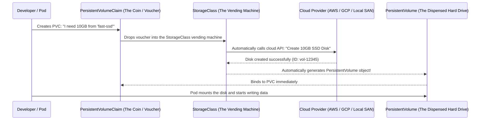

# StorageClasses & Dynamic Provisioning — Novice-Friendly Study Guide

> **Official Curriculum Reference:** Domain: *Storage (10%)*  
> **Official Documentation Links:**  
> - [Storage Classes Documentation](https://kubernetes.io/docs/concepts/storage/storage-classes/)  
> - [Dynamic Volume Provisioning](https://kubernetes.io/docs/concepts/storage/dynamic-provisioning/)  
> - [Change the default StorageClass](https://kubernetes.io/docs/tasks/administer-cluster/change-default-storage-class/)

---

## 1. Explain Like I'm a Novice: The On-Demand 3D-Printed Locker Analogy

Imagine running a self-storage rental facility:

### The Old Way: Static Provisioning
- The facility manager had to guess how much storage people would need, hire contractors, and manually build 50 concrete lockers ahead of time (e.g. five 10GB units, ten 50GB units).
- If a customer arrives with a voucher (**PVC**) asking for a 12GB locker, the manager has to give them a 50GB locker! 38GB of expensive disk space is completely wasted.
- If all lockers are occupied, the customer must call the administrator at 2:00 AM to manually build another one.

### The Modern Way: Dynamic Provisioning with `StorageClass`
- There are no pre-built lockers sitting empty collecting dust.
- Instead, the facility has an **automated robotic 3D printer** (the `StorageClass` provisioner).
- When a developer creates a **PVC** asking for "7GB on fast SSD", the robot calls the cloud provider's API (AWS, GCP, Azure), provisions a real 7GB disk on the fly, instantiates a **PersistentVolume (PV)** automatically, and hands it to the pod. Zero human intervention required!

### What is `volumeBindingMode: WaitForFirstConsumer`?
Imagine your company has datacenters in New York and London:
- If the robot creates a physical hard drive in New York the moment the PVC is requested, but your Pod gets scheduled to a server in London, **the Pod can never touch that hard drive!**
- `WaitForFirstConsumer` tells the robot: *"Don't build the hard drive yet. Wait until the scheduler decides which node or datacenter the Pod will actually run on, and then build the hard drive right there!"*

---

## 2. Under the Hood: Dynamic Provisioning Workflow



You define the "types" of storage your company offers (e.g. `cheap-hdd`, `fast-ssd`, `nfs-shared`).  
When a developer submits a claim (`PersistentVolumeClaim`), the StorageClass **provisions the real disk on demand without any human involvement!**

---

## 2. Anatomy of a StorageClass

```yaml
apiVersion: storage.k8s.io/v1
kind: StorageClass
metadata:
  name: fast-ssd
provisioner: kubernetes.io/no-provisioner # Or CSI provisioner (e.g. ebs.csi.aws.com)
volumeBindingMode: WaitForFirstConsumer  # CRUCIAL PROPERTY!
reclaimPolicy: Delete                    # Delete underlying disk when PVC deleted
allowVolumeExpansion: true               # Allows increasing disk size later
parameters:
  type: gp3
  fsType: ext4
```

---

## 3. The Most Important Setting: `volumeBindingMode`

There are only two choices for `volumeBindingMode`, and understanding the difference is an exam game-changer:

### 1. `Immediate` (Default)
As soon as the developer creates the PVC, the StorageClass rushes to create the disk in the cloud.
- **The Danger (Zone Mismatch):** Imagine AWS creates the disk in datacenter `us-east-1a`. But 5 minutes later, when you launch the Pod, all servers in `us-east-1a` are full, so the scheduler places the Pod on a server in `us-east-1b`. AWS cannot attach an EBS disk from zone `1a` to a server in zone `1b`! The pod stays in `Pending` forever!

### 2. `WaitForFirstConsumer` (The Smart Way)
Tells the vending machine: *"Do NOT create the hard drive yet! Wait until a Pod actually tries to use this PVC. See which physical server/datacenter zone the scheduler picks for the Pod first, and THEN create the hard drive in that exact same zone!"*

> [!NOTE]
> When `WaitForFirstConsumer` is enabled, a newly created PVC will show status **`Pending`** until a Pod that mounts it is created. **This is completely normal, not an error!**

---

## 4. Setting a Default StorageClass

If a developer creates a PVC without specifying a `storageClassName`, Kubernetes checks if a **default StorageClass** exists.

You mark a StorageClass as default using an annotation:
```bash
kubectl annotate storageclass fast-ssd storageclass.kubernetes.io/is-default-class="true" --overwrite
```

Verify with:
```bash
kubectl get sc
# Output:
# NAME                 PROVISIONER             RECLAIMPOLICY   VOLUMEBINDINGMODE
# fast-ssd (default)   kubernetes.io/no-prov   Delete          WaitForFirstConsumer
```

---

## 5. Rookie Traps & Exam Gotchas

> [!CAUTION]
> 1. **Panic Over `Pending` PVC with `WaitForFirstConsumer`:** If you create a PVC and see `STATUS: Pending` with message `waiting for first consumer to be created before binding`, do not delete it! The question expects you to deploy the Pod next. As soon as the Pod is created, the PVC binds.
> 2. **StorageClasses are Immutable:** You cannot edit an existing StorageClass to change its provisioner or volumeBindingMode. You must delete it (`kubectl delete sc <name>`) and recreate it.
> 3. **Volume Expansion:** To allow increasing a PVC's size from 10Gi to 20Gi later, `allowVolumeExpansion: true` must be set in the StorageClass.

---

## 6. Knowledge Check Flashcards

1. **Q:** What is the primary benefit of dynamic volume provisioning over static provisioning?  
   **A:** Disks are automatically created on-demand when a PVC is submitted, without an administrator having to manually create PersistentVolumes.
2. **Q:** Why is `volumeBindingMode: WaitForFirstConsumer` recommended for multi-zone cloud clusters?  
   **A:** It delays disk creation until the pod is scheduled to a specific node, ensuring the storage volume is provisioned in the exact same availability zone as the node.
3. **Q:** What annotation marks a StorageClass as the cluster default?  
   **A:** `storageclass.kubernetes.io/is-default-class="true"`.
