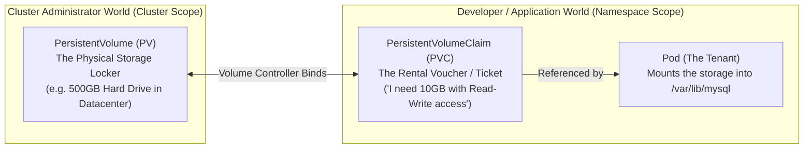

# PersistentVolumes (PV) & Claims (PVC) — Novice-Friendly Study Guide

> **Official Curriculum Reference:** Domain: *Storage (10%)*  
> **Official Documentation Links:**  
> - [Persistent Volumes Concepts](https://kubernetes.io/docs/concepts/storage/persistent-volumes/)  
> - [Configure a Pod to Use a PersistentVolume](https://kubernetes.io/docs/tasks/configure-pod-container/configure-persistent-volume-storage/)  
> - [Reclaiming PersistentVolumes](https://kubernetes.io/docs/concepts/storage/persistent-volumes/#reclaiming)

---

## 1. Explain Like I'm a Novice: The Airbnb Storage Locker Analogy

By default, a container's filesystem is completely **ephemeral**:
- Running an app inside a container is like staying in an **Airbnb rental**:
- If you buy groceries, write notes on the desk, and store files on the local drive, the moment your stay ends (the container crashes or updates), the cleaning crew resets the apartment to factory settings. **All your data is erased permanently!**

If your application is a database (like PostgreSQL or MySQL), losing all customer orders every time a container restarts is a total disaster.

To solve this, Kubernetes separates storage into two distinct pieces:



1. **PersistentVolume (PV) = The Storage Locker:**  
   The actual, physical disk drive (on AWS EBS, an NFS server, or local server disk) provisioned by the cluster administrator. It exists at the cluster level and has no namespace.
2. **PersistentVolumeClaim (PVC) = The Rental Voucher:**  
   A request written by a developer: *"I need a storage locker that has at least 10GB of space and allows read-write access."*
3. **The Binding Matchmaker:**  
   Kubernetes automatically searches all available PVs. When it finds a PV that satisfies the PVC's voucher, it **binds** them together permanently.

---

## 2. Decoded: The 4 Storage Access Modes

When renting a storage locker, you must specify who is allowed to use the key:

| Access Mode | Shorthand | Plain English Explanation | Real-World Analogy |
| :--- | :---: | :--- | :--- |
| **`ReadWriteOnce`** | `RWO` | Can be mounted as read-write by a **single node** at a time. Other nodes are locked out. | A private safe with one physical key held by one person. |
| **`ReadOnlyMany`** | `ROX` | Can be mounted by **many nodes simultaneously**, but **only for reading** (no writing). | A published book in a library: 50 people can read it, but no one can write in it. |
| **`ReadWriteMany`** | `RWX` | **Multiple nodes can read and write simultaneously** (requires network storage like NFS or Ceph). | A shared Google Doc or public whiteboard where multiple people write at once. |
| **`ReadWriteOncePod`** | `RWOP` | Can be mounted as read-write by a **single pod** (even more restrictive than RWO). | A personal diary that only one specific individual can touch. |

---

## 3. Creating a PersistentVolume (PV)

This is cluster-scoped (it does **not** have a `namespace:` field):

```yaml
apiVersion: v1
kind: PersistentVolume
metadata:
  name: database-pv
  labels:
    tier: database
spec:
  capacity:
    storage: 10Gi
  accessModes:
    - ReadWriteOnce
  persistentVolumeReclaimPolicy: Retain
  storageClassName: manual
  hostPath:
    path: /data/db-files # Directory on the physical host machine
    type: DirectoryOrCreate
```

---

## 4. Creating a PersistentVolumeClaim (PVC)

This is namespace-scoped (created inside your app's namespace):

```yaml
apiVersion: v1
kind: PersistentVolumeClaim
metadata:
  name: database-pvc
  namespace: default
spec:
  accessModes:
    - ReadWriteOnce
  resources:
    requests:
      storage: 5Gi         # Asks for 5Gi (can bind to the 10Gi PV!)
  storageClassName: manual # Must match the PV's storageClassName
```

Check the status:
```bash
kubectl get pvc database-pvc
# Output must show STATUS: Bound
```

---

## 5. Attaching the PVC to a Pod

Once the PVC is `Bound`, attach it to your container:

```yaml
apiVersion: v1
kind: Pod
metadata:
  name: mysql-pod
spec:
  containers:
  - name: mysql
    image: mysql:8.0
    env:
    - name: MYSQL_ROOT_PASSWORD
      value: "supersecret"
    volumeMounts:
    - name: data-volume
      mountPath: /var/lib/mysql # Where MySQL saves its tables
  volumes:
  - name: data-volume
    persistentVolumeClaim:
      claimName: database-pvc   # Points to our PVC voucher!
```

---

## 6. What Happens When You Delete the PVC? (`reclaimPolicy`)

When you delete a PVC, what happens to the underlying physical data on the PV? That is determined by the **`persistentVolumeReclaimPolicy`**:

1. **`Delete` (Default in cloud):**  
   The underlying cloud storage (e.g. AWS EBS volume) is immediately wiped and destroyed. Data is lost forever.
2. **`Retain` (Recommended for safety):**  
   The PV is **not** deleted! It moves into **`Released`** status. The data is preserved on disk so an admin can manually recover it.

### How to Reuse a "Released" PV:
If a PV is in `Released` status, no new PVC can bind to it because it is still holding onto the old claim pointer (`claimRef`). To make it `Available` again:
```bash
# Strip the claimRef pointer:
kubectl patch pv database-pv -p '{"spec":{"claimRef": null}}'

# Verify status returned to Available:
kubectl get pv database-pv
```

---

## 7. Rookie Traps & Exam Gotchas

> [!CAUTION]
> 1. **Putting a `namespace:` inside a `PersistentVolume`:** PVs are cluster-wide infrastructure resources. If you specify `namespace: prod` in a PV YAML, Kubernetes will ignore or reject it. Only PVCs have namespaces!
> 2. **Size Request is a Minimum, Not a Limit:** A PVC requesting `5Gi` **can and will** bind to a `10Gi` PV if it matches all other criteria. But a PVC requesting `20Gi` will sit in `Pending` forever if the largest available PV is only `10Gi`.
> 3. **Access Modes are PascalCase:** Writing `accessModes: [readwriteonce]` will fail validation. It must be capitalized: `ReadWriteOnce`.

---

## 8. Knowledge Check Flashcards

1. **Q:** What is the difference between a PersistentVolume and a PersistentVolumeClaim?  
   **A:** A PersistentVolume is the actual storage resource provisioned on the cluster; a PersistentVolumeClaim is a request/voucher by a user for storage of a specific size and access mode.
2. **Q:** Which access mode allows pods on multiple different nodes to write data to the volume at the same time?  
   **A:** `ReadWriteMany` (RWX).
3. **Q:** Why does a PV with `reclaimPolicy: Retain` transition to `Released` instead of `Available` when its PVC is deleted?  
   **A:** To protect existing data from being accidentally overwritten by a new claim until an administrator reviews it.
