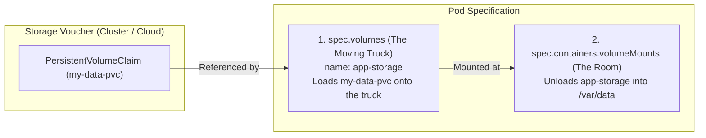
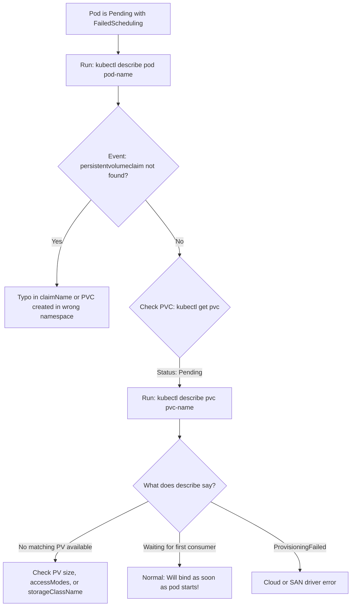

# Pod Volume Attachments & Storage Troubleshooting — Novice-Friendly Study Guide

> **Official Curriculum Reference:** Domain: *Storage (10%)*  
> **Official Documentation Links:**  
> - [Volumes Overview](https://kubernetes.io/docs/concepts/storage/volumes/)  
> - [Persistent Volumes & Claims](https://kubernetes.io/docs/concepts/storage/persistent-volumes/)  
> - [Configure a Pod to Use a PersistentVolume](https://kubernetes.io/docs/tasks/configure-pod-container/configure-persistent-volume-storage/)  
> - [Troubleshooting Volume Attachments](https://kubernetes.io/docs/concepts/storage/volume-health-monitoring/)

---

## 1. Explain Like I'm a Novice: The Moving Truck & Coaster Analogy

In the previous chapter, we learned that:
- The physical storage drive is the **PersistentVolume (PV)**.
- Your rental voucher is the **PersistentVolumeClaim (PVC)**.

Now, how do you actually bring the contents of that storage locker into your running container?

Kubernetes divides this into two distinct steps inside the Pod manifest:



1. **`spec.volumes` (The Moving Truck):**  
   Parked outside the Pod. It fetches the storage locker referenced by `claimName: my-data-pvc` and gives it a temporary label (e.g. `name: app-storage`).
2. **`spec.containers[*].volumeMounts` (Unloading into the Room):**  
   Tells the container where to unpack that truck inside its filesystem (e.g. `mountPath: /var/data`).

---

## 2. Complete Pod Volume Attachment Manifest

```yaml
apiVersion: v1
kind: Pod
metadata:
  name: web-database-pod
  namespace: default
spec:
  containers:
  - name: web-app
    image: nginx
    volumeMounts:
    # STEP 2: Where to unpack the truck inside the container
    - name: app-storage
      mountPath: /usr/share/nginx/html
      readOnly: false # Can be true if you want write protection
  volumes:
  # STEP 1: The moving truck loading your storage claim
  - name: app-storage
    persistentVolumeClaim:
      claimName: my-data-pvc # Must match an existing, Bound PVC in this namespace!
```

---

## 3. The `subPath` Pattern: The Coaster on the Coffee Table

Imagine you have a coffee table with books, laptops, and coffee cups already sitting on it.
- If you dump a giant wooden moving crate directly on top of the table (`mountPath: /etc/nginx/conf.d`), **all the books and cups underneath are crushed and hidden from view!**
- This is what happens if you mount a volume to an existing directory in a container: all default files in that folder vanish.

### The Solution: `subPath` (The Drink Coaster)
`subPath` tells Kubernetes: *"Do not cover the entire table with a crate. Just place this one small coaster on the table without touching anything else!"*

```yaml
spec:
  containers:
  - name: nginx
    image: nginx
    volumeMounts:
    # Mounts ONLY custom-index.html without wiping other files in /usr/share/nginx/html/!
    - name: html-volume
      mountPath: /usr/share/nginx/html/index.html
      subPath: custom-index.html
  volumes:
  - name: html-volume
    persistentVolumeClaim:
      claimName: web-assets-pvc
```

---

## 4. Diagnostic Flowchart: Why Is My Pod Stuck in `Pending`?

Storage questions on the exam love to give you a pod stuck in `Pending`. Follow this diagnostic flowchart:



---

## 5. The 4 Most Common Storage Exam Traps

1. **The Typo in `claimName`:**  
   If your PVC is named `app-storage-pvc`, but inside `pod.spec.volumes[0].persistentVolumeClaim.claimName` you typed `app-storage`, the scheduler will say: `persistentvolumeclaim "app-storage" not found`.
2. **Namespace Mismatch:**  
   PVs are cluster-wide, but PVCs belong to a specific namespace. If you created your PVC in the `default` namespace, but your Pod lives in the `prod` namespace, the Pod cannot see the PVC!
3. **Capacity Oversubscription:**  
   If your PVC requests `10Gi`, but the physical PV only has `5Gi`, the volume controller will refuse to bind them.
4. **Access Mode Conflict:**  
   If the PV only supports `ReadWriteOnce` (RWO), but the PVC requests `ReadWriteMany` (RWX), they will never bind.

---

## 6. Rookie Traps & Exam Gotchas

> [!CAUTION]
> 1. **`mountPath` Must Be an Absolute Path:** Inside `volumeMounts`, `mountPath` must always start with a leading slash `/` (e.g., `/data`, never `data`).
> 2. **`subPath` is a Relative Filename:** Unlike `mountPath`, `subPath` should be a relative filename (e.g. `index.html`, not `/index.html`).
> 3. **Volume Name Matching:** The `name:` under `volumeMounts` must match the `name:` under `volumes` letter for letter.

---

## 7. Knowledge Check Flashcards

1. **Q:** What is the purpose of `subPath` when mounting a volume in a container?  
   **A:** To mount a single file or subdirectory from the volume into the container without hiding existing files in the mount directory.
2. **Q:** If a Pod is stuck in `Pending` with message `persistentvolumeclaim not found`, what should you check?  
   **A:** Verify that the PVC exists in the same namespace as the Pod and that `claimName` is spelled correctly.
3. **Q:** Can a Pod in namespace `marketing` mount a PVC located in namespace `finance`?  
   **A:** No. PVCs are namespace-scoped and can only be consumed by Pods within the exact same namespace.
