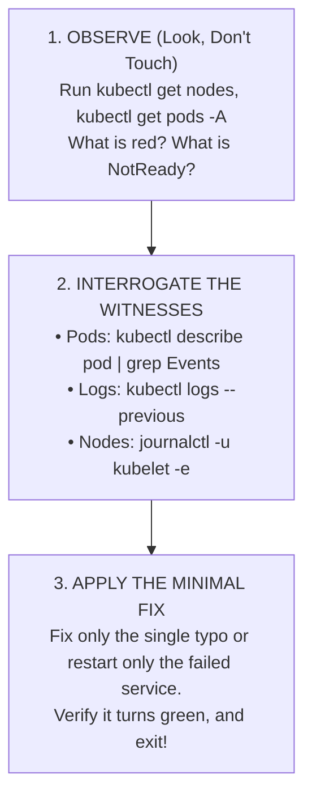

# Real-World Break-Fix Scenarios — Novice-Friendly Study Guide

> **Official Curriculum Reference:** Domain: *Troubleshooting (30%)*  
> **Official Documentation Links:**  
> - [Troubleshooting Clusters](https://kubernetes.io/docs/tasks/debug/debug-cluster/)  
> - [Troubleshooting Applications](https://kubernetes.io/docs/tasks/debug/debug-application/)  
> - [Determine the Reason for Pod Failure](https://kubernetes.io/docs/tasks/debug/debug-application/determine-reason-pod-failure/)

---

## 1. Explain Like I'm a Novice: The Crime Scene Detective Protocol

In the CKA exam, troubleshooting questions carry the **highest weight (30%)**. You will be dropped into a pre-broken cluster where applications are failing or servers are dead.

### The Rookie Mistake: The "Panic and Kick Everything" Anti-Pattern
When novices see an error, they panic:
- They start randomly typing `kubectl delete pod`, editing random files, or running `systemctl restart` on every service they can think of.
- This is like a detective arriving at a crime scene and accidentally kicking over the fingerprints and tracking mud across the room!

### The 3-Step Detective Protocol:
Follow this disciplined methodology on every single troubleshooting task:



---

## Scenario 1: The Dead Worker Node (`NotReady` State)

### The Crime Scene:
You switch context to `cluster-ops`. Running `kubectl get nodes` shows `node01` is `NotReady`.

```text
NAME           STATUS     ROLES    AGE   VERSION
controlplane   Ready      master   25d   v1.31.0
node01         NotReady   <none>   25d   v1.31.0
```

### Detective Investigation Protocol:
1. **Interrogate from the outside:**
   ```bash
   kubectl describe node node01
   ```
   *Clue found under Conditions:* `Kubelet stopped posting node status`. This means the foreman on `node01` is dead or unreachable.
2. **Log in to the physical node:**
   ```bash
   ssh node01
   sudo -i
   ```
3. **Check the Foreman (`kubelet`):**
   ```bash
   systemctl status kubelet
   ```
   *Clue:* It says `inactive (dead)` or `activating (auto-restart)`.
4. **Read the Black Box Flight Recorder (`journalctl`):**
   ```bash
   journalctl -u kubelet -e --no-pager -n 40
   ```
   *Look for the specific error:*
   - **Case A (Swap enabled):** `"failed to run Kubelet: running with swap on is not supported"`
     ```bash
     swapoff -a && sed -i '/swap/d' /etc/fstab
     systemctl restart kubelet
     ```
   - **Case B (Container runtime crashed):**
     ```bash
     systemctl status containerd
     systemctl restart containerd && systemctl restart kubelet
     ```
5. **Verify and Clean Up:**
   ```bash
   systemctl is-active kubelet # Must output 'active'
   exit                        # Return to workstation!
   kubectl get nodes           # node01 is now Ready!
   ```

---

## Scenario 2: Control Plane Outage (The Brain Is Dead)

### The Crime Scene:
Every `kubectl` command fails immediately with:
```text
The connection to the server 192.168.1.10:6443 was refused - did you specify the right host or port?
```

### Detective Investigation Protocol:
1. **Log in to the master node:**
   ```bash
   ssh controlplane
   sudo -i
   ```
2. **Remember the Static Pod Chicken-and-Egg rule:**  
   The API server runs as a container launched by the host `kubelet` from `/etc/kubernetes/manifests/kube-apiserver.yaml`.
3. **Inspect the container using `crictl`:**
   ```bash
   crictl ps -a --name kube-apiserver
   ```
   *Clue:* The container is `Exited`.
4. **Read the crash logs:**
   ```bash
   crictl logs <container-id>
   ```
   *Clue:* `error: unknown flag: --etcd-server`
5. **Fix the Typo in the Manifest:**
   Open `/etc/kubernetes/manifests/kube-apiserver.yaml`:
   - Change `--etcd-server` $\rightarrow$ `--etcd-servers` (add the missing `s`).
   - Save the file.
6. **Wait 15 Seconds:** Kubelet detects the save and boots the API server.
7. **Verify:**
   ```bash
   exit
   kubectl get nodes
   ```

---

## Scenario 3: Broken CoreDNS (The Blind Application)

### The Crime Scene:
Applications are running, but cannot communicate with each other: `curl http://billing-service` says `Could not resolve host`.

### Detective Investigation Protocol:
1. **Launch a test pod to test DNS:**
   ```bash
   kubectl run dns-tester --rm -it --image=busybox:1.28 --restart=Never -- nslookup kubernetes.default
   ```
   *Clue:* `connection timed out; no servers could be reached`.
2. **Check CoreDNS pods:**
   ```bash
   kubectl get pods -n kube-system -l k8s-app=kube-dns
   ```
   *Clue:* Pods are in `CrashLoopBackOff`.
3. **Read CoreDNS logs:**
   ```bash
   kubectl logs -n kube-system -l k8s-app=kube-dns
   ```
   *Clue:* `plugin/loop: Loop ... detected`. Host node's `/etc/resolv.conf` forwards queries back into the cluster, creating an infinite DNS loop.
4. **Fix the CoreDNS ConfigMap:**
   ```bash
   kubectl edit cm coredns -n kube-system
   ```
   Under `forward .`, change `/etc/resolv.conf` to a public resolver like `8.8.8.8`.
5. **Restart CoreDNS:**
   ```bash
   kubectl rollout restart deployment coredns -n kube-system
   ```

---

## Scenario 4: Pod CrashLooping from Missing Secret

### The Crime Scene:
A deployment named `payment-app` has `0/3` pods ready:
```bash
kubectl get pods
# Output: payment-app-xxx-yyy   0/1   CreateContainerConfigError
```

### Detective Investigation Protocol:
1. **Describe the pod:**
   ```bash
   kubectl describe pod payment-app-xxx-yyy | grep -A 8 Events:
   ```
   *Clue:* `Error: secret "payment-secret" key "STRIPE_KEY" not found`.
2. **Inspect the existing secret:**
   ```bash
   kubectl get secret payment-secret -o yaml
   ```
   *Clue:* The secret exists, but the key inside it is named `stripe-key` (lowercase).
3. **Fix the Mismatch:**
   Edit the deployment to match the real key:
   ```bash
   kubectl edit deployment payment-app
   # Change STRIPE_KEY to stripe-key
   ```
4. **Verify Rollout:**
   ```bash
   kubectl rollout status deployment payment-app
   # Successfully rolled out!
   ```

---

## 5. Knowledge Check Flashcards

1. **Q:** What is the first thing you should do when encountering a broken pod or node?  
   **A:** Run `kubectl describe` and check the **Events** section at the bottom for explicit failure messages.
2. **Q:** If `kubectl logs <pod>` is blank on a CrashLooping pod, how do you see what caused the crash?  
   **A:** Add the `--previous` flag (`kubectl logs <pod> --previous`).
3. **Q:** How do you view container logs on a control plane node when the API server is completely dead?  
   **A:** Use `crictl ps -a` to find the container ID, then `crictl logs <id>` (or inspect `/var/log/pods/`).
