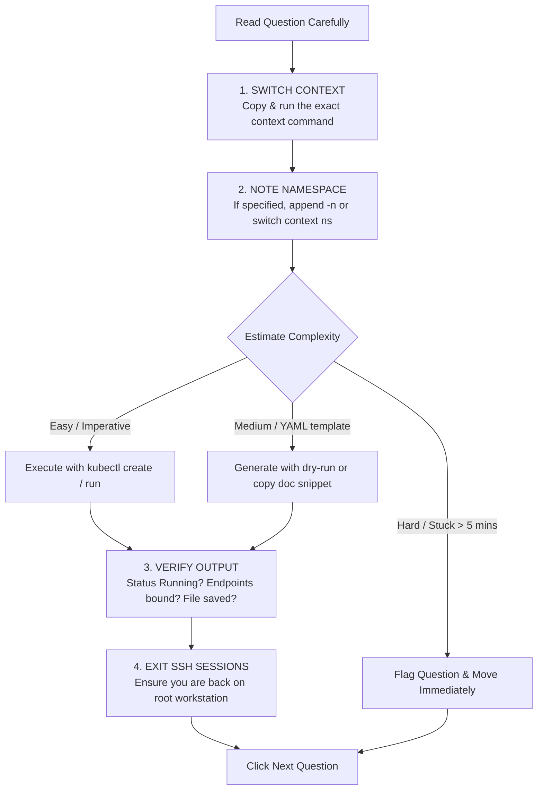

# Master Exam Day Checklist & Mental Flowchart — Study Guide

> **Official Handbook Reference:**  
> - [Linux Foundation Certification Candidate Handbook](https://docs.linuxfoundation.org/tc-docs/certification/lf-handbook2)  
> - [Important Instructions: CKA and CKAD](https://docs.linuxfoundation.org/tc-docs/certification/tips-cka-and-ckad)  
> - [Allowed Resources for LF Exams](https://docs.linuxfoundation.org/tc-docs/certification/faq-cka-ckad-cks#what-resources-are-allowed-during-the-exam)

---

## 1. 24 Hours Before the Exam

- [ ] **Valid Identification:** Government-issued photo ID (Passport, Driver's License) matching the exact legal name on your LF account.
- [ ] **Hardware Check:**
  - Webcam and microphone functional.
  - Single external monitor or laptop screen (Dual monitors are strictly disallowed; unplug and set aside second screens).
  - External mouse recommended (laptop trackpad can slow you down in the remote desktop).
- [ ] **Room Environment:**
  - Clear desk completely (no papers, sticky notes, books, secondary phones, smart watches).
  - Quiet, private room with a closed door (no other people entering).
  - Wall decorations behind and around desk must not contain technical diagrams.

---

## 2. The Novice Mindset: 66% Is a Perfect Score!

One of the biggest psychological traps for Kubernetes novices is perfectionism:
- You do **not** need a 100% or even an 85% to pass the CKA exam.
- **The passing benchmark is 66%.**
- A score of 67% earns you the exact same official Linux Foundation credential and digital badge as someone who scores 98%.
- That means on a 17-question exam, you can completely mess up or skip 3 or 4 difficult questions and still walk away with a certified passing grade!
- Don't let one stubborn question ruin your momentum. Take your points, flag the time-wasters, and secure the certification.

---

## 3. The First 5 Minutes: Shell & Editor Setup

Once the proctor releases the exam environment, execute your setup commands immediately:

```bash
# 1. Kubectl Autocomplete & Aliases
source <(kubectl completion bash)
alias k=kubectl
complete -o default -F __start_kubectl k
export do="--dry-run=client -o yaml"
export now="--grace-period=0 --force"

# 2. Configure Vim for 2-space YAML editing
cat <<EOF > ~/.vimrc
set tabstop=2
set shiftwidth=2
set expandtab
set autoindent
set number
EOF
```

---

## 4. The Question Execution Flowchart

Follow this strict ritual for every single question:



---

## 5. Time Management Formula (120 Minutes Total)

| Phase | Time Window | Goal |
| :--- | :--- | :--- |
| **Phase 1: Setup & Warmup** | 0 – 5 mins | Configure `.bashrc`, `.vimrc`, test terminal latency |
| **Phase 2: The Fast Pass** | 5 – 70 mins | Answer all Tier-1 and Tier-2 questions. Skip any question taking $> 6$ mins. |
| **Phase 3: Deep Troubleshooting** | 70 – 105 mins | Return to flagged break-fix and complex questions with a calm mind. |
| **Phase 4: Sanity Audit** | 105 – 120 mins | Double-check namespaces, running pods, and exported output files. |

---

## 6. In-Exam Pro-Tips & Anti-Patterns

### ✅ Best Practices:
1. **Always use `--dry-run=client -o yaml`:** Never manually type YAML from memory.
2. **Use `kubectl explain`:** It is faster than navigating documentation pages in the remote browser.
3. **Verify every resource after creation:** Run `kubectl get <resource>` and `kubectl describe <resource>` to verify status is `Running` or `Bound`.
4. **Copy output file paths directly from question text:** Avoid typos in filenames like `/opt/output_nodes.txt`.

### ❌ Fatal Traps:
1. **Forgetting to switch context:** Executing work on the wrong cluster guarantees 0 points.
2. **Remaining inside an SSH session:** If you SSH into `node01` to troubleshoot kubelet, typing `kubectl` there will fail. Always run `exit` back to the workstation.
3. **Leaving pods in CrashLoop:** If an application crashes because of a minor typo, fix it before leaving.
4. **Getting stuck on a 4% question:** Never spend 15 minutes on a low-weight question when high-weight upgrade and RBAC questions remain unattempted.
