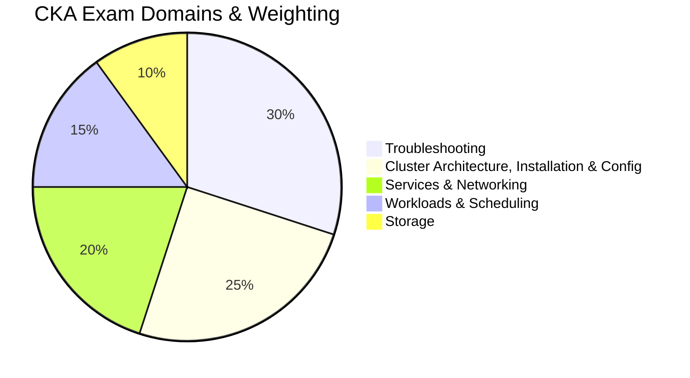
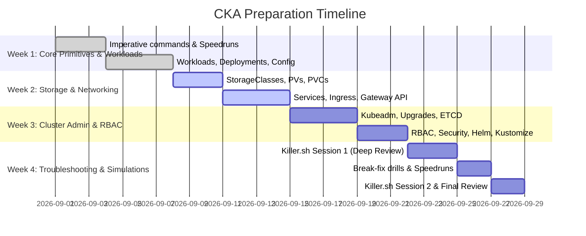

# Certified Kubernetes Administrator (CKA) — Master Study Guide & Knowledge Base

> **Administered by:** Cloud Native Computing Foundation (CNCF) & The Linux Foundation  
> **Target Version:** Kubernetes v1.31 / v1.32+  
> **Format:** 100% Performance-Based Practical Exam (Hands-on Terminal)  
> **Exam Duration:** 120 Minutes (15–17 Questions)  
> **Passing Score:** 66%  
> **Official Links:**
> - [CNCF Official CKA Curriculum Repository](https://github.com/cncf/curriculum)
> - [Linux Foundation CKA Certification Program](https://training.linuxfoundation.org/certification/certified-kubernetes-administrator-cka/)
> - [Allowed Documentation: Kubernetes Official Docs](https://kubernetes.io/docs/)
> - [Allowed Documentation: Gateway API Official Docs](https://gateway-api.sigs.k8s.io/)

---

## 🧭 Curriculum Domains & Weighting

The exam curriculum is divided into five core domains. Troubleshooting and Cluster Architecture account for **55% of the total score**.

| Domain | Weight | Key Competencies & Focus Areas |
| :--- | :---: | :--- |
| [**01. Troubleshooting**](01-troubleshooting/) | **30%** | Cluster & node health, kubelet & containerd failures, static pod recovery, CoreDNS loops, crictl diagnostics |
| [**02. Cluster Architecture & Installation**](02-cluster-architecture-installation/) | **25%** | `kubeadm` init & join, sequential cluster upgrades, ETCD backup & restore, RBAC, Helm, Kustomize |
| [**03. Services & Networking**](03-services-and-networking/) | **20%** | Pod networking, CoreDNS resolution, ClusterIP/NodePort, NetworkPolicies, Ingress, Gateway API (`HTTPRoute`) |
| [**04. Workloads & Scheduling**](04-workloads-and-scheduling/) | **15%** | Rolling deployments, rollbacks, ConfigMaps, Secrets, nodeAffinity, Taints & Tolerations, HPA, Static Pods |
| [**05. Storage**](05-storage/) | **10%** | StorageClasses, dynamic provisioning, PV/PVC lifecycle, access modes, reclaim policies, subPath mounts |

---

## 📚 Complete Knowledge Base Navigation

### Module 00: Exam Strategy, Environment, & Terminal Fluency
*Master the remote desktop UI, setup shortcuts, and time management.*
- [01. Exam Format, Rules, and Remote Desktop UI](00-exam-strategy-and-environment/01-exam-format-rules-and-ui.md) — PSI secure browser details, dual-monitor disallowance, permitted browser tabs.
- [02. Terminal Setup, Aliases, & Speedruns](00-exam-strategy-and-environment/02-terminal-setup-and-speedruns.md) — 60-second `.bashrc` bootstrap, `.vimrc` indentation, `$do` and `$now` shortcuts.
- [03. Killer.sh & Simulation Strategy](00-exam-strategy-and-environment/03-killer-sh-and-simulation-strategy.md) — 3-tier triage strategy, time budgeting, and post-session review methods.
- [04. Imperative Command Master Cheat Sheet](00-exam-strategy-and-environment/04-imperative-command-cheatsheet.md) — Instant manifest generators for Pods, Deployments, Services, RBAC, and Jobs.

---

### Module 01: Troubleshooting (30% Weight)
*Diagnose and repair failed nodes, broken control plane components, and network loops.*
- [01. Node & Kubelet Troubleshooting](01-troubleshooting/01-node-and-kubelet-troubleshooting.md) — Systemd journalctl diagnostics, swap-on traps, containerd sockets, `crictl` low-level tools.
- [02. Control Plane Troubleshooting & Static Pods](01-troubleshooting/02-control-plane-troubleshooting.md) — `/etc/kubernetes/manifests/`, apiserver connection refused, cert checking with `kubeadm certs`.
- [03. Application & Container Debugging](01-troubleshooting/03-application-and-container-debugging.md) — CrashLoopBackOff, ImagePullBackOff, exit codes (137 OOMKilled), `kubectl debug`.
- [04. Cluster Resource Monitoring & Top Commands](01-troubleshooting/04-cluster-resource-monitoring.md) — Metrics-server usage, `kubectl top nodes/pods`, sorting, extracting top consumers.
- [05. Services & DNS Troubleshooting](01-troubleshooting/05-services-and-dns-troubleshooting.md) — CoreDNS Corefile loops, Service endpoints/EndpointSlices selector mismatches, port vs targetPort.

---

### Module 02: Cluster Architecture, Installation, & Configuration (25% Weight)
*Bootstrap clusters, manage upgrades, secure with RBAC, and package with Helm & Kustomize.*
- [01. Kubeadm Cluster Bootstrap & Node Joining](02-cluster-architecture-installation/01-kubeadm-cluster-bootstrap.md) — Kernel modules, sysctl, containerd Cgroup driver, `kubeadm init`, join tokens.
- [02. Cluster Upgrades Lifecycle](02-cluster-architecture-installation/02-cluster-upgrades-lifecycle.md) — Version skew rules, control plane vs worker nodes, `kubeadm upgrade apply` vs `upgrade node`.
- [03. HA Control Plane & ETCD Management](02-cluster-architecture-installation/03-ha-control-plane-and-etcd.md) — Stacked vs external topologies, quorum requirements, snapshot save & restore procedures.
- [04. Role-Based Access Control (RBAC) & Security](02-cluster-architecture-installation/04-rbac-and-security.md) — Roles, ClusterRoles, RoleBindings, ServiceAccounts, and `kubectl auth can-i`.
- [05. Helm & Kustomize Manifest Management](02-cluster-architecture-installation/05-helm-and-kustomize.md) — Modern packaging tools: Helm repo/install/upgrade, Kustomize overlays & `kubectl apply -k`.
- [06. Extension Interfaces (CNI, CSI, CRI), CRDs, & Operators](02-cluster-architecture-installation/06-extension-interfaces-crds-operators.md) — Socket paths, plugins, CRD inspection, and Operator reconciliation patterns.

---

### Module 03: Services & Networking (20% Weight)
*Design and secure east-west and north-south traffic routing.*
- [01. Pod Networking Model & CoreDNS](03-services-and-networking/01-pod-networking-and-dns.md) — Non-NAT networking, FQDN syntax, `/etc/resolv.conf`, ndots:5 mechanics.
- [02. Services, Endpoints, & EndpointSlices](03-services-and-networking/02-services-and-endpoints.md) — ClusterIP, NodePort, LoadBalancer, Headless, manual external Endpoints.
- [03. Kubernetes Network Policies](03-services-and-networking/03-network-policies.md) — Ingress/Egress isolation, AND vs OR syntax rules, default-deny templates, DNS whitelisting.
- [04. Ingress Controllers & Ingress Resources](03-services-and-networking/04-ingress-controllers-and-resources.md) — IngressClass, host/path prefix rules, rewrite-target annotations, TLS termination.
- [05. Gateway API (Modern Ingress Architecture)](03-services-and-networking/05-gateway-api.md) — GatewayClass, Gateway listeners, HTTPRoute path/header rules, traffic splitting, Ingress migration.

---

### Module 04: Workloads & Scheduling (15% Weight)
*Control workload execution, rolling deployments, configuration injection, and node scheduling.*
- [01. Deployments, Rollouts, & Rollbacks](04-workloads-and-scheduling/01-deployments-rollouts-rollbacks.md) — RollingUpdate strategies, revision history inspection, rollback procedures.
- [02. Pod Configuration: ConfigMaps, Secrets, & SecurityContext](04-workloads-and-scheduling/02-pod-configuration-configmaps-secrets.md) — `valueFrom`, `envFrom`, directory mounts, `subPath` isolation, runAsUser.
- [03. Advanced Scheduling: Affinity, Taints, & Tolerations](04-workloads-and-scheduling/03-scheduling-affinity-taints-tolerations.md) — nodeSelector, hard/soft nodeAffinity, podAntiAffinity, NoSchedule taints.
- [04. Resource Management & Horizontal Pod Autoscaler (HPA)](04-workloads-and-scheduling/04-resource-management-and-hpa.md) — Requests vs limits, CFS throttling, OOMKilled, imperative & declarative HPA.
- [05. Static Pods, DaemonSets, Jobs, & CronJobs](04-workloads-and-scheduling/05-static-pods-and-daemonsets.md) — Node static manifests, DaemonSet conversion, batch Jobs, CronJob syntax.

---

### Module 05: Storage (10% Weight)
*Implement persistent storage architectures across nodes.*
- [01. StorageClasses & Dynamic Provisioning](05-storage/01-storage-classes-dynamic-provisioning.md) — Provisioners, volumeBindingMode (WaitForFirstConsumer), reclaimPolicy (Delete vs Retain).
- [02. PersistentVolumes (PV) & PersistentVolumeClaims (PVC)](05-storage/02-persistent-volumes-and-claims.md) — Access modes (RWO, ROX, RWX, RWOP), binding matching rules, claimRef recycling.
- [03. Pod Volume Attachments & Storage Troubleshooting](05-storage/03-pod-volume-attachments.md) — Volume mounts, single file `subPath` overlays, diagnostic trees for Pending PVCs.

---

### Module 06: Hands-on Practice Scenarios & Speedruns
*Test and validate your exam readiness against timed, real-world simulations.*
- [01. Real-World Break-Fix Scenarios](06-hands-on-practice-scenarios/01-killer-break-fix-scenarios.md) — Step-by-step diagnostic workflows for broken nodes, downed API servers, and failing DNS.
- [02. 20 Speedrun Practice Challenges](06-hands-on-practice-scenarios/02-speedrun-challenge-questions.md) — Timed challenges covering every domain with point allocations and verification commands.
- [03. Master Exam Day Checklist & Mental Flowchart](06-hands-on-practice-scenarios/03-master-exam-checklist.md) — Pre-exam checks, the question execution flowchart, and the 120-minute pacing formula.

---

## 🎯 Recommended 4-Week Study Plan

1. **Week 1:** Master `kubectl` imperative commands until generating Pods, Deployments, ConfigMaps, and Services requires zero hesitation. Read Modules 00 and 04.
2. **Week 2:** Master Kubernetes networking and storage. Understand the Gateway API (`HTTPRoute`) and practice debugging missing Endpoints. Read Modules 03 and 05.
3. **Week 3:** Practice cluster lifecycle operations: `kubeadm upgrade`, ETCD snapshot save/restore, and RBAC role assignments. Read Module 02.
4. **Week 4:** Take Killer.sh Session 1. Spend 2 days reviewing every missed question. Complete all 20 speedrun challenges in Module 06. Take Killer.sh Session 2 as a final timed dress rehearsal.
