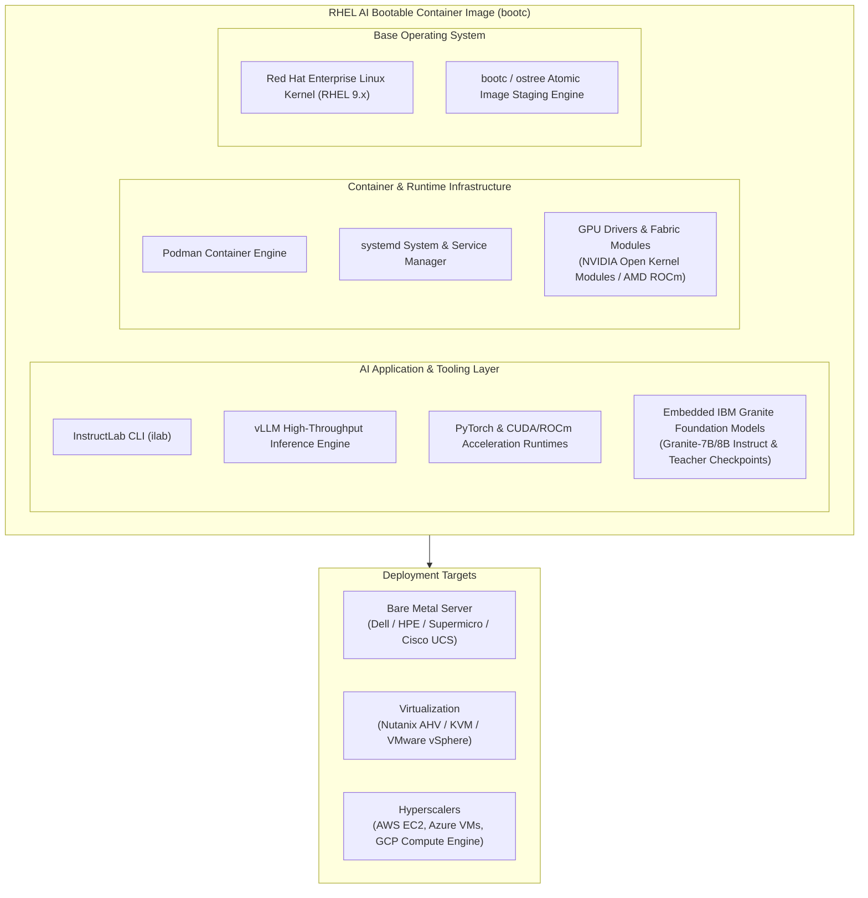
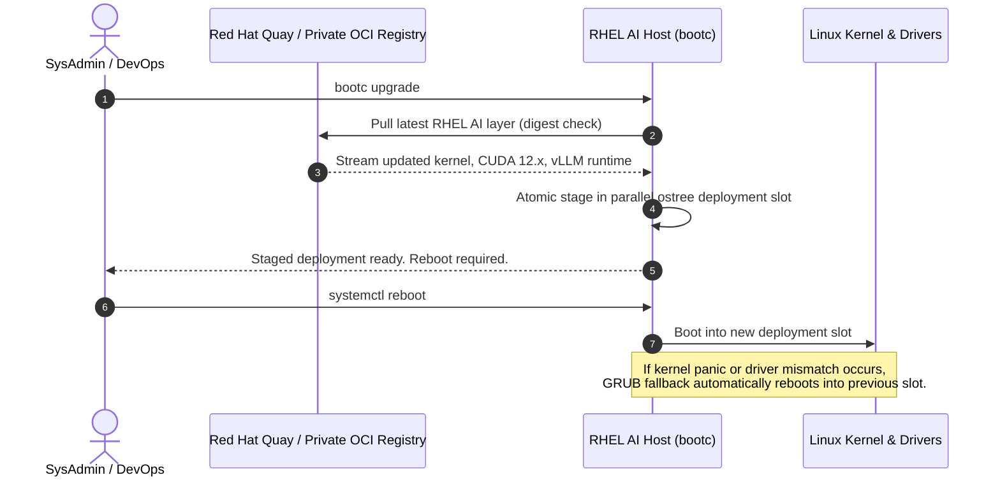

# Red Hat Enterprise Linux AI (RHEL AI) Architecture & Deployment Guide

> **Focus Domain**: Operating System Level AI Appliances, Bootable Containers (`bootc`), Single-Node Alignment  
> **Audience**: Systems Engineers, Linux Administrators, Infrastructure Architects  
> **Status**: Production Reference

---

## 1. Architectural Overview & Philosophy

**Red Hat Enterprise Linux AI (RHEL AI)** is a purpose-built, bootable foundation model platform designed to bring generative AI development, alignment, and local serving directly to bare-metal servers, hypervisors, and cloud virtual machines.

Rather than assembling and configuring disparate software packages (Linux kernel, GPU kernel modules, CUDA/ROCm userland libraries, PyTorch, vLLM, and alignment tools), RHEL AI ships as an **atomic, bootable OCI container image** managed via **`bootc`** (bootable container technology).



---

## 2. The `bootc` (Bootable Container) Engine

Traditional Linux servers rely on package managers (`dnf`/`rpm`) that mutate state unpredictably over time. RHEL AI adopts the image-based paradigm using `bootc`:

1. **Transactional Immutability**:
   - The root filesystem (`/`) is mounted read-only (`ro`).
   - Mutable state is strictly isolated to `/var` (persistent data, models, taxonomy) and `/etc` (configuration overrides).
2. **OCI Standard Artifact**:
   - The entire operating system is built from a `Containerfile`.
   - OS updates are delivered by pulling new image digests from Quay or a private OCI registry.
3. **Rollback Safety**:
   - Updates stage a new deployment in an underlying `ostree` slot. If a boot or hardware verification fails, the system automatically rolls back to the prior known-good kernel/driver deployment.



---

## 3. Hardware Requirements & Sizing Matrix

Running InstructLab (synthetic data generation + multi-phase fine-tuning) on a single RHEL AI instance requires substantial GPU compute and memory bandwidth:

| Workload Scope | Recommended GPUs | Minimum VRAM | Host System RAM | Storage (NVMe) | Example Hardware |
| :--- | :--- | :--- | :--- | :--- | :--- |
| **Inference Only (Granite 8B)** | 1x NVIDIA L4 / A10G / RTX 4090 | 16 GB – 24 GB | 64 GB DDR5 | 250 GB NVMe | Dell PowerEdge R760xa (1x L4) / AWS `g6.xlarge` |
| **Quantized Alignment (QLoRA)** | 1x NVIDIA A10G / L40S / A100 | 24 GB – 48 GB | 128 GB DDR5 | 500 GB NVMe | AWS `g5.4xlarge` / Supermicro AS-4125GS |
| **Full Parameter Tuning (Granite 8B)** | 4x NVIDIA A100 / H100 (80GB) | 320 GB Total | 512 GB DDR5 | 2 TB NVMe | Supermicro 8-way H100 / AWS `p4de.24xlarge` |
| **AMD Instinct Platform** | 1x to 4x AMD MI300X | 192 GB – 768 GB | 512 GB DDR5 | 2 TB NVMe | Dell PowerEdge XE9680 (MI300X) |

---

## 4. Deployment Artifacts & Provisioning

RHEL AI is distributed in multiple image formats generated from the core OCI container:

```bash
# Example: Building target disk images from the RHEL AI bootc container
podman run --rm --privileged \
  -v /var/run/docker.sock:/var/run/docker.sock \
  -v ./output:/output \
  registry.redhat.io/rhelai1/bootc-image-builder:latest \
  --type qcow2 \
  --aws-ami \
  registry.redhat.io/rhelai1/rhel-ai-nvidia:latest
```

### Artifact Types

1. **Bare Metal ISO**:
   - Bootable installer for air-gapped or on-prem servers.
   - Includes kickstart templates to partition NVMe arrays and format `/var` with XFS.
2. **QCOW2 / Raw Virtual Appliance**:
   - Pre-partitioned virtual disk ready for KVM, Nutanix AHV, OpenStack, and Proxmox.
   - Cloud-init enabled for network configuration and SSH key injection.
3. **Cloud AMIs & VHDs**:
   - Published directly to AWS Marketplace and Azure Marketplace for one-click deployment on GPU-enabled VM instances (`g5`, `p4d`, `p5`, `Standard_NCads_H100_v5`).

---

## 5. First-Boot Bootstrap & Operational Walkthrough

Once booted into RHEL AI, the system environment is pre-configured with GPU runtimes and the `ilab` binary.

### Step 1: Verify Hardware & Driver Bindings

```bash
# Verify NVIDIA kernel modules and GPU state
nvidia-smi

# Check GPU hardware interconnect topology
nvidia-smi topo -m

# Verify PyTorch CUDA recognition
python3 -c "import torch; print(f'CUDA Available: {torch.cuda.is_available()} | Device Count: {torch.cuda.device_count()} | Device Name: {torch.cuda.get_device_name(0)}')"
```

### Step 2: Initialize InstructLab Workspace

```bash
# Initialize ilab configuration for NVIDIA or AMD profiles
ilab config init --profile=nvidia

# Inspect the generated configuration file
cat ~/.config/instructlab/config.yaml
```

The default `config.yaml` manages:
- **Serving Engine**: vLLM (`serve.vllm`) or llama.cpp backend.
- **Model Checkpoints**: Paths to student (`granite-7b-lab`) and teacher (`mixtral-8x7b` or `granite-20b`) models stored in `/var/home/<user>/.local/share/instructlab/models`.
- **Generation Parameters**: Token limits, batch sizes, and temperature settings for synthetic data generation.

### Step 3: Download Foundation Models

```bash
# Download the default Granite student and teacher models from Red Hat registry
ilab model download --repository registry.redhat.io/rhelai1/granite-7b-starter

# Verify model weights in local storage
ls -lh ~/.local/share/instructlab/models/
```

### Step 4: Run High-Performance Local Serving

RHEL AI uses `vLLM` to expose an OpenAI-compatible REST server:

```bash
# Launch serving engine in the background
ilab model serve --model-path ~/.local/share/instructlab/models/granite-7b-starter &

# Query the model endpoint using cURL
curl -X POST http://localhost:8000/v1/chat/completions \
  -H "Content-Type: application/json" \
  -d '{
    "model": "granite-7b-starter",
    "messages": [
      {"role": "system", "content": "You are an enterprise systems engineering assistant."},
      {"role": "user", "content": "Explain the role of bootc in RHEL AI."}
    ],
    "temperature": 0.2,
    "max_tokens": 256
  }'
```

---

## 6. Day-2 Management & Lifecycle Operations

### Transactional OS Updates with `bootc`

```bash
# Check status of current bootc deployment
bootc status

# Check for new container image layers from Red Hat Registry
bootc check

# Apply upgrade atomically and stage next boot
bootc upgrade --apply
```

### Managing Models and Storage Quotas

Because `/var` is the persistent volume, large models and taxonomy trees must be partitioned properly:

```bash
# Verify disk layout and mount points
lsblk -f

# Prune cached intermediate checkpoints from fine-tuning runs
ilab model list
rm -rf ~/.local/share/instructlab/internal/checkpoints/discarded_*
```

---

## 7. Hand-Off: Promoting from RHEL AI to OpenShift AI

When model alignment on a single RHEL AI node demonstrates measurable accuracy gains, enterprise workflows promote the artifacts to OpenShift AI:

1. **Export Safetensors Checkpoint**:
   ```bash
   ilab model convert --model-dir ~/.local/share/instructlab/checkpoints/final_aligned/ --format safetensors
   ```
2. **Push to Enterprise Model Registry / S3**:
   ```bash
   # Push model weights to enterprise MinIO / AWS S3 bucket
   aws s3 sync ~/.local/share/instructlab/checkpoints/final_aligned/ s3://rh-ai-model-registry/granite-8b-custom-v1/
   ```
3. **Deploy into RHOAI**:
   Refer to [[06-model-serving-kserve-and-vllm|KServe & vLLM Serving Architecture]] to deploy the tuned weights across an autoscaling OpenShift cluster.

---
*Reference architecture documentation for `/workspace/projects/rh-ai`.*
