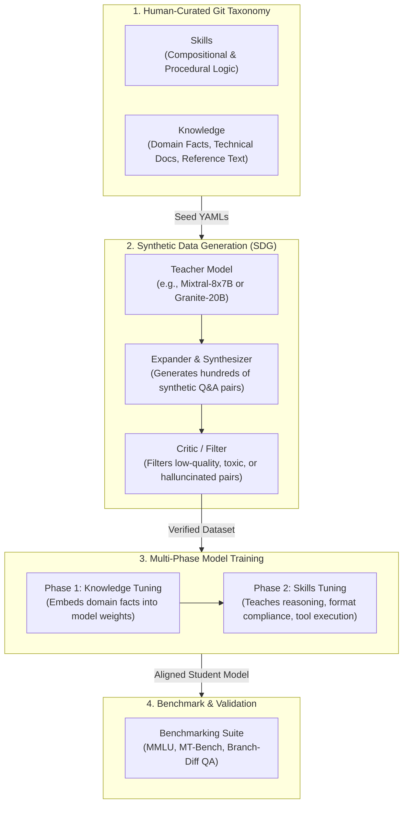
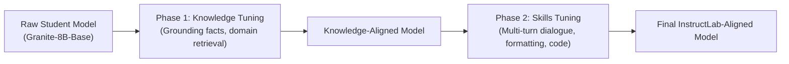

# InstructLab & LAB Alignment Methodology

> **Focus Domain**: Model Alignment, Synthetic Data Generation (SDG), Taxonomy-Driven Fine-Tuning  
> **Audience**: AI Engineers, ML Scientists, Domain Specialists, Automation Architects  
> **Status**: Production Reference

---

## 1. The Alignment Problem & The LAB Methodology

Traditional Large Language Model (LLM) fine-tuning suffers from two major bottlenecks:
1. **The Cost of Pre-Training**: Pre-training foundational models from scratch requires tens of millions of dollars in compute, making continuous updates economically impossible for single enterprises.
2. **The Human-in-the-Loop Bottleneck**: Traditional Reinforcement Learning from Human Feedback (RLHF) and Supervised Fine-Tuning (SFT) rely on costly, slow, error-prone manual human annotation. Furthermore, catastrophic forgetting frequently degrades model generalization when new knowledge is injected naively.

Developed by IBM Research and open-sourced in partnership with Red Hat, the **LAB (Large-scale Alignment for chatBots)** methodology replaces manual annotation with **taxonomy-guided synthetic data generation (SDG)** coupled with **phased multi-stage training**.



---

## 2. Taxonomy Architecture: Skills vs. Knowledge

The InstructLab taxonomy is a version-controlled Git repository (`github.com/instructlab/taxonomy`) organized into two distinct semantic trees:

```
taxonomy/
├── knowledge/
│   ├── cloud/
│   │   ├── openshift/
│   │   │   └── ingress_controllers/
│   │   │       └── qna.yaml
│   │   └── nutanix/
│   │       └── ahv_microsegmentation/
│   │           └── qna.yaml
└── skills/
    ├── compositional/
    │   ├── coding/
    │   │   └── ansible_playbook_generation/
    │   │       └── qna.yaml
    │   └── reasoning/
    │       └── kubernetes_crashloop_triage/
    │           └── qna.yaml
```

### 2.1 Knowledge Taxonomy

Knowledge is factual, static domain information that the base model did not encounter during pre-training. Every knowledge entry requires:
1. **Domain Reference Document**: Verified markdown or text file (no copyrighted or proprietary content without rights).
2. **Attribution Metadata**: Authorship, source link, license.
3. **Seed Questions & Answers**: 5 to 10 diverse seed examples demonstrating how humans query this domain.

#### Example: `knowledge/cloud/openshift/ingress_controllers/qna.yaml`

```yaml
version: 3
created_by: cloud_architect
domain: openshift_networking
document_outline: OpenShift Ingress and Route Architecture
document:
  repo: https://github.com/openshift/openshift-docs.git
  commit: 8a4c1e0a29b3
  patterns:
    - networking/ingress-operator.adoc
seed_examples:
  - context: |
      In OpenShift 4, the Ingress Operator manages external access to cluster services.
      It provisions one or more HAProxy-based routers known as default IngressControllers.
      Admins can configure routeAdmission policies to prevent duplicate routes across namespaces.
    questions_and_answers:
      - question: Which component provisions and manages the default routers in OpenShift 4?
        answer: The Ingress Operator provisions and manages one or more HAProxy-based routers.
      - question: How can an administrator prevent cross-namespace route conflicts?
        answer: By configuring routeAdmission policies within the IngressController specification.
      - question: What underlying reverse proxy software powers the OpenShift router?
        answer: HAProxy.
```

### 2.2 Skills Taxonomy

Skills represent procedural capabilities: how to perform an action, transform data, generate code, or execute step-by-step reasoning. Skills do **not** take reference documents; instead, they provide seed examples showing the step-by-step logic.

#### Example: `skills/compositional/reasoning/kubernetes_crashloop_triage/qna.yaml`

```yaml
version: 3
created_by: sre_lead
task_description: Step-by-step triage of Kubernetes Pod CrashLoopBackOff states
seed_examples:
  - user: A pod named 'api-gateway-74bf' is in CrashLoopBackOff with Exit Code 137. How do I troubleshoot?
    assistant: |
      Exit Code 137 indicates the container received a SIGKILL signal, almost always caused by an Out-Of-Memory (OOMKilled) event. Follow these steps:
      1. Inspect Pod Status: Run 'kubectl describe pod api-gateway-74bf' and check 'Last State: Terminated -> Reason: OOMKilled'.
      2. Check Pod Limits: Check 'resources.limits.memory' in the Pod spec.
      3. Verify Node Memory Pressure: Run 'kubectl top pod api-gateway-74bf --containers' and check node kernel logs via 'dmesg -T | grep -i oom'.
      4. Remediation: Increase the memory limit in the Deployment manifest or profile application heap allocation.
```

---

## 3. Synthetic Data Generation (SDG) Engine

The SDG engine (`ilab data generate`) transforms 5 seed examples into hundreds or thousands of high-fidelity synthetic training samples:

1. **Teacher Model Selection**:
   - High-capacity models (e.g., Mixtral-8x7B, Granite-20B-Code/Instruct, Llama-3-70B) serve as the generator.
2. **Context Sampling & Expansion**:
   - The generator slices the reference document into overlapping semantic chunks.
   - It prompts the teacher model to formulate new questions, rephrased queries, and multi-turn conversations grounded *strictly* in the reference text.
3. **Negative Sampling & Critic Filtering**:
   - The engine generates negative examples to teach the model when to admit "I don't know" rather than hallucinate.
   - A critic prompt verifies that each generated answer is 100% faithful to the provided context.

```bash
# Generate synthetic dataset using the active taxonomy tree
ilab data generate \
  --num-instructions 500 \
  --model ~/.local/share/instructlab/models/granite-20b-instruct \
  --gpus 4
```

The output is written as formatted JSONL datasets in `~/.local/share/instructlab/datasets/` containing prompt-response pairs ready for tokenizer ingestion.

---

## 4. Multi-Phase Training Deep Dive

The InstructLab training pipeline decouples training into two distinct phases to prevent catastrophic forgetting:



### Phase 1: Knowledge Tuning
- Focuses on loss reduction across factual declarative statements.
- Uses lower learning rates ($1 \times 10^{-5}$) to gently adjust transformer attention heads without obliterating foundational language representations.

### Phase 2: Skills Tuning
- Fine-tunes the model on conversational flow, formatting constraints, JSON schemas, and logical chain-of-thought tokens.
- Introduces instruction masks so loss is computed exclusively on the assistant response tokens, not the system or user prompt.

### Sizing and Acceleration Options: LoRA vs. QLoRA vs. Full

| Parameter / Technique | QLoRA (4-Bit) | LoRA (16-Bit) | Full-Parameter Fine-Tuning |
| :--- | :--- | :--- | :--- |
| **Quantization** | NF4 (NormalFloat4) | None (FP16 / BF16) | None (FP16 / BF16 / FP8) |
| **Trainable Weights** | Low-rank adapters ($r=16, \alpha=32$) | Low-rank adapters ($r=16, \alpha=32$) | 100% of model parameters |
| **Min VRAM (8B Model)** | ~18 GB (Single L4 / A10G) | ~32 GB (Single A100 / L40S) | ~160 GB (4x A100/H100 80GB) |
| **Accuracy Retention** | High (95-98% of full) | Very High (98-99% of full) | Optimal (100% domain adaptation) |
| **Execution Time (500 samples)**| ~45 minutes | ~20 minutes | ~8 minutes |

```bash
# Execute local multi-phase training using QLoRA
ilab model train \
  --device cuda \
  --pipeline accelerated \
  --strategy qlora \
  --num-epochs 3
```

---

## 5. Evaluation & Verification Metrics

Deploying an unvalidated model into enterprise environments introduces risk. InstructLab incorporates a multi-tiered evaluation harness (`ilab model test` / `ilab model evaluate`):

1. **MMLU (Massive Multitask Language Understanding)**:
   - Evaluates general world knowledge across 57 subjects to ensure general intelligence has not degraded.
2. **MT-Bench (Multi-Turn Benchmark)**:
   - Evaluates conversational coherence, role-playing ability, and reasoning depth over multi-turn interactions.
3. **Branch Evaluation (Differential QA)**:
   - Compares the newly trained model against the base model directly on the taxonomy PR questions:

```bash
# Benchmark the aligned model against the baseline model
ilab model evaluate \
  --benchmark mmlu \
  --model ~/.local/share/instructlab/checkpoints/final_aligned \
  --base-model ~/.local/share/instructlab/models/granite-7b-starter
```

### Output Interpretation

```
================ Evaluation Report ================
Metric                 Base Model       Aligned Model       Delta
------------------------------------------------------------------
MMLU (General Score)   64.2%            64.1%               -0.1% (Safe)
MT-Bench               7.15             7.42                +0.27 (Improved)
Taxonomy Specific Q&A  42.0%            94.8%               +52.8% (Target Met)
==================================================================
Result: PASS — Model is ready for enterprise promotion.
```

---

## 6. End-to-End CLI Speedrun Workflow

```bash
# 1. Initialize environment
ilab config init --profile=nvidia

# 2. Clone enterprise taxonomy
git clone https://github.com/my-org/taxonomy.git ~/.local/share/instructlab/taxonomy

# 3. Add domain knowledge (YAML)
cd ~/.local/share/instructlab/taxonomy
git checkout -b add-ocp-networking
# (Create knowledge/cloud/openshift/ingress/qna.yaml)

# 4. Validate syntax
ilab taxonomy diff

# 5. Generate synthetic data
ilab data generate --num-instructions 300

# 6. Train candidate student model
ilab model train --pipeline accelerated --strategy qlora

# 7. Evaluate and verify
ilab model test

# 8. Serve aligned candidate locally
ilab model serve --model-path ~/.local/share/instructlab/checkpoints/final_aligned
```

---
*Reference architecture documentation for `/workspace/projects/rh-ai`.*
