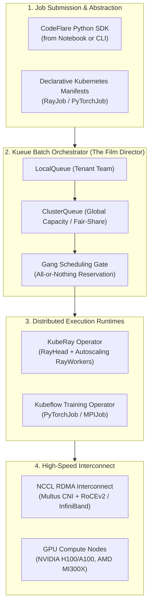
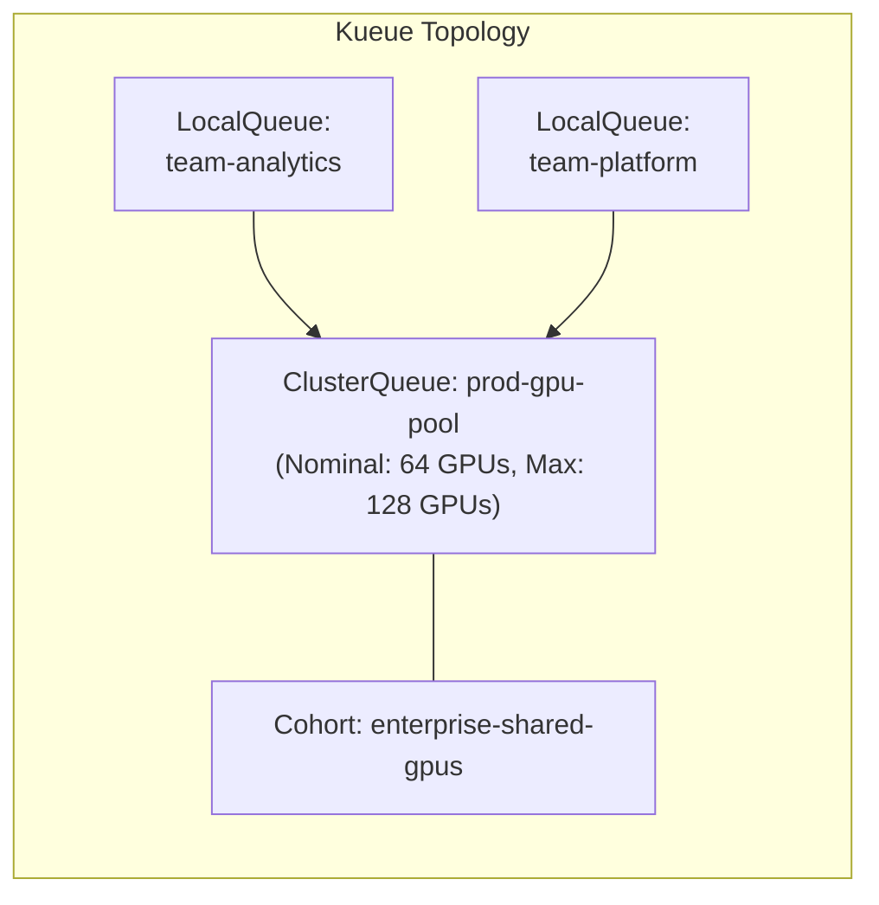
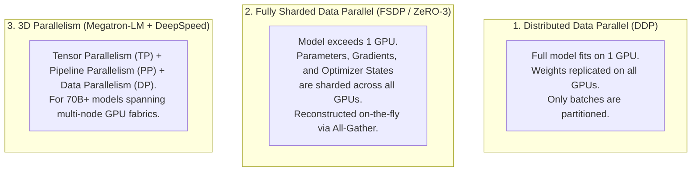

# Distributed Training & Workload Orchestration (Ray, Kueue, PyTorch)

> **Focus Domain**: Distributed Compute, Batch Scheduling, Ray on Kubernetes, Kueue Queuing, High-Speed Fabric  
> **Audience**: Platform Engineers, MLOps Architects, Distributed Systems Specialists  
> **Status**: Production Reference

---

## 1. The Distributed AI Challenge in Plain English

### The "Film Crew Call Sheet" Mental Model (Why Standard Kubernetes Fails AI)

In traditional enterprise Kubernetes, pods are scheduled like commuters catching a city bus: If 3 seats are open, 3 people board, and the 4th person waits for the next bus.

In distributed AI training, **this behavior causes cluster deadlock**:

```
┌─────────────────────────────────────────────────────────────────────────────┐
│                 THE FILM CREW CALL SHEET MENTAL MODEL                       │
├─────────────────────────────────────────────────────────────────────────────┤
│  1. THE STANDARD KUBERNETES FAILURE (The Partial Call):                     │
│     • A distributed PyTorch job needs 32 GPUs (4 nodes of 8 GPUs) to train. │
│     • The cluster only has 24 GPUs free right now.                          │
│     • Standard Kubernetes allocates the 24 GPUs immediately.                │
│     • Result: 24 GPUs sit 100% idle, burning thousands of dollars an hour,  │
│       waiting for the last 8 GPUs to free up. Meanwhile, other teams' jobs  │
│       are blocked from using those 24 GPUs!                                 │
├─────────────────────────────────────────────────────────────────────────────┤
│  2. THE KUEUE SOLUTION (All-or-Nothing / Gang Scheduling):                  │
│     • Like a Hollywood film director: You do NOT start filming and paying   │
│       the 50-person crew if the lead actor is still on a flight!            │
│     • Either ALL 32 GPUs are reserved and ready simultaneously, or the job  │
│       waits peacefully in the queue without reserving a single GPU.         │
│     • When capacity opens, all 32 GPUs are gated into the cluster at the    │
│       exact same millisecond. Zero idle waste, zero deadlocks.              │
└─────────────────────────────────────────────────────────────────────────────┘
```

### The "Jigsaw Puzzle" Mental Model (Why FSDP is Required)
When training or fine-tuning an 8B model with the AdamW optimizer, the model weights, gradients, and optimizer states consume **128 GB of memory**! Since an individual GPU usually has 48 GB or 80 GB, a single GPU physically cannot hold the training process.

Instead of buying a fictional 200 GB GPU, **Fully Sharded Data Parallel (FSDP)** breaks the problem apart like a jigsaw puzzle:
*   Instead of each GPU holding the entire 128 GB model, 8 GPUs each hold only $\frac{1}{8}\text{th}$ of the parameters (**16 GB each**)!
*   When calculating Layer 1, GPU 0 broadcasts its pieces to the other 7 GPUs on-the-fly.
*   The math finishes, the temporary piece is wiped from memory, and they move to Layer 2.
*   This allows a cluster of commodity GPUs to train models that no single GPU on Earth could hold.



---

## 2. Batch Queuing Architecture with Kueue

**Kueue** manages hardware allocation dynamically without modifying the underlying Kubernetes scheduler. It implements **All-or-Nothing (Gang) Scheduling** and **Fair-Share Borrowing**:



### 1. Production `ClusterQueue` Configuration

```yaml
apiVersion: kueue.x-k8s.io/v1beta1
kind: ClusterQueue
metadata:
  name: gpu-cluster-queue
spec:
  namespaceSelector: {}
  cohort: "enterprise-shared-gpus"
  resourceGroups:
    - coveredResources: ["nvidia.com/gpu", "cpu", "memory"]
      flavors:
        - name: "h100-flavor"
          resources:
            - name: "nvidia.com/gpu"
              nominalQuota: 64
              borrowingLimit: 32
            - name: "cpu"
              nominalQuota: 512
            - name: "memory"
              nominalQuota: 2048Gi
  preemption:
    reclaimWithinCohort: Any
    withinClusterQueue: LowerPriority
```

### 2. Production `LocalQueue` Configuration

```yaml
apiVersion: kueue.x-k8s.io/v1beta1
kind: LocalQueue
metadata:
  namespace: team-nlp
  name: team-nlp-local-queue
spec:
  clusterQueue: gpu-cluster-queue
```

---

## 3. Distributed Compute with KubeRay & CodeFlare

Project CodeFlare integrates with KubeRay to simplify running Ray workloads on OpenShift.

### RayCluster with Kueue Integration

```yaml
apiVersion: ray.io/v1
kind: RayCluster
metadata:
  name: granite-distributed-tune
  namespace: team-nlp
  labels:
    kueue.x-k8s.io/queue-name: team-nlp-local-queue
spec:
  rayVersion: "2.35.0"
  headGroupSpec:
    rayStartParams:
      dashboard-host: "0.0.0.0"
    template:
      spec:
        containers:
          - name: ray-head
            image: registry.redhat.io/rhoai/ray-cuda-py311:latest
            resources:
              limits:
                cpu: "8"
                memory: 32Gi
  workerGroupSpecs:
    - groupName: gpu-workers
      replicas: 4
      minReplicas: 4
      maxReplicas: 4
      rayStartParams: {}
      template:
        spec:
          containers:
            - name: ray-worker
              image: registry.redhat.io/rhoai/ray-cuda-py311:latest
              resources:
                limits:
                  nvidia.com/gpu: "8"
                  cpu: "64"
                  memory: 256Gi
              volumeMounts:
                - mountPath: /dev/shm
                  name: dshm
          volumes:
            - name: dshm
              emptyDir:
                medium: Memory
                sizeLimit: 64Gi
```

### Submitting Workloads via the CodeFlare Python SDK

```python
from codeflare_sdk import Cluster, ClusterConfiguration, TokenAuthentication

# 1. Authenticate with OpenShift
auth = TokenAuthentication(
    token="sha256~...",
    server="https://api.ocp.corp.internal:6443",
    skip_tls=False
)
auth.login()

# 2. Define Ray cluster configuration with Kueue LocalQueue
cluster_config = ClusterConfiguration(
    name="instructlab-dist-train",
    namespace="team-nlp",
    num_workers=4,
    num_gpus_per_worker=8,
    worker_cpu_requests=64,
    worker_mem_requests=256,
    image="registry.redhat.io/rhoai/ray-cuda-py311:latest",
    local_queue="team-nlp-local-queue"
)

# 3. Provision and wait for gang scheduling allocation
cluster = Cluster(cluster_config)
cluster.up()
cluster.wait_ready()

# 4. Submit distributed fine-tuning job
job_client = cluster.job_client
job_id = job_client.submit_job(
    entrypoint="python3 -m instructlab.training.distributed_train --model-name granite-8b --dataset-path s3://models/data.jsonl",
    runtime_env={"pip": ["torch", "transformers", "accelerate", "deepspeed"]}
)
print(f"Distributed job submitted: {job_id}")
```

---

## 4. Distributed Training Strategies: DDP vs. FSDP vs. Megatron-LM

When scaling foundation models, platform architects must choose the appropriate parallelism paradigm:

```
┌─────────────────────────────────────────────────────────────────────────────┐
│                 PARALLELISM STRATEGIES IN PLAIN ENGLISH                     │
├─────────────────────────────────────────────────────────────────────────────┤
│  1. DDP (Distributed Data Parallel) = "The 8 Cloned Chefs"                  │
│     • Every chef has an identical copy of the entire recipe book in memory. │
│     • Chef 1 cooks Orders 1–10, Chef 2 cooks Orders 11–20.                  │
│     • At the end of each plate, they quickly sync spice adjustments.        │
│     • Constraint: Fails if the recipe book is too heavy for one counter.   │
├─────────────────────────────────────────────────────────────────────────────┤
│  2. FSDP (Fully Sharded Data Parallel) = "The Shredded Recipe Book"         │
│     • The recipe book is 2,000 pages (128 GB) and cannot fit on one counter!│
│     • The book is torn into 8 pieces: Chef 1 holds pages 1–250, Chef 2      │
│       holds 251–500, etc.                                                   │
│     • When Chef 1 needs to cook step 1, they shout the instructions to the  │
│       entire kitchen. Math finishes, the page is thrown away, and on to 2!  │
│     • Result: Lets 8 commodity GPUs train a model that fits on zero GPUs.   │
├─────────────────────────────────────────────────────────────────────────────┤
│  3. MEGATRON 3D (TP + PP) = "The High-Speed Factory Assembly Line"          │
│     • For giant models (70B–405B), even a single sentence calculation is    │
│       too wide for one chip.                                                │
│     • Tensor Parallelism (TP) puts half of each equation on GPU 0 and half  │
│       on GPU 1 (they must hold hands across ultra-fast NVLink).             │
│     • Pipeline Parallelism (PP) puts Layers 1–20 on Node A, Layers 21–40   │
│       on Node B, passing tokens down a conveyor belt.                       │
└─────────────────────────────────────────────────────────────────────────────┘
```



### Memory Footprint Breakdown (AdamW Optimizer in FP16/BF16)

For a model with $N$ billion parameters:
- **Model Weights (FP16)**: $2N$ bytes
- **Gradients (FP16)**: $2N$ bytes
- **Optimizer States (AdamW)**:
  - FP32 Master Weights: $4N$ bytes
  - Momentum: $4N$ bytes
  - Variance: $4N$ bytes
  - *Total Optimizer*: $12N$ bytes
- **Total Static Memory**: $16N$ bytes per model parameter!

For an 8-Billion parameter model:
$$\text{Static VRAM} = 8 \times 10^9 \times 16 \text{ bytes} \approx 128 \text{ GB}$$

*Conclusion*: An 8B model cannot be trained with full AdamW on a single 80 GB GPU. **FSDP or ZeRO-3 sharding across at least 2 to 4 GPUs is mathematically required.**

---

## 5. Kubernetes PyTorchJob Manifest (Kubeflow Training Operator)

For native PyTorch distributed runs using PyTorch Elastic (`torchrun`), RHOAI provides the `PyTorchJob` custom resource:

```yaml
apiVersion: kubeflow.org/v1
kind: PyTorchJob
metadata:
  name: granite-fsdp-finetune
  namespace: team-nlp
  labels:
    kueue.x-k8s.io/queue-name: team-nlp-local-queue
spec:
  nprocPerNode: "8"
  pytorchReplicaSpecs:
    Master:
      replicas: 1
      restartPolicy: OnFailure
      template:
        spec:
          containers:
            - name: pytorch
              image: registry.redhat.io/rhoai/pytorch-cuda-py311:latest
              command:
                - torchrun
                - --nnodes=2
                - --nproc_per_node=8
                - --rdzv_backend=c10d
                - train_fsdp.py
              resources:
                limits:
                  nvidia.com/gpu: "8"
                  cpu: "64"
                  memory: 256Gi
    Worker:
      replicas: 1
      restartPolicy: OnFailure
      template:
        spec:
          containers:
            - name: pytorch
              image: registry.redhat.io/rhoai/pytorch-cuda-py311:latest
              resources:
                limits:
                  nvidia.com/gpu: "8"
                  cpu: "64"
                  memory: 256Gi
```

---

## 6. High-Performance Interconnects: RoCEv2 & SR-IOV on OpenShift

### The "Garden Hose vs High-Pressure Firehose" Mental Model

```
┌─────────────────────────────────────────────────────────────────────────────┐
│                    HIGH-SPEED INTERCONNECT IN PLAIN ENGLISH                 │
├─────────────────────────────────────────────────────────────────────────────┤
│  1. STANDARD KUBERNETES NETWORKING (The Garden Hose):                       │
│     • GPU memory must copy data to host RAM via PCIe.                       │
│     • Host Linux CPU is interrupted to wrap data in standard TCP/IP.        │
│     • Packets crawl through Linux kernel firewalls (iptables/nftables).      │
│     • Result: 50–100 microseconds of latency. Distributed training stalls;  │
│       expensive H100 GPUs spend 70% of their time waiting for the network!  │
├─────────────────────────────────────────────────────────────────────────────┤
│  2. RDMA / RoCEv2 ON OPENSHIFT (The Direct Firehose Expressway):            │
│     • Remote Direct Memory Access (RDMA) over Converged Ethernet (RoCEv2).  │
│     • GPU A's VRAM writes directly into GPU B's VRAM on another server.     │
│     • Completely bypasses the CPU, Linux kernel, and TCP stack.             │
│     • Multus CNI gives the training pod a dedicated 400 Gbps network pipe.  │
│     • Result: Sub-microsecond latency. GPUs run at 95%+ math utilization.   │
└─────────────────────────────────────────────────────────────────────────────┘
```

```
┌─────────────────────────────────────────────────────────┐
│ Multi-NIC OpenShift Node Architecture                  │
│                                                         │
│  [Pod / Container]                                      │
│     ├── eth0 (Default CNI / OVN-Kubernetes) ──► Pod API │
│     └── net1 (SR-IOV / RoCEv2 RDMA) ─────────► NCCL Fab │
│                                                         │
│  [Hardware NICs]                                        │
│     ├── 2x 25GbE LACP (Cluster Management & K8s API)    │
│     └── 8x 400GbE NVIDIA CX7 / BlueField (RoCEv2 East-West)│
└─────────────────────────────────────────────────────────┘
```

1. **Multus CNI**: Attaches multiple network interfaces to a single training Pod.
2. **SR-IOV Network Operator**: Bypasses the host Linux kernel network stack, injecting virtual functions (VFs) directly into the PyTorch/Ray containers.
3. **RDMA / RoCEv2**: Enables GPU-to-GPU Direct Memory Access across nodes without CPU intervention, driving NCCL bandwidth up to 400 Gbps per NIC.

---

## 7. Real-World Pipeline Walkthrough: Multi-Team Overnight Training Run

To illustrate how these components coordinate in production, consider a real enterprise engineering pipeline:

```
┌─────────────────────────────────────────────────────────────────────────────┐
│ REAL-WORLD SCENARIO: Financial Risk Model Alignment (32 GPUs / 4 Nodes)     │
├─────────────────────────────────────────────────────────────────────────────┤
│ 1. 18:00 - Job Submission:                                                  │
│    Data science team submits a PyTorchJob requesting 32x H100 GPUs via      │
│    CodeFlare SDK to `team-risk-local-queue`.                                │
│                                                                             │
│ 2. 18:02 - Kueue Gang Scheduling:                                           │
│    Cluster currently only has 24 GPUs free. Instead of claiming the 24 GPUs │
│    and idling, Kueue HOLDS the job in queue. Other teams continue working.  │
│                                                                             │
│ 3. 18:45 - Cluster Capacity Clears:                                         │
│    A daytime inference test finishes, freeing up 8 more GPUs.               │
│    Kueue atomically releases all 32 GPUs simultaneously across 4 worker     │
│    nodes in a single millisecond. Zero cluster deadlock.                    │
│                                                                             │
│ 4. 18:46 - Pod Initialization & Multus CNI Attachment:                      │
│    OpenShift injects 8x SR-IOV 400GbE virtual functions into each worker.   │
│    PyTorch Elastic (`torchrun`) discovers all 32 ranks via NCCL.            │
│                                                                             │
│ 5. 18:48 - FSDP Model Sharding:                                             │
│    IBM Granite 8B (128 GB memory footprint with AdamW) is downloaded from   │
│    Ceph S3 storage and sharded evenly: each GPU holds exactly 4 GB of       │
│    parameters, gradients, and optimizer states.                             │
│                                                                             │
│ 6. 23:30 - Training Complete:                                               │
│    Model checkpoints write to S3. Kueue releases all 32 GPUs back to the    │
│    cohort pool for morning interactive developer workbenches.               │
└─────────────────────────────────────────────────────────────────────────────┘
```

---
*Reference architecture documentation for `/workspace/projects/rh-ai`.*
