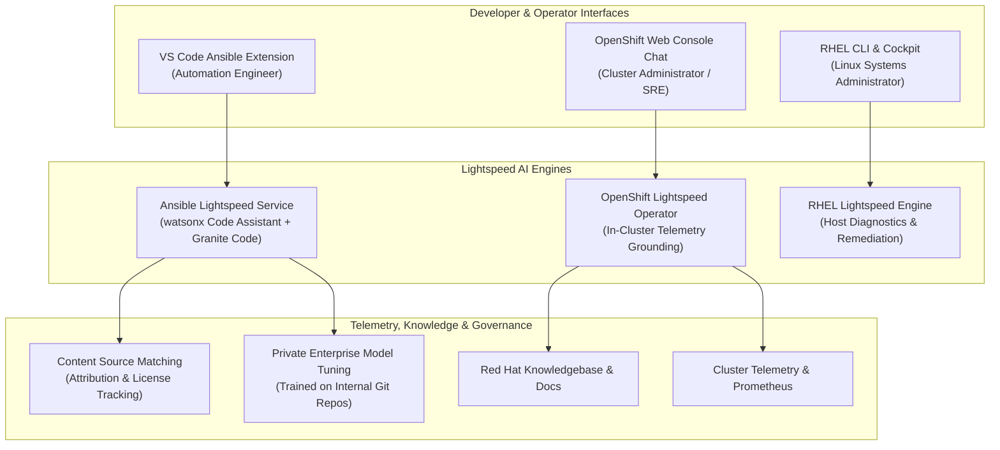
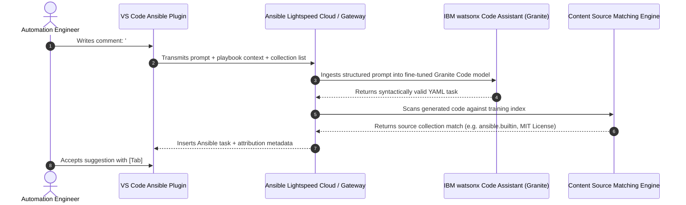
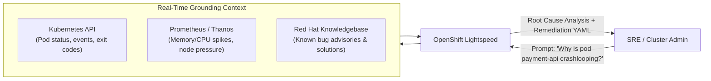

# Enterprise Generative AI & Automation (Ansible & OpenShift Lightspeed)

> **Focus Domain**: Domain-Specific Generative AI, Infrastructure as Code Automation, SRE Assistants  
> **Audience**: Systems Administrators, DevOps Engineers, Automation Architects, SREs  
> **Status**: Production Reference

---

## 1. Domain-Specific GenAI vs. Generic Chatbots

Generic commercial foundation models (ChatGPT, Claude) struggle with enterprise infrastructure automation:
1. **Hallucinated Syntax & Deprecated Modules**: They frequently invent non-existent Ansible module parameters or use deprecated syntax incompatible with Ansible Core 2.15+.
2. **Context Blindness**: They lack knowledge of internal company naming conventions, custom Ansible collections, and proprietary infrastructure topologies.
3. **Intellectual Property & Licensing Risk**: Generated code may inadvertently mirror GPL-licensed snippets without proper attribution.

Red Hat addresses this with specialized, domain-tailored AI assistants:
- **Ansible Lightspeed with watsonx Code Assistant**: Purpose-built code assistant for Infrastructure-as-Code (IaC).
- **OpenShift Lightspeed**: Intelligent in-cluster SRE assistant for Kubernetes operations.
- **RHEL Lightspeed**: Command-line and Cockpit assistant for Linux systems administration.



---

## 2. Ansible Lightspeed Architecture & Workflow

Ansible Lightspeed integrates directly into the developer workflow inside VS Code:



### 2.1 Natural Language Prompting to Validated Tasks

```yaml
- name: Configure Production Web Server
  hosts: webservers
  become: true
  tasks:
    # prompt: Install firewalld, enable service, and permit https traffic permanently
    - name: Install firewalld, enable service, and permit https traffic permanently
      ansible.posix.firewalld:
        service: https
        permanent: true
        state: enabled
        immediate: true

    # prompt: Deploy custom nginx vhost template and notify restart
    - name: Deploy custom nginx vhost template and notify restart
      ansible.builtin.template:
        src: vhost.j2
        dest: /etc/nginx/conf.d/vhost.conf
        owner: root
        group: root
        mode: '0644'
      notify: Restart nginx
```

### 2.2 Content Source Matching & IP Transparency
When Lightspeed generates code, the **Content Source Matching (CSM)** engine cross-references the tokens against the training corpus:
- Displays the upstream Ansible Galaxy collection or certified partner collection that inspired the code.
- Reports the original author and license (e.g., Apache 2.0, MIT, BSD).
- Guarantees complete licensing compliance for enterprise audits.

### 2.3 Custom Model Fine-Tuning for Enterprise Environments
Standard public models do not understand an enterprise's private automation modules. Organizations can train a **custom watsonx model** on their internal Git repositories:
1. Enterprise uploads audited, approved internal roles and playbooks.
2. The fine-tuning pipeline trains a private adapter on top of Granite Code.
3. Recommendations automatically use internal collections (`corp.security_compliance`, `internal.network_provisioning`) with organization-specific parameter conventions.

---

## 3. Red Hat OpenShift Lightspeed: The SRE Assistant

Managing large-scale OpenShift clusters involves parsing vast volumes of logs, Prometheus alerts, and complex Kubernetes manifests. **OpenShift Lightspeed** is deployed as an operator directly onto the cluster.



### 3.1 Operator Deployment: `OpenShiftLightspeed` CR

```yaml
apiVersion: lightspeed.openshift.io/v1alpha1
kind: OLSConfig
metadata:
  name: cluster
spec:
  llm:
    providers:
      - name: enterprise-rhoai
        type: rhoai_vllm
        url: https://granite-8b.apps.ocp.corp.internal/v1
        credentialsSecretRef:
          name: rhoai-api-token
    models:
      - name: granite-3.0-8b-instruct
        provider: enterprise-rhoai
  ols:
    conversationHistory:
      maxAge: 7d
    logLevel: INFO
```

### 3.2 Real-World Incident Triage Example

**Admin Prompt**:
> *"Cluster node worker-03 is in NotReady state. Investigate root cause and provide remediation."*

**OpenShift Lightspeed Response**:
> 1. **Telemetry Analysis**: Node `worker-03` transitioned to `NotReady` at 06:14 UTC due to `KubeletNotReady` with condition `DiskPressure: True`.
> 2. **Root Cause**: The `/var/lib/containers` mount reached 99.4% capacity due to unpruned dangling container layers from failed build tasks in namespace `ci-cd-builds`.
> 3. **Immediate Remediation**:
>    - Evacuate non-critical workloads: `oc adm drain worker-03 --ignore-daemonsets --delete-emptydir-data`
>    - Trigger CRI-O container garbage collection or inspect disk usage:
>      ```bash
>      oc debug node/worker-03 -- chroot /host crictl rmi --prune
>      ```
> 4. **Preventive Action**: Adjust Image Prune Schedule in `ClusterImagePolicy` or expand the underlying NVMe storage partition.

---

## 4. Enterprise Security, Privacy, and Data Governance

Enterprise deployments of Lightspeed enforce strict data isolation:
- **No Data Retention**: Customer prompts, playbook contents, and cluster configurations are processed in-memory and never cached or retained on external SaaS servers.
- **Zero Model Training**: Customer code is never used to train public commercial foundation models without explicit contractual consent.
- **On-Premises / Air-Gapped Execution**: OpenShift Lightspeed can be pointed directly to an in-cluster KServe + vLLM deployment running IBM Granite inside the enterprise firewall.

---
*Reference architecture documentation for `/workspace/projects/rh-ai`.*
