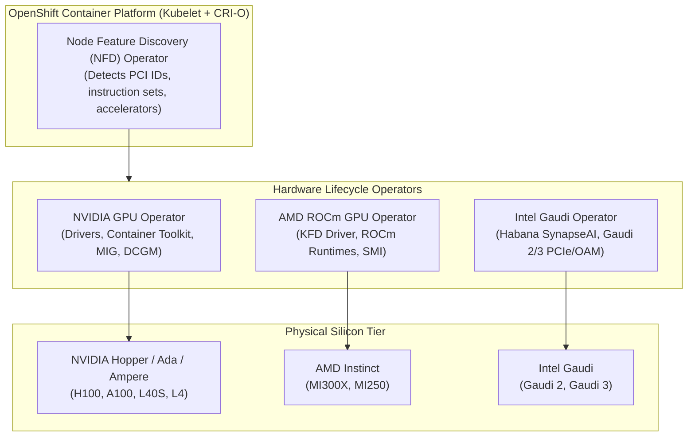
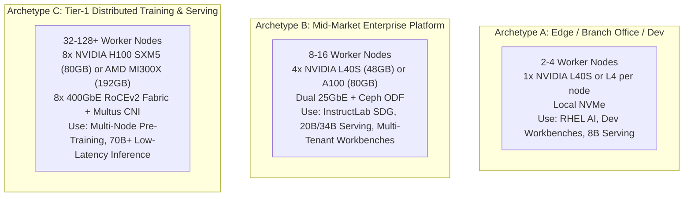

# Hardware Acceleration, GPU Math & Cluster Sizing Guide

> **Focus Domain**: Hardware Accelerators, Heterogeneous Compute, VRAM Mathematical Sizing, Cluster Topologies  
> **Audience**: Infrastructure Architects, Capacity Planners, Hardware Engineers, Platform SREs  
> **Status**: Production Reference

---

## 1. Heterogeneous Accelerator Ecosystem on OpenShift

Enterprise AI platforms cannot rely on a single hardware vendor. Supply chain shortages, cost optimization, and specialized workloads demand heterogeneous accelerator support.

Red Hat OpenShift AI abstracts hardware diversity across three primary silicon architectures:



### Accelerator Comparison Matrix

| Silicon Family | Accelerator | Memory Capacity | Memory Bandwidth | Key Strengths | Optimal OpenShift AI Workload |
| :--- | :--- | :--- | :--- | :--- | :--- |
| **NVIDIA Hopper** | H100 SXM5 | 80 GB HBM3 | 3.35 TB/s | FP8 Transformer Engine, 4th Gen NVLink (900 GB/s) | Large Foundation Model Training & Low-Latency Serving |
| **NVIDIA Ada Lovelace** | L40S PCIe | 48 GB GDDR6 | 864 GB/s | Cost-effective, high FP8 throughput, standard PCIe | Multi-tenant fine-tuning, RAG inference, InstructLab |
| **AMD Instinct** | MI300X OAM | 192 GB HBM3 | 5.3 TB/s | Massive single-GPU VRAM (192GB), high memory bandwidth | Running 70B models without tensor sharding |
| **Intel Gaudi** | Gaudi 2 / 3 | 96 GB / 128 GB | 2.45 / 3.7 TB/s | Integrated 24x 100GbE RDMA NICs on-die | Cost-efficient distributed pre-training and fine-tuning |

---

## 2. The Mathematics of VRAM Sizing

Accurate capacity planning requires decomposing memory usage into deterministic components.

### 2.1 Inference Memory Physics

$$\text{Total VRAM}_{\text{Inference}} = M_{\text{weights}} + M_{\text{KV-Cache}} + M_{\text{activations}}$$

1. **Model Weights ($M_{\text{weights}}$)**:
   $$M_{\text{weights}} = P \times B_p$$
   - $P$: Number of parameters (e.g., $8 \times 10^9$ for 8B).
   - $B_p$: Bytes per parameter ($2$ for FP16, $1$ for INT8/FP8, $0.5$ for INT4).

2. **KV Cache ($M_{\text{KV-Cache}}$)**:
   In Grouped Query Attention (GQA):
   $$M_{\text{KV-Cache}} = 2 \times L \times H_{kv} \times D \times B_p \times S \times B$$
   - $L$: Number of transformer layers.
   - $H_{kv}$: Number of key-value attention heads.
   - $D$: Head dimension ($D = \text{Hidden Size} / \text{Query Heads}$).
   - $S$: Context sequence length (tokens).
   - $B$: Batch size (concurrent streams).

3. **Time Per Output Token (TPOT) vs. Memory Bandwidth**:
   During the decode phase, tokens are generated one by one. The entire model weight tensor must be read from VRAM into compute cores for *every single token*.
   $$\text{Theoretical Min TPOT (seconds)} = \frac{\text{Model Weights (Bytes)}}{\text{GPU Memory Bandwidth (Bytes/sec)}}$$

   *Example*: Running unquantized Granite 8B (16 GB weights) on an NVIDIA L4 (300 GB/s bandwidth):
   $$\text{Min TPOT} = \frac{16 \times 10^9}{300 \times 10^9} \approx 0.053 \text{ seconds (18.7 tokens/sec max single-stream)}$$

---

### 2.2 Distributed Training Memory Physics (AdamW Optimizer)

$$\text{Total VRAM}_{\text{Training}} = M_{\text{weights}} + M_{\text{gradients}} + M_{\text{optimizer}} + M_{\text{activations}}$$

For standard FP16/BF16 mixed-precision training:
- **Weights ($M_{\text{weights}}$)**: $2P$ bytes
- **Gradients ($M_{\text{gradients}}$)**: $2P$ bytes
- **AdamW Optimizer States ($M_{\text{optimizer}}$)**:
  - FP32 Master Weights: $4P$ bytes
  - First Momentum: $4P$ bytes
  - Second Momentum (Variance): $4P$ bytes
  - *Total Optimizer*: $12P$ bytes

$$\text{Static Training Footprint} = 2P + 2P + 12P = 16P \text{ bytes}$$

$$\text{For Granite 8B}: 16 \times 8 \times 10^9 \text{ bytes} \approx 128 \text{ GB of static memory!}$$

*Takeaway*: To fine-tune Granite 8B with full AdamW without sharding, an engineer would need two 80 GB GPUs or one AMD MI300X (192 GB). With **FSDP (ZeRO-3)**, memory scales inversely with the number of GPUs ($N_{\text{gpus}}$):
$$M_{\text{per-GPU}} = \frac{16P}{N_{\text{gpus}}} + M_{\text{activations}}$$

---

## 3. Reference Cluster Sizing Archetypes



### Detailed Bill of Materials (BOM) & Sizing Matrix

| Specification | Archetype A (Dev/Edge) | Archetype B (Enterprise Standard) | Archetype C (High-End Sovereign/LLM) |
| :--- | :--- | :--- | :--- |
| **Target Scale** | 1 to 4 GPUs total | 16 to 64 GPUs total | 64 to 512+ GPUs total |
| **Node Hardware** | 1RU Server (e.g. Dell R760xa) | 2RU/4RU Server (e.g. HPE ProLiant DL385) | 8-way GPU Baseboard (e.g. Supermicro GPU SuperServer) |
| **GPU Model** | 1x NVIDIA L40S (48 GB) | 4x NVIDIA L40S or 2x A100 (80 GB) | 8x NVIDIA H100 SXM5 (80 GB) or 8x MI300X |
| **Node CPU** | 1x 32-core AMD EPYC / Intel Xeon | 2x 48-core AMD EPYC | 2x 64-core AMD EPYC |
| **Host System RAM** | 128 GB DDR5 | 512 GB DDR5 | 1.5 TB to 2 TB DDR5 |
| **Network Fabric** | 2x 25GbE LACP (Front-end) | 4x 25GbE (2x Front-end, 2x ODF Storage) | 2x 25GbE Management + 8x 400GbE RoCEv2 (NCCL) |
| **Storage Substrate** | 2x 1.92TB NVMe local RAID1 | OpenShift Data Foundation (Ceph RBD/S3) | Dedicated NVMe-oF / All-Flash Ceph Cluster |
| **Primary Workloads** | RHEL AI, ilab QLoRA, Granite 8B | RHOAI, KServe vLLM, Distributed ilab | Large distributed FSDP, 70B/405B inference |

---

## 4. OpenShift MachineConfig for High-Performance GPU Tuning

To eliminate NUMA node memory penalties and CPU throttling during heavy inference or all-reduce operations, deploy a tuned `MachineConfig`:

```yaml
apiVersion: machineconfiguration.openshift.io/v1
kind: MachineConfig
metadata:
  labels:
    machineconfiguration.openshift.io/role: worker-gpu
  name: 99-worker-gpu-performance
spec:
  config:
    ignition:
      version: 3.2.0
    storage:
      files:
        - contents:
            source: data:text/plain;charset=utf-8;base64,IyBFbmFibGUgR1BVIHBlcmZvcm1hbmNlIHR1bmluZwp2bS5tYXhfbWFwX2NvdW50PTY1NTMzMTAKdm0uc3dhcHBpbmVzcz0xCg==
          mode: 420
          overwrite: true
          path: /etc/sysctl.d/99-gpu-performance.conf
    systemd:
      units:
        - enabled: true
          name: nvidia-persistenced.service
```

---
*Reference architecture documentation for `/workspace/projects/rh-ai`.*
