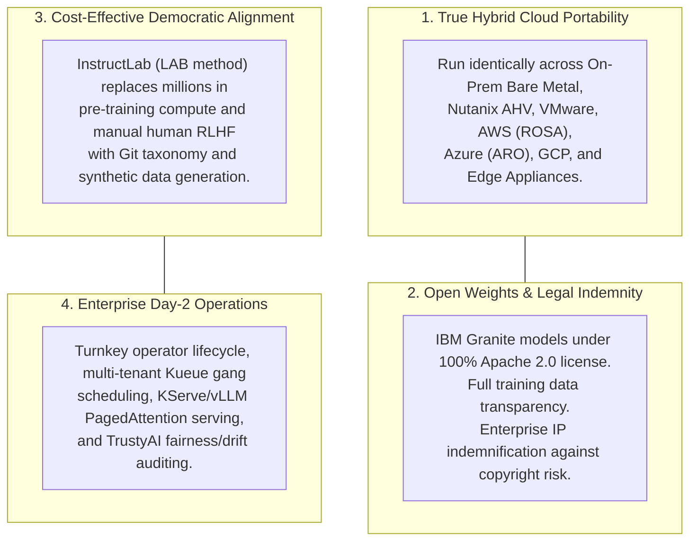
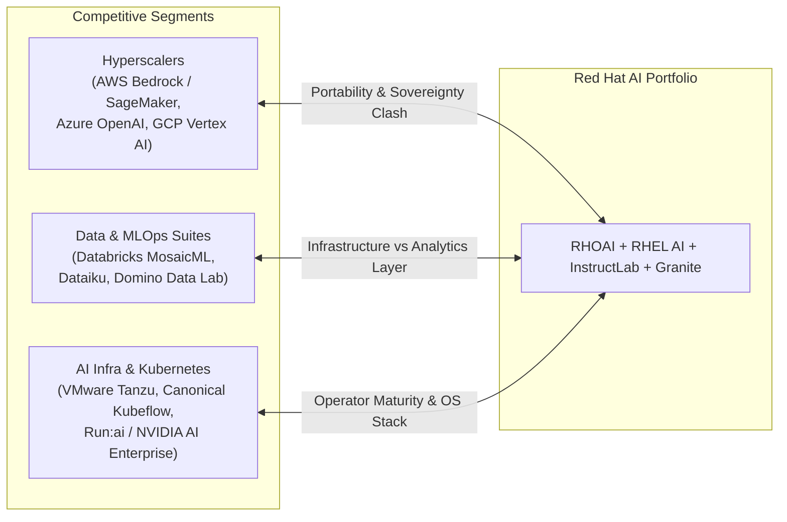
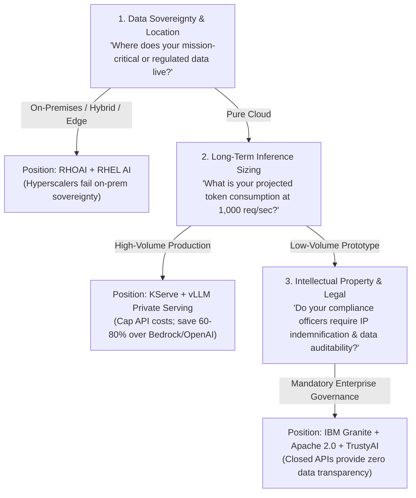

# Red Hat AI: Executive Pitch, Competitive Landscape & SWOT Analysis

> **Focus Domain**: Executive Strategy, Market Positioning, Competitive Battlecards, SWOT Analysis  
> **Audience**: Enterprise Architects, Technology Strategists, Field CTOs, Sales Engineering Leadership  
> **Status**: Production Reference

---

## 1. The High-Level Executive Pitch

### The Core Problem Statement
Enterprise AI is currently trapped between two extremes:
1. **The Public Cloud Trap (Hyperscaler Lock-In)**: Closed-source APIs (OpenAI, Anthropic, AWS Bedrock, Google Vertex AI) offer rapid time-to-market but create catastrophic lock-in, data sovereignty vulnerabilities, unpredictable token billing, and zero portability.
2. **The "Do-It-Yourself" Open-Source Chaos**: Piecing together raw PyTorch scripts, unmanaged Hugging Face weights, fragmented Kubernetes operators, and bespoke CUDA drivers creates fragile Day-2 operational nightmares that fail compliance audits and collapse under enterprise SLA requirements.

### Red Hat’s Value Proposition: "AI Everywhere on Your Terms"
Red Hat delivers an **enterprise-grade, open-source-first, hybrid-cloud AI platform** that spans from edge appliances and developer workstations to multi-cluster hyperscaler deployments:

> *"Red Hat democratizes enterprise generative AI by providing open models, community-driven alignment, and containerized cloud-native orchestration—enabling organizations to build, tune, and run AI workloads anywhere their data lives, with complete sovereignty and enterprise indemnification."*



### Executive Pitch by Persona

| Executive Stakeholder | Primary Pain Point | Red Hat Strategic Pitch |
| :--- | :--- | :--- |
| **Chief Information Officer (CIO)** | Uncontrollable cloud AI operational costs and vendor lock-in. | *"Red Hat provides hybrid-cloud infrastructure portability that caps inference compute costs, prevents SaaS API price gouging, and maximizes existing datacenter hardware."* |
| **Chief Information Security Officer (CISO)** | Data leakage, unvetted LLM training weights, and regulatory compliance (EU AI Act). | *"Granite models offer 100% open data provenance and IP indemnification. Models run entirely within private VPCs or air-gapped datacenters with Sigstore cryptographic signing."* |
| **Head of AI / Chief Data Officer (CDO)** | Talent shortages and slow transition from experimental notebooks to scalable production. | *"InstructLab enables non-data scientists to inject domain expertise via Git taxonomy, while RHOAI handles distributed Ray/PyTorch clusters and KServe autoscaling automatically."* |
| **VP of Infrastructure & Platform Engineering** | GPU sprawl, node starvation, and operational friction between ML teams and SREs. | *"Standardize all AI workloads on OpenShift with Kueue batch scheduling, dynamic GPU resource sharing across NVIDIA/AMD/Intel, and GitOps lifecycle management."* |

---

## 2. Competitive Landscape & Battlecard Matrix

Red Hat competes across four distinct industry segments: Hyperscaler AI Platforms, Data/MLOps Suites, Pure-Play AI Serving, and Traditional Linux/Kubernetes Vendors.



### 2.1 Detailed Competitive Battlecard Matrix

| Competitor / Offering | Red Hat Differentiation & Advantages (Where Red Hat Wins) | Competitor Strengths (Where Competitors Win) | Strategy to Win / Trap to Set |
| :--- | :--- | :--- | :--- |
| **AWS SageMaker & Bedrock** | - **True Portability**: Runs on-prem, Azure, GCP, and AWS (ROSA). SageMaker is effectively locked to AWS.<br>- **Data Sovereignty**: Zero telemetry egress; models run inside customer-controlled VPC/air-gap.<br>- **Cost Determinism**: Avoids exponential per-token API charges. | - Native integration with AWS data services (S3, Glue, Redshift).<br>- Massive catalog of closed frontier models (Claude 3.5, Amazon Nova).<br>- Turnkey managed serverless APIs. | **Trap**: *"What is your 3-year projected token egress and inference cost on AWS Bedrock when internal applications scale to 50 million requests per day?"* |
| **Microsoft Azure AI & Azure OpenAI** | - **No Single-Vendor Monopoly**: Decoupled from Microsoft/OpenAI proprietary APIs.<br>- **Open Source Transparency**: Fully auditable model weights and training datasets.<br>- **Heterogeneous Silicon**: Support for AMD MI300X and Intel Gaudi, avoiding NVIDIA allocation bottlenecks. | - Deep Copilot integration across Microsoft 365, GitHub, and Windows.<br>- Exclusive access to OpenAI frontier models (GPT-4o, o1/o3).<br>- Unified enterprise enterprise agreement (EA) billing. | **Trap**: *"Can Azure OpenAI run inside your sovereign, disconnected, air-gapped on-premises datacenter under EU AI Act compliance?"* |
| **Google Cloud Vertex AI** | - **On-Premises & Hybrid Native**: Vertex AI is fundamentally public-cloud bound. OpenShift AI runs seamlessly on bare metal.<br>- **Apache 2.0 Licensing**: Granite weights can be modified and distributed without Google licensing constraints. | - Native access to Gemini multimodal foundation models.<br>- Google Cloud TPU infrastructure integration.<br>- Advanced Search and Conversation managed enterprise tooling. | **Trap**: *"How will your regulated banking/healthcare data comply with privacy mandates if training datasets must be shipped to Google Cloud?"* |
| **Databricks (MosaicML)** | - **Infrastructure & Platform Layer**: OpenShift manages the entire Kubernetes cluster, GPU nodes, storage, and networking, whereas Databricks sits on top of existing Kubernetes/cloud VMs.<br>- **OS-Level Tuning**: RHEL AI bootable containers provide optimized driver/kernel stacks. | - Dominant position in enterprise data warehousing and feature preparation (Delta Lake).<br>- Strong brand among data scientists and analytics teams.<br>- Sophisticated foundation model pre-training tooling. | **Trap**: *"Databricks still requires underlying compute orchestration. Why pay a double margin on compute and license fees when OpenShift hosts both data engineering and model serving?"* |
| **VMware Private AI (Tanzu + Broadcom)** | - **Container-Native Performance**: OpenShift avoids virtualization hypervisor overhead (overhead on vGPU vs bare-metal containers).<br>- **Modern Cloud-Native Ecosystem**: Native KServe, Ray, Kueue, and Tekton pipelines vs. legacy VM-centric management.<br>- **Licensing Predictability**: Freedom from aggressive Broadcom subscription pricing hikes. | - Massive legacy enterprise virtualization footprint across enterprise datacenters.<br>- Close joint marketing partnership with NVIDIA (VMware Private AI Foundation). | **Trap**: *"Are you prepared for Broadcom's renewed core-pricing structure on vSphere while trying to build a modern containerized GPU cluster?"* |
| **NVIDIA AI Enterprise (NVAIE) & Run:ai** | - **Hardware Neutrality**: Red Hat works equally well on AMD ROCm and Intel Gaudi, whereas NVAIE locks customers exclusively into NVIDIA hardware.<br>- **Complementary Co-Existence**: RHOAI natively certifies and runs NVIDIA GPU Operator, NIMs, and NeMo. | - Industry gold standard for CUDA developer ecosystem and low-level kernel optimization.<br>- Run:ai has advanced GPU slicing and fractioning algorithms. | **Win Strategy**: Position OpenShift AI as the management and application orchestration layer that incorporates NVIDIA NIMs while preserving future hardware choice. |

---

## 3. Comprehensive SWOT Analysis

```
┌──────────────────────────────────────────────┬──────────────────────────────────────────────┐
│                  STRENGTHS                   │                  WEAKNESSES                  │
├──────────────────────────────────────────────┼──────────────────────────────────────────────┤
│ • Hybrid Cloud Ubiquity (OpenShift / RHEL)   │ • "Plumbing" vs "Data Science" Brand Bias   │
│ • IBM Granite IP Indemnification & Apache 2.0│ • Smaller Out-of-the-Box Model Zoo           │
│ • InstructLab (LAB) Democratized Alignment   │ • Kubernetes Learning Curve for Data Teams   │
│ • Full-Stack Integration (Silicon to SRE)    │ • Dependent on Upstream Community Pacing     │
│ • Ansible Installed Base (Lightspeed Monet.) │                                              │
├──────────────────────────────────────────────┼──────────────────────────────────────────────┤
│                OPPORTUNITIES                 │                   THREATS                    │
├──────────────────────────────────────────────┼──────────────────────────────────────────────┤
│ • Sovereign AI & Air-Gapped Datacenters      │ • Hyperscaler Bundling & Cloud Credits       │
│ • Heterogeneous Hardware (AMD MI300X/Gaudi)  │ • NVIDIA Expanding Up-Stack (NIM, Run:ai)    │
│ • IT Automation GenAI (Ansible Lightspeed)   │ • Databricks & Snowflake Ingesting MLOps     │
│ • Broadcom/VMware Migration Wave             │ • Rapid Commoditization of Frontier LLMs     │
└──────────────────────────────────────────────┴──────────────────────────────────────────────┘
```

### 3.1 Strengths (Internal Advantages)
1. **Unrivaled Hybrid Cloud Footprint**:
   OpenShift is the enterprise Kubernetes standard. Organizations already running OpenShift for core banking, retail, or ERP systems can activate RHOAI via a single operator without introducing foreign infrastructure silos.
2. **True Open Source Licensing & Legal Indemnity**:
   Unlike Meta's Llama (which imposes custom acceptable-use restrictions and developer thresholds), IBM Granite models are **100% Apache 2.0**. Combined with IBM/Red Hat intellectual property indemnification, Red Hat offers the safest legal framework for enterprise deployment.
3. **The InstructLab Efficiency Breakthrough**:
   The LAB methodology eliminates the multi-million-dollar cost of pre-training and replaces slow, error-prone human RLHF with Git-versioned taxonomy and synthetic data generation. This allows subject matter experts (engineers, lawyers, underwriters) to align models without hiring PhD data science teams.
4. **Purpose-Built Operating System Tier (RHEL AI)**:
   By shipping `bootc` containerized OS appliances with embedded drivers, runtimes, and models, Red Hat removes the painful multi-day manual setup of GPU servers.
5. **Ansible Automation Synergy**:
   Red Hat owns the automation standard (Ansible). Ansible Lightspeed provides an immediate, high-ROI generative AI application for millions of existing enterprise sysadmins and DevOps engineers.

### 3.2 Weaknesses (Internal Challenges)
1. **Perception as an Infrastructure Company**:
   Enterprise data scientists frequently view Red Hat as an OS/Kubernetes platform provider rather than an AI/ML innovator. They default to Python-centric platforms (Hugging Face, Databricks, Vertex AI) and resist Kubernetes tooling.
2. **Smaller Curated Model Garden**:
   Hyperscalers (AWS Bedrock, Azure AI Studio) offer hundreds of proprietary and open models with one-click trial APIs. Red Hat’s curated focus on Granite and key open weights requires customers to manage model registries.
3. **Operational Complexity of OpenShift**:
   For organizations with small IT teams that do not already run OpenShift, deploying a complete OpenShift Container Platform cluster with Service Mesh, Serverless, and Ceph storage represents a steep operational hurdle.
4. **Upstream Project Synchronization**:
   RHOAI relies heavily on upstream open-source momentum (Kubeflow, KubeRay, vLLM, KServe). Delays or breaking changes in upstream projects require intense downstream reconciliation and testing by Red Hat engineering.

### 3.3 Opportunities (External Tailwinds)
1. **Sovereign AI & Data Residency Regulations**:
   Governments worldwide (EU AI Act, French SecNumCloud, US DoD IL5/IL6, German BSI) require AI models to run within national boundaries, strictly air-gapped from US hyperscaler telemetry. Red Hat is uniquely positioned as the trusted sovereign infrastructure standard.
2. **Silicon Diversification & Breaking the NVIDIA Premium**:
   Enterprises are desperate to avoid 12-month GPU lead times and NVIDIA price premiums. RHOAI’s first-class support for **AMD Instinct MI300X** and **Intel Gaudi** enables customers to deploy cheaper, available hardware without changing application code.
3. **Broadcom/VMware Displacement Wave**:
   Following Broadcom's acquisition of VMware, enterprise customers face steep price hikes and license restructuring. Red Hat can capture legacy VMware workloads and position OpenShift AI as the unified modernization target.
4. **Enterprise LLMOps Standardization**:
   As companies move beyond exploratory prompt engineering into enterprise RAG and production fine-tuning, they need enterprise governance (TrustyAI, Model Registry, CI/CD pipelines)—the exact strengths of RHOAI.

### 3.4 Threats (External Risks)
1. **Hyperscaler Monopoly & Subsidized Cloud Credits**:
   AWS, Microsoft, and Google aggressively subsidize proprietary AI adoption by bundling free cloud credits, making on-premises or hybrid platforms seem initially more expensive.
2. **NVIDIA Vertical Integration**:
   NVIDIA is systematically moving up the software stack. With NVIDIA AI Enterprise (NVAIE), NIM microservices, and the acquisition of Run:ai, NVIDIA aims to become the operating system of AI, threatening to commoditize container orchestrators.
3. **Data Platforms Consuming the AI Tier**:
   Platforms like Databricks and Snowflake are leveraging their ownership of enterprise enterprise data lakes to capture MLOps and LLM serving, attempting to make infrastructure orchestrators invisible.
4. **Frontier Model Capabilities Outpacing Local Tuning**:
   If massive commercial models (OpenAI, Anthropic) become dramatically cheaper and offer robust zero-shot generalization across domain tasks, enterprise appetite for local model fine-tuning via InstructLab could soften.

---

## 4. Architectural Discovery & Sales Framework

When qualifying enterprise opportunities, use this discovery matrix to expose hyperscaler weaknesses and establish Red Hat's technical superiority:



### Key Discovery Questions

1. **On Hardware Utilization**:
   > *"How do you currently prevent GPU idle waste when data science teams submit uncoordinated batch training jobs alongside live inference endpoints?"*
   - **Pain**: Teams allocate static GPU nodes that sit idle 70% of the day.
   - **Red Hat Answer**: Kueue batch gang scheduling and KServe dynamic autoscaling pool GPUs across the enterprise.

2. **On Fine-Tuning Economics**:
   > *"How much budget is allocated for manual human prompt labeling and data annotation for fine-tuning?"*
   - **Pain**: Manual RLHF labeling costs hundreds of thousands of dollars and months of delay.
   - **Red Hat Answer**: InstructLab generates synthetic, critic-filtered datasets from domain markdown docs in hours.

3. **On Regulatory Auditability**:
   > *"If an auditor asks for the exact provenance and bias metrics of your production model under the EU AI Act, how do you provide that evidence?"*
   - **Pain**: Closed APIs provide zero insight into model weights, and DIY scripts lack audit logs.
   - **Red Hat Answer**: OpenShift Model Registry catalogs the full Git-to-model lineage, and TrustyAI generates real-time Disparate Impact and Explainability reports.

---

## 5. Summary Recommendation & Go-Forward Architecture

For enterprise IT leadership evaluating AI infrastructure:
- **Adopt RHEL AI** for rapid developer onboarding, single-box edge appliances, and local taxonomy validation without Kubernetes friction.
- **Scale on Red Hat OpenShift AI (RHOAI)** for multi-tenant enterprise clusters, distributed multi-node Ray training, and autoscaled vLLM model serving.
- **Standardize on IBM Granite & InstructLab** to build proprietary enterprise intelligence while retaining 100% intellectual property ownership, zero vendor lock-in, and full legal indemnification.

---
*Reference architecture documentation for `/workspace/projects/rh-ai`.*
